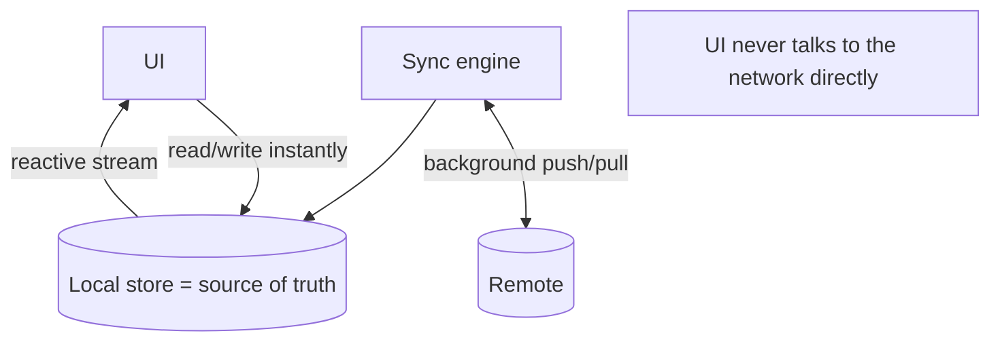

# Offline-First Fundamentals (Local Source of Truth)

> Offline-first inverts the usual flow: the **local store is the single source of truth** the UI reads/writes instantly; the network syncs it in the background — so the app is fast and fully functional with or without connectivity.

## Introduction

The core principle: don't read/write the network directly from the UI. Instead, the UI talks to a **local store** (DB/cache), and a **sync engine** reconciles that store with the server asynchronously. This file establishes the architecture the rest of the module builds on.

## Why this concept exists

Network-first apps freeze on spinners, fail offline, and feel laggy. Users expect instant, always-working apps (like native note/email apps). Offline-first delivers that by decoupling UI responsiveness from network availability — the local store answers immediately; sync happens when it can.

## Real-world analogy

Offline-first is a **personal notebook** you always write in (local store); a secretary periodically **photocopies changes to/from the office archive** (sync). You never wait for the archive to write a note — you write locally now, and it's reconciled later. If the office is unreachable, you keep working.

## Problem Statement

A notes app must open instantly, let users create/edit notes with no connection, and sync seamlessly when online — never blocking on the network. You'll design the local-source-of-truth architecture.

## Internal Working



- **Local store = source of truth**: a local DB ([Module 20](../20%20Database/README.md)) holds the canonical app data the UI reads (usually via a **reactive stream**) and writes to immediately.
- **UI ↔ local only**: the UI never awaits the network; it reads/writes the local store and re-renders from it.
- **Sync engine** ([sync_engine.md](sync_engine.md)): a background process pushes local changes to the server and pulls remote changes into the local store — reconciling the two.
- **Repository boundary** ([05 · repository](../05%20Design%20Patterns/repository.md)): exposes `watch()`/`save()` over the local store + coordinates sync; the UI/domain is oblivious to network state.
- **Metadata**: records carry sync metadata (dirty flag, version/updatedAt, deleted tombstone) to drive sync/conflict logic.
- **Distinguish from caching**: caching serves *reads* faster with TTL ([15 · caching_strategies](../15%20Local%20Storage/caching_strategies.md)); offline-first makes the local store **authoritative for reads and writes**, with full bidirectional sync.

## Memory Representation

The local DB holds canonical data on disk; the UI observes streams (bounded queries). Sync metadata (dirty/version) lives per record ([Module 20](../20%20Database/README.md)).

## Compiler Behavior

Not applicable.

## Runtime Behavior

Reads/writes are local (instant); the UI updates from a local stream. Sync runs opportunistically (on connectivity/interval/app events) without blocking the UI. Offline writes are marked dirty and queued for push ([connectivity_and_outbox.md](connectivity_and_outbox.md)).

## Flutter Engine Behavior / Dart VM Behavior

Not applicable; heavy sync/merge work should run off the UI isolate if large ([02 · isolates](../02%20Advanced%20Dart/isolates.md)).

## Examples

```dart
// Offline-first repository: UI reads/writes LOCAL; sync happens in background
abstract interface class LocalStore {
  Stream<List<Note>> watchNotes();          // reactive local reads
  Future<void> upsert(Note note);           // local write (mark dirty)
  Future<List<Note>> dirtyNotes();          // pending to push
}
abstract interface class RemoteApi {
  Future<List<Note>> pullSince(DateTime? cursor);
  Future<void> push(List<Note> notes);
}

class Note {
  final String id, text;
  final DateTime updatedAt;
  final bool dirty;      // local change not yet synced
  final int version;     // for conflict detection
  const Note(this.id, this.text, this.updatedAt, {this.dirty = false, this.version = 0});
}

class NotesRepository {
  final LocalStore local;
  final RemoteApi remote;
  NotesRepository(this.local, this.remote);

  // UI observes LOCAL store (instant, offline-capable):
  Stream<List<Note>> watch() => local.watchNotes();

  // Writes go LOCAL first (instant), marked dirty for later push:
  Future<void> saveNote(Note note) =>
      local.upsert(Note(note.id, note.text, DateTime.now(), dirty: true, version: note.version));

  // Sync engine (called on connectivity/interval) — see sync_engine.md
  Future<void> sync() async {
    await remote.push(await local.dirtyNotes());   // push local changes
    for (final n in await remote.pullSince(null)) { // pull remote changes
      await local.upsert(n);                         // reconcile into local
    }
  }
}
```

## Diagrams

```mermaid
flowchart LR
    NetFirst[Network-first: UI -> network -> spinner/fail offline]
    OffFirst[Offline-first: UI -> local (instant) + background sync]
```

## Common Mistakes

| Mistake | Why | Fix |
|---------|-----|-----|
| UI awaiting the network for reads/writes | Laggy, breaks offline | UI reads/writes local; sync in background |
| No sync metadata (dirty/version) | Can't track/resolve changes | Add dirty flag + version/updatedAt + tombstones |
| Treating cache-with-TTL as offline-first | No write sync/authority | Make local authoritative + bidirectional sync |
| Deleting records hard (no tombstone) | Deletions don't propagate | Soft-delete (tombstone) then sync |
| Sync logic in the UI | Coupling, untestable | Encapsulate in repository/sync engine |

## Best Practices

- Make the **local store the source of truth**; the UI reads (streams) and writes it **immediately**.
- Run **sync in the background** (on connectivity/interval/app resume), never blocking UI.
- Track **sync metadata** per record: dirty flag, version/`updatedAt`, tombstones for deletes.
- Encapsulate everything behind a **repository** exposing reactive reads + local writes ([05 · repository](../05%20Design%20Patterns/repository.md)).
- Offload heavy merges to an isolate; design for eventual consistency.
- Reuse a proven local DB with sync support where possible (Firestore offline, PowerSync, Isar/Drift + custom sync).

## Performance

Local reads/writes are instant (no network latency); sync amortizes network work in the background. Offload large syncs off-isolate; bound queries/streams ([Module 21](../21%20Performance/README.md)).

## Advantages / Disadvantages

- **+** Instant UX, works offline, resilient to flaky networks, decoupled from connectivity, fewer spinners.
- **−** Complexity (sync/conflicts/queueing), eventual consistency (not instant global truth), metadata/tombstone bookkeeping, harder testing.

## Interview Questions

1. **🟢 What defines offline-first?** — The local store is the source of truth the UI reads/writes instantly; the network syncs in the background.
2. **🟢 How does it differ from caching?** — Caching speeds up reads with TTL; offline-first makes the local store authoritative for reads **and** writes with bidirectional sync.
3. **🟡 Why does the UI never talk to the network directly?** — To stay instant and functional offline; it talks to the local store, and a sync engine reconciles with the server.
4. **🟡 What sync metadata do records need?** — A dirty flag (unsynced local change), a version/`updatedAt` (conflict detection), and tombstones (soft-delete propagation).
5. **🟡 What consistency model does offline-first imply?** — Eventual consistency — local is immediately correct; global convergence happens after sync.
6. **🔴 What are the hard problems introduced?** — Sync (pull/push/delta), conflict resolution, queued offline mutations (outbox), and optimistic UI/rollback.
7. **🔴 Where does sync logic belong?** — In a sync engine behind the repository, off the UI; the UI/domain stays connectivity-agnostic.

## Senior Engineer Tips

- Decide offline-first **up front** — retrofitting it into a network-first app is painful (touches data model, repos, UI).
- Model records with sync metadata from day one (dirty/version/tombstone); it's the backbone of sync/conflict logic.
- Lean on existing solutions (Firestore offline, PowerSync, WatermelonDB-style, or Isar/Drift + a documented sync protocol) before hand-rolling.

## Architect Perspective

Offline-first is a top-level architectural decision that reshapes the data layer: local-source-of-truth + background sync behind repositories, with eventual consistency. It delivers premium UX and resilience but demands rigorous handling of sync, conflicts, and queued writes — the subject of the rest of this module ([sync_engine.md](sync_engine.md), [conflict_resolution.md](conflict_resolution.md), [connectivity_and_outbox.md](connectivity_and_outbox.md)).

## Summary

- Offline-first: local store is source of truth (instant reads/writes), network syncs in background.
- Track sync metadata (dirty/version/tombstone); encapsulate in a repository; embrace eventual consistency.
- Distinct from caching; introduces sync/conflict/outbox/optimistic-UI complexity to design deliberately.

## Revision Notes

- Local store = source of truth; UI reads (stream)/writes local instantly; sync in background.
- Metadata: dirty flag + version/`updatedAt` + tombstones.
- Not caching (authoritative + bidirectional sync); eventual consistency.
- Repository-encapsulated; offload heavy sync off-isolate; decide up front.

## Practice Questions

1. Why doesn't the UI await the network in offline-first?
2. What metadata must records carry and why?
3. How is offline-first different from cache-with-TTL?

## Coding Questions

1. Design `LocalStore`/`RemoteApi`/`NotesRepository` where UI reads/writes local + a `sync()` method.
2. Add dirty/version/tombstone metadata to the model.
3. Sketch how a write flows: UI → local (dirty) → later push.

## Mini Project

**Offline-first skeleton (Flutter):** Build a `NotesRepository` where `watch()` streams from a fake local store and `saveNote()` writes locally (dirty), plus a `sync()` that pushes dirty notes and pulls remote ones into local. Prove the UI works with the "network" unavailable. Acceptance: UI reads/writes local only; sync in background; metadata tracked; runs. (Sync details continue in [sync_engine.md](sync_engine.md).)
