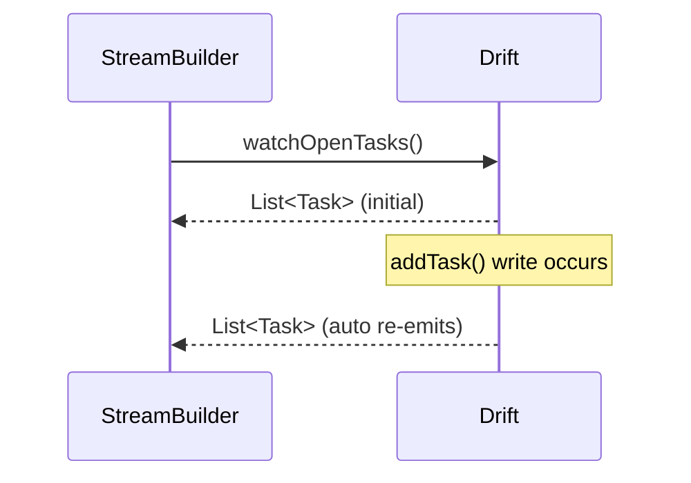

# Drift (Typed, Reactive SQL)

> Drift is a reactive persistence library over SQLite with **compile-time-checked** queries and typed rows (via codegen): you declare tables/queries in Dart, get generated data classes and DAOs, and read data as **auto-updating streams** — SQLite's power without raw strings or manual refresh.

## Introduction

Drift (package: `drift`, formerly Moor) sits on SQLite and adds type safety + reactivity. You define tables as Dart classes; codegen produces typed row classes, a type-safe query DSL, and `watch()` streams. This file covers defining tables, typed/reactive queries, DAOs, and migrations.

## Why this concept exists

Raw `sqflite` gives runtime-only SQL with untyped maps and no reactivity ([02_sqlite_sqflite.md](02_sqlite_sqflite.md)). Drift fixes both: queries are checked at compile time, rows are typed, and reads stream updates — dramatically reducing bugs and boilerplate for relational Flutter apps.

## Real-world analogy

If `sqflite` is a manual car, Drift is the **automatic with lane-assist**: same SQLite engine, but it checks your route at compile time (typed queries), and the dashboard auto-updates as conditions change (reactive streams) — less manual work, fewer mistakes.

## Problem Statement

Model tasks with a typed schema, query them type-safely, get a reactive task list that auto-updates the UI on writes, and migrate the schema — using Drift behind a repository. You'll define tables, use `watch()`, and write a migration.

## Internal Working

```mermaid
flowchart TD
    Tables[Dart table classes] -->|build_runner codegen| Gen[typed row classes + query DSL + DB]
    Gen --> Queries[type-safe select/insert/update]
    Queries --> Watch[.watch() -> Stream (auto-updates)]
    Version[schemaVersion + MigrationStrategy] --> Migrate[migrations]
```

- **Define tables** as classes extending `Table` (columns via typed getters); the DB extends `_$AppDatabase` (generated).
- **Codegen** (`build_runner`) produces: typed **row classes**, **companions** for inserts/updates, and a type-safe query API — queries are checked at **compile time**.
- **Reactive reads**: `select(...).watch()` returns a `Stream<List<Row>>` that re-emits on relevant writes — plug into `StreamBuilder`/state ([02 · streams](../02%20Advanced%20Dart/03_streams.md)).
- **Queries**: type-safe DSL (`select(tasks)..where((t) => t.done.equals(false))`) or custom SQL with typed results; joins, aggregates supported.
- **DAOs**: group queries per table/feature (`@DriftAccessor`) for organization.
- **Migrations**: `schemaVersion` + `MigrationStrategy(onCreate, onUpgrade)`; Drift has schema tooling/step-by-step migration helpers.
- Runs on SQLite (native, or WASM on web); can execute on a **background isolate** for heavy work.

## Memory Representation

Query results are typed row objects; streams hold current results. Bound with `.limit()`/pagination; the DB is a SQLite file ([15 · file_storage](../15%20Local%20Storage/04_file_storage.md)).

## Compiler Behavior

**Queries and schema are compile-time checked** (generated code) — typos/type mismatches are build errors, not runtime crashes. Requires a `build_runner` codegen step.

## Runtime Behavior

`watch()` streams re-emit on writes affecting the query; one-shot `get()` returns once. Migrations run on version bump; transactions supported.

## Flutter Engine Behavior

Uses native SQLite via the plugin; supports background-isolate execution for heavy queries ([02 · isolates](../02%20Advanced%20Dart/04_isolates.md)).

## Dart VM Behavior

Not applicable beyond async.

## Examples

```yaml
# pubspec.yaml
dependencies:
  drift: ^2.16.0
  sqlite3_flutter_libs: ^0.5.0
  path_provider: ^2.1.0
  path: ^1.9.0
dev_dependencies:
  drift_dev: ^2.16.0
  build_runner: ^2.4.0
```

```dart
import 'package:drift/drift.dart';
// part 'db.g.dart'; // generated

// Typed table definition
class Tasks extends Table {
  IntColumn get id => integer().autoIncrement()();
  TextColumn get title => text().withLength(min: 1, max: 200)();
  BoolColumn get done => boolean().withDefault(const Constant(false))();
}

@DriftDatabase(tables: [Tasks])
class AppDatabase extends _$AppDatabase {
  AppDatabase(super.e);

  @override
  int get schemaVersion => 2;

  @override
  MigrationStrategy get migration => MigrationStrategy(
        onCreate: (m) => m.createAll(),
        onUpgrade: (m, from, to) async {
          if (from < 2) {
            await m.addColumn(tasks, tasks.priority); // migration (if column added)
          }
        },
      );

  // Reactive, TYPE-SAFE query -> auto-updates the UI on writes:
  Stream<List<Task>> watchOpenTasks() =>
      (select(tasks)..where((t) => t.done.equals(false))..limit(100)).watch();

  Future<int> addTask(String title) =>
      into(tasks).insert(TasksCompanion.insert(title: title));

  Future<void> toggle(int id, bool done) =>
      (update(tasks)..where((t) => t.id.equals(id))).write(TasksCompanion(done: Value(done)));
}
// `Task` (row class) + `TasksCompanion` are generated — fully typed.
```

## Diagrams



## Common Mistakes

| Mistake | Why | Fix |
|---------|-----|-----|
| Forgetting `build_runner` | Generated code missing/stale | Run/watch codegen |
| Unbounded `watch()` | Memory/perf on large tables | `.limit()`/pagination |
| Leaking Drift row classes to the UI | Coupling | Map rows→domain entities in a repository |
| Bad migrations | Data loss on upgrade | Use `MigrationStrategy`/schema tooling; test |
| Heavy queries on UI isolate | Jank | Background isolate execution |
| Overusing custom raw SQL | Loses type-safety | Prefer the typed DSL where possible |

## Best Practices

- Define tables in Dart; **run codegen**; use the **typed DSL** (compile-safe) over raw SQL where possible.
- Expose **reactive `watch()`** streams for lists that must auto-update; bound with `.limit()`/pagination.
- Organize queries in **DAOs**; wrap in a **repository** mapping generated rows→domain entities.
- Write **migrations** with `MigrationStrategy` + Drift's schema tooling; test against old schemas.
- Run heavy queries on a **background isolate**; select only needed columns; index hot columns ([05_modeling_migrations_performance.md](05_modeling_migrations_performance.md)).

## Performance

Compile-checked, indexed, bounded queries are fast; reactive streams re-run only affected queries. Background-isolate execution avoids UI jank on heavy work ([Module 21](../21%20Performance/README.md)).

## Advantages / Disadvantages

- **+** Compile-time-safe queries, typed rows, **reactive streams**, full SQL (joins/aggregates), migrations tooling, background isolates.
- **−** Codegen/build step, learning curve vs raw `sqflite`, more setup, still SQLite lock-in (but portable schema).

## Interview Questions

1. **🟢 What does Drift add over `sqflite`?** — Compile-time-checked queries, typed row classes, and reactive `watch()` streams — over the same SQLite engine.
2. **🟢 How do you get auto-updating data?** — `select(...).watch()` returns a `Stream` that re-emits when writes affect the query.
3. **🟡 How are Drift's types generated?** — `build_runner` codegen from your table/DB classes produces typed rows, companions, and a query DSL.
4. **🟡 How do migrations work in Drift?** — Bump `schemaVersion` and implement `MigrationStrategy(onCreate/onUpgrade)`, using schema tooling for step-by-step changes.
5. **🟡 Why prefer the typed DSL over custom SQL?** — It's compile-time-checked; raw SQL reintroduces runtime-only errors (though Drift can type custom SQL too).
6. **🔴 How do you keep Drift from coupling the app?** — Map generated row classes to domain entities in a repository; the domain doesn't import Drift.
7. **🔴 How does Drift help performance/UX?** — Reactive queries update only affected UI, indexed/bounded queries are fast, and heavy work can run on a background isolate.

## Senior Engineer Tips

- Prefer Drift for relational Flutter apps — the compile-safety + reactivity eliminate whole bug classes vs raw `sqflite`.
- Map row classes to entities at the repository; don't leak `Task`/companions into widgets.
- Use Drift's schema-version tooling and test migrations against real old databases; migrations are the riskiest DB code.

## Architect Perspective

Drift is the recommended relational data layer for Flutter: typed, reactive SQL behind repositories gives a compile-safe, auto-updating, migratable foundation — ideal as the local source of truth for offline-first ([Module 19](../19%20Offline%20First/README.md)) and rich caching ([15](../15%20Local%20Storage/05_caching_strategies.md)). It trades a codegen step for major safety/productivity gains.

## Summary

- Drift = typed, reactive SQL over SQLite via codegen: compile-checked queries, typed rows, `watch()` streams, migrations.
- Use the typed DSL, expose reactive bounded queries, organize in DAOs, map rows→entities in a repository.
- Recommended relational engine; ideal local source of truth for offline-first.

## Revision Notes

- Define `Table` classes → `build_runner` → typed rows/companions + type-safe DSL + `.watch()` streams.
- `schemaVersion` + `MigrationStrategy(onCreate/onUpgrade)`; DAOs for organization.
- Compile-time query checks; bound with `.limit()`; map rows→entities in repo; heavy work off-isolate.
- Built on SQLite; recommended relational engine (vs raw `sqflite`).

## Practice Questions

1. How does Drift make queries compile-safe?
2. How do you build an auto-updating task list?
3. How do Drift migrations differ from raw `sqflite`?

## Coding Questions

1. Define a `Tasks` table + reactive `watchOpenTasks()` and a typed `addTask`.
2. Add a v1→v2 migration adding a column via `MigrationStrategy`.
3. Wrap the Drift DB in a repository mapping rows→entities.

## Mini Project

**Typed reactive tasks (Flutter):** Build a Drift `AppDatabase` (Tasks table), a repository exposing `watchOpenTasks()` (mapped to entities) + typed CRUD, a v1→v2 migration, and a `StreamBuilder` UI that auto-updates on writes. Acceptance: compile-safe typed queries; reactive UI; migration works; rows mapped to entities; bounded queries; runs.
