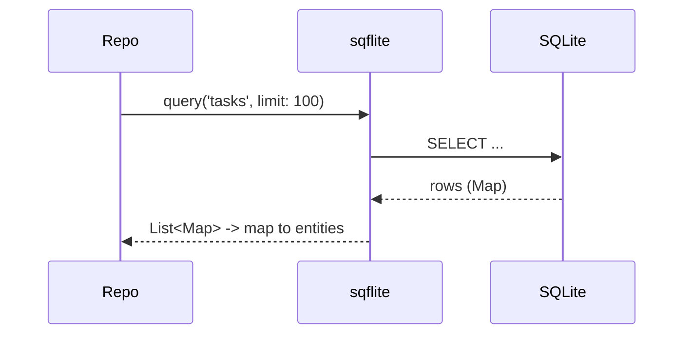

# SQLite via `sqflite`

> `sqflite` is the battle-tested, low-level SQLite plugin: you open a database, run raw SQL (or helper methods), and get back untyped `Map`s — full SQL power and control, at the cost of manual typing, migrations, and no built-in reactivity.

## Introduction

SQLite is an embedded relational database; `sqflite` (package) is Flutter's direct binding. This file covers opening a DB, CRUD via raw SQL / helpers, transactions, batch, and versioned migrations — plus why larger apps often move to Drift on top of it.

## Why this concept exists

SQLite is ubiquitous, reliable, and file-based (no server). `sqflite` exposes it directly, giving full SQL and precise control. It's the foundation many higher-level tools (Drift) build on, and knowing it demystifies them.

## Real-world analogy

`sqflite` is **driving a manual-transmission car**: full control over the engine (SQL), but you work the clutch yourself (typing, migrations, refresh). Drift is the automatic on top — same engine, less manual labor.

## Problem Statement

Persist tasks in SQLite: create the schema, insert/query/update/delete, use transactions, and handle a v1→v2 schema change — all with `sqflite`, wrapped in a repository. You'll write the raw SQL layer.

## Internal Working

```mermaid
flowchart TD
    Open["openDatabase(path, version, onCreate, onUpgrade)"] --> DB[(SQLite file)]
    DB --> CRUD[query / insert / update / delete (or rawQuery)]
    CRUD --> Maps[List<Map<String,Object?>> (untyped rows)]
    DB --> Tx[transaction / batch (atomic)]
    Version[version bump] --> onUpgrade[onUpgrade migration]
```

- **Open**: `openDatabase(path, version:, onCreate:, onUpgrade:, onConfigure:)` (path via `path_provider`/`getDatabasesPath`). `onCreate` builds the schema; `onUpgrade` migrates on version bumps ([modeling_migrations_performance.md](modeling_migrations_performance.md)).
- **CRUD helpers**: `db.insert/query/update/delete` (map-based) or `db.rawQuery/rawInsert(...)` (raw SQL). Results are **`List<Map<String, Object?>>`** — untyped; you cast/map manually.
- **Transactions**: `db.transaction((txn) async { ... })` for atomic multi-statement writes; `db.batch()` for bulk operations.
- **Migrations**: bump `version`; in `onUpgrade(db, oldV, newV)` run `ALTER TABLE`/data migrations step-by-step.
- **No reactivity**: `sqflite` doesn't stream changes — you re-query manually (or add your own change notifications). This (plus untyped rows) is why big apps prefer Drift ([drift.md](drift.md)).
- **Repository**: map rows→entities at the boundary; keep SQL out of the UI ([05 · repository](../05%20Design%20Patterns/repository.md)).

## Memory Representation

Query results are lists of maps in memory — bound with `LIMIT`/pagination. The DB is a single file on disk ([15 · file_storage](../15%20Local%20Storage/file_storage.md)).

## Compiler Behavior

No compile-time schema/query checking — raw SQL strings and `Map` casts are validated only at runtime (a key `sqflite` drawback).

## Runtime Behavior

All ops are async; SQL errors/typos throw at runtime; transactions roll back on exception. Heavy queries block the calling isolate unless offloaded.

## Flutter Engine Behavior

Crosses the embedder to native SQLite; runs on a background thread internally but marshals via the plugin ([02 · isolates](../02%20Advanced%20Dart/isolates.md)).

## Dart VM Behavior

Not applicable.

## Examples

```yaml
# pubspec.yaml
dependencies:
  sqflite: ^2.3.0
  path: ^1.9.0
```

```dart
import 'package:sqflite/sqflite.dart';
import 'package:path/path.dart' as p;

class Task { final int? id; final String title; final bool done;
  const Task({this.id, required this.title, this.done = false}); }

class TaskDao {
  late final Database _db;

  Future<void> open() async {
    final path = p.join(await getDatabasesPath(), 'app.db');
    _db = await openDatabase(
      path,
      version: 2,
      onCreate: (db, v) async {
        await db.execute('''
          CREATE TABLE tasks(
            id INTEGER PRIMARY KEY AUTOINCREMENT,
            title TEXT NOT NULL,
            done INTEGER NOT NULL DEFAULT 0
          )''');
        await db.execute('CREATE INDEX idx_tasks_done ON tasks(done)'); // index
      },
      onUpgrade: (db, oldV, newV) async {
        if (oldV < 2) {
          await db.execute('ALTER TABLE tasks ADD COLUMN priority INTEGER DEFAULT 0'); // migration
        }
      },
    );
  }

  Future<int> add(Task t) =>
      _db.insert('tasks', {'title': t.title, 'done': t.done ? 1 : 0});

  Future<List<Task>> all() async {
    final rows = await _db.query('tasks', orderBy: 'id DESC', limit: 100); // bound!
    return rows.map((r) => Task(                 // map row -> entity (manual)
          id: r['id'] as int,
          title: r['title'] as String,
          done: (r['done'] as int) == 1,
        )).toList();
  }

  Future<void> toggle(int id, bool done) =>
      _db.update('tasks', {'done': done ? 1 : 0}, where: 'id = ?', whereArgs: [id]);

  Future<void> addManyAtomically(List<Task> tasks) async {
    await _db.transaction((txn) async {           // atomic
      for (final t in tasks) {
        await txn.insert('tasks', {'title': t.title, 'done': 0});
      }
    });
  }
}
```

## Diagrams



## Common Mistakes

| Mistake | Why | Fix |
|---------|-----|-----|
| String-concatenating values into SQL | SQL injection/errors | Use `?` placeholders + `whereArgs` |
| Untyped `Map` casts everywhere | Runtime errors | Map to entities in a DAO/repository |
| No migrations / wrong version handling | Crash/data loss on upgrade | Bump `version` + `onUpgrade` step-by-step |
| Unbounded queries | Memory/perf | `LIMIT` + pagination + indexes |
| Expecting reactivity | `sqflite` doesn't stream | Re-query or use Drift |
| Heavy queries on UI isolate | Jank | Offload large work |

## Best Practices

- Use **parameterized queries** (`?` + `whereArgs`) — never string-concat values (injection).
- Wrap in a **DAO/repository** mapping rows→entities; keep SQL out of the UI.
- **Version + `onUpgrade`** for migrations (step-by-step, additive when possible).
- Add **indexes** and use `LIMIT`/pagination; select only needed columns.
- Use **transactions/batch** for atomic/bulk writes.
- For typed queries + reactivity, prefer **Drift** (built on SQLite) ([drift.md](drift.md)).

## Performance

Fast for indexed, bounded queries; transactions batch writes efficiently. Untyped mapping adds a little overhead; offload heavy queries; index hot columns ([modeling_migrations_performance.md](modeling_migrations_performance.md)).

## Advantages / Disadvantages

- **+** Full SQL power/control, mature/reliable, ubiquitous, transactions, foundation for Drift.
- **−** Untyped (runtime errors), verbose, manual migrations, **no reactivity**, manual entity mapping.

## Interview Questions

1. **🟢 What is `sqflite`?** — Flutter's low-level SQLite plugin: open a DB, run SQL/helpers, get untyped `Map` rows.
2. **🟢 How do you migrate schema with `sqflite`?** — Bump the `version` and handle changes in `onUpgrade(db, oldV, newV)` (e.g., `ALTER TABLE`), stepwise.
3. **🟡 How do you avoid SQL injection?** — Parameterized queries: `?` placeholders with `whereArgs`, never string concatenation.
4. **🟡 Does `sqflite` support reactive queries?** — No; you re-query manually. Drift adds reactive `watch()` on top of SQLite.
5. **🟡 How do you do atomic multi-writes?** — `db.transaction((txn) => ...)` (rolls back on error); `db.batch()` for bulk.
6. **🔴 What are `sqflite`'s main drawbacks for large apps?** — Untyped rows (runtime cast errors), verbosity, manual migrations, and no reactivity — motivating Drift.
7. **🔴 How do you keep DB code from coupling the app?** — Wrap it in a DAO/repository mapping rows→entities; the UI/domain never sees SQL/`Map`s.

## Senior Engineer Tips

- Centralize SQL in DAOs with entity mapping; scattering raw `sqflite` maps across features is a maintenance trap.
- Write migrations defensively (additive, tested against real old DBs) — botched `onUpgrade` corrupts user data.
- If you find yourself wanting types + reactivity, switch to Drift rather than reinventing them over `sqflite`.

## Architect Perspective

`sqflite` is the reliable low-level SQLite layer — great when you want raw control or a minimal dependency, and the substrate beneath Drift. For most apps, its lack of type-safety/reactivity pushes toward Drift; either way, DAO/repository boundaries + disciplined migrations keep the data layer maintainable ([drift.md](drift.md), [Module 40](../40%20Clean%20Architecture/README.md)).

## Summary

- `sqflite` = direct SQLite: SQL/helpers → untyped `Map` rows; transactions/batch; version+`onUpgrade` migrations.
- Parameterize queries, wrap in DAOs/repositories (rows→entities), index + bound queries.
- No types/reactivity — prefer Drift for large apps; `sqflite` for raw control/minimal deps.

## Revision Notes

- `openDatabase(version, onCreate, onUpgrade)`; CRUD via `query/insert/update/delete` or `raw*` → `List<Map>`.
- Parameterize (`?`+`whereArgs`); transactions/batch for atomic/bulk.
- Migrations: bump version + `onUpgrade` stepwise (additive).
- Untyped + no reactivity → map in DAO; large apps → Drift.

## Practice Questions

1. How do you migrate from v1 to v2 safely?
2. Why parameterize queries?
3. What does `sqflite` lack that Drift provides?

## Coding Questions

1. Build a `TaskDao` (CRUD + index + entity mapping) over `sqflite`.
2. Add a v1→v2 migration adding a column.
3. Insert many tasks atomically in a transaction.

## Mini Project

**SQLite task store (Flutter):** Implement a `TaskDao`/repository over `sqflite` with parameterized CRUD, an index, `LIMIT` pagination, row→entity mapping, a transaction for bulk insert, and a v1→v2 migration. Acceptance: no string-concatenated SQL; entities (not maps) exposed; migration works on an old DB; bounded queries; runs.
