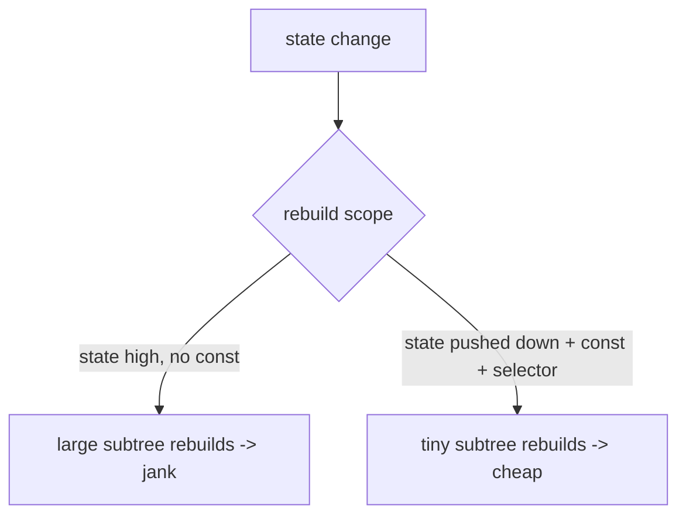
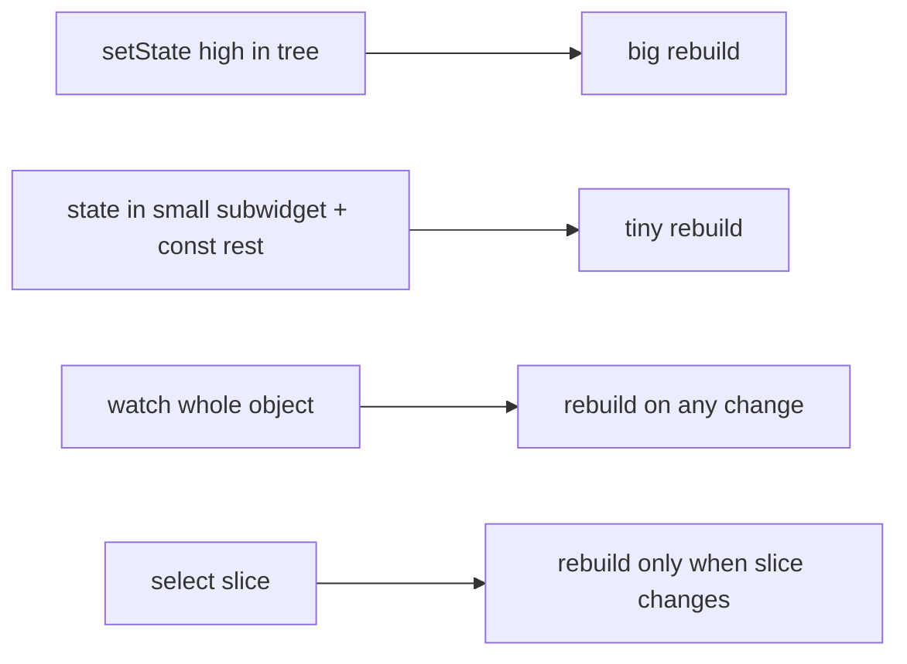

# Rebuild Optimization (`const`, Scoping, Selectors)

> Most UI-thread jank is over-rebuilding: shrink the **rebuild scope** so a state change rebuilds the smallest subtree — via `const` widgets, pushing state down / extracting widget classes, and fine-grained subscriptions (`select`/`buildWhen`/`ValueListenableBuilder`).

## Introduction

The build phase re-runs `build` for dirty elements ([09 · build_phase](../09%20Rendering%20Pipeline/02_build_phase.md)). If a change rebuilds a large subtree (or rebuilds happen too often), the UI thread overruns its budget. This file covers the three levers to keep rebuilds small and cheap.

## Why this concept exists

Declarative UI rebuilds frequently by design; that's fine only if rebuilds are **scoped and cheap**. Uncontrolled rebuilds (state too high, no `const`, whole-object listeners) are the #1 UI-bound jank cause — and the easiest to fix once measured.

## Real-world analogy

Repainting a house: you don't repaint every room because one wall got a scuff — you repaint **just that wall** (scoped rebuild). `const` is masking off the trim you're not touching; selectors are only touching up the exact spot that changed.

## Problem Statement

A screen with an expensive header janks when a counter increments because the whole screen rebuilds. You'll scope the rebuild to the counter using `const`, widget extraction, and a selective listener — verified via "Track Widget Rebuilds."

## Internal Working



Three levers:
1. **`const` widgets**: `const` subtrees are canonicalized/identical across builds, so the element **skips** rebuilding them ([09 · build_phase](../09%20Rendering%20Pipeline/02_build_phase.md)).
2. **Scope via widget classes + state pushdown**: extract **widget classes** (not `_buildX()` methods — [07 · custom_composite_widgets](../07%20Widgets/09_custom_composite_widgets.md)) and put `setState`/state in the **smallest** widget that owns the changing UI, so only it rebuilds.
3. **Fine-grained subscriptions**: subscribe to the **slice** you render — `context.select`/`Selector` (Provider), `ref.watch(p.select(...))` (Riverpod), `buildWhen`/`BlocSelector` (BLoC), `ValueListenableBuilder` — so unrelated changes don't rebuild you ([Module 11](../11%20State%20Management/README.md)).

Also: keep `build` **pure and cheap** (no heavy work/allocations/side effects); use the `child` slot of builders to keep static subtrees out of the rebuild.

## Memory Representation

Rebuilds allocate throwaway widgets (GC'd); `const` avoids allocation; elements/render objects persist. Fewer/scoped rebuilds = less allocation churn ([02 · memory_and_gc](../02%20Advanced%20Dart/13_memory_and_gc.md)).

## Compiler Behavior

`const` constructors (all-`final` fields) enable canonicalization and skip. Lints (`prefer_const_constructors`) help.

## Runtime Behavior

Dirty elements rebuild; a rebuild whose child is `const`/`==`-equal short-circuits deeper work. Selectors re-run the builder only when the selected value changes (by `==`).

## Flutter Engine Behavior / Dart VM Behavior

Not applicable beyond build feeding the pipeline; heavy `build` work blocks the UI thread ([02 · isolates](../02%20Advanced%20Dart/04_isolates.md)).

## Examples

```dart
import 'package:flutter/material.dart';

// ❌ Whole screen rebuilds on every counter change
class Bad extends StatefulWidget {
  const Bad({super.key});
  @override State<Bad> createState() => _BadState();
}
class _BadState extends State<Bad> {
  int _count = 0;
  @override
  Widget build(BuildContext context) => Column(children: [
        const _ExpensiveHeader(),                 // const helps, but...
        Text('$_count'),                          // ...this whole build re-runs
        ElevatedButton(onPressed: () => setState(() => _count++), child: const Text('+')),
      ]);
}

// ✅ Scope the rebuild to the counter subwidget only
class Good extends StatelessWidget {
  const Good({super.key});
  @override
  Widget build(BuildContext context) => Column(children: const [
        _ExpensiveHeader(),   // const -> skipped
        _Counter(),           // only THIS rebuilds on its own setState
      ]);
}
class _Counter extends StatefulWidget {
  const _Counter();
  @override State<_Counter> createState() => _CounterState();
}
class _CounterState extends State<_Counter> {
  int _count = 0;
  @override
  Widget build(BuildContext context) => Row(children: [
        Text('$_count'),
        ElevatedButton(onPressed: () => setState(() => _count++), child: const Text('+')),
      ]);
}
class _ExpensiveHeader extends StatelessWidget {
  const _ExpensiveHeader();
  @override
  Widget build(BuildContext context) => const SizedBox(height: 100, child: Center(child: Text('Header')));
}

// Fine-grained subscription: rebuild only on the slice that changed
// context.select<CartModel, int>((c) => c.count)   // Provider
// ref.watch(cartProvider.select((c) => c.count))    // Riverpod
// ValueListenableBuilder(valueListenable: countVN, builder: ...)
```

## Diagrams



## Common Mistakes

| Mistake | Why | Fix |
|---------|-----|-----|
| `setState` high in the tree | Rebuilds big subtree | Push state into a small subwidget |
| No `const` on static subtrees | Needless rebuilds/allocations | Mark them `const` |
| `_buildX()` helper methods | No own element/scope/`const` | Extract widget classes |
| Whole-object `watch`/listen | Rebuild on unrelated changes | Use `select`/`Selector`/`buildWhen` |
| Heavy work/allocations in `build` | UI-thread cost each rebuild | Precompute/memoize; keep `build` pure |
| Not using builder `child` slot | Static subtree rebuilds | Pass it via `child` |

## Best Practices

- **Push state down** to the smallest widget that owns it; extract **widget classes** for independent rebuild scope.
- Use **`const`** aggressively for static subtrees (enable `prefer_const_constructors`).
- Subscribe to **slices** (`select`/`Selector`/`buildWhen`/`ValueListenableBuilder`), not whole objects.
- Keep `build` **pure and cheap**; memoize expensive derived values; use builder `child` slots.
- **Verify** with DevTools "Track Widget Rebuilds" — fix what actually over-rebuilds.

## Performance

Build cost ∝ dirty-subtree size × per-widget cost × rebuild frequency. Scoping + `const` + selectors attack all three — the primary UI-bound perf lever ([01_profiling_and_frame_budget.md](01_profiling_and_frame_budget.md)).

## Advantages / Disadvantages

- **+** Big UI-thread wins with simple, local changes; less allocation churn; scalable.
- **−** Requires deliberate structure (widget extraction, selectors); over-splitting can add minor complexity.

## Interview Questions

1. **🟢 What's the main UI-thread performance lever?** — Reducing rebuild scope and frequency: `const`, state-pushdown/widget extraction, and fine-grained selectors.
2. **🟢 How does `const` help rebuilds?** — `const` widgets are identical across builds, so elements skip rebuilding those subtrees.
3. **🟡 Why extract widget classes over `_buildX()` methods?** — Classes get their own element, `const`-ability, and independent rebuild scope; methods inline into the parent's build.
4. **🟡 What do selectors (`select`/`buildWhen`) do?** — Subscribe to a specific slice so the widget rebuilds only when that value changes, not on any state change.
5. **🟡 Why keep `build` pure/cheap?** — It runs frequently; heavy work/side effects there directly cost UI-thread time and cause bugs.
6. **🔴 How do you find over-rebuilding widgets?** — DevTools "Track Widget Rebuilds" shows rebuild counts per widget; target the hotspots.
7. **🔴 Where should state live to minimize rebuilds?** — In the smallest widget/scope that owns it (pushdown), with the rest `const`/selector-scoped.

## Senior Engineer Tips

- The fix for "everything rebuilds" is almost always **move state lower + `const` the rest + selectors** — not micro-optimizing widget internals.
- Prefer `ValueListenableBuilder`/`Selector`/Riverpod `select` to rebuild only the reactive leaf; wrap static neighbors in `const` or the builder `child`.
- Measure rebuild counts before/after; intuition about rebuilds is often wrong.

## Architect Perspective

Rebuild discipline is a UI-layer architecture decision: structure state so changes touch the smallest subtree (fine-grained reactivity + widget decomposition). This is a core reason state-management choice ([Module 11](../11%20State%20Management/README.md)) matters, and it keeps large apps smooth as they grow.

## Summary

- Reduce rebuild scope/frequency: `const` static subtrees, push state down / extract widget classes, subscribe to slices.
- Keep `build` pure/cheap; use builder `child` slots; verify with rebuild tracking.
- The primary UI-thread jank fix; drives state-management structure.

## Revision Notes

- Levers: `const` (skip static), state-pushdown + widget classes (scope), selectors (`select`/`Selector`/`buildWhen`/`ValueListenableBuilder`).
- `build` pure/cheap; builder `child` for static parts.
- Cost ∝ dirty subtree × per-widget × frequency.
- Verify via "Track Widget Rebuilds".

## Practice Questions

1. Why does high `setState` cause a big rebuild, and how do you fix it?
2. Why are widget classes better than build-helper methods for perf?
3. How do selectors reduce rebuilds vs whole-object listening?

## Coding Questions

1. Refactor a whole-screen `setState` into a small stateful subwidget + `const` neighbors.
2. Replace a whole-object `watch` with a `select`/`ValueListenableBuilder` for one field.
3. Use DevTools to show rebuild-count reduction after the change.

## Mini Project

**Rebuild-scope fix (Flutter):** Take a screen where a frequent counter change rebuilds an expensive header; refactor with state-pushdown + `const` + a selective listener so only the counter rebuilds. Capture "Track Widget Rebuilds" before/after. Acceptance: header no longer rebuilds on counter change; measurable rebuild reduction; `build` kept cheap; runs.
