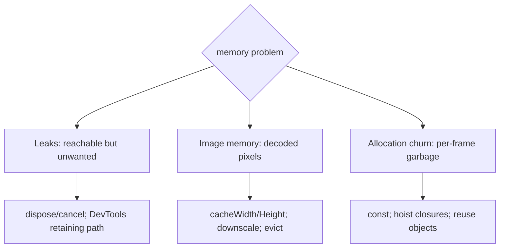
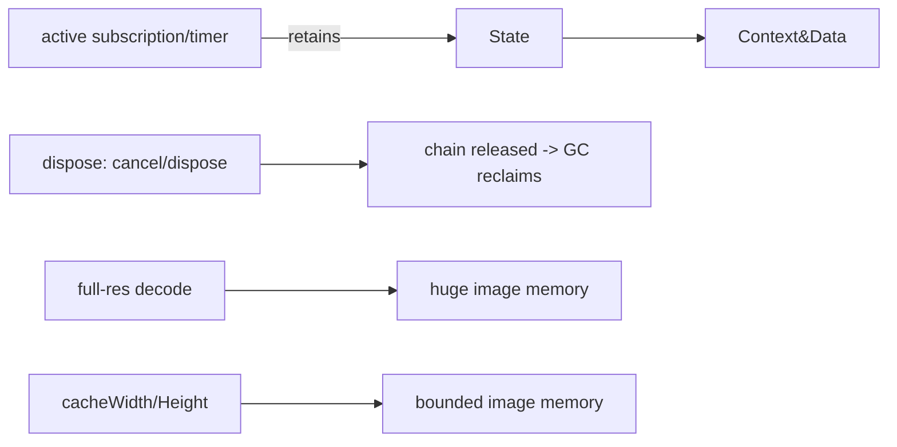

# Memory Optimization & Leak Hunting

> Memory problems come from **leaks** (unreleased references — uncancelled subscriptions/timers, undisposed controllers), **image memory** (full-res decodes), and **allocation churn** (per-frame garbage); fix them with disposal discipline, decode sizing, and reduced allocation — verified via DevTools Memory.

## Introduction

Growing memory → more GC → jank/OOM, especially on low-end devices. This file covers the three memory culprits and how to find/fix them, building on the GC/reachability model ([02 · memory_and_gc](../02%20Advanced%20Dart/13_memory_and_gc.md)) and dispose discipline ([08 · dispose_and_leaks](../08%20Widget%20Lifecycle/05_dispose_and_leaks.md)).

## Why this concept exists

Dart is GC-managed, but GC only reclaims **unreachable** objects — a forgotten subscription keeps a whole screen alive (leak). And images/allocations can bloat memory even without leaks. Managing this keeps apps stable and smooth over long sessions.

## Real-world analogy

Memory is a **desk**: leaks are papers you never throw away (piling up until you can't work); image bloat is keeping full-size posters when thumbnails would do; allocation churn is constantly printing and shredding scratch paper (busywork for the janitor/GC).

## Problem Statement

A screen's memory climbs each time it's opened/closed (leak), an image grid uses excessive RAM (image memory), and an animation causes GC hitches (churn). You'll find and fix each with DevTools Memory.

## Internal Working



- **Leaks (reachability)**: an object survives while any reference chain from a GC root reaches it. Common culprits (all retain the `State` and its captures): **uncancelled `StreamSubscription`s, `Timer`s, undisposed controllers** (Animation/Text/Scroll), un-removed listeners, unbounded static caches, singletons holding transient data ([08 · dispose_and_leaks](../08%20Widget%20Lifecycle/05_dispose_and_leaks.md)). Fix: **dispose/cancel** in `dispose`; bound caches; use `WeakReference`/`Expando` where appropriate.
- **Image memory**: decoded memory ∝ **pixels** (not file size). Full-res decodes of large images are huge. Fix: `cacheWidth`/`cacheHeight` (decode at display size), `ResizeImage`, evict from `ImageCache`, and use `cached_network_image` ([07 · images](../07%20Widgets/07_images_and_assets.md)).
- **Allocation churn**: per-frame/hot-path allocations (rebuilding heavy widgets/closures/lists) increase young-gen GC frequency → hitches. Fix: `const` widgets, **hoist stable closures** out of `build`/`itemBuilder`, reuse buffers/objects, avoid needless intermediate lists ([02_rebuild_optimization.md](02_rebuild_optimization.md)).
- **Find it**: DevTools **Memory** — heap **snapshots** across open/close cycles (growing instance counts = leak), **allocation tracing**, and the **retaining path** (what still references a "gone" object). `leak_tracker` catches leaks in tests.

## Memory Representation

Live objects occupy heap; images occupy GPU/CPU memory ∝ pixels; the young generation collects frequent short-lived garbage. Leaked graphs migrate to the old generation (costlier collection) ([02 · memory_and_gc](../02%20Advanced%20Dart/13_memory_and_gc.md)).

## Compiler Behavior

`const` reduces allocations (canonicalized). Otherwise not a compile-time concern.

## Runtime Behavior

Allocation is cheap; **churn** (frequency) is the cost. Leaks prevent collection indefinitely. Large image decodes spike memory immediately.

## Flutter Engine Behavior

The engine's `ImageCache` holds decoded images (bounded, configurable); GPU textures for images/layers consume GPU memory ([03_jank_and_raster.md](03_jank_and_raster.md)).

## Dart VM Behavior

Generational GC: frequent cheap young collections + rarer old collections; heavy churn/leaks increase GC work and pauses ([02 · memory_and_gc](../02%20Advanced%20Dart/13_memory_and_gc.md)).

## Examples

```dart
import 'dart:async';
import 'package:flutter/material.dart';

// LEAK FIX: dispose/cancel everything owned by the State
class _ScreenState extends State<StatefulWidget> {
  StreamSubscription? _sub;
  Timer? _timer;
  late final _scroll = ScrollController();
  late final _anim = AnimationController(vsync: /* this */ null as dynamic);

  @override
  void dispose() {
    _sub?.cancel();      // else the stream keeps `this` alive (leak)
    _timer?.cancel();    // else the scheduler keeps `this` alive
    _scroll.dispose();
    _anim.dispose();
    super.dispose();
  }
  @override Widget build(BuildContext context) => const SizedBox();
}

// IMAGE MEMORY FIX: decode at display size (not full-res)
Widget thumbnail(String url) => Image.network(
      url,
      width: 120, height: 120, fit: BoxFit.cover,
      cacheWidth: 240, cacheHeight: 240, // decode ~2x display, not full-res
    );

// CHURN FIX: hoist stable callbacks out of itemBuilder; const items
class Feed extends StatelessWidget {
  const Feed({super.key, required this.items});
  final List<String> items;
  @override
  Widget build(BuildContext context) => ListView.builder(
        itemCount: items.length,
        itemBuilder: (_, i) => _Item(text: items[i]), // const-friendly item widget
      );
}
class _Item extends StatelessWidget {
  const _Item({required this.text});
  final String text;
  @override Widget build(BuildContext context) => ListTile(title: Text(text));
}
```

## Diagrams



## Common Mistakes

| Mistake | Why | Fix |
|---------|-----|-----|
| Not cancelling subscriptions/timers | Retains `State` graph (leak) | `cancel()` in `dispose` |
| Not disposing controllers | Leak | `dispose()` each |
| Full-res image decodes | Memory spikes/OOM | `cacheWidth`/`cacheHeight`/`ResizeImage` |
| Unbounded static caches/singletons | Grow forever | Bound (LRU/size); weak refs; clear on logout |
| Per-frame closures/allocations | GC churn/hitches | `const`, hoist closures, reuse |
| No leak detection | Silent growth | DevTools snapshots + `leak_tracker` |

## Best Practices

- **Dispose/cancel** every subscription/timer/controller/listener (own it → release it in `dispose`); consider a dispose-tracking mixin ([08 · dispose_and_leaks](../08%20Widget%20Lifecycle/05_dispose_and_leaks.md)).
- **Size image decodes** (`cacheWidth`/`cacheHeight`); evict/cap the `ImageCache`; use disk caching ([07 · images](../07%20Widgets/07_images_and_assets.md)).
- **Bound caches** (LRU/size/TTL — [15 · caching_strategies](../15%20Local%20Storage/05_caching_strategies.md)); avoid singletons retaining transient/user data (clear on logout).
- **Reduce churn**: `const` widgets, hoist stable callbacks out of `build`/`itemBuilder`, reuse objects/buffers.
- **Verify**: DevTools Memory (snapshots across open/close, retaining path, allocation tracing) + `leak_tracker` in tests/CI.

## Performance

Leaks → gradual slowdown/OOM; image bloat → immediate spikes/OOM on low-end; churn → GC hitches. Fixing all three keeps memory flat and frames smooth over long sessions ([01_profiling_and_frame_budget.md](01_profiling_and_frame_budget.md)).

## Advantages / Disadvantages

- **+** Stable long-session memory, fewer GC pauses, no OOM crashes, smoother scrolling.
- **−** Requires disposal discipline + profiling; over-caching vs under-caching balance; image sizing tradeoffs (quality).

## Interview Questions

1. **🟢 What makes an object leak in Dart?** — It stays **reachable** from a GC root (e.g., an active subscription/timer/listener capturing `this`) so GC never collects it.
2. **🟢 Name common Flutter leaks.** — Uncancelled `StreamSubscription`s/`Timer`s and undisposed controllers (Animation/Text/Scroll) — all retaining the `State` graph.
3. **🟡 Why do images cause memory spikes?** — Decoded memory is proportional to pixel dimensions; full-res decodes are huge — use `cacheWidth`/`cacheHeight`.
4. **🟡 What is allocation churn and its effect?** — Frequent short-lived allocations (per-frame widgets/closures) increase young-gen GC frequency → hitches; reduce with `const`/hoisting/reuse.
5. **🟡 How do you find a leak?** — DevTools Memory: heap snapshots across open/close cycles, growing instance counts, and the retaining path; `leak_tracker` in tests.
6. **🔴 Why don't singletons/static caches get collected?** — They're GC roots; anything they reference lives for the app's life — bound them and clear transient/user data (e.g., on logout).
7. **🔴 How do you keep image memory bounded at scale?** — Decode at display size, cap/evict the `ImageCache`, downscale before caching, and use disk-backed caching.

## Senior Engineer Tips

- Enforce "if you `listen`/create a controller/start a timer, dispose it" in reviews; add `leak_tracker` to CI to catch regressions.
- Always size image decodes for lists/grids — full-res thumbnails are a top OOM cause on real devices.
- Audit singletons/static caches for retained user data; clear on logout/scope end ([14 · scopes_and_lifetimes](../14%20Dependency%20Injection/04_scopes_and_lifetimes.md)).

## Architect Perspective

Memory health is a cross-cutting reliability concern. Establishing disposal conventions (mixins/lints/leak tests), image-decode policies, bounded caches, and low-churn patterns prevents gradual degradation and OOM crashes — critical on low-end devices and long sessions, and part of monitoring ([Module 52](../52%20Monitoring/README.md)).

## Summary

- Three culprits: leaks (dispose/cancel), image memory (decode sizing/eviction), allocation churn (`const`/hoist/reuse).
- Leaks = unwanted reachability; images ∝ pixels; churn = GC frequency.
- Verify with DevTools Memory (snapshots/retaining path) + `leak_tracker`; keep memory flat across sessions.

## Revision Notes

- Leak = reachable-but-unwanted; cancel subscriptions/timers, dispose controllers/listeners; bound caches/singletons.
- Image memory ∝ decoded pixels → `cacheWidth`/`cacheHeight`/`ResizeImage`; cap/evict ImageCache.
- Churn → `const`, hoist closures out of `build`/`itemBuilder`, reuse objects.
- Find: DevTools snapshots + retaining path + allocation tracing; `leak_tracker` in tests.

## Practice Questions

1. Why does a forgotten subscription leak a whole screen?
2. Why size image decodes, and how?
3. What causes GC hitches during animation, and the fix?

## Coding Questions

1. Add correct disposal (a dispose-tracking mixin) to a leaky screen; verify flat memory.
2. Size image-grid decodes and measure memory reduction.
3. Remove per-frame allocations from an `itemBuilder` (hoist closures, `const` items).

## Mini Project

**Memory cleanup (Flutter):** Take a screen that leaks (uncancelled subscription + undisposed controllers), uses full-res images, and churns allocations in a list; fix all three (disposal, decode sizing, `const`/hoisting), and prove flat memory across open/close via DevTools snapshots + a `leak_tracker` test. Acceptance: no growth across cycles; bounded image memory; reduced churn; verified with tooling; runs.
