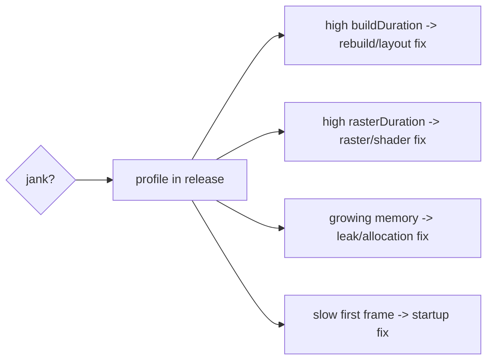

# Profiling & the Frame Budget

> Every frame must finish within the budget (~16ms at 60fps, ~8ms at 120fps) across **both** the UI and raster threads; profile with DevTools to attribute overruns to a specific phase/thread, then fix *that* — never optimize by guessing.

## Introduction

Performance starts with measurement. This file covers the frame budget, the DevTools performance tools, reading UI vs raster timings, and the disciplined **measure→diagnose→fix→verify** loop that all later files plug into.

## Why this concept exists

"It feels slow" isn't actionable. Different bottlenecks (rebuild, layout, paint, raster, memory, startup) need different fixes; applying the wrong one wastes effort. Profiling turns vague slowness into a precise, phase/thread-attributed problem.

## Real-world analogy

A doctor doesn't prescribe before diagnosing. Profiling is the **diagnostic scan**: it tells you *which organ* (phase/thread) is failing, so you treat the actual cause instead of guessing.

## Problem Statement

A list stutters while scrolling. Is it rebuilding too much (UI), laying out expensively (UI), painting heavy effects (raster), or hitting shader compilation (raster)? You'll profile to attribute it before touching code.

## Internal Working

```mermaid
flowchart TD
    Profile[DevTools Performance/Timeline] --> Frames[per-frame timings]
    Frames --> UIms[buildDuration (UI thread)]
    Frames --> Rasterms[rasterDuration (raster thread)]
    UIms -->|over budget| UIfix[rebuild/layout/paint fixes]
    Rasterms -->|over budget| Rasterfix[effects/shaders/RepaintBoundary/Impeller]
```

- **Frame budget**: ~16.6ms @ 60fps (~8.3ms @ 120fps). **Both** the UI thread (build→layout→paint→composite) and the raster thread (rasterize) must fit — they pipeline but each must keep up ([09 · pipeline_overview](../09%20Rendering%20Pipeline/pipeline_overview.md)).
- **DevTools tools**:
  - **Performance/Timeline**: per-frame `buildDuration` (UI) vs `rasterDuration` (raster); flame charts of what ran.
  - **Performance overlay**: two graphs (UI/raster); bars over the line = dropped frames.
  - **"Track Widget Rebuilds"**: which widgets rebuild and how often (build-phase issues).
  - **CPU profiler**: hot Dart functions (heavy computation).
  - **Memory**: heap snapshots, allocations, leaks ([memory_optimization.md](memory_optimization.md)).
  - **"Highlight Repaints"**: which layers repaint (raster/repaint issues — [09 · compositing](../09%20Rendering%20Pipeline/compositing_and_repaint_boundaries.md)).
- **Attribution rule**: high `buildDuration` → UI-thread (rebuild/layout/paint); high `rasterDuration` → raster-thread (effects/shaders); growing memory → leaks/allocation; slow first frame → startup.
- **Measure in profile/release**, never debug (debug has JIT + asserts + no AOT/shader realities — [02 · dart_compilation](../02%20Advanced%20Dart/dart_compilation.md)).

## Memory Representation

Not applicable directly; the Memory tab visualizes heap/retained objects ([02 · memory_and_gc](../02%20Advanced%20Dart/memory_and_gc.md)).

## Compiler Behavior

Debug (JIT) numbers are unrepresentative; profile/release (AOT) reflect real performance and shader behavior.

## Runtime Behavior

DevTools reads live frame timings; `SchedulerBinding.addTimingsCallback` exposes them programmatically. Dropped frames show as budget overruns on either thread.

## Flutter Engine Behavior

The engine reports frame phases; raster-thread cost (Skia/Impeller) is separate from UI-thread cost ([09 · rasterization](../09%20Rendering%20Pipeline/rasterization_skia_impeller.md)).

## Dart VM Behavior

CPU profiler attributes time to Dart functions; heavy synchronous work on the root isolate blocks frames ([02 · isolates](../02%20Advanced%20Dart/isolates.md)).

## Examples

```dart
import 'package:flutter/scheduler.dart';

// Programmatic frame timing (run in profile/release to attribute jank):
void watchFrames() {
  SchedulerBinding.instance.addTimingsCallback((timings) {
    for (final t in timings) {
      final uiMs = t.buildDuration.inMicroseconds / 1000;      // UI thread
      final rasterMs = t.rasterDuration.inMicroseconds / 1000; // raster thread
      if (uiMs > 16 || rasterMs > 16) {
        // over budget: uiMs high -> rebuild/layout; rasterMs high -> effects/shaders
        debugPrint('JANK ui=${uiMs}ms raster=${rasterMs}ms');
      }
    }
  });
}
```

```text
Profile the app (real perf + shaders):
  flutter run --profile
Open DevTools -> Performance:
  - enable Performance Overlay (UI/raster graphs)
  - "Track Widget Rebuilds" (build issues)
  - "Highlight Repaints" (repaint/raster issues)
  - Memory tab (leaks/allocations)
```

## Diagrams



## Common Mistakes

| Mistake | Why | Fix |
|---------|-----|-----|
| Optimizing without profiling | Wrong target, wasted effort | Measure first; fix the actual bottleneck |
| Profiling in debug mode | Unrepresentative (JIT/asserts) | Use profile/release |
| Only watching the UI thread | Miss raster-bound jank | Check `rasterDuration` too |
| "Add `const` everywhere" as a cure-all | Doesn't fix raster/memory/startup | Match fix to the phase |
| No before/after measurement | Can't prove improvement | Verify with frame timings |

## Best Practices

- Follow the loop: **measure → diagnose (phase/thread) → fix → verify**.
- Profile in **profile/release**, not debug.
- Attribute jank via `buildDuration` vs `rasterDuration` (+ rebuild/repaint highlighters + memory tab).
- Fix the **actual** bottleneck; re-profile to confirm gains.
- Set the budget by target fps (16ms/8ms) and treat overruns as bugs.

## Performance

This *is* the meta-skill: correct attribution makes every later optimization efficient. Guessing wastes time and can regress other areas.

## Advantages / Disadvantages

- **+** Data-driven fixes, provable improvements, no wasted effort.
- **−** Requires tooling familiarity and release-build profiling discipline.

## Interview Questions

1. **🟢 What's the frame budget?** — ~16.6ms at 60fps (~8.3ms at 120fps); both UI and raster threads must fit per frame or a frame drops.
2. **🟢 Why profile in release, not debug?** — Debug uses JIT + asserts and lacks AOT/shader realities; only profile/release reflect real performance.
3. **🟡 How do you tell UI-bound vs raster-bound jank?** — Compare `buildDuration` (UI thread) vs `rasterDuration` (raster thread) in DevTools/timings.
4. **🟡 Which DevTools tools diagnose what?** — Performance/overlay (frame timings), Track Widget Rebuilds (build), Highlight Repaints (raster/repaint), CPU profiler (hot Dart), Memory (leaks/allocations).
5. **🟡 Why not "add `const` everywhere"?** — It only helps the build phase; raster/memory/startup jank need different fixes — profile to know.
6. **🔴 What's the performance workflow?** — Measure → diagnose the phase/thread → apply the targeted fix → verify with before/after timings.
7. **🔴 How can a fast build still drop frames?** — Raster-thread cost (effects/shader compilation) or memory GC pauses can overrun the budget independently ([09 · rasterization](../09%20Rendering%20Pipeline/rasterization_skia_impeller.md)).

## Senior Engineer Tips

- Keep a small `addTimingsCallback` logger during perf work to flag jank frames with UI/raster split automatically.
- Reproduce jank on a **low-end device** in release — high-end debug hides real problems.
- Always capture **before/after** numbers; "it feels faster" isn't evidence.

## Architect Perspective

A measurement culture is the foundation of performance engineering: define budgets, profile in realistic conditions, attribute by phase/thread, and verify. This discipline scales across a team and prevents the two failure modes — ignoring perf and cargo-culting "optimizations" — and it underpins every technique in the following files and monitoring ([Module 52](../52%20Monitoring/README.md)).

## Summary

- Frame budget ~16ms/8ms across UI + raster threads; profile in profile/release with DevTools.
- Attribute jank by phase/thread (`buildDuration` vs `rasterDuration`, rebuild/repaint highlighters, memory tab).
- Follow measure→diagnose→fix→verify; fix the real bottleneck, prove it with data.

## Revision Notes

- Budget: 16.6ms@60 / 8.3ms@120; UI **and** raster threads must fit.
- Profile in release; `buildDuration`(UI) vs `rasterDuration`(raster) attributes jank.
- Tools: Performance/overlay, Track Widget Rebuilds, Highlight Repaints, CPU profiler, Memory.
- Loop: measure→diagnose→fix→verify; test low-end release device; before/after numbers.

## Practice Questions

1. How do you decide whether jank is UI- or raster-bound?
2. Why is debug profiling misleading?
3. What's the measure→fix→verify loop?

## Coding Questions

1. Add an `addTimingsCallback` that logs jank frames with UI/raster split.
2. Given a profile, identify the bottleneck phase and propose the fix category.
3. Capture before/after frame timings for a change.

## Mini Project

**Jank triage (Flutter + docs):** Take a moderately janky screen, profile it in release, capture UI vs raster timings + rebuild/repaint highlights, and write `PERF.md` attributing the bottleneck to a phase/thread with the recommended fix category (deep-dived in later files). Acceptance: release profiling; correct attribution; documented before-state + proposed fix.
