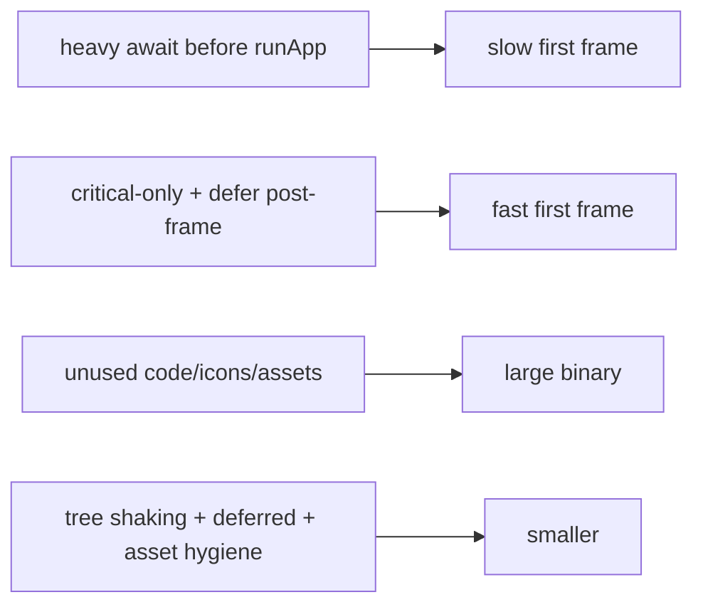

# Startup & App Size Optimization

> Fast cold start = minimal work before the first frame (defer non-critical init); small app size = tree shaking + deferred/lazy loading + asset discipline + obfuscation/split-debug-info — both measured on release builds, not guessed.

## Introduction

First impressions and download conversion depend on **cold-start time** and **app/bundle size**. This file covers reducing pre-`runApp` work, deferring initialization, and shrinking binaries (tree shaking, deferred loading on web, asset/dependency hygiene) — all verified on release builds.

## Why this concept exists

Slow launches feel broken and hurt retention; large apps reduce installs (especially on low-end/limited-data markets) and slow web loads. These are measurable business metrics, and both are fixable with deliberate startup and size discipline.

## Real-world analogy

Startup is a **restaurant opening for the day**: don't do the whole week's prep before serving the first customer (defer non-critical init) — get the doors open fast, then finish prep. App size is **packing for a trip**: bring only what you'll use (tree shaking), leave bulky items you might load later at home (deferred loading), and vacuum-pack the essentials (obfuscation/compression).

## Problem Statement

The app takes ~3s to show its first screen and ships a large APK/web bundle. You'll trim pre-`runApp` work, defer non-critical init, and shrink size via tree shaking, deferred loading, and asset/dependency hygiene — measuring before/after.

## Internal Working

```mermaid
flowchart TD
    subgraph Startup
      Main[main()] --> Critical[only critical init before runApp]
      Critical --> RunApp[runApp -> first frame FAST]
      RunApp --> Post[addPostFrameCallback: defer non-critical init]
    end
    subgraph Size
      AOT[AOT compile] --> Shake[tree shaking (drop dead code/icons)]
      Deferred[deferred imports (web)] --> LazyLoad[load on demand]
      Assets[asset hygiene] --> Smaller[smaller bundle]
      Obf[obfuscate + split-debug-info] --> Slim[smaller + safer]
    end
```

**Startup (cold start)**:
- Keep pre-`runApp` work **minimal**: `WidgetsFlutterBinding.ensureInitialized()` + only truly critical init (e.g., Firebase core), then `runApp` ([10 · embedder_and_startup](../10%20Flutter%20Architecture/embedder_and_startup.md)).
- **Defer** non-critical init (analytics, remote config, warm-ups, prefetch) to **after the first frame** (`WidgetsBinding.instance.addPostFrameCallback`) or **lazy** (create on first use — [14 · scopes_and_lifetimes](../14%20Dependency%20Injection/scopes_and_lifetimes.md)).
- Show a fast first frame / lightweight splash; avoid blocking `await`s in `main`.
- Offload heavy startup computation to isolates ([02 · isolates](../02%20Advanced%20Dart/isolates.md)).
- Measure **TTID/TTFD** (time-to-initial/first-frame-drawn) in release.

**App size**:
- **Tree shaking** (AOT/web): dead code + unused **icon glyphs** (`--tree-shake-icons`) are dropped automatically; keep deps lean (unused-but-referenced code still ships).
- **Deferred imports** (`deferred as` + `loadLibrary()`): split rarely-used features to load on demand (mainly **Flutter web** initial-load reduction — [02 · libraries_and_packages](../02%20Advanced%20Dart/libraries_and_packages.md)).
- **Assets**: compress images, ship right resolutions, use vector/SVG where apt, remove unused assets/fonts ([07 · images](../07%20Widgets/images_and_assets.md)).
- **Build config**: Android **app bundles** (per-device delivery), ABI splits; **obfuscation + `--split-debug-info`** (smaller + symbol stripping — [Module 37](../37%20Security/README.md)); analyze with `flutter build --analyze-size`.
- Avoid **reflection-based** libs (defeat tree shaking; also unsupported under AOT — [02 · dart_compilation](../02%20Advanced%20Dart/dart_compilation.md)).

## Memory Representation

Not the focus, but heavy startup allocations delay the first frame; deferred code isn't loaded until needed (memory + size win on web).

## Compiler Behavior

AOT + whole-program **tree shaking** removes unreferenced code/icons; `deferred` splits code; obfuscation renames symbols. Reflection blocks shaking.

## Runtime Behavior

Cold start pays engine init + AOT snapshot load + pre-`runApp` work + first-frame build; deferred libraries load on `loadLibrary()`. Warm start reuses a running engine ([02 · dart_compilation](../02%20Advanced%20Dart/dart_compilation.md)).

## Flutter Engine Behavior

Engine/snapshot load and first-frame rasterization dominate cold start; the embedder sets up before `main` ([10 · embedder_and_startup](../10%20Flutter%20Architecture/embedder_and_startup.md)).

## Dart VM Behavior

Release loads an AOT snapshot; snapshot size + init affect startup. Deferred loading defers compiling/loading that code.

## Examples

```dart
import 'package:flutter/material.dart';

Future<void> main() async {
  WidgetsFlutterBinding.ensureInitialized();
  // ✅ ONLY critical init before runApp (keep this tiny):
  // await Firebase.initializeApp(...);
  runApp(const MyApp());              // render first frame FAST

  // ✅ Defer non-critical init to after the first frame:
  WidgetsBinding.instance.addPostFrameCallback((_) async {
    // await analytics.init(); await remoteConfig.fetchAndActivate(); warmUpCaches();
  });
  // ❌ Anti-pattern: await loadEverything(); runApp(...);  // blocks first frame
}

class MyApp extends StatelessWidget {
  const MyApp({super.key});
  @override
  Widget build(BuildContext context) =>
      const MaterialApp(home: Scaffold(body: Center(child: Text('Fast boot'))));
}
```

```text
Measure/shrink:
  flutter build apk --release --analyze-size     # size breakdown
  flutter build appbar/aab                        # Android app bundle (per-device)
  flutter build ... --obfuscate --split-debug-info=build/symbols
  # icons: unused MaterialIcons glyphs are tree-shaken automatically in release
  # web: deferred imports reduce initial bundle
```

## Diagrams



## Common Mistakes

| Mistake | Why | Fix |
|---------|-----|-----|
| Heavy `await` before `runApp` | Delays first frame | Critical-only; defer the rest post-frame/lazy |
| Blocking `main` for analytics/DB/prefetch | Slow cold start | Initialize lazily/after first frame |
| Reflection-based libraries | Defeat tree shaking (+ AOT unsupported) | Use codegen equivalents |
| Shipping unused assets/fonts/deps | Bloats size | Prune; compress; right resolutions |
| Not using app bundles/obfuscation | Larger/less safe binaries | AAB + `--obfuscate --split-debug-info` |
| Measuring startup in debug | Unrepresentative | Measure in release (TTID/TTFD) |

## Best Practices

- **Critical-only before `runApp`**; **defer** non-critical init (`addPostFrameCallback`/lazy); show a fast first frame.
- Offload heavy startup work to **isolates**; avoid blocking `await`s in `main`.
- Rely on **tree shaking**; keep dependencies lean; avoid reflection.
- **Deferred-load** rarely-used features (web); practice **asset hygiene** (compress/right-size/prune).
- Ship **Android app bundles**, enable **obfuscation + split-debug-info**; analyze size (`--analyze-size`).
- **Measure** TTID/TTFD and size on release/low-end; verify before/after.

## Performance

Cold start = engine + snapshot + pre-`runApp` + first frame; deferring non-critical work is the biggest startup lever. Size affects install/web-load; tree shaking + deferral + asset hygiene are the main levers ([profiling_and_frame_budget.md](profiling_and_frame_budget.md)).

## Advantages / Disadvantages

- **+** Faster launch (retention), smaller downloads (installs/web speed), better low-end/limited-data UX.
- **−** Deferred/lazy init adds sequencing complexity; deferred loading mainly benefits web; obfuscation complicates crash symbolication (handled via split-debug-info).

## Interview Questions

1. **🟢 What dominates cold start?** — Engine + AOT snapshot load + pre-`runApp` work + first-frame build; minimizing pre-`runApp` work is the main lever.
2. **🟢 How do you speed up startup?** — Do only critical init before `runApp`; defer the rest to `addPostFrameCallback`/lazy; render a fast first frame.
3. **🟡 What is tree shaking and what does it remove?** — Whole-program dead-code elimination in AOT/web that drops unreferenced code and unused icon glyphs, shrinking the binary.
4. **🟡 When do deferred imports help?** — Mainly Flutter web — splitting rarely-used features to reduce the initial bundle, loaded on demand via `loadLibrary()`.
5. **🟡 Why avoid reflection-based libraries?** — They defeat tree shaking (can't prove code unused) and aren't supported under AOT; use codegen instead.
6. **🔴 How do you reduce and measure Android app size?** — App bundles (per-device delivery)/ABI splits, obfuscation + split-debug-info, asset hygiene; measure with `flutter build --analyze-size`.
7. **🔴 Why measure startup/size in release, not debug?** — Debug (JIT + assets + no AOT) is unrepresentative; only release reflects real startup time and binary size.

## Senior Engineer Tips

- Audit `main`: everything before `runApp` should be justified as *critical*; move the rest to post-frame/lazy.
- Track cold-start and app-size as **metrics over time** (CI + monitoring — [Module 52](../52%20Monitoring/README.md)); regressions creep in via `main` bloat and dependencies.
- Prefer codegen over reflection app-wide to keep tree shaking effective; prune assets/deps regularly.

## Architect Perspective

Startup and size are product-level performance metrics tied to retention and installs. Architecting a **lean composition root** (critical-only init, deferred/lazy the rest), a codegen-not-reflection stance, deferred web loading, and asset/build discipline — with measurement in CI — keeps launches fast and downloads small as the app grows ([Modules 10, 50, 51, 52](../10%20Flutter%20Architecture/embedder_and_startup.md)).

## Summary

- Cold start: critical-only before `runApp`, defer non-critical (post-frame/lazy), fast first frame, offload heavy work.
- Size: tree shaking + deferred loading (web) + asset/dependency hygiene + app bundles + obfuscation/split-debug-info; avoid reflection.
- Measure TTID/TTFD and size on release; verify before/after and track over time.

## Revision Notes

- Startup lever: minimize pre-`runApp`; defer via `addPostFrameCallback`/lazy; offload heavy to isolate; fast first frame.
- Size levers: tree shaking (+ `--tree-shake-icons`), deferred imports (web), asset hygiene, AAB/ABI splits, obfuscate + split-debug-info.
- Avoid reflection (breaks shaking, unsupported AOT).
- Measure in release: TTID/TTFD + `--analyze-size`; track over time.

## Practice Questions

1. What should/shouldn't run before `runApp`?
2. What does tree shaking remove, and what breaks it?
3. When do deferred imports help most?

## Coding Questions

1. Refactor `main` to critical-only init + post-frame deferral of analytics/warm-ups.
2. Add a deferred import for a rarely-used feature (web).
3. Run `--analyze-size` and identify the largest contributors to trim.

## Mini Project — Module capstone

**Fast, lean launch (Flutter + docs):** Refactor an app's `main` to critical-only init + deferred post-frame init, add a deferred-loaded feature (web), prune/compress assets, and enable app bundle + obfuscation/split-debug-info. Measure TTID/TTFD and app size before/after on a release/low-end build. Write `STARTUP_SIZE.md` with the numbers and changes. Acceptance: faster first frame; smaller size; measured before/after; reflection-free; runs.
