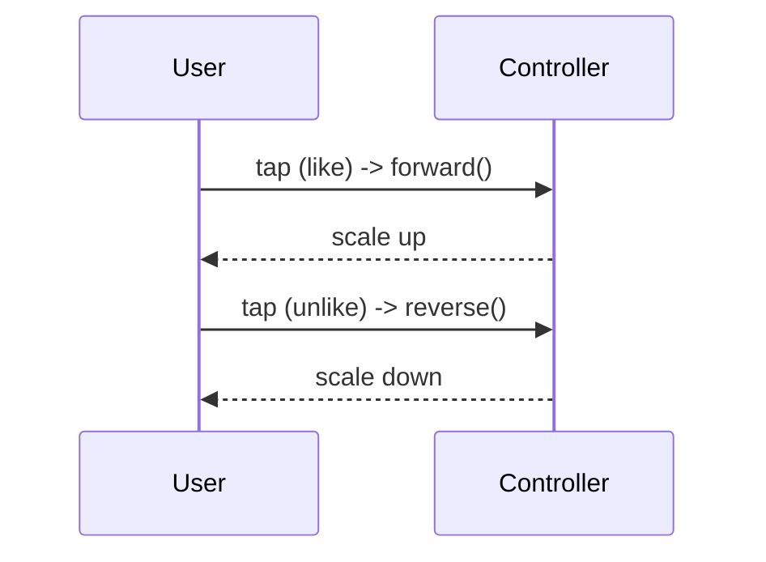

# Explicit Animations (Controllers, `AnimatedBuilder`, Transitions)

> Explicit animations give you a **controller you drive** — play, reverse, repeat, stop, chain on status — with the value consumed by `AnimatedBuilder` or `*Transition` widgets; use them when you need control, repetition, or coordination that implicit animations can't provide.

## Introduction

Where implicit animations fire-on-change ([02_implicit_animations.md](02_implicit_animations.md)), explicit animations put an `AnimationController` in your hands. This file covers driving controllers (forward/reverse/repeat), consuming values (`AnimatedBuilder`/`*Transition`), coordinating multiple animations from one controller, and status-driven chaining.

## Why this concept exists

Real interactions need control: a loading spinner that **repeats**, a like button that plays **and reverses**, an animation that starts on a gesture and **chains** into another. Implicit widgets can't express these; explicit controllers can — with precise timing and lifecycle.

## Real-world analogy

Implicit is a **thermostat** (set target, it eases there). Explicit is a **DJ at the controls**: you start, pause, rewind, loop, and cue the next track (chain) exactly when you want — full manual control.

## Problem Statement

Build a repeating loading spinner, a like button that plays forward on tap and reverses on un-tap, and a two-step sequence (scale then fade) — all from explicit controllers. You'll drive `forward`/`reverse`/`repeat` and coordinate multiple tweens.

## Internal Working

```mermaid
flowchart TD
    Controller[AnimationController (you drive it)] --> Value[Animation<double> 0->1]
    Value --> Tweens[multiple Tweens/Curves from ONE controller]
    Tweens --> Build[AnimatedBuilder / *Transition rebuild]
    Controller --> Status[status: forward/completed/reverse/dismissed]
    Status --> Chain[chain/reverse/repeat]
```

- **Drive the controller**: `forward()`, `reverse()`, `repeat(reverse: true)`, `stop()`, `animateTo()`, `fling()`. Control `duration`/`reverseDuration`; read/react to `status`.
- **Consume the value**:
  - **`AnimatedBuilder(animation:, builder:, child:)`** — rebuild the builder each tick from `.value` (pass static content via `child`).
  - **`*Transition`** (`FadeTransition`, `ScaleTransition`, `RotationTransition`, `SlideTransition`, `SizeTransition`) — efficient, purpose-built consumers of an `Animation`.
- **One controller, many tweens/curves**: drive scale + fade + color from a single controller with different `Tween`/`CurvedAnimation`s (coordinated, cheap).
- **Chaining**: use `status` listeners (`addStatusListener`) or `TweenSequence` for multi-step; reverse on completion, etc.
- **Lifecycle**: create in `initState`, **dispose** in `dispose`; use `SingleTickerProviderStateMixin` (or `TickerProviderStateMixin` for multiple controllers) ([08 · dispose_and_leaks](../08%20Widget%20Lifecycle/05_dispose_and_leaks.md)).

## Memory Representation

Controller(s) + tickers held by `State`; dispose them (leak + wasted frames otherwise). `AnimatedBuilder`'s `child` avoids rebuilding static content ([06_animation_performance.md](06_animation_performance.md)).

## Compiler Behavior

Not applicable.

## Runtime Behavior

Each tick updates the value → consumers rebuild; `repeat` loops until stopped; `status` transitions drive your chaining logic. `dispose` stops the ticker.

## Flutter Engine Behavior

Per-tick rebuild → repaint of the animated subtree; isolate with `RepaintBoundary` and keep the subtree small ([21 · jank_and_raster](../21%20Performance/03_jank_and_raster.md)).

## Dart VM Behavior

Not applicable.

## Examples

```dart
import 'package:flutter/material.dart';

// Repeating spinner (explicit, controlled)
class Spinner extends StatefulWidget {
  const Spinner({super.key});
  @override State<Spinner> createState() => _SpinnerState();
}
class _SpinnerState extends State<Spinner> with SingleTickerProviderStateMixin {
  late final AnimationController _c =
      AnimationController(vsync: this, duration: const Duration(seconds: 1))..repeat();
  @override void dispose() { _c.dispose(); super.dispose(); }
  @override
  Widget build(BuildContext context) =>
      RotationTransition(turns: _c, child: const Icon(Icons.autorenew)); // efficient transition
}

// Like button: play forward on like, reverse on unlike (one controller, coordinated tweens)
class LikeButton extends StatefulWidget {
  const LikeButton({super.key});
  @override State<LikeButton> createState() => _LikeButtonState();
}
class _LikeButtonState extends State<LikeButton> with SingleTickerProviderStateMixin {
  late final AnimationController _c =
      AnimationController(vsync: this, duration: const Duration(milliseconds: 300));
  late final Animation<double> _scale =
      Tween(begin: 1.0, end: 1.4).chain(CurveTween(curve: Curves.easeOut)).animate(_c);
  bool _liked = false;

  @override void dispose() { _c.dispose(); super.dispose(); }

  void _toggle() {
    setState(() => _liked = !_liked);
    _liked ? _c.forward() : _c.reverse(); // control direction
  }

  @override
  Widget build(BuildContext context) {
    return GestureDetector(
      onTap: _toggle,
      child: AnimatedBuilder(
        animation: _c,
        builder: (_, child) => Transform.scale(scale: _scale.value, child: child),
        child: Icon(_liked ? Icons.favorite : Icons.favorite_border,
            color: _liked ? Colors.red : null),
      ),
    );
  }
}
```

## Diagrams



## Common Mistakes

| Mistake | Why | Fix |
|---------|-----|-----|
| Not disposing controller(s) | Leak + endless frames | `dispose()` all controllers |
| Multiple controllers where one suffices | Overhead/complexity | Drive multiple tweens from one controller |
| `AnimatedBuilder` without `child` | Rebuilds static content each tick | Pass static content via `child` |
| `setState` per tick for big subtrees | Over-rebuild/jank | Use `AnimatedBuilder`/`*Transition` |
| `repeat()` left running off-screen | Wasted frames/battery | Stop when not visible |
| Wrong ticker mixin for N controllers | Errors | `TickerProviderStateMixin` for multiple |

## Best Practices

- Create controllers in `initState`, **dispose** in `dispose`; use the right ticker mixin (`Single...` vs `TickerProviderStateMixin`).
- Prefer **`*Transition`** widgets; use **`AnimatedBuilder` + `child`** for custom rebuilds; keep builders cheap.
- Drive **multiple coordinated tweens from one controller**; chain via `status`/`TweenSequence`.
- **Stop/repeat deliberately**; don't leave animations running off-screen.
- Isolate with `RepaintBoundary` for expensive/independent animations ([21 · jank_and_raster](../21%20Performance/03_jank_and_raster.md)).

## Performance

Per-tick rebuild cost scales with the animated subtree — keep it small, use `child`, prefer `*Transition`, isolate with `RepaintBoundary`, and stop off-screen animations. Mind raster cost of animated effects ([21 · jank_and_raster](../21%20Performance/03_jank_and_raster.md)).

## Advantages / Disadvantages

- **+** Full control (play/reverse/repeat/stop/chain), coordination, precise timing, reusable.
- **−** Boilerplate + lifecycle (dispose), easy to over-rebuild or leave running; more than simple cases need.

## Interview Questions

1. **🟢 When do you need explicit animations?** — When you need control (play/reverse/repeat/stop), coordination, chaining, or precise timing that implicit animations can't provide.
2. **🟢 How do you consume a controller's value efficiently?** — `*Transition` widgets or `AnimatedBuilder` with a `child` (rebuild only the animated part).
3. **🟡 How do you coordinate multiple animations?** — Drive multiple `Tween`/`CurvedAnimation`s from a single `AnimationController`.
4. **🟡 How do you chain animations?** — `addStatusListener` (react to `completed`/`dismissed`) or `TweenSequence` for multi-step sequences.
5. **🟡 Which ticker mixin for multiple controllers?** — `TickerProviderStateMixin` (use `SingleTickerProviderStateMixin` for one).
6. **🔴 How do you keep an explicit animation efficient?** — Scope rebuilds (`*Transition`/`AnimatedBuilder`+`child`), keep builders cheap, isolate with `RepaintBoundary`, and stop when off-screen.
7. **🔴 What lifecycle bugs are common?** — Not disposing controllers (leak + endless scheduled frames) and leaving `repeat()` running off-screen.

## Senior Engineer Tips

- One controller, many tweens — coordinate related motion (scale+fade+color) from a single clock.
- Always pass a `child` to `AnimatedBuilder`; it's the difference between rebuilding a leaf vs a subtree each tick.
- Pause/stop animations that aren't visible (route changes, off-screen list items) to save frames/battery.

## Architect Perspective

Explicit animations are the controllable tier for rich interactions and micro-interactions. Encapsulating them in reusable widgets (like/spinner/reveal) with correct lifecycle + scoped rebuilds keeps motion consistent and performant across a design system, building on the fundamentals and feeding staggering/physics ([01_animation_fundamentals.md](01_animation_fundamentals.md), [04_staggered_and_choreographed.md](04_staggered_and_choreographed.md)).

## Summary

- Explicit = a controller you drive (forward/reverse/repeat/stop/chain), value consumed by `*Transition`/`AnimatedBuilder`.
- One controller drives many coordinated tweens; chain via `status`/`TweenSequence`.
- Dispose controllers, scope rebuilds (`child`/transition), stop off-screen; use for control/coordination beyond implicit.

## Revision Notes

- Drive: `forward/reverse/repeat/stop/animateTo`; react to `status`; `Single`/`TickerProviderStateMixin`; dispose!
- Consume: `*Transition` (efficient) or `AnimatedBuilder`+`child`.
- One controller → many tweens/curves; chain via status/`TweenSequence`.
- Isolate + keep builders cheap; stop off-screen animations.

## Practice Questions

1. Why can implicit widgets not build a reversible like animation?
2. How do you coordinate scale + fade from one controller?
3. Why pass a `child` to `AnimatedBuilder`?

## Coding Questions

1. Build a repeating spinner with `RotationTransition`.
2. Build a like button that forwards/reverses on tap (coordinated scale + icon).
3. Chain scale→fade via a `status` listener or `TweenSequence`.

## Mini Project

**Micro-interaction kit (Flutter):** Build reusable explicit animations — a repeating loader, a reversible like button (one controller, coordinated tweens), and a two-step reveal (`TweenSequence`) — with correct lifecycle, scoped rebuilds (`*Transition`/`AnimatedBuilder`+`child`), and off-screen stopping. Acceptance: full control (play/reverse/repeat/chain); disposed; scoped/efficient; runs at 60fps.
