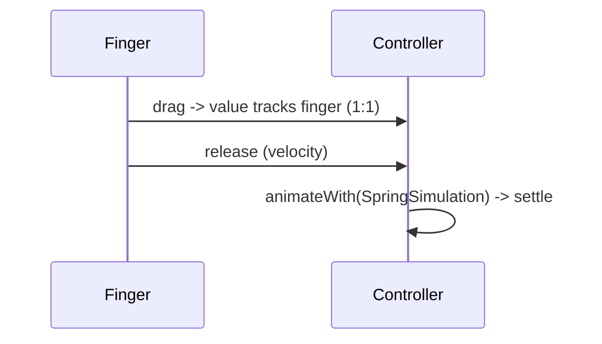

# Physics-Based & Gesture-Driven Animation

> Natural motion follows physics (springs, friction, gravity) rather than fixed durations; drive an `AnimationController` with a `Simulation` (e.g., `SpringSimulation`) or tie its value directly to a **gesture** (drag) so animations feel responsive and organic — like `Draggable`, `Dismissible`, and swipe-to-dismiss sheets.

## Introduction

Duration-based curves feel mechanical for interactive motion. This file covers **physics simulations** (spring/friction/gravity via `controller.animateWith(Simulation)`) and **gesture-driven** animation (map a drag to the controller value; `fling()` with velocity), plus the built-in gesture widgets (`Draggable`, `Dismissible`).

## Why this concept exists

When users fling/drag, motion should respond to their **velocity** and settle naturally (spring), not play a fixed 300ms tween. Physics makes interactions feel alive and predictable to the hand; gesture-driving makes the UI track the finger 1:1, then continue with momentum.

## Real-world analogy

A **real drawer**: you push it and it glides with momentum, then eases to a stop (friction); a **spring-loaded lid** snaps back when released. Physics animations reproduce that felt-realism; gesture-driving is the drawer following your hand exactly while you hold it.

## Problem Statement

A bottom sheet should follow the drag 1:1, then **fling** to open/closed based on release velocity and **spring** into place; and a card should be swipe-to-dismiss. You'll drive a controller with a spring simulation and from gesture velocity.

## Internal Working

```mermaid
flowchart TD
    Gesture[drag updates] --> Value[controller.value = drag fraction (1:1)]
    Release[drag end + velocity] --> Decide{fling target}
    Decide --> Sim[SpringSimulation/FrictionSimulation]
    Sim --> AnimateWith[controller.animateWith(sim)]
    AnimateWith --> Settle[natural settle to target]
```

- **Simulations**: a `Simulation` defines position/velocity over time. `controller.animateWith(simulation)` drives the value by physics instead of a fixed duration.
  - **`SpringSimulation(SpringDescription, start, end, velocity)`**: spring toward a target with mass/stiffness/damping — natural snap/bounce.
  - **`FrictionSimulation`**: decelerating glide (momentum scrolling feel).
  - **`GravitySimulation`**: fall under gravity.
- **Gesture-driven**: in `onPanUpdate`/`onVerticalDragUpdate`, set `controller.value` from the drag delta (1:1 tracking); on `onDragEnd`, use the **velocity** to `fling()` or pick a target and `animateWith(spring)` to settle.
- **`fling(velocity:)`**: drive the controller with a spring-like simulation using the release velocity.
- **Built-in gesture widgets**: `Draggable`/`DragTarget` (drag-and-drop), `Dismissible` (swipe-to-dismiss with velocity), `DraggableScrollableSheet` (draggable sheets) — encapsulate common gesture+physics patterns.
- **`ScrollPhysics`** (`BouncingScrollPhysics`/`ClampingScrollPhysics`) is physics-driven scrolling — a Strategy ([05 · strategy](../05%20Design%20Patterns/11_strategy.md)).

## Memory Representation

Controller + simulation objects (lightweight); dispose the controller. Gesture recognizers are managed by the gesture widgets ([08 · dispose_and_leaks](../08%20Widget%20Lifecycle/05_dispose_and_leaks.md)).

## Compiler Behavior

Not applicable.

## Runtime Behavior

During a drag the value tracks the finger; on release the simulation runs to completion (position/velocity → settle). `fling` uses velocity for a natural throw. Interruption (new drag) re-targets.

## Flutter Engine Behavior

Per-frame value updates repaint the moving widget; isolate/keep it cheap ([06_animation_performance.md](06_animation_performance.md)).

## Dart VM Behavior

Not applicable.

## Examples

```dart
import 'package:flutter/material.dart';
import 'package:flutter/physics.dart';

// Gesture-driven, spring-settled draggable panel (vertical)
class SpringPanel extends StatefulWidget {
  const SpringPanel({super.key});
  @override State<SpringPanel> createState() => _SpringPanelState();
}
class _SpringPanelState extends State<SpringPanel> with SingleTickerProviderStateMixin {
  late final AnimationController _c =
      AnimationController(vsync: this, lowerBound: 0, upperBound: 1)..value = 0;
  @override void dispose() { _c.dispose(); super.dispose(); }

  void _onDragUpdate(DragUpdateDetails d, double height) {
    _c.value -= d.primaryDelta! / height; // 1:1 follow the finger
  }

  void _onDragEnd(DragEndDetails d, double height) {
    // Use release velocity to decide + spring toward a target:
    final v = -d.velocity.pixelsPerSecond.dy / height;
    final target = (_c.value + v * 0.2) > 0.5 ? 1.0 : 0.0;
    final sim = SpringSimulation(
      const SpringDescription(mass: 1, stiffness: 200, damping: 20),
      _c.value, target, v,
    );
    _c.animateWith(sim); // natural spring settle
  }

  @override
  Widget build(BuildContext context) {
    final height = MediaQuery.of(context).size.height;
    return GestureDetector(
      onVerticalDragUpdate: (d) => _onDragUpdate(d, height),
      onVerticalDragEnd: (d) => _onDragEnd(d, height),
      child: AnimatedBuilder(
        animation: _c,
        builder: (_, child) => Align(
          alignment: Alignment(0, 1 - _c.value * 2), // map value -> position
          child: child,
        ),
        child: Container(height: 200, color: Colors.teal),
      ),
    );
  }
}

// Built-in: swipe-to-dismiss (velocity-aware) — no manual physics needed
Widget dismissible(Widget child, VoidCallback onDismissed) => Dismissible(
      key: const ValueKey('item'),
      onDismissed: (_) => onDismissed(),
      child: child,
    );
```

## Diagrams



## Common Mistakes

| Mistake | Why | Fix |
|---------|-----|-----|
| Fixed-duration tween for fling/drag | Feels mechanical/unresponsive | Physics (spring/friction) + velocity |
| Ignoring release velocity | Unnatural settle/decision | Use `d.velocity` for fling/target |
| Not clamping controller bounds | Out-of-range values | Set `lowerBound`/`upperBound`; clamp |
| Not disposing controller | Leak | Dispose |
| Reinventing swipe-to-dismiss | Bugs | Use `Dismissible`/`Draggable`/sheets |
| Heavy per-frame builder during drag | Jank | Keep builder cheap; isolate |

## Best Practices

- Use **physics simulations** (`SpringSimulation`/`Friction`/`fling`) for interactive/release motion; reserve fixed-duration curves for non-interactive transitions.
- **Track gestures 1:1** into the controller value during drag; use **release velocity** to fling/choose a target and **spring** to settle.
- Prefer **built-in gesture widgets** (`Draggable`, `Dismissible`, `DraggableScrollableSheet`, `ScrollPhysics`) before hand-rolling.
- Clamp controller bounds; dispose; keep the drag builder cheap/isolated.

## Performance

Physics/gesture animations repaint per frame during interaction — keep the moving subtree small/cheap and isolated. Velocity-based settling avoids overlong tweens. Built-ins are optimized ([21 · jank_and_raster](../21%20Performance/03_jank_and_raster.md)).

## Advantages / Disadvantages

- **+** Natural, responsive, velocity-aware motion; 1:1 gesture tracking; realistic settle; built-ins cover common cases.
- **−** More complex than duration tweens; tuning spring params; per-frame cost during interaction; needs care to feel right.

## Interview Questions

1. **🟢 Why use physics instead of fixed-duration curves for interactions?** — Interactive motion should respond to the user's velocity and settle naturally (spring/friction), which fixed durations can't express.
2. **🟢 How do you drive a controller with physics?** — `controller.animateWith(simulation)` (e.g., `SpringSimulation`) instead of `forward()` with a duration.
3. **🟡 How do you make an animation follow a drag?** — Set `controller.value` from the drag delta (1:1) in `onDragUpdate`; on end, use velocity to `fling`/spring to a target.
4. **🟡 What does `fling(velocity:)` do?** — Drives the controller with a velocity-based (spring-like) simulation for a natural throw.
5. **🟡 Which built-in widgets encapsulate gesture+physics?** — `Draggable`/`DragTarget`, `Dismissible`, `DraggableScrollableSheet`, and `ScrollPhysics` (bouncing/clamping).
6. **🔴 What is a `Simulation` and its common types?** — An object defining position/velocity over time; `SpringSimulation` (spring), `FrictionSimulation` (glide/decelerate), `GravitySimulation` (fall).
7. **🔴 How do you keep gesture-driven animation smooth?** — Cheap/isolated per-frame builder, clamp bounds, use velocity to avoid long tweens, and reuse built-ins where possible.

## Senior Engineer Tips

- Reach for built-ins (`Dismissible`/`DraggableScrollableSheet`) first — they encode the physics/gesture nuances you'd otherwise get wrong.
- For custom sheets/panels, track 1:1 then `animateWith(SpringSimulation)` using release velocity — this is the recipe for "feels native."
- Tune `SpringDescription` (stiffness/damping) to taste; over-bouncy springs feel toy-like.

## Architect Perspective

Physics/gesture-driven motion is what makes interactions feel native and responsive (sheets, dismiss, drag-drop, scroll). Building it from `Simulation` + gesture-to-value (or leaning on built-ins) is a UX-quality decision; it composes with the animation fundamentals and scroll physics, and its per-frame cost must respect the budget ([01_animation_fundamentals.md](01_animation_fundamentals.md), [21](../21%20Performance/03_jank_and_raster.md)).

## Summary

- Physics simulations (spring/friction/gravity via `animateWith`) give natural, velocity-aware motion.
- Gesture-drive by mapping drag→controller value (1:1) and flinging/springing on release using velocity.
- Prefer built-in gesture widgets; clamp bounds; dispose; keep the moving subtree cheap/isolated.

## Revision Notes

- `controller.animateWith(Simulation)`: `SpringSimulation`/`FrictionSimulation`/`GravitySimulation`; `fling(velocity)`.
- Gesture: `onDragUpdate` → set `value` (1:1); `onDragEnd` → velocity → target + spring.
- Built-ins: `Draggable`/`Dismissible`/`DraggableScrollableSheet`/`ScrollPhysics`.
- Clamp bounds; dispose; cheap/isolated builder; use velocity to settle.

## Practice Questions

1. Why do fixed-duration tweens feel wrong for a fling?
2. How do you tie an animation value to a drag and settle with a spring?
3. Which built-ins should you use before hand-rolling gesture physics?

## Coding Questions

1. Build a draggable panel that follows the finger and springs to open/closed by velocity.
2. Use `Dismissible` for swipe-to-dismiss list items.
3. Implement a `fling`-based toggle using release velocity.

## Mini Project

**Spring bottom sheet (Flutter):** Build a draggable bottom sheet that tracks the drag 1:1 and, on release, flings/springs (`SpringSimulation` with release velocity) to open or closed; plus a swipe-to-dismiss list via `Dismissible`. Acceptance: 1:1 tracking; velocity-aware spring settle; built-in dismiss; disposed; smooth (60fps).
