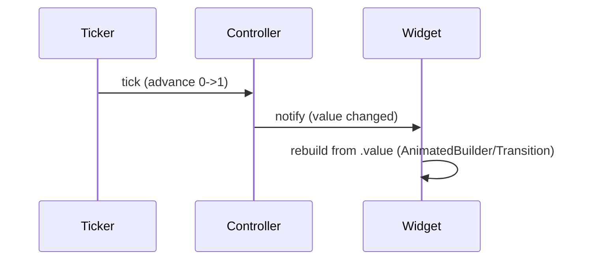

# Animation Fundamentals (`AnimationController`, `Tween`, `Curve`)

> Flutter animation is value-driven: an `AnimationController` produces a value (0→1) each frame (via a `Ticker`), a `Tween` maps that to your range/type, a `Curve` shapes the timing, and the UI rebuilds from the resulting `Animation<T>`.

## Introduction

The core objects: **`AnimationController`** (drives a 0→1 value over a duration, tied to a vsync `Ticker`), **`Animation<T>`** (a listenable value + status), **`Tween<T>`** (maps 0→1 to a range/type), and **`Curve`** (non-linear timing). This file explains how they compose — the foundation for every animation.

## Why this concept exists

Animating manually per frame is error-prone. Flutter factors it: the controller handles the clock (frames/duration), tweens handle interpolation (any type), and curves handle easing — a composable system that plugs into the scheduler ([09 · scheduler_and_vsync](../09%20Rendering%20Pipeline/scheduler_and_vsync.md)).

## Real-world analogy

A **film projector**: the controller is the motor turning the reel at a set speed (duration); the tween is the **frames drawn** for each position (start→end); the curve is the **motor easing in/out** rather than instant full speed. Together they play smooth motion.

## Problem Statement

Fade and slide a widget in over 400ms with an ease-out curve, controllable (play/reverse), and correctly disposed. You'll wire a controller + tweens + curve + an `AnimatedBuilder`.

## Internal Working

```mermaid
flowchart TD
    Ticker[Ticker (vsync)] --> Controller[AnimationController: 0->1 over duration]
    Controller --> Curved[CurvedAnimation: apply Curve]
    Curved --> Tween[Tween<T>: map to range/type]
    Tween --> Anim[Animation<T> value]
    Anim -->|listeners/AnimatedBuilder| Rebuild[rebuild widget from value]
```

- **`AnimationController(vsync:, duration:)`**: produces a value from `lowerBound`..`upperBound` (default 0..1) driven by a `Ticker` each frame; methods `forward()`/`reverse()`/`repeat()`/`stop()`; `status` (`forward`/`completed`/`reverse`/`dismissed`). Needs a **`TickerProvider`** (`SingleTickerProviderStateMixin`) and must be **disposed**.
- **`Animation<T>`**: a `Listenable` exposing `.value` + `.status`; the controller *is* an `Animation<double>`.
- **`Tween<T>(begin, end)`**: `.animate(controller)` maps 0→1 to `[begin, end]` — works for `double`, `Offset`, `Color` (`ColorTween`), `Size`, etc.
- **`Curve`** (`Curves.easeOut`, etc.): non-linear timing via `CurvedAnimation(parent:, curve:)` (chain before the tween).
- **Consuming the value**: `AnimatedBuilder`/`ListenableBuilder` rebuild on each tick (preferred, scoped), or `addListener` + `setState` (coarser). `*Transition` widgets (`FadeTransition`, `SlideTransition`) consume an `Animation` directly.

## Memory Representation

The controller + ticker are objects held by `State`; not disposing leaks and keeps frames scheduled ([08 · dispose_and_leaks](../08%20Widget%20Lifecycle/dispose_and_leaks.md)). Tweens/curves are lightweight.

## Compiler Behavior

Not applicable.

## Runtime Behavior

`forward()` advances the value each frame (transient scheduler phase — [09 · scheduler_and_vsync](../09%20Rendering%20Pipeline/scheduler_and_vsync.md)); listeners fire; the widget rebuilds from `.value`. `status` transitions drive chaining/reversal.

## Flutter Engine Behavior

Each tick triggers a rebuild → the animated widget re-paints; keep the rebuilt subtree small and isolate with `RepaintBoundary` to bound raster cost ([animation_performance.md](animation_performance.md)).

## Dart VM Behavior

Ticker callbacks run on the isolate's frame; heavy per-tick work blocks the UI thread ([02 · isolates](../02%20Advanced%20Dart/isolates.md)).

## Examples

```dart
import 'package:flutter/material.dart';

class FadeSlideIn extends StatefulWidget {
  final Widget child;
  const FadeSlideIn({super.key, required this.child});
  @override State<FadeSlideIn> createState() => _FadeSlideInState();
}
class _FadeSlideInState extends State<FadeSlideIn> with SingleTickerProviderStateMixin {
  late final AnimationController _c =
      AnimationController(vsync: this, duration: const Duration(milliseconds: 400));
  late final Animation<double> _fade =
      CurvedAnimation(parent: _c, curve: Curves.easeOut);           // curve
  late final Animation<Offset> _slide = Tween(
    begin: const Offset(0, 0.1), end: Offset.zero,                  // tween<Offset>
  ).animate(CurvedAnimation(parent: _c, curve: Curves.easeOut));

  @override
  void initState() { super.initState(); _c.forward(); }             // play
  @override
  void dispose() { _c.dispose(); super.dispose(); }                 // MUST dispose

  @override
  Widget build(BuildContext context) {
    // *Transition widgets consume the Animation directly (efficient):
    return FadeTransition(
      opacity: _fade,
      child: SlideTransition(position: _slide, child: widget.child),
    );
    // Equivalent with AnimatedBuilder (custom rebuild from value):
    // return AnimatedBuilder(animation: _c, builder: (_, child) =>
    //   Opacity(opacity: _fade.value, child: child), child: widget.child);
  }
}
```

## Diagrams



## Common Mistakes

| Mistake | Why | Fix |
|---------|-----|-----|
| Not disposing the controller | Leak; keeps frames scheduled | `dispose()` in `State.dispose` |
| No `TickerProvider` mixin | Controller needs `vsync` | `SingleTickerProviderStateMixin` |
| `addListener`+`setState` for large subtrees | Rebuilds too much each tick | `AnimatedBuilder`/`*Transition` (scoped) + `child` |
| Applying curve after tween incorrectly | Wrong easing | `CurvedAnimation(parent, curve)` then `.animate` |
| Heavy work in the per-tick builder | UI-thread jank | Keep builder cheap; precompute |

## Best Practices

- Create the controller in `initState` (with `vsync: this`) and **dispose** it.
- Use **`CurvedAnimation`** for easing, **`Tween`** for range/type, and **`AnimatedBuilder`/`*Transition`** to rebuild only the animated part (pass a `child` for static content).
- Keep per-tick builders **cheap**; isolate with `RepaintBoundary` ([animation_performance.md](animation_performance.md)).
- Drive chaining/reversal off `status`; prefer implicit animations for simple cases ([implicit_animations.md](implicit_animations.md)).

## Performance

Every tick rebuilds/repaints the animated subtree — keep it small and cheap; use `*Transition` (rebuilds only the transition) and `RepaintBoundary`. Heavy builders or effects cause jank ([21 · jank_and_raster](../21%20Performance/jank_and_raster.md)).

## Advantages / Disadvantages

- **+** Composable (controller/tween/curve), any type/range, precise control, integrates with scheduler.
- **−** Boilerplate + lifecycle (dispose) vs implicit animations; easy to over-rebuild if misused.

## Interview Questions

1. **🟢 What does an `AnimationController` do?** — Drives a value (default 0→1) over a duration via a vsync `Ticker`, with play/reverse/repeat/status control.
2. **🟢 What are `Tween` and `Curve` for?** — `Tween` maps 0→1 to a range/type (`Offset`/`Color`/…); `Curve` shapes the timing (easing) via `CurvedAnimation`.
3. **🟡 Why must you dispose the controller?** — It holds a `Ticker`; not disposing leaks it and keeps frames scheduled (wasting battery).
4. **🟡 `AnimatedBuilder` vs `addListener`+`setState`?** — `AnimatedBuilder` rebuilds only its builder (scoped, efficient, with a `child` slot); listener+`setState` rebuilds the whole `State` subtree.
5. **🟡 What does `status` give you?** — Animation state (`forward`/`completed`/`reverse`/`dismissed`) for chaining/reversing.
6. **🔴 How does animation tie into the scheduler?** — The `Ticker` fires each frame in the transient phase, advancing the controller value ([09 · scheduler_and_vsync](../09%20Rendering%20Pipeline/scheduler_and_vsync.md)).
7. **🔴 How do you keep a value-driven animation efficient?** — Scope rebuilds with `AnimatedBuilder`/`*Transition` + `child`, keep the builder cheap, and isolate with `RepaintBoundary`.

## Senior Engineer Tips

- Prefer `*Transition` widgets (`FadeTransition`/`SlideTransition`/`ScaleTransition`) — they rebuild only the transition and are efficient by design.
- Always pass a `child` to `AnimatedBuilder` so static content isn't rebuilt each tick.
- Use one controller to drive multiple tweens/curves (fade + slide together) rather than several controllers.

## Architect Perspective

The controller→tween/curve→value→rebuild model is Flutter's uniform animation substrate; understanding it lets you build any motion and reason about its cost. It underpins implicit widgets, transitions, staggering, and physics — and its performance (scoped rebuilds, isolation) ties directly to the rendering pipeline ([Module 09](../09%20Rendering%20Pipeline/README.md), [21](../21%20Performance/jank_and_raster.md)).

## Summary

- Animation = controller (0→1 via ticker) + tween (range/type) + curve (easing) → `Animation<T>` → rebuild.
- Dispose the controller; use `CurvedAnimation`/`Tween` and `AnimatedBuilder`/`*Transition` (with `child`).
- Keep per-tick builds cheap and isolated; foundation for all later animation techniques.

## Revision Notes

- `AnimationController(vsync, duration)` (needs `TickerProvider`, dispose!); `forward/reverse/repeat/status`.
- `Tween(begin,end).animate(CurvedAnimation(parent, curve))` → `Animation<T>`.
- Consume via `AnimatedBuilder`/`*Transition` (+`child`), not whole-subtree `setState`.
- Ticks = transient scheduler phase; keep builders cheap + `RepaintBoundary`.

## Practice Questions

1. How do controller, tween, and curve compose into an animation?
2. Why and where do you dispose the controller?
3. Why prefer `AnimatedBuilder`/`*Transition` over `addListener`+`setState`?

## Coding Questions

1. Fade+slide a widget in over 400ms with `easeOut`, one controller, disposed.
2. Animate a `Color` via `ColorTween` and drive a container.
3. Chain a second animation when the first `completed` (via `status`).

## Mini Project

**Reusable entrance animation (Flutter):** Build a `FadeSlideIn` widget wrapping any child, driven by one `AnimationController` + `CurvedAnimation` + `Tween<Offset>`/opacity, using `*Transition`/`AnimatedBuilder` with a `child`, disposed correctly. Acceptance: smooth fade+slide; one controller; disposed; scoped rebuilds; runs.
