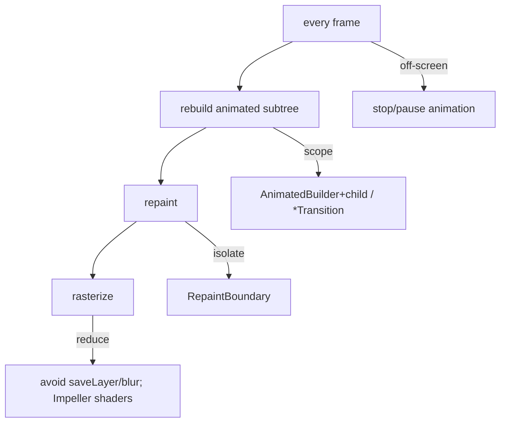
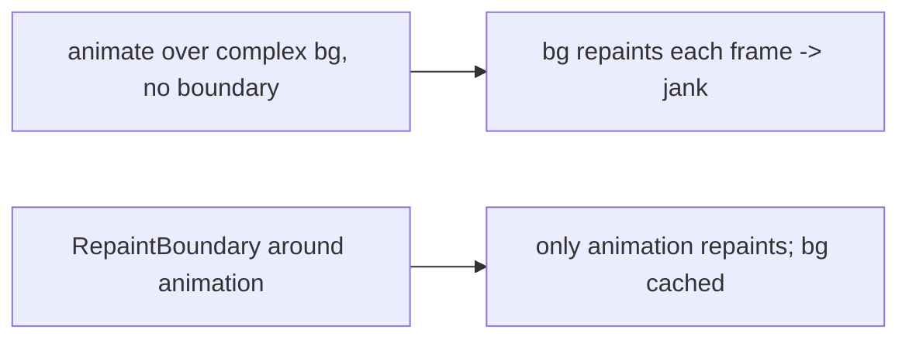

# Animation Performance

> Animations run every frame, so they're unforgiving of cost: keep the per-tick rebuild **small** (`AnimatedBuilder` + `child`, `*Transition`), **isolate** the moving part (`RepaintBoundary`), avoid **raster-expensive** effects (opacity/clip/blur = `saveLayer`), address **shader jank** (Impeller), and **stop off-screen** animations.

## Introduction

An animation that drops frames ruins the effect it was meant to create. This file consolidates the performance rules for animation, tying the animation system to the rendering-pipeline and performance modules ([Module 09](../09%20Rendering%20Pipeline/README.md), [Module 21](../21%20Performance/README.md)).

## Why this concept exists

Because animations rebuild/repaint ~60–120×/second, small per-frame costs multiply into jank. The fixes are specific: scope rebuilds, isolate repaints, cut raster cost, precompile shaders, and don't animate when unseen. Knowing them keeps motion smooth on real devices.

## Real-world analogy

A **flipbook**: if each page takes too long to draw, the animation stutters. You keep pages simple (cheap builds), only redraw the moving character (isolation), avoid elaborate shading (raster cost), and stop flipping when no one's watching (off-screen).

## Problem Statement

A spinning, blurred badge over a complex screen janks (raster-bound), and a list-item animation rebuilds the whole tile. You'll scope rebuilds, isolate repaints, cut raster cost, and confirm 60fps in release.

## Internal Working



- **Scope the rebuild**: use **`*Transition`** widgets (rebuild only the transition) or **`AnimatedBuilder` with a `child`** (static content passed via `child` isn't rebuilt). Never `addListener`+`setState` on a big subtree ([animation_fundamentals.md](animation_fundamentals.md)).
- **Isolate the repaint**: wrap the animating widget (and cache the expensive-static background) in **`RepaintBoundary`** so a moving part doesn't repaint neighbors ([09 · compositing](../09%20Rendering%20Pipeline/compositing_and_repaint_boundaries.md), [21 · jank_and_raster](../21%20Performance/jank_and_raster.md)).
- **Cut raster cost**: animating **opacity/clips/blur** uses `saveLayer` (offscreen buffers) — prefer `FadeTransition` (still `saveLayer` but scoped), tint paints, or bake effects; limit blur area/radius. Custom painters: correct `shouldRepaint` ([09 · paint_phase](../09%20Rendering%20Pipeline/paint_phase.md)).
- **Shader jank**: first-run animation stutter is shader compilation (Skia) → **Impeller** precompiles ([21 · jank_and_raster](../21%20Performance/jank_and_raster.md)).
- **Stop off-screen**: pause/stop controllers when the widget isn't visible (route change, off-screen list item) to save frames/battery; dispose on removal.
- **Profile**: check `rasterDuration` vs `buildDuration` during the animation on a low-end release build ([21 · profiling_and_frame_budget](../21%20Performance/profiling_and_frame_budget.md)).

## Memory Representation

Controllers/tickers + any `saveLayer`/boundary GPU buffers. Off-screen running animations waste CPU/GPU/battery; boundaries cost GPU memory (use where measured) ([09 · compositing](../09%20Rendering%20Pipeline/compositing_and_repaint_boundaries.md)).

## Compiler Behavior

Impeller precompiles shaders; `const` reduces rebuild allocation.

## Runtime Behavior

Each tick: rebuild → paint → raster of the animated subtree; costs compound over frames. Off-screen `repeat()` keeps scheduling frames until stopped.

## Flutter Engine Behavior

Raster-thread cost (effects/shaders) is separate from UI-thread rebuild cost — an animation can be raster-bound even with a trivial build ([09 · rasterization](../09%20Rendering%20Pipeline/rasterization_skia_impeller.md)).

## Dart VM Behavior

Heavy per-tick Dart work blocks the UI thread → dropped frames ([02 · isolates](../02%20Advanced%20Dart/isolates.md)).

## Examples

```dart
import 'package:flutter/material.dart';

class PerfAnimation extends StatefulWidget {
  const PerfAnimation({super.key});
  @override State<PerfAnimation> createState() => _PerfAnimationState();
}
class _PerfAnimationState extends State<PerfAnimation> with SingleTickerProviderStateMixin {
  late final AnimationController _c =
      AnimationController(vsync: this, duration: const Duration(seconds: 1))..repeat();
  @override void dispose() { _c.dispose(); super.dispose(); }

  @override
  Widget build(BuildContext context) {
    return Stack(children: [
      const RepaintBoundary(child: _ExpensiveStaticBackground()), // cache static
      // Isolate the animated part; AnimatedBuilder rebuilds only the transform, child stays put:
      RepaintBoundary(
        child: AnimatedBuilder(
          animation: _c,
          builder: (_, child) => Transform.rotate(angle: _c.value * 6.28, child: child),
          child: const Icon(Icons.refresh, size: 48), // NOT rebuilt each tick
        ),
      ),
    ]);
  }
}
class _ExpensiveStaticBackground extends StatelessWidget {
  const _ExpensiveStaticBackground();
  @override
  Widget build(BuildContext context) => const DecoratedBox(
      decoration: BoxDecoration(gradient: LinearGradient(colors: [Colors.indigo, Colors.teal])),
      child: SizedBox.expand());
}
```

## Diagrams



## Common Mistakes

| Mistake | Why | Fix |
|---------|-----|-----|
| `addListener`+`setState` on big subtree | Whole subtree rebuilds each tick | `AnimatedBuilder`+`child` / `*Transition` |
| No `child` in `AnimatedBuilder` | Static content rebuilt each tick | Pass it via `child` |
| No `RepaintBoundary` around animation | Neighbors repaint | Isolate the moving part |
| Heavy opacity/clip/blur animation | `saveLayer` raster cost | Reduce/bake; limit area; Impeller |
| First-run stutter blamed on rebuilds | Shader compilation | Impeller / warm-up |
| `repeat()` running off-screen | Wasted frames/battery | Stop/pause when not visible |
| Not profiling in release | Miss raster/shader reality | Profile low-end release |

## Best Practices

- **Scope rebuilds**: `*Transition` or `AnimatedBuilder`+`child`; never `setState` a big subtree per tick.
- **Isolate** the animating part (and cache expensive static) with `RepaintBoundary`.
- **Minimize raster-expensive effects** (opacity/clip/blur); bake/limit them; correct `shouldRepaint`; adopt **Impeller** for shader jank.
- **Stop/pause off-screen** animations; **dispose** controllers.
- **Profile the animation** in release on a low-end device (`buildDuration` vs `rasterDuration`).

## Performance

The rules attack each frame phase: rebuild (scope), paint/composite (isolate), raster (cheap effects/Impeller). Off-screen stopping saves battery. Verify with frame timings during the animation ([21 · profiling_and_frame_budget](../21%20Performance/profiling_and_frame_budget.md)).

## Advantages / Disadvantages

- **+** Smooth 60/120fps motion; battery-friendly; scalable across many animations.
- **−** Requires discipline (isolation/scoping/effect budgeting); `RepaintBoundary` GPU-memory cost; profiling effort.

## Interview Questions

1. **🟢 Why are animations sensitive to cost?** — They rebuild/repaint every frame (~60–120×/s), so small per-tick costs multiply into jank.
2. **🟢 How do you scope an animation's rebuild?** — `*Transition` widgets or `AnimatedBuilder` with a `child` so only the animated part rebuilds.
3. **🟡 Why wrap an animation in `RepaintBoundary`?** — To isolate its repaints into its own layer so it doesn't repaint neighbors (and expensive static content can be cached).
4. **🟡 Why is animating opacity/blur expensive?** — They use `saveLayer` (offscreen buffers) on the raster thread; minimize/bake them.
5. **🟡 What causes first-run animation stutter, and the fix?** — Shader compilation (Skia); fix with Impeller (precompiled shaders).
6. **🔴 How can an animation be janky with a trivial build?** — It's raster-bound (effects/shaders) — check `rasterDuration`, not just `buildDuration`.
7. **🔴 Why stop off-screen animations?** — A running/`repeat()` controller keeps scheduling frames, wasting CPU/GPU/battery when nothing's visible.

## Senior Engineer Tips

- Default recipe: `AnimatedBuilder` + `child` (or `*Transition`) **inside** a `RepaintBoundary`, over a cached static background — solves most animation jank.
- Profile the *specific animation* in release; attribute to UI vs raster before optimizing.
- Pause animations on route push / off-screen list items; it's an easy battery/perf win.

## Architect Perspective

Animation performance is where the animation system meets the rendering pipeline: scope rebuilds (build phase), isolate repaints (compositing), budget raster (effects/shaders/Impeller), and stop when unseen. Baking these into reusable animation widgets keeps motion premium *and* performant across the app ([Module 09](../09%20Rendering%20Pipeline/README.md), [Module 21](../21%20Performance/README.md)).

## Summary

- Keep per-tick rebuilds small (`AnimatedBuilder`+`child`/`*Transition`), isolate with `RepaintBoundary`, minimize raster-heavy effects, fix shader jank (Impeller), stop off-screen, dispose.
- Profile the animation in release (UI vs raster) and verify 60/120fps.
- These tie the animation system to the pipeline/performance modules.

## Revision Notes

- Scope: `*Transition`/`AnimatedBuilder`+`child` (never big-subtree `setState`).
- Isolate: `RepaintBoundary` (animation + cache static bg).
- Raster: avoid/limit opacity/clip/blur (`saveLayer`); `shouldRepaint`; Impeller for shader jank.
- Stop off-screen; dispose controllers; profile animation in release (build vs raster).

## Practice Questions

1. What's the default recipe for a smooth animation over a complex background?
2. How can an animation be raster-bound despite a cheap build?
3. Why stop animations that aren't visible?

## Coding Questions

1. Convert a `setState`-per-tick animation to `AnimatedBuilder`+`child` inside a `RepaintBoundary`.
2. Reduce an animated blur's raster cost; measure `rasterDuration`.
3. Stop a repeating animation when its route is not on top.

## Mini Project — Module capstone

**Smooth animated screen (Flutter):** Combine techniques — an implicit expand card, an explicit staggered entrance, and a gesture-driven spring sheet — each scoped (`*Transition`/`AnimatedBuilder`+`child`), isolated (`RepaintBoundary`), effect-budgeted, and stopped off-screen. Profile in release (UI vs raster) to confirm 60fps. Acceptance: scoped/isolated animations; raster budget respected; off-screen stopping; disposed; measured 60fps.
