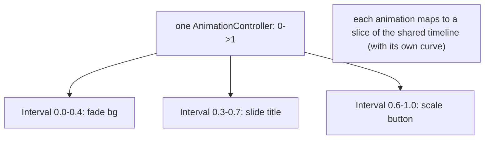

# Staggered & Choreographed Animations

> Choreograph multiple animations from **one controller** by giving each an `Interval` (a slice of the 0→1 timeline) so they start/end at different times — producing staggered entrances, sequenced steps, and coordinated motion; `AnimatedList`/`TweenSequence` help with list and multi-phase choreography.

## Introduction

Complex motion = many animations timed relative to each other. Rather than juggling multiple controllers, drive them from **one** controller and carve the timeline with `Interval`s (and `Curve`s). This file covers staggered animations, `TweenSequence`, and animated lists.

## Why this concept exists

Choreography (a card's icon, title, and button entering in sequence; a list staggering in) needs shared timing. One controller + intervals guarantees synchronization and simplicity; separate controllers drift and complicate lifecycle. It's the standard technique for polished, multi-part motion.

## Real-world analogy

A **synchronized dance** to one piece of music (the controller's timeline). Each dancer (animation) has a **cue** — when to start and stop within the song (`Interval`) — so the whole routine is coordinated to a single clock.

## Problem Statement

A card should animate in as: background fade (0–40%), title slide (30–70%), then button scale (60–100%) — all from one controller; and a list should stagger items in as they're added. You'll use `Interval`s and `AnimatedList`.

## Internal Working



- **`Interval(begin, end, curve:)`**: a `Curve` that is flat (0) before `begin`, animates `begin`→`end`, and flat (1) after — so a `CurvedAnimation(parent: controller, curve: Interval(...))` runs only during its slice of the shared 0→1.
- **Stagger**: assign overlapping/sequential intervals to each animation from **one controller**; `forward()` plays the whole choreography.
- **`TweenSequence`**: chain multiple tweens with weights over one animation (multi-phase single value, e.g., up-then-down, color A→B→C).
- **`AnimatedList`/`SliverAnimatedList`**: animate item insertion/removal (`insertItem`/`removeItem` + a per-item transition builder) — staggered/animated lists ([07 · scrolling_and_slivers](../07%20Widgets/scrolling_and_slivers.md)).
- **List stagger**: give each item an interval based on its index (delay ∝ index) for a cascading entrance.

## Memory Representation

One controller + several derived animations (lightweight). `AnimatedList` tracks items + in-flight transitions. Dispose the controller ([08 · dispose_and_leaks](../08%20Widget%20Lifecycle/dispose_and_leaks.md)).

## Compiler Behavior

Not applicable.

## Runtime Behavior

Each tick advances the shared value; each animation reflects its interval slice (flat outside it). `AnimatedList` runs per-item enter/exit transitions on insert/remove.

## Flutter Engine Behavior

All parts repaint during their active slices; isolate heavy parts and keep item counts/effects reasonable ([animation_performance.md](animation_performance.md)).

## Dart VM Behavior

Not applicable.

## Examples

```dart
import 'package:flutter/material.dart';

// Staggered card entrance from ONE controller via Intervals
class StaggeredCard extends StatefulWidget {
  const StaggeredCard({super.key});
  @override State<StaggeredCard> createState() => _StaggeredCardState();
}
class _StaggeredCardState extends State<StaggeredCard> with SingleTickerProviderStateMixin {
  late final AnimationController _c =
      AnimationController(vsync: this, duration: const Duration(milliseconds: 900))..forward();

  late final Animation<double> _bgFade =
      CurvedAnimation(parent: _c, curve: const Interval(0.0, 0.4, curve: Curves.easeOut));
  late final Animation<Offset> _titleSlide = Tween(begin: const Offset(-0.2, 0), end: Offset.zero)
      .animate(CurvedAnimation(parent: _c, curve: const Interval(0.3, 0.7, curve: Curves.easeOut)));
  late final Animation<double> _btnScale =
      CurvedAnimation(parent: _c, curve: const Interval(0.6, 1.0, curve: Curves.easeOutBack));

  @override void dispose() { _c.dispose(); super.dispose(); }

  @override
  Widget build(BuildContext context) {
    return FadeTransition(
      opacity: _bgFade,                                   // 0-40%
      child: Column(mainAxisSize: MainAxisSize.min, children: [
        SlideTransition(position: _titleSlide,            // 30-70%
            child: const Text('Welcome', style: TextStyle(fontSize: 24))),
        ScaleTransition(scale: _btnScale,                 // 60-100%
            child: ElevatedButton(onPressed: () {}, child: const Text('Start'))),
      ]),
    );
  }
}

// TweenSequence: multi-phase single value (grow then settle)
final bounce = TweenSequence<double>([
  TweenSequenceItem(tween: Tween(begin: 1.0, end: 1.3), weight: 50),
  TweenSequenceItem(tween: Tween(begin: 1.3, end: 1.0), weight: 50),
]);
```

## Diagrams

```mermaid
gantt
    title One controller timeline (0 -> 1)
    dateFormat X
    axisFormat %s
    section Choreography
    bg fade      :0, 40
    title slide  :30, 70
    button scale :60, 100
```



## Common Mistakes

| Mistake | Why | Fix |
|---------|-----|-----|
| Multiple controllers for one choreography | Drift, complex lifecycle | One controller + `Interval`s |
| Intervals summing/overlapping wrongly | Janky timing | Plan intervals on the 0→1 timeline |
| Manually rebuilding an animated list | Bugs/no exit animations | Use `AnimatedList` insert/remove |
| Staggering a huge list all at once | Perf hit | Stagger only visible/bounded items |
| Not disposing the controller | Leak | Dispose in `dispose` |

## Best Practices

- Drive choreography from **one controller** using **`Interval`s** (with per-slice curves); map the timeline deliberately.
- Use **`TweenSequence`** for multi-phase single values (bounce, A→B→C color).
- Use **`AnimatedList`/`SliverAnimatedList`** for animated insert/remove; stagger by index for entrances (bound to visible items).
- Keep total durations tasteful (~600–1000ms for entrances); dispose the controller; isolate heavy parts.

## Performance

One controller is efficient; cost is the sum of active parts repainting. Stagger only bounded/visible items; isolate expensive parts with `RepaintBoundary`; keep durations reasonable ([21 · jank_and_raster](../21%20Performance/jank_and_raster.md), [animation_performance.md](animation_performance.md)).

## Advantages / Disadvantages

- **+** Synchronized, polished multi-part motion from one clock; simple lifecycle; list enter/exit animations.
- **−** Interval planning overhead; over-choreography feels slow/busy; list staggering costs if unbounded.

## Interview Questions

1. **🟢 How do you stagger multiple animations?** — Drive them from one `AnimationController` and give each an `Interval` slice of the 0→1 timeline (with its own curve).
2. **🟢 Why one controller instead of several?** — Guarantees synchronization to a single clock and simplifies lifecycle; separate controllers drift.
3. **🟡 What does `Interval` do?** — It's a curve that's flat before `begin` and after `end`, animating only within its slice — timing an animation to part of the shared timeline.
4. **🟡 What is `TweenSequence` for?** — Chaining multiple tweens (with weights) over one animation for multi-phase single values (e.g., grow-then-settle).
5. **🟡 How do you animate list insert/remove?** — `AnimatedList`/`SliverAnimatedList` with `insertItem`/`removeItem` and a per-item transition builder.
6. **🔴 How do you stagger a list without hurting performance?** — Stagger only bounded/visible items (delay ∝ index within the viewport), not all items at once.
7. **🔴 How do you plan overlapping intervals?** — Map each animation's begin/end on the 0→1 timeline (they can overlap for smooth handoff); ensure the total reads as coordinated.

## Senior Engineer Tips

- Sketch the timeline (Gantt-style) first; choreography is a timing-design problem, then a coding one.
- Overlap intervals slightly for smooth handoffs (title starts before bg finishes) rather than strictly sequential.
- For lists, stagger the *visible* entrance only; unbounded staggering janks and feels sluggish.

## Architect Perspective

Choreography via one controller + intervals is the scalable way to build complex, synchronized motion (onboarding, hero screens, list entrances) with clean lifecycle. It composes the fundamentals into polished sequences and, done tastefully and bounded, delivers premium feel without perf cost ([animation_fundamentals.md](animation_fundamentals.md), [explicit_animations.md](explicit_animations.md)).

## Summary

- Choreograph multiple animations from one controller using `Interval` timeline slices (+curves).
- `TweenSequence` for multi-phase single values; `AnimatedList` for animated insert/remove; stagger lists by index (bounded).
- Plan the timeline, overlap for smooth handoffs, keep it tasteful, dispose the controller.

## Revision Notes

- One controller + `Interval(begin,end,curve)` per animation = staggered/choreographed.
- `TweenSequence` (weighted multi-phase single value); `AnimatedList`/`SliverAnimatedList` (insert/remove).
- Stagger lists by index but only visible/bounded; overlap intervals for handoffs.
- Plan timeline first; dispose controller; isolate heavy parts.

## Practice Questions

1. How do intervals let one controller stagger many animations?
2. When use `TweenSequence` vs multiple interval'd animations?
3. How do you stagger a list performantly?

## Coding Questions

1. Build a staggered card entrance (bg/title/button) from one controller via intervals.
2. Implement a grow-then-settle bounce with `TweenSequence`.
3. Animate list insertions with `AnimatedList`, staggering visible items by index.

## Mini Project

**Choreographed onboarding (Flutter):** Build an onboarding screen where several elements animate in staggered from one controller (intervals + curves), plus an `AnimatedList` section that staggers item entrances. Sketch the timeline in comments. Acceptance: single controller; coordinated intervals; animated list insert/remove; bounded stagger; disposed; smooth.
