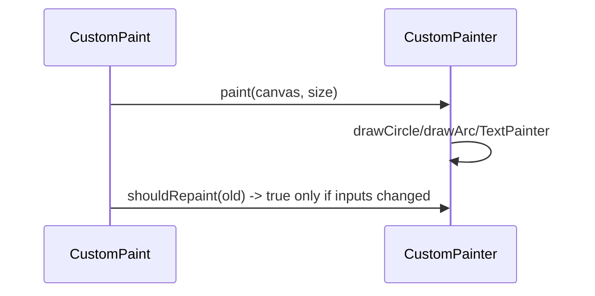

# `CustomPainter` & `Canvas`

> `CustomPaint` hands a `CustomPainter` a `Canvas` and a `Size`; you issue draw commands (`drawRect`/`drawCircle`/`drawPath`/`drawText`) with a `Paint`, and implement **`shouldRepaint`** to control when it re-draws — the entry point to pixel-level drawing.

## Introduction

`CustomPaint` is the widget that gives you a canvas; `CustomPainter` is where you draw. This file covers the `paint(canvas, size)` method, the `Paint` object (color/style/stroke), coordinate space, drawing text, and the critical `shouldRepaint`.

## Why this concept exists

Widgets describe *composed* UI; some visuals (a ring progress, a chart, a waveform) are inherently drawn, not composed. `CustomPainter` exposes the same low-level canvas the framework uses in the paint phase ([09 · paint_phase](../09%20Rendering%20Pipeline/04_paint_phase.md)), letting you draw anything.

## Real-world analogy

`CustomPaint` gives you a **blank canvas and brushes**; `CustomPainter.paint` is you **painting**. `Paint` is your **brush settings** (color, thickness, fill vs outline). `shouldRepaint` is deciding **whether the scene changed enough to repaint** rather than redoing the whole painting every frame.

## Problem Statement

Draw a circular progress ring (arc) with a label, styled with stroke width and color, that repaints only when its progress value changes. You'll use `CustomPaint`/`CustomPainter`, a `Paint`, `drawArc`, text, and `shouldRepaint`.

## Internal Working

```mermaid
flowchart TD
    Widget[CustomPaint(size, painter)] --> Painter[CustomPainter.paint(canvas, size)]
    Painter --> Draw[canvas.drawRect/Circle/Arc/Path/... with Paint]
    Widget --> Should[shouldRepaint(old) -> repaint only if inputs changed]
```

- **`CustomPaint(size:, painter:, foregroundPainter:, child:)`**: allocates a canvas of `size` (or sizes to `child`); `painter` draws behind, `foregroundPainter` in front.
- **`CustomPainter.paint(Canvas canvas, Size size)`**: issue commands; `size` is the drawing area (top-left origin, y-down).
- **`Paint`**: `color`, `style` (`fill`/`stroke`), `strokeWidth`, `strokeCap`, `shader` (gradients — [02_paths_shapes_gradients.md](02_paths_shapes_gradients.md)), `blendMode`, `isAntiAlias`.
- **Canvas commands**: `drawRect`, `drawRRect`, `drawCircle`, `drawArc`, `drawLine`, `drawPath`, `drawImage`, plus `save`/`restore`/`translate`/`rotate`/`scale`/`clip*` for transforms.
- **Text**: use a `TextPainter` (`layout()` then `paint(canvas, offset)`) — `Canvas` has no direct text method.
- **`shouldRepaint(oldDelegate)`**: return `true` only when inputs changed (compare fields); `false`/default-true wrongly repaints every frame — a top perf bug ([09 · paint_phase](../09%20Rendering%20Pipeline/04_paint_phase.md), [05_custom_painting_performance.md](05_custom_painting_performance.md)).
- Optional: `shouldRebuildSemantics`, `hitTest` for interactivity.

## Memory Representation

The painter records draw ops into a layer (`Picture`) each paint; the framework rasterizes it ([09 · rasterization](../09%20Rendering%20Pipeline/06_rasterization_skia_impeller.md)). Reuse `Paint`/`TextPainter` objects to avoid per-frame allocation ([05_custom_painting_performance.md](05_custom_painting_performance.md)).

## Compiler Behavior

Not applicable.

## Runtime Behavior

`paint` runs when the widget paints and whenever `shouldRepaint` returns true (or a repaint is triggered, e.g., by an animation via `repaint:`). Heavy paint ops cost raster time.

## Flutter Engine Behavior

Draw commands become GPU operations via Skia/Impeller on the raster thread; complex paths/effects cost raster time ([09 · rasterization](../09%20Rendering%20Pipeline/06_rasterization_skia_impeller.md)).

## Dart VM Behavior

Not applicable.

## Examples

```dart
import 'dart:math';
import 'package:flutter/material.dart';

class RingPainter extends CustomPainter {
  final double progress; // 0..1
  final Color color;
  RingPainter({required this.progress, required this.color});

  @override
  void paint(Canvas canvas, Size size) {
    final center = size.center(Offset.zero);
    final radius = min(size.width, size.height) / 2 - 6;

    final track = Paint()
      ..style = PaintingStyle.stroke ..strokeWidth = 8 ..color = color.withOpacity(0.2);
    final arc = Paint()
      ..style = PaintingStyle.stroke ..strokeWidth = 8 ..strokeCap = StrokeCap.round ..color = color;

    canvas.drawCircle(center, radius, track);                 // background track
    canvas.drawArc(                                           // progress arc
      Rect.fromCircle(center: center, radius: radius),
      -pi / 2, 2 * pi * progress, false, arc,
    );

    // Text via TextPainter (Canvas has no drawText):
    final tp = TextPainter(
      text: TextSpan(text: '${(progress * 100).round()}%',
          style: TextStyle(color: color, fontSize: 20, fontWeight: FontWeight.bold)),
      textDirection: TextDirection.ltr,
    )..layout();
    tp.paint(canvas, center - Offset(tp.width / 2, tp.height / 2));
  }

  @override
  bool shouldRepaint(RingPainter old) =>
      old.progress != progress || old.color != color; // repaint ONLY on change
}

class ProgressRing extends StatelessWidget {
  final double progress;
  const ProgressRing({super.key, required this.progress});
  @override
  Widget build(BuildContext context) => CustomPaint(
        size: const Size(120, 120),
        painter: RingPainter(progress: progress, color: Colors.teal),
      );
}
```

## Diagrams



## Common Mistakes

| Mistake | Why | Fix |
|---------|-----|-----|
| `shouldRepaint => true`/default | Repaints every frame → jank | Compare inputs; return false when unchanged |
| Allocating `Paint`/`TextPainter` per paint | GC churn | Reuse/cache them ([05_custom_painting_performance.md](05_custom_painting_performance.md)) |
| Using `canvas.drawText`-style call | No such method | Use `TextPainter.layout()`+`paint` |
| Ignoring `size` / hardcoding coords | Breaks on resize | Compute from `size` |
| Forgetting `save`/`restore` around transforms | State leaks between draws | Wrap transforms in `save`/`restore` |
| Heavy paint each frame | Raster jank | Cache/simplify; isolate with `RepaintBoundary` |

## Best Practices

- Implement **`shouldRepaint`** to repaint only on input changes (the #1 custom-paint perf rule).
- Compute geometry from **`size`** (resize-safe); wrap transforms in **`save`/`restore`**.
- Draw text with **`TextPainter`** (layout once, reuse where possible).
- Reuse `Paint` objects; keep `paint` **cheap**; **isolate** with `RepaintBoundary` (esp. when animated) ([21 · jank_and_raster](../21%20Performance/03_jank_and_raster.md)).
- Drive animated repaints via the painter's `repaint:` `Listenable` (e.g., an `AnimationController`) instead of rebuilding the widget.

## Performance

Paint recording is UI-thread; the ops rasterize on the GPU. Correct `shouldRepaint` + isolation + cheap ops keep it smooth; complex paths/effects add raster cost ([05_custom_painting_performance.md](05_custom_painting_performance.md)).

## Advantages / Disadvantages

- **+** Total visual control (charts/gauges/drawings/backgrounds), efficient when done right, integrates with animation.
- **−** Lower-level/imperative, easy to over-repaint, manual geometry/text, requires perf discipline.

## Interview Questions

1. **🟢 What does `CustomPainter` give you?** — A `Canvas` + `Size` to issue low-level draw commands (shapes/paths/text) with a `Paint`.
2. **🟢 What is `shouldRepaint` for?** — To tell the framework whether inputs changed so it repaints only when needed — returning true/default repaints every frame.
3. **🟡 How do you draw text on a canvas?** — With a `TextPainter` (`layout()` then `paint(canvas, offset)`); `Canvas` has no text method.
4. **🟡 What does `Paint` control?** — Color, fill/stroke style, stroke width/cap, shader (gradients), blend mode, anti-aliasing.
5. **🟡 Why wrap transforms in `save`/`restore`?** — To isolate transform/clip state so it doesn't leak into subsequent draws.
6. **🔴 How do you efficiently repaint an animated painter?** — Pass an `AnimationController` (a `Listenable`) as `CustomPainter(repaint: ...)` so it repaints on ticks without rebuilding the widget, and isolate with `RepaintBoundary`.
7. **🔴 What's the top custom-paint perf bug?** — Missing/incorrect `shouldRepaint` (repainting every frame) — plus per-paint allocations.

## Senior Engineer Tips

- Always define `shouldRepaint` by comparing the exact inputs; a wrong one silently repaints 60×/s.
- For animations, use `CustomPainter(repaint: controller)` + `RepaintBoundary` rather than `setState`-rebuilding the widget.
- Cache `Paint`/`TextPainter`/computed paths; recompute only when inputs change.

## Architect Perspective

`CustomPainter` is the sanctioned drop-to-canvas for bespoke visuals, sitting on the paint phase. Wrapping custom visuals in reusable, correctly-`shouldRepaint`ing, isolated painter widgets gives data-viz/drawing features that are both flexible and performant — the base for charts, gauges, and drawing tools across an app ([09 · paint_phase](../09%20Rendering%20Pipeline/04_paint_phase.md), [Module 22](../22%20Animations/README.md)).

## Summary

- `CustomPaint` + `CustomPainter.paint(canvas, size)` draw with `Paint`; text via `TextPainter`; transforms via `save`/`restore`.
- Implement `shouldRepaint` to repaint only on change; drive animated repaints via `repaint:`; isolate + reuse objects.
- The entry point for charts/gauges/drawings/backgrounds — powerful but requires perf discipline.

## Revision Notes

- `CustomPaint(size, painter, foregroundPainter, child)` → `paint(canvas, size)`; `Paint` (color/style/stroke/shader/blend).
- Text = `TextPainter.layout()`+`paint`; transforms in `save`/`restore`; geometry from `size`.
- `shouldRepaint(old)` = compare inputs (repaint only on change); animate via `repaint:` Listenable.
- Reuse Paint/TextPainter; isolate with `RepaintBoundary`.

## Practice Questions

1. Why is a missing/incorrect `shouldRepaint` a perf bug?
2. How do you draw text on a `Canvas`?
3. How do you efficiently repaint an animated painter?

## Coding Questions

1. Draw a progress ring (arc + track + % text) with correct `shouldRepaint`.
2. Draw a bar chart from a list of values scaled to `size`.
3. Animate a painter via `CustomPainter(repaint: controller)` inside a `RepaintBoundary`.

## Mini Project

**Progress ring widget (Flutter):** Build a reusable `ProgressRing` (`CustomPainter`: track arc + progress arc + centered % text), driven by an `AnimationController` via `repaint:`, with correct `shouldRepaint`, reused `Paint`, and `RepaintBoundary`. Acceptance: resize-safe geometry; repaints only on value change; text via `TextPainter`; smooth animation; runs.
