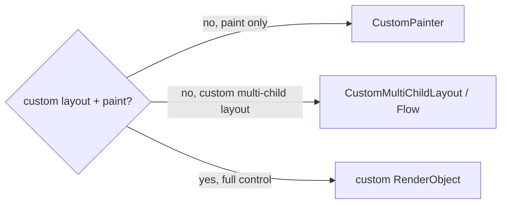

# Custom `RenderObject`s (Bespoke Layout + Paint)

> When you need custom **layout** (sizing/positioning children) *and* painting that `CustomPainter` (paint-only) or existing widgets can't express, drop to a custom `RenderObject` — implementing `performLayout` and `paint` directly on the render tree.

## Introduction

`CustomPainter` draws but doesn't do layout or manage children. For bespoke layout algorithms (custom flex, radial menus, flow layouts) plus painting, you write a `RenderObject` (usually via `RenderBox`) and expose it with a `RenderObjectWidget`. This file covers when and how — the rarest, most advanced custom-visual tier.

## Why this concept exists

The framework's layout widgets and `CustomPainter` cover most needs, but some UIs need a genuinely custom **layout protocol** (how children are measured/placed) combined with painting — e.g., a chart that lays out labels around data, a masonry/flow grid, a custom slider track+thumb. Only a `RenderObject` gives full control of layout *and* paint ([09 · layout_phase](../09%20Rendering%20Pipeline/03_layout_phase.md)).

## Why this concept exists (when NOT to)

Most of the time you **don't** need this — compose widgets, use `CustomPainter`, `Flow`, `CustomMultiChildLayout`, or `LayoutBuilder` first. Custom render objects are low-level and easy to get wrong; reserve them for real layout+paint needs.

## Real-world analogy

Widgets are **prefab furniture**; `CustomPainter` is **painting a wall**; a custom `RenderObject` is **being the architect and builder** — deciding room sizes/positions (layout) *and* the finish (paint). Powerful, but you own the structural engineering (the layout contract).

## Problem Statement

Build a widget that lays out children in a circle (radial layout) and paints connecting lines — layout the framework doesn't provide. You'll implement a custom `RenderBox` with `performLayout` + `paint`.

## Internal Working

```mermaid
flowchart TD
    Widget[RenderObjectWidget] --> Create[createRenderObject / updateRenderObject]
    Create --> RB[RenderBox]
    RB --> Layout[performLayout: size self + layout/position children]
    RB --> Paint[paint(context, offset): draw children + custom visuals]
    RB --> Hit[hitTest (for interactivity)]
```

- **Two options**:
  - **`SingleChildRenderObjectWidget`/`MultiChildRenderObjectWidget`** + a custom `RenderBox` — full control of layout + paint.
  - **`LeafRenderObjectWidget`** for no children (pure custom-drawn+laid-out leaf).
- **`RenderBox.performLayout()`**: read `constraints`, call `child.layout(childConstraints, parentUsesSize:)`, set `size`, and set each child's offset (`parentData`) — the layout contract ([09 · layout_phase](../09%20Rendering%20Pipeline/03_layout_phase.md)).
- **`paint(PaintingContext context, Offset offset)`**: draw via `context.canvas`; paint children with `context.paintChild(child, offset + childOffset)`.
- **`RenderObjectWidget`**: `createRenderObject(context)` builds it; `updateRenderObject` pushes new config (mark `markNeedsLayout`/`markNeedsPaint` on changes).
- **Parent data**: use `ContainerRenderObjectMixin`/`RenderBoxContainerDefaultsMixin` + a `ParentData` subclass for multi-child positioning.
- **Interactivity**: implement `hitTestChildren`/`hitTestSelf` for gestures.
- **Simpler alternatives** to consider first: `CustomMultiChildLayout`+`MultiChildLayoutDelegate`, `Flow`+`FlowDelegate`, or `CustomPainter` (paint-only).

## Memory Representation

A persistent node in the render tree holding size/offset/parentData; children are laid out/positioned relative to it ([09 · layout_phase](../09%20Rendering%20Pipeline/03_layout_phase.md)).

## Compiler Behavior

Not applicable.

## Runtime Behavior

`performLayout` runs in the layout phase (respect the constraints protocol); `paint` in the paint phase. Config changes must call `markNeedsLayout`/`markNeedsPaint` to schedule updates.

## Flutter Engine Behavior

Produces layers/draw ops rasterized by the engine; incorrect layout (not calling `child.layout`, wrong `size`) breaks rendering ([09 · pipeline_overview](../09%20Rendering%20Pipeline/01_pipeline_overview.md)).

## Dart VM Behavior

Not applicable.

## Examples

```dart
import 'dart:math';
import 'package:flutter/material.dart';
import 'package:flutter/rendering.dart';

// Radial layout: place children evenly on a circle, paint spokes.
class RadialLayout extends MultiChildRenderObjectWidget {
  const RadialLayout({super.key, required super.children});
  @override
  RenderObject createRenderObject(BuildContext context) => _RenderRadial();
}

class _RadialParentData extends ContainerBoxParentData<RenderBox> {}

class _RenderRadial extends RenderBox
    with ContainerRenderObjectMixin<RenderBox, _RadialParentData>,
         RenderBoxContainerDefaultsMixin<RenderBox, _RadialParentData> {
  @override
  void setupParentData(RenderBox child) {
    if (child.parentData is! _RadialParentData) child.parentData = _RadialParentData();
  }

  @override
  void performLayout() {
    size = constraints.biggest;                       // fill available
    final center = size.center(Offset.zero);
    final radius = min(size.width, size.height) / 2 - 40;
    final n = childCount;
    var child = firstChild;
    var i = 0;
    while (child != null) {
      child.layout(const BoxConstraints.tightFor(width: 60, height: 60), parentUsesSize: true);
      final angle = 2 * pi * i / n - pi / 2;          // place on circle
      final pd = child.parentData! as _RadialParentData;
      pd.offset = center + Offset(cos(angle), sin(angle)) * radius - const Offset(30, 30);
      child = pd.nextSibling; i++;
    }
  }

  @override
  void paint(PaintingContext context, Offset offset) {
    final center = offset + size.center(Offset.zero);
    final paint = Paint()..color = Colors.grey ..strokeWidth = 1;
    var child = firstChild;
    while (child != null) {
      final pd = child.parentData! as _RadialParentData;
      context.canvas.drawLine(center, offset + pd.offset + const Offset(30, 30), paint); // spoke
      context.paintChild(child, offset + pd.offset);   // paint the child
      child = pd.nextSibling;
    }
  }
}
// Usage: RadialLayout(children: [ ...avatars... ])
```

## Diagrams



## Common Mistakes

| Mistake | Why | Fix |
|---------|-----|-----|
| Writing a RenderObject when a delegate/painter suffices | Needless complexity/bugs | Use `CustomPainter`/`CustomMultiChildLayout`/`Flow` first |
| Not calling `child.layout` / not setting `size` | Broken layout | Follow the layout contract exactly |
| Forgetting `markNeedsLayout`/`markNeedsPaint` on config change | Stale rendering | Mark dirty in `updateRenderObject`/setters |
| Wrong `parentData` setup | Positioning breaks | Use the container mixins + a `ParentData` subclass |
| Ignoring constraints | Overflow/errors | Honor incoming `constraints` |
| No `hitTest` for interactive widgets | Gestures don't work | Implement `hitTestChildren`/`hitTestSelf` |

## Best Practices

- **Exhaust simpler options first**: composition, `CustomPainter` (paint-only), `CustomMultiChildLayout`/`Flow` (custom multi-child layout without a full RenderObject), `LayoutBuilder`.
- If you must: follow the **layout contract** (`constraints`→`child.layout`→set `size`→position children); mark dirty (`markNeedsLayout`/`markNeedsPaint`) on changes.
- Use **container mixins** + a `ParentData` subclass for multi-child positioning; implement `hitTest` for interactivity.
- Keep `performLayout`/`paint` efficient (relayout/repaint boundaries — [09 · layout_phase](../09%20Rendering%20Pipeline/03_layout_phase.md)).

## Performance

Custom render objects run in layout/paint each relevant frame — respect relayout/repaint boundaries and keep the algorithms O(children). Correctness (constraints/contract) matters as much as speed ([09 · layout_phase](../09%20Rendering%20Pipeline/03_layout_phase.md), [05_custom_painting_performance.md](05_custom_painting_performance.md)).

## Advantages / Disadvantages

- **+** Total control of layout *and* paint (impossible-otherwise layouts), integrates natively with the render tree.
- **−** Low-level, verbose, error-prone (layout contract/parentData/hitTest), rarely necessary — high maintenance cost.

## Interview Questions

1. **🟢 When do you need a custom `RenderObject` vs `CustomPainter`?** — When you need custom **layout** (sizing/positioning children), not just painting; `CustomPainter` is paint-only.
2. **🟢 What must `performLayout` do?** — Read `constraints`, lay out children (`child.layout`), set the render object's `size`, and position children (offsets) — honoring the layout contract.
3. **🟡 What simpler options should you try first?** — Composition, `CustomPainter`, `CustomMultiChildLayout`/`MultiChildLayoutDelegate`, and `Flow`/`FlowDelegate`.
4. **🟡 How does a `RenderObjectWidget` connect to the render object?** — `createRenderObject` builds it; `updateRenderObject` pushes new config (marking layout/paint dirty as needed).
5. **🟡 How do you position multiple children?** — Use `ContainerRenderObjectMixin` + a `ParentData` subclass storing each child's offset.
6. **🔴 What triggers re-layout/re-paint after a config change?** — Calling `markNeedsLayout()` / `markNeedsPaint()` (typically in setters/`updateRenderObject`).
7. **🔴 How do you make a custom render object interactive?** — Implement `hitTestSelf`/`hitTestChildren` so it participates in the gesture hit-test.

## Senior Engineer Tips

- The right answer is usually **"don't"** — reach for `Flow`/`CustomMultiChildLayout`/`CustomPainter` before a full `RenderObject`; they cover most "custom layout/paint" needs with far less risk.
- If you do write one, mirror an existing framework `RenderBox` and respect the constraints protocol exactly; subtle contract violations cause baffling bugs.
- Mark dirty correctly on every config change; forgetting it yields stale, confusing renders.

## Architect Perspective

Custom `RenderObject`s are the escape hatch for genuinely novel layout+paint (advanced charts, editors, custom layout engines). They're powerful but high-cost/maintenance; architecturally, prefer composition/delegates/painters and reserve render objects for a small, well-encapsulated set of truly-custom widgets ([09 · layout_phase](../09%20Rendering%20Pipeline/03_layout_phase.md)).

## Summary

- Custom `RenderObject` = full control of layout + paint (via `RenderBox`: `performLayout` + `paint`), exposed by a `RenderObjectWidget`.
- Honor the constraints/layout contract, use container mixins + parentData for children, mark dirty on changes, implement `hitTest` for interactivity.
- Rare/advanced — exhaust composition/`CustomPainter`/`Flow`/`CustomMultiChildLayout` first.

## Revision Notes

- Need custom layout+paint → `RenderBox` (`performLayout`: constraints→child.layout→size→offsets; `paint`: context.paintChild + custom draws).
- `RenderObjectWidget`: `createRenderObject`/`updateRenderObject`; mark `markNeedsLayout`/`markNeedsPaint`.
- Multi-child: `ContainerRenderObjectMixin` + `ParentData`; interactivity: `hitTest*`.
- Prefer `CustomPainter`/`Flow`/`CustomMultiChildLayout` first.

## Practice Questions

1. When is a custom `RenderObject` justified over `CustomPainter`?
2. What are the steps of `performLayout`?
3. What must you call after a config change, and why?

## Coding Questions

1. Implement a leaf `RenderBox` that sizes to a fixed aspect ratio and paints a shape.
2. Build a radial multi-child layout (children on a circle) + spokes.
3. Rewrite a custom layout using `CustomMultiChildLayout` instead and compare complexity.

## Mini Project

**Radial menu (Flutter):** Implement a `RadialLayout` custom `MultiChildRenderObjectWidget` placing children evenly on a circle with painted spokes (correct `performLayout`/`paint`/parentData, `markNeedsLayout` on change, basic `hitTest`). Then reimplement with `CustomMultiChildLayout` and note the tradeoff. Acceptance: correct layout contract; children positioned + spokes drawn; interactive; documented "prefer delegate" comparison; runs.
