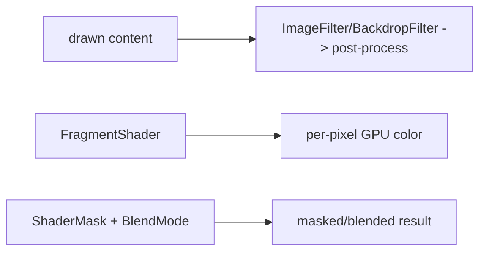

# Shaders & Effects (Fragment Shaders, `ImageFilter`, Blend Modes)

> For effects beyond shapes/gradients — glows, distortions, procedural patterns, blurs, color blends — use GPU **fragment shaders** (GLSL via `FragmentProgram`), `ImageFilter` (blur/matrix), `ShaderMask`, and `BlendMode` — powerful visuals that run on the GPU but carry real raster cost.

## Introduction

This file covers advanced visual effects: custom **fragment shaders** (`.frag` GLSL compiled to a `FragmentProgram`, applied as a `Paint.shader`), built-in **`ImageFilter`s** (blur, matrix) via `BackdropFilter`/`ImageFiltered`, **`ShaderMask`** (mask a child with a shader/gradient), and **`BlendMode`** (how colors combine). It's the top tier of custom visuals.

## Why this concept exists

Some looks — animated gradients, noise, ripples, glassmorphism blur, gradient-text, glow/duotone — can't be drawn with paths/solid fills alone. Shaders compute per-pixel color on the GPU; filters/blends compose effects. They enable rich, modern visuals Flutter's engine can render efficiently (with care).

## Real-world analogy

Fragment shaders are **a tiny program run for every pixel** (like a per-pixel recipe) executed on the GPU's many cores; `ImageFilter`/blend modes are **post-processing filters** (blur, tint, overlay) applied to already-drawn content — the difference between painting each dot vs applying an Instagram filter.

## Problem Statement

Add a gradient-masked headline (`ShaderMask`), a frosted-glass panel (`BackdropFilter` blur), and an animated custom fragment-shader background. You'll use `ShaderMask`, `ImageFilter.blur`, and a `FragmentProgram`.

## Internal Working

```mermaid
flowchart TD
    Frag[.frag GLSL] -->|FragmentProgram.fromAsset| Shader[FragmentShader (set uniforms)]
    Shader --> PaintShader[paint.shader = shader -> drawRect]
    ImageFilter[ImageFilter.blur/matrix] --> Filter[BackdropFilter / ImageFiltered]
    ShaderMask[ShaderMask(gradient/shader)] --> Mask[mask a child's alpha]
    BlendMode[Paint.blendMode] --> Compose[combine with backdrop]
```

- **Fragment shaders** (Flutter): author a GLSL `.frag`, declare it under `flutter: shaders:` in `pubspec.yaml`, load with `FragmentProgram.fromAsset(...)`, create a `FragmentShader`, set **uniforms** (`setFloat`/`setImageSampler`) — including time/resolution for animation — and assign to `paint.shader` for `drawRect`/`drawPaint`. Runs per-pixel on the GPU.
- **`ImageFilter`**: `ImageFilter.blur(sigmaX, sigmaY)` (and matrix/compose) used by **`BackdropFilter`** (blur what's *behind* — glassmorphism) or **`ImageFiltered`** (filter the child).
- **`ShaderMask`**: applies a shader/gradient as a **mask** over its child (e.g., gradient text, fade edges) via a blend mode.
- **`BlendMode`**: how source pixels combine with destination (`srcOver`, `multiply`, `screen`, `overlay`, etc.) — set on `Paint.blendMode` or in `ShaderMask`.
- **Cost**: shaders/filters run on the raster thread; blurs/backdrop are expensive (offscreen buffers); **shader compilation** can cause first-run jank (Impeller precompiles) ([21 · jank_and_raster](../21%20Performance/03_jank_and_raster.md)).

## Memory Representation

Filters/backdrops allocate offscreen GPU buffers; shaders use GPU program + uniform state. Large/animated blurs are GPU-memory and time heavy ([09 · compositing](../09%20Rendering%20Pipeline/05_compositing_and_repaint_boundaries.md)).

## Compiler Behavior

`.frag` shaders are compiled/bundled (declared in `pubspec`); Impeller precompiles shaders (no first-run jank); Skia compiles lazily.

## Runtime Behavior

Shaders execute per-pixel per frame; animating uniforms (time) repaints each frame. Filters/backdrops recompute each frame they're active — costly if large/continuous.

## Flutter Engine Behavior

All run on the GPU via the engine's rasterizer; Impeller vs Skia affects shader-compilation behavior and predictability ([09 · rasterization](../09%20Rendering%20Pipeline/06_rasterization_skia_impeller.md)).

## Dart VM Behavior

Not applicable (GPU-side).

## Examples

```dart
import 'dart:ui' as ui;
import 'package:flutter/material.dart';

// ShaderMask: gradient-filled text (mask child alpha with a gradient)
Widget gradientText(String text) => ShaderMask(
      shaderCallback: (rect) => const LinearGradient(
        colors: [Colors.purple, Colors.orange],
      ).createShader(rect),
      blendMode: BlendMode.srcIn,           // paint gradient where text is opaque
      child: Text(text, style: const TextStyle(fontSize: 40, color: Colors.white)),
    );

// BackdropFilter: frosted-glass panel (blur what's behind)
Widget frostedPanel(Widget child) => ClipRRect(
      borderRadius: BorderRadius.circular(16),
      child: BackdropFilter(
        filter: ui.ImageFilter.blur(sigmaX: 12, sigmaY: 12), // blur backdrop
        child: Container(color: Colors.white.withOpacity(0.15), child: child),
      ),
    );

// Custom fragment shader (animated) — pubspec: flutter: shaders: - shaders/wave.frag
class ShaderBackground extends StatefulWidget {
  const ShaderBackground({super.key});
  @override State<ShaderBackground> createState() => _ShaderBackgroundState();
}
class _ShaderBackgroundState extends State<ShaderBackground> with SingleTickerProviderStateMixin {
  ui.FragmentShader? _shader;
  late final _c = AnimationController(vsync: this, duration: const Duration(seconds: 4))..repeat();

  @override
  void initState() {
    super.initState();
    ui.FragmentProgram.fromAsset('shaders/wave.frag').then((p) => setState(() => _shader = p.fragmentShader()));
  }
  @override void dispose() { _c.dispose(); super.dispose(); }

  @override
  Widget build(BuildContext context) {
    if (_shader == null) return const SizedBox.expand();
    return AnimatedBuilder(
      animation: _c,
      builder: (_, __) => CustomPaint(size: Size.infinite, painter: _ShaderPainter(_shader!, _c.value)),
    );
  }
}
class _ShaderPainter extends CustomPainter {
  final ui.FragmentShader shader; final double t;
  _ShaderPainter(this.shader, this.t);
  @override
  void paint(Canvas canvas, Size size) {
    shader
      ..setFloat(0, size.width) ..setFloat(1, size.height) ..setFloat(2, t); // uniforms: resolution + time
    canvas.drawRect(Offset.zero & size, Paint()..shader = shader);
  }
  @override bool shouldRepaint(_ShaderPainter o) => o.t != t;
}
```

## Diagrams



## Common Mistakes

| Mistake | Why | Fix |
|---------|-----|-----|
| Large/continuous `BackdropFilter` blurs | Very expensive (offscreen, per frame) | Limit area/sigma; static/cached where possible |
| Shader not declared in `pubspec` | Fails to load | Add under `flutter: shaders:` |
| Ignoring shader-compilation jank | First-run stutter | Impeller / warm-up ([21 · jank_and_raster](../21%20Performance/03_jank_and_raster.md)) |
| Wrong `BlendMode` in `ShaderMask` | Wrong masking (e.g., not `srcIn`) | Pick the mode for the effect |
| Animating heavy effects unbounded | Raster jank | Bound size/area; isolate; profile |
| Not disposing FragmentShader/controller | Leak | Dispose |

## Best Practices

- Use built-ins first: **`ShaderMask`** (gradient/mask), **`ImageFilter`/`BackdropFilter`** (blur), **`BlendMode`** — reserve **custom fragment shaders** for genuinely procedural/animated effects.
- **Bound cost**: limit blur `sigma`/area; avoid large continuous backdrops; cache static effects; isolate with `RepaintBoundary`.
- Address **shader-compilation jank** via **Impeller** (or SkSL warm-up on Skia).
- Declare `.frag` in `pubspec`; set uniforms correctly; dispose shaders/controllers.
- **Profile** effects in release (raster-bound) on a low-end device.

## Performance

Shaders/filters/blends are raster-thread work; blurs/backdrops are the most expensive (offscreen buffers per frame). Impeller removes shader-compilation jank; still budget effect cost, cache, and isolate ([21 · jank_and_raster](../21%20Performance/03_jank_and_raster.md)).

## Advantages / Disadvantages

- **+** Rich, modern, GPU-accelerated visuals (glass/glow/procedural/animated) not possible with shapes alone.
- **−** Expensive (esp. blurs/backdrops), shader-compilation jank (Skia), GLSL complexity, GPU-memory cost — needs profiling/restraint.

## Interview Questions

1. **🟢 What's a fragment shader in Flutter?** — A GLSL program run per-pixel on the GPU, loaded via `FragmentProgram.fromAsset`, applied as a `Paint.shader` (with uniforms).
2. **🟢 What does `ShaderMask` do?** — Masks a child using a shader/gradient + blend mode (e.g., gradient text, edge fades).
3. **🟡 `BackdropFilter` vs `ImageFiltered`?** — `BackdropFilter` filters what's *behind* it (glassmorphism blur); `ImageFiltered` filters the child itself.
4. **🟡 Why are blurs/backdrops expensive?** — They allocate offscreen buffers and recompute per frame on the raster thread.
5. **🟡 How do you animate a fragment shader?** — Pass a time uniform (updated each frame via an `AnimationController`) and repaint (`shouldRepaint` on time).
6. **🔴 What causes first-run effect stutter and the fix?** — Shader compilation (Skia); fix with Impeller (precompiled) or SkSL warm-up.
7. **🔴 How do you keep effects performant?** — Prefer built-ins, bound blur size/area, cache static effects, isolate with `RepaintBoundary`, and profile raster time in release.

## Senior Engineer Tips

- Treat blur/backdrop as premium-cost; use small areas, cache when static, and never animate full-screen heavy blurs without profiling.
- Reach for `ShaderMask`/gradients/`BlendMode` before writing GLSL — most "shader-looking" effects are achievable with built-ins.
- If you ship custom shaders, plan for Impeller (or warm-up) and test first-run on a low-end device.

## Architect Perspective

Shaders/effects are the highest-cost visual tier — powerful for brand/immersive UI and data-viz, but raster-heavy. Architecturally, prefer built-in effects, budget/cached/isolated usage, and Impeller for predictability; reserve custom GLSL for signature effects, encapsulated and profiled ([09 · rasterization](../09%20Rendering%20Pipeline/06_rasterization_skia_impeller.md), [21 · jank_and_raster](../21%20Performance/03_jank_and_raster.md)).

## Summary

- Effects: fragment shaders (per-pixel GPU), `ImageFilter`/`BackdropFilter` (blur), `ShaderMask` (masking), `BlendMode` (compositing).
- Prefer built-ins; bound blur/backdrop cost; cache/isolate; address shader-compilation jank via Impeller.
- Rich modern visuals with real raster cost — profile in release and use restraint.

## Revision Notes

- Fragment shader: `.frag` (pubspec) → `FragmentProgram.fromAsset` → `FragmentShader` (set uniforms) → `paint.shader`.
- `ShaderMask` (gradient/mask + blend), `ImageFilter.blur` via `BackdropFilter`(behind)/`ImageFiltered`(child), `BlendMode`.
- Blurs/backdrops expensive (offscreen/frame); Impeller precompiles shaders (no first-run jank).
- Bound size/area; cache/isolate; dispose; profile raster in release.

## Practice Questions

1. `BackdropFilter` vs `ImageFiltered` — difference?
2. Why are blurs expensive and how do you mitigate?
3. How do you animate a fragment shader?

## Coding Questions

1. Build gradient text with `ShaderMask` (correct `BlendMode`).
2. Make a frosted-glass panel with `BackdropFilter` (bounded blur).
3. Load and animate a simple fragment shader with a time uniform.

## Mini Project — Module capstone

**Effects showcase (Flutter):** Build a screen with gradient-masked headline (`ShaderMask`), a frosted-glass card (`BackdropFilter`, bounded blur, `ClipRRect`), and an animated fragment-shader background (time uniform, `shouldRepaint`, `RepaintBoundary`). Profile raster time in release; note Impeller for shader jank. Acceptance: effects render correctly; blur cost bounded/isolated; shader animates; disposed; measured raster within budget. (Combines with the gauge/signature capstone in [README](README.md).)
