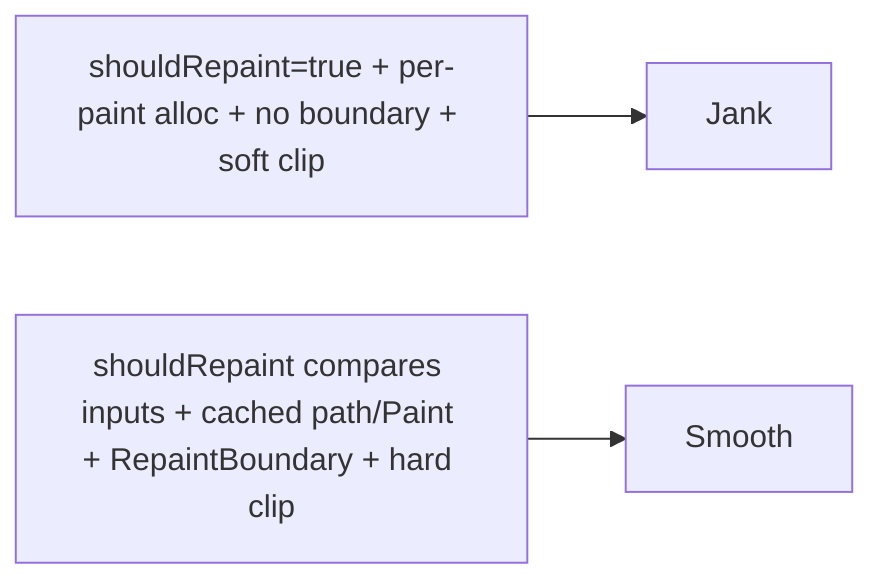

# Custom Painting Performance

> Custom paint can jank easily because it can run every frame: implement **`shouldRepaint`** correctly, **cache** expensive computations (paths/`Paint`/pictures), **isolate** with `RepaintBoundary`, keep `paint` **cheap**, and budget **raster-heavy** ops (soft clips/blurs/complex paths) — verified in release.

## Introduction

This file consolidates the performance rules for custom painting, connecting `CustomPainter`/paths/shaders to the paint/rasterization phases ([Module 09](../09%20Rendering%20Pipeline/README.md)) and the performance module ([Module 21](../21%20Performance/README.md)). It's the discipline that makes charts/gauges/drawings smooth.

## Why this concept exists

A painter with a wrong `shouldRepaint` or per-frame allocations repaints 60–120×/s, and complex paths/blurs stress the raster thread. Custom visuals are precisely where naive code janks — targeted rules keep them fast.

## Real-world analogy

An artist who **redraws the whole mural every second** (bad `shouldRepaint`), **mixes fresh paint each stroke** (per-frame allocation), and **uses slow airbrush everywhere** (blurs) will never keep up. The fast artist redraws only what changed, reuses mixed paint, and reserves the airbrush for small areas.

## Problem Statement

An animated chart janks: it repaints every frame, rebuilds its path/`Paint` each paint, isn't isolated, and uses a soft clip. You'll fix each and confirm 60fps in release.

## Internal Working

```mermaid
flowchart TD
    Frame[frame] --> Should{shouldRepaint?}
    Should -- false --> Skip[skip repaint]
    Should -- true --> Paint[paint(canvas,size)]
    Paint --> Cache[reuse cached path/Paint/Picture]
    Paint --> Cheap[minimal draw ops]
    Paint --> Raster[raster: budget clips/blurs/paths]
    Anim[animated] --> Repaint[repaint: Listenable + RepaintBoundary]
```

- **`shouldRepaint`**: return **false** unless inputs changed (compare fields) — the single biggest win; default/true repaints every frame ([01_custompainter_and_canvas.md](01_custompainter_and_canvas.md)).
- **Cache expensive work**: build `Path`s, `Paint`s, gradients, and `TextPainter`s **once** (fields/memoized by inputs), not inside every `paint`. For static complex drawings, record a `ui.Picture` (`PictureRecorder`) once and `drawPicture` it.
- **Isolate**: wrap the painter (and cache expensive static neighbors) in **`RepaintBoundary`** so its repaints don't affect others — essential for animated painters ([09 · compositing](../09%20Rendering%20Pipeline/05_compositing_and_repaint_boundaries.md)).
- **Animate efficiently**: drive repaints via `CustomPainter(repaint: controller)` (a `Listenable`) — repaints without rebuilding the widget — and keep the animated part small.
- **Budget raster ops**: complex paths, **soft/anti-aliased clips**, and **blurs** cost raster time (offscreen buffers) — simplify, use `Clip.hardEdge` where acceptable, limit blur area, and consider **Impeller** for shader jank ([04_shaders_and_effects.md](04_shaders_and_effects.md), [21 · jank_and_raster](../21%20Performance/03_jank_and_raster.md)).
- **Profile**: check `rasterDuration` vs `buildDuration` during the paint/animation in release on a low-end device ([21 · profiling_and_frame_budget](../21%20Performance/01_profiling_and_frame_budget.md)).

## Memory Representation

Cached paths/`Paint`/`Picture` live in painter fields (reused); per-frame allocation causes GC churn. Boundaries/offscreen buffers cost GPU memory — use where measured ([02 · memory_and_gc](../02%20Advanced%20Dart/13_memory_and_gc.md)).

## Compiler Behavior

Not applicable (Impeller precompiles shaders).

## Runtime Behavior

`paint` runs on repaint (gated by `shouldRepaint`/`repaint` Listenable). Cached objects skip rebuild cost; heavy ops rasterize slowly.

## Flutter Engine Behavior

Draw ops rasterize on the GPU; soft clips/blurs/complex paths are the costly ones; `drawPicture` replays a cached recording efficiently ([09 · rasterization](../09%20Rendering%20Pipeline/06_rasterization_skia_impeller.md)).

## Dart VM Behavior

Heavy per-paint Dart (path/geometry computation) blocks the UI thread — precompute/memoize ([02 · isolates](../02%20Advanced%20Dart/04_isolates.md)).

## Examples

```dart
import 'package:flutter/material.dart';

class ChartPainter extends CustomPainter {
  final List<double> data;
  // Cache Paint objects (reused across paints):
  static final _linePaint = Paint()
    ..style = PaintingStyle.stroke ..strokeWidth = 2 ..color = Colors.teal;
  Path? _cachedPath;
  Size? _cachedSize;

  ChartPainter(this.data, {Listenable? repaint}) : super(repaint: repaint);

  @override
  void paint(Canvas canvas, Size size) {
    // Rebuild the path only when inputs (data/size) change:
    if (_cachedPath == null || _cachedSize != size) {
      _cachedPath = _buildPath(size);
      _cachedSize = size;
    }
    canvas.drawPath(_cachedPath!, _linePaint); // cheap: draw cached path + reused Paint
  }

  Path _buildPath(Size size) {
    final path = Path();
    for (var i = 0; i < data.length; i++) {
      final x = size.width * i / (data.length - 1);
      final y = size.height * (1 - data[i]);
      i == 0 ? path.moveTo(x, y) : path.lineTo(x, y);
    }
    return path;
  }

  @override
  bool shouldRepaint(ChartPainter old) => old.data != data; // repaint only on data change
}

// Usage: isolate + drive animation efficiently
// RepaintBoundary(child: CustomPaint(painter: ChartPainter(data, repaint: controller)))
```

## Diagrams



## Common Mistakes

| Mistake | Why | Fix |
|---------|-----|-----|
| `shouldRepaint => true`/default | Repaints every frame | Compare inputs; false when unchanged |
| Building path/`Paint`/gradient in `paint` | Per-frame allocation/cost | Cache in fields; rebuild on input change |
| No `RepaintBoundary` around animated painter | Repaints neighbors | Isolate it |
| `setState`-rebuild for animation | Whole widget rebuilds | `CustomPainter(repaint: controller)` |
| Soft/anti-aliased clips + blurs each frame | Raster cost (offscreen) | Hard-edge clips; limit blur; cache |
| Recomputing static drawing every frame | Wasted work | Record once to `ui.Picture`; `drawPicture` |
| Profiling in debug | Unrepresentative | Profile in release/low-end |

## Best Practices

- **Implement `shouldRepaint`** comparing inputs (repaint only on change) — the top rule.
- **Cache** paths/`Paint`/gradients/`TextPainter` (and static drawings as a `ui.Picture`); recompute only when inputs change.
- **Isolate** with `RepaintBoundary`; **animate** via `repaint:` `Listenable` (not widget rebuilds); keep the animated area small.
- **Budget raster ops**: simplify paths, prefer hard-edge clips, limit blur area, adopt Impeller for shader jank.
- **Profile in release** (build vs raster) on a low-end device; verify before/after.

## Performance

The rules target each phase: repaint gating (`shouldRepaint`), UI-thread cost (caching/cheap paint), raster cost (simpler ops/clips/Impeller), and isolation (`RepaintBoundary`). Together they keep custom visuals at 60/120fps ([21 · profiling_and_frame_budget](../21%20Performance/01_profiling_and_frame_budget.md)).

## Advantages / Disadvantages

- **+** Smooth, efficient custom visuals; scalable to animated charts/gauges/drawings.
- **−** Requires discipline (`shouldRepaint`/caching/isolation/raster budgeting) and release profiling; boundaries cost GPU memory.

## Interview Questions

1. **🟢 What's the #1 custom-paint perf rule?** — Implement `shouldRepaint` to repaint only when inputs change (never default/true).
2. **🟢 Why cache paths/`Paint`?** — Building them inside `paint` allocates every frame (GC churn) and wastes CPU; cache and rebuild only on input change.
3. **🟡 How do you animate a painter efficiently?** — Pass an `AnimationController` as `CustomPainter(repaint:)` (repaints on ticks without rebuilding the widget) and isolate with `RepaintBoundary`.
4. **🟡 What custom-paint ops are raster-expensive?** — Complex paths, soft/anti-aliased clips, and blurs (offscreen buffers) — simplify/hard-edge/limit and consider Impeller.
5. **🟡 How do you draw a complex static picture cheaply?** — Record it once with `PictureRecorder`/`ui.Picture` and `drawPicture` it (no per-frame rebuild).
6. **🔴 How can a painter be raster-bound with cheap `paint`?** — Heavy raster ops (blurs/soft clips) or shader compilation cost GPU time regardless — check `rasterDuration`.
7. **🔴 Why isolate an animated painter?** — So its per-frame repaints don't force neighbors/backgrounds to repaint (localizes cost).

## Senior Engineer Tips

- Default recipe: correct `shouldRepaint` + cached path/`Paint` + `CustomPainter(repaint: controller)` + `RepaintBoundary` — solves most custom-paint jank.
- Cache static complex drawings as a `ui.Picture` and replay it; recompute only on real changes.
- Profile the *specific* painter in release; attribute UI vs raster before optimizing.

## Architect Perspective

Custom-paint performance is where the drawing tools meet the pipeline: gate repaints, cache work, isolate, and budget raster. Encapsulating these in reusable painter widgets yields data-viz/drawing features that stay smooth as data/animation scale — the payoff of understanding the paint/raster phases ([Module 09](../09%20Rendering%20Pipeline/README.md), [Module 21](../21%20Performance/README.md)).

## Summary

- Custom paint runs per frame — implement `shouldRepaint`, cache expensive work (paths/`Paint`/`Picture`), isolate with `RepaintBoundary`, animate via `repaint:`, budget raster ops.
- Profile in release (build vs raster) on low-end; verify.
- These rules keep charts/gauges/drawings/effects at 60/120fps.

## Revision Notes

- `shouldRepaint` compares inputs (top rule); cache paths/`Paint`/gradients/`TextPainter`/`ui.Picture`.
- Animate via `CustomPainter(repaint: controller)` + `RepaintBoundary`; keep animated area small.
- Raster budget: simpler paths, hard-edge clips, limited blur, Impeller.
- Profile release/low-end (build vs raster); before/after.

## Practice Questions

1. Why is a wrong `shouldRepaint` the top perf bug?
2. How do you animate a painter without rebuilding the widget?
3. How do you draw a complex static picture cheaply each frame?

## Coding Questions

1. Add correct `shouldRepaint` + cached path/`Paint` to a chart painter.
2. Drive a painter animation via `repaint:` inside a `RepaintBoundary`.
3. Record a static complex drawing to a `ui.Picture` and replay it.

## Mini Project

**Fast animated chart (Flutter):** Optimize a janky animated line chart: correct `shouldRepaint`, cached path/`Paint`, `CustomPainter(repaint: controller)` + `RepaintBoundary`, hard-edge clip, and a `ui.Picture` for the static grid. Profile release before/after (build vs raster). Acceptance: repaints only on data change; no per-frame allocation; isolated; measured 60fps; runs.
