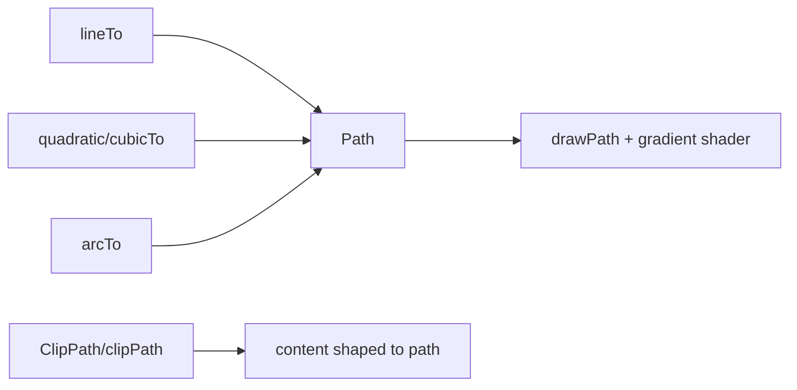

# Paths, Shapes, Gradients & Clipping

> Beyond primitives, `Path` composes arbitrary vector shapes (lines/curves/arcs), `Gradient`s fill them via a `Paint.shader`, and clipping constrains drawing to a region — the toolkit for custom charts, curved containers, and complex visuals.

## Introduction

This file covers building shapes with **`Path`** (`moveTo`/`lineTo`/`cubicTo`/`quadraticBezierTo`/`arcTo`/`close`), filling with **gradients** (linear/radial/sweep via a shader), and **clipping** (`clipPath`/`clipRRect`/`ClipPath` widget + `CustomClipper`). It's the expressive core of custom painting.

## Why this concept exists

Rectangles and circles don't make a wave, a curved app-bar, a pie/line chart, or a speech bubble. `Path` provides arbitrary geometry; gradients provide rich fills; clipping shapes content to non-rectangular regions — enabling any 2D visual.

## Real-world analogy

`Path` is **drawing an outline with a pen** (straight and curved strokes) then filling it; a gradient is **airbrushing a color blend** inside; clipping is a **stencil** that only lets paint through a chosen shape.

## Problem Statement

Draw a gradient-filled wave background, a pie-chart slice, and clip an image into a curved shape. You'll build `Path`s (lines/curves/arcs), fill with a gradient shader, and clip.

## Internal Working

```mermaid
flowchart TD
    Path[Path: moveTo/lineTo/cubicTo/arcTo/close] --> Fill[Paint(shader: Gradient)]
    Fill --> Draw[canvas.drawPath]
    Clip[clipPath/ClipPath(CustomClipper)] --> Region[restrict drawing to shape]
```

- **`Path`**: build with `moveTo(x,y)`, `lineTo`, `quadraticBezierTo`/`cubicTo` (Bézier curves), `arcTo`/`arcToPoint`, `addRect/addOval/addRRect`, `close()`; combine paths with `Path.combine` (union/difference/intersect). Draw via `canvas.drawPath(path, paint)`.
- **Gradients**: `LinearGradient`/`RadialGradient`/`SweepGradient` → `.createShader(rect)` assigned to `paint.shader`; `SweepGradient` is great for pie/gauge arcs. (Widget-level: `BoxDecoration(gradient:)`.)
- **Clipping (canvas)**: `canvas.clipPath/clipRRect/clipRect` (within `save`/`restore`) restricts subsequent draws.
- **Clipping (widgets)**: `ClipRRect`/`ClipOval`/`ClipPath(clipper: CustomClipper<Path>)` clip a child to a shape — `CustomClipper.getClip(size)` returns the path.
- **Curves**: quadratic (1 control point) and cubic (2 control points) Béziers produce smooth curves (waves, bubbles); arcs for circular segments.

## Memory Representation

Paths/shaders are objects; build once and reuse when inputs don't change (avoid rebuilding per paint) ([custom_painting_performance.md](custom_painting_performance.md)). Clipping may allocate offscreen buffers (`saveLayer`-like cost — [21 · jank_and_raster](../21%20Performance/jank_and_raster.md)).

## Compiler Behavior

Not applicable.

## Runtime Behavior

`drawPath` rasterizes the filled/stroked path; complex paths and anti-aliased clips cost more raster time. Clips constrain following draws until `restore`.

## Flutter Engine Behavior

Paths/gradients/clips become GPU operations (Skia/Impeller); heavy/soft clips and large gradients add raster cost ([09 · rasterization](../09%20Rendering%20Pipeline/rasterization_skia_impeller.md)).

## Dart VM Behavior

Not applicable.

## Examples

```dart
import 'dart:math';
import 'package:flutter/material.dart';

// Gradient-filled wave background
class WavePainter extends CustomPainter {
  @override
  void paint(Canvas canvas, Size size) {
    final path = Path()
      ..moveTo(0, size.height * 0.7)
      ..quadraticBezierTo(                                   // smooth curve
        size.width * 0.25, size.height * 0.6,
        size.width * 0.5, size.height * 0.7)
      ..quadraticBezierTo(
        size.width * 0.75, size.height * 0.8,
        size.width, size.height * 0.7)
      ..lineTo(size.width, size.height)
      ..lineTo(0, size.height)
      ..close();

    final paint = Paint()
      ..shader = const LinearGradient(                       // gradient fill
        colors: [Colors.teal, Colors.indigo],
        begin: Alignment.topLeft, end: Alignment.bottomRight,
      ).createShader(Offset.zero & size);

    canvas.drawPath(path, paint);
  }
  @override bool shouldRepaint(WavePainter old) => false;    // static
}

// Pie-chart slice (arc as a wedge path with sweep gradient)
class SlicePainter extends CustomPainter {
  final double startAngle, sweep;
  SlicePainter(this.startAngle, this.sweep);
  @override
  void paint(Canvas canvas, Size size) {
    final center = size.center(Offset.zero);
    final r = min(size.width, size.height) / 2;
    final path = Path()
      ..moveTo(center.dx, center.dy)
      ..arcTo(Rect.fromCircle(center: center, radius: r), startAngle, sweep, false)
      ..close();
    final paint = Paint()..shader =
        SweepGradient(colors: const [Colors.orange, Colors.red]).createShader(Offset.zero & size);
    canvas.drawPath(path, paint);
  }
  @override bool shouldRepaint(SlicePainter o) => o.startAngle != startAngle || o.sweep != sweep;
}

// Clip a child into a custom (rounded-top) shape
class RoundedTopClipper extends CustomClipper<Path> {
  @override
  Path getClip(Size size) => Path()
    ..moveTo(0, 40)
    ..quadraticBezierTo(size.width / 2, 0, size.width, 40)
    ..lineTo(size.width, size.height)
    ..lineTo(0, size.height)
    ..close();
  @override bool shouldReclip(RoundedTopClipper old) => false;
}
// Usage: ClipPath(clipper: RoundedTopClipper(), child: Image.network(...))
```

## Diagrams



## Common Mistakes

| Mistake | Why | Fix |
|---------|-----|-----|
| Rebuilding paths/shaders every paint | GC churn / cost | Cache; rebuild only on input change |
| Forgetting `close()` on a fill | Open path fills oddly | `close()` filled shapes |
| Heavy anti-aliased clips per frame | Raster cost (offscreen) | `Clip.hardEdge` when acceptable; limit/cache |
| Not scaling geometry to `size` | Breaks on resize | Compute from `size` |
| Wrong angle units/direction (arcs) | Wrong shape | Radians, clockwise from +x; offset by `-pi/2` for top-start |
| Overusing `ClipPath` for simple rounding | Cost | Use `ClipRRect`/`BorderRadius` |

## Best Practices

- Build `Path`s from **`size`** (resize-safe); **cache** paths/shaders and rebuild only when inputs change.
- Use the right **gradient** (linear/radial/**sweep** for arcs) via `paint.shader`.
- Prefer **`ClipRRect`/`ClipOval`** for simple rounding; reserve `ClipPath`+`CustomClipper` for genuine custom shapes; implement `shouldReclip`.
- Watch **clip cost** (anti-aliased/soft clips use offscreen buffers) — use `Clip.hardEdge` when quality allows ([21 · jank_and_raster](../21%20Performance/jank_and_raster.md)).
- `close()` filled shapes; use radians and account for start-angle offset for arcs.

## Performance

`drawPath` and clipping cost raster time; heavy/soft clips are `saveLayer`-like. Cache paths/gradients; simplify shapes; use hard-edge clips where possible; isolate animated paths with `RepaintBoundary` ([custom_painting_performance.md](custom_painting_performance.md)).

## Advantages / Disadvantages

- **+** Arbitrary vector shapes, rich gradient fills, custom-shaped content — full 2D expressiveness.
- **−** Imperative geometry/math, raster cost for complex paths/soft clips, easy to over-allocate/over-clip.

## Interview Questions

1. **🟢 How do you draw an arbitrary shape?** — Build a `Path` (`moveTo`/`lineTo`/`cubicTo`/`arcTo`/`close`) and `canvas.drawPath(path, paint)`.
2. **🟢 How do you fill a shape with a gradient?** — Set `paint.shader` from a `LinearGradient`/`RadialGradient`/`SweepGradient` via `.createShader(rect)`.
3. **🟡 When use `ClipRRect` vs `ClipPath`?** — `ClipRRect`/`ClipOval` for simple rounded/oval clips; `ClipPath` + `CustomClipper` for arbitrary custom shapes.
4. **🟡 Quadratic vs cubic Bézier?** — Quadratic has one control point; cubic has two (more expressive curves) — used for waves/bubbles/smooth outlines.
5. **🟡 Why is clipping potentially expensive?** — Anti-aliased/soft clips allocate offscreen buffers on the raster thread (like `saveLayer`).
6. **🔴 How do you keep path drawing efficient?** — Cache paths/shaders (rebuild only on input change), simplify geometry, prefer hard-edge clips, and isolate animated paths with `RepaintBoundary`.
7. **🔴 Which gradient suits a pie/gauge arc?** — `SweepGradient` (angular color sweep around a center).

## Senior Engineer Tips

- Precompute paths/gradients in the painter's fields (or memoize by inputs); building them inside `paint` every frame is a common cost.
- For charts, map data→geometry from `size` so it's responsive; use `Path.combine` for composite shapes.
- Prefer widget clippers (`ClipRRect`) for simple cases; drop to `ClipPath`/canvas clips only when needed, and mind `shouldReclip`.

## Architect Perspective

Paths/gradients/clipping are the expressive vocabulary of custom visuals (charts, branded shapes, drawing tools). Encapsulated in reusable painters/clippers with caching and cost-awareness, they enable rich data-viz and unique UI while respecting the raster budget ([09 · rasterization](../09%20Rendering%20Pipeline/rasterization_skia_impeller.md), [21 · jank_and_raster](../21%20Performance/jank_and_raster.md)).

## Summary

- `Path` builds arbitrary shapes (lines/curves/arcs); gradients fill via `paint.shader`; clipping shapes content to a region.
- Cache paths/shaders, compute from `size`, prefer simple widget clippers, mind clip/raster cost.
- The expressive core for charts, curved UI, and drawing — with performance discipline.

## Revision Notes

- `Path`: `moveTo/lineTo/quadraticBezierTo/cubicTo/arcTo/close`, `Path.combine`; `canvas.drawPath`.
- Gradients: Linear/Radial/Sweep → `paint.shader = g.createShader(rect)`; Sweep for arcs/pies.
- Clip: `ClipRRect/ClipOval` (simple), `ClipPath(CustomClipper)` (custom, `shouldReclip`); soft clips = offscreen cost.
- Cache paths/shaders; geometry from `size`; radians for arcs; isolate animated paths.

## Practice Questions

1. How do you draw a wave (curve) background?
2. Which gradient for a pie slice, and why?
3. Why is `ClipPath` costlier than `ClipRRect`?

## Coding Questions

1. Draw a gradient-filled wave via quadratic Béziers.
2. Draw a pie chart from data (arc wedges + sweep gradient).
3. Clip an image into a rounded-top shape with a `CustomClipper`.

## Mini Project

**Mini pie chart (Flutter):** Build a `CustomPainter` pie chart from a list of values — arc wedges via `Path`+`arcTo`, sweep/solid fills, computed from `size`, with cached paths and correct `shouldRepaint`; add a `ClipRRect` rounded container. Acceptance: correct proportional slices; responsive to size; cached geometry; repaint only on data change; runs.
