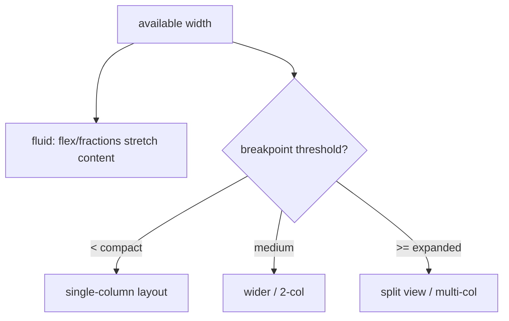
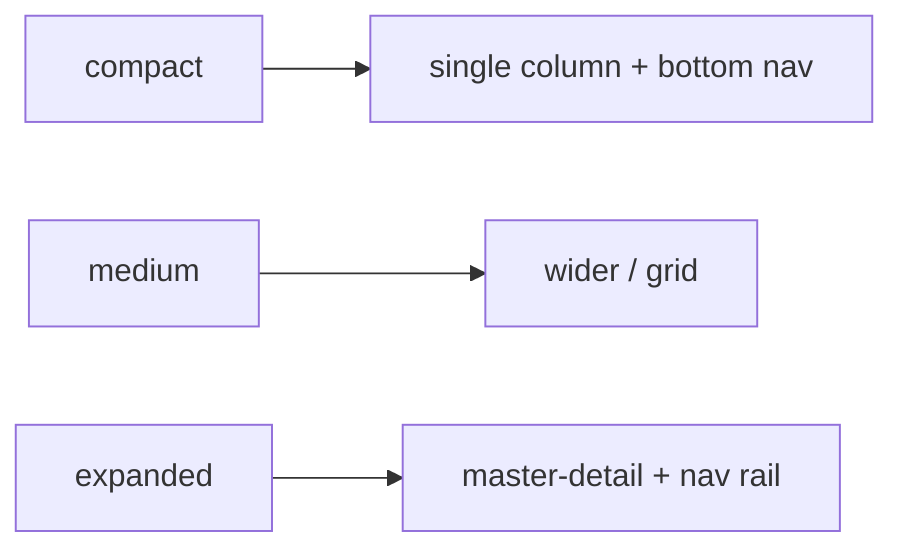

# Responsive Fundamentals (Breakpoints & Principles)

> Responsive UI = a single layout that flows and reconfigures across sizes: use **fluid sizing** (flex/fractions/constraints) for continuous adaptation and **breakpoints** (width thresholds) to switch layout structure (e.g., list → split view) between phone, tablet, and desktop.

## Introduction

Before tools, the principles: think in **constraints and available space**, not fixed pixels; combine **fluid** layout (stretches with size) with **breakpoint** decisions (change structure at thresholds); and design mobile-first, enhancing for larger screens. This grounds the `MediaQuery`/`LayoutBuilder`/grid files.

## Why this concept exists

Fixed pixel layouts break outside the device they were designed for. Flutter targets phones→desktop→web with wildly different sizes; responsive principles produce one codebase that looks right everywhere, improving reach and quality.

## Real-world analogy

Responsive design is **water taking the shape of its container**: it fills small and large glasses (fluid), but at a certain size you switch containers entirely — a cup vs a pitcher with a spout (breakpoint structural change). Same water, right form per size.

## Problem Statement

A product screen should be a single scrolling list on phones but a two-pane master-detail on tablets/desktop, with content that fluidly fills the width in between. You'll define breakpoints + fluid behavior and a mobile-first approach.

## Internal Working



- **Two mechanisms**:
  - **Fluid**: content stretches/shrinks continuously with available space (flex, fractions, constraints — [03_responsive_layout_widgets.md](03_responsive_layout_widgets.md)). No thresholds.
  - **Breakpoints**: at width thresholds, change **structure/layout** (columns, split views, navigation pattern). Common tiers: compact (< ~600), medium (~600–840/1024), expanded (≥ ~840/1024) — roughly Material's window size classes; pick sensible values for your app.
- **Mobile-first**: design the smallest layout first, then *add* structure/columns for larger screens (progressive enhancement).
- **Base on layout width, not device**: decide by the **space the layout has** (from `LayoutBuilder`/`MediaQuery`), not "is it a phone" — because of split-screen, foldables, web resizing, and embedded panes.
- **Navigation adapts too**: bottom nav (compact) → navigation rail/drawer (expanded).
- Distinct from **adaptive** (platform conventions/widgets per OS — [Module 25](../25%20Adaptive%20UI/README.md)): responsive is about *size*, adaptive about *platform*.

## Memory Representation

Not applicable; layout decisions are per-frame based on size ([07 · constraints_and_sizing](../07%20Widgets/03_constraints_and_sizing.md)).

## Compiler Behavior / Runtime Behavior

Layout re-evaluates on size/orientation changes (resize, rotate, split-screen); breakpoint branches pick a structure at build/layout time.

## Flutter Engine Behavior / Dart VM Behavior

Not applicable.

## Examples

```dart
import 'package:flutter/material.dart';

// Breakpoint tiers (choose values to fit your design)
enum WindowSize { compact, medium, expanded }
WindowSize windowSizeFor(double width) =>
    width < 600 ? WindowSize.compact
    : width < 1024 ? WindowSize.medium
    : WindowSize.expanded;

// Mobile-first: base layout, enhanced for larger widths
class ProductScreen extends StatelessWidget {
  const ProductScreen({super.key});
  @override
  Widget build(BuildContext context) {
    return LayoutBuilder(
      builder: (context, constraints) {
        final size = windowSizeFor(constraints.maxWidth); // decide by layout WIDTH
        return switch (size) {
          WindowSize.compact => const _ListOnly(),           // phone: single column
          WindowSize.medium => const _WiderList(),           // tablet: wider/2-col
          WindowSize.expanded => const _MasterDetail(),      // desktop: split view
        };
      },
    );
  }
}
class _ListOnly extends StatelessWidget { const _ListOnly(); @override Widget build(_) => const Placeholder(); }
class _WiderList extends StatelessWidget { const _WiderList(); @override Widget build(_) => const Placeholder(); }
class _MasterDetail extends StatelessWidget { const _MasterDetail(); @override Widget build(_) => const Placeholder(); }
```

## Diagrams



## Common Mistakes

| Mistake | Why | Fix |
|---------|-----|-----|
| Fixed pixel sizes | Breaks across sizes | Fluid (flex/fractions/constraints) + breakpoints |
| Deciding by "device type" | Ignores split-screen/foldables/web resize | Decide by available **width** |
| Only breakpoints (no fluid) | Rigid between thresholds | Combine fluid + breakpoints |
| Desktop-first design | Hard to shrink to mobile | Mobile-first + enhance |
| Not adapting navigation | Bottom nav on wide screens feels wrong | Rail/drawer on expanded |
| Hardcoding many device sizes | Fragile | A few semantic tiers |

## Best Practices

- Combine **fluid sizing** (continuous) with **breakpoints** (structural switches at width tiers).
- Design **mobile-first**; progressively enhance for medium/expanded.
- Decide by **available layout width** (`LayoutBuilder`/`MediaQuery`), not device type.
- Use a small set of **semantic breakpoints** (compact/medium/expanded) app-wide.
- Adapt **navigation** (bottom nav → rail/drawer) and structure (list → split view) per tier.
- Keep responsive logic centralized (helpers/extensions) for consistency.

## Performance

Layout re-evaluation on resize/rotate is cheap; branching by tier is negligible. Avoid heavy work in size-dependent builders ([21 · rebuild_optimization](../21%20Performance/02_rebuild_optimization.md)).

## Advantages / Disadvantages

- **+** One codebase across sizes, better UX/reach, future-proof (foldables/web/desktop), quality on all form factors.
- **−** Design/testing effort across sizes; branching complexity; must handle continuous *and* threshold behavior.

## Interview Questions

1. **🟢 What is responsive UI?** — A single layout that adapts to size/orientation via fluid sizing and breakpoint-based structural changes.
2. **🟢 Fluid vs breakpoint responsiveness?** — Fluid stretches continuously with space (flex/fractions); breakpoints switch layout structure at width thresholds.
3. **🟡 Why decide by layout width, not device type?** — Split-screen, foldables, embedded panes, and web resizing mean "phone/tablet" is unreliable; the available width is what matters.
4. **🟡 What is mobile-first design?** — Start with the smallest layout and progressively add structure/columns for larger screens.
5. **🟡 Responsive vs adaptive?** — Responsive adapts to *size*; adaptive conforms to *platform conventions/widgets* (Material/Cupertino — [Module 25](../25%20Adaptive%20UI/README.md)).
6. **🔴 How should navigation change across tiers?** — Bottom navigation on compact → navigation rail/drawer on expanded; list → master-detail split on large widths.
7. **🔴 Why use semantic breakpoints (compact/medium/expanded)?** — Fewer, meaningful tiers are maintainable and align with window size classes vs hardcoding many device dimensions.

## Senior Engineer Tips

- Define breakpoints and a `windowSizeFor(width)` helper (or extension) once; use it everywhere for consistent, testable responsiveness.
- Combine both mechanisms: fluid within a tier, structural switch between tiers.
- Test at continuous sizes (resize a desktop/web window) and split-screen — not just a few device presets.

## Architect Perspective

Responsive strategy is a UI-architecture decision spanning navigation, layout structure, and content flow across all form factors. Centralizing breakpoints + a mobile-first, width-driven approach yields a maintainable single codebase for phone→desktop→web, and pairs with adaptive platform conventions ([Module 25](../25%20Adaptive%20UI/README.md)) for polished cross-platform apps.

## Summary

- Responsive = one layout adapting to size via fluid sizing + breakpoints (compact/medium/expanded).
- Mobile-first, decide by available width (not device), adapt navigation and structure per tier.
- Distinct from adaptive (platform); centralize breakpoints for consistency.

## Revision Notes

- Fluid (flex/fractions/constraints, continuous) + breakpoints (structure switch at width tiers).
- Tiers: compact/medium/expanded (semantic, not device-hardcoded); decide by layout width.
- Mobile-first + progressive enhancement; adapt navigation (bottom→rail) + structure (list→split).
- Responsive (size) ≠ adaptive (platform, Module 25); centralize breakpoints.

## Practice Questions

1. Why combine fluid and breakpoint responsiveness?
2. Why decide by width instead of device type?
3. How does navigation adapt from compact to expanded?

## Coding Questions

1. Write a `windowSizeFor(width)` helper with compact/medium/expanded tiers.
2. Build a screen that switches list→split view at a breakpoint via `LayoutBuilder`.
3. Adapt navigation (bottom nav → nav rail) by tier.

## Mini Project

**Breakpoint scaffold (Flutter):** Build a screen using a `windowSizeFor(width)` helper that renders a single column (compact), a wider/2-col layout (medium), and a master-detail split (expanded), plus adaptive navigation (bottom nav ↔ nav rail). Test by resizing. Acceptance: width-driven tiers; mobile-first; fluid within tiers; navigation adapts; runs across sizes.
