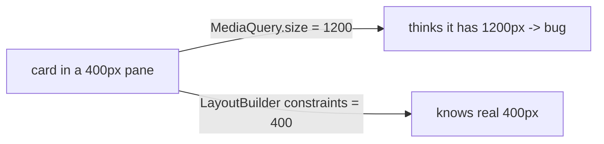

# `MediaQuery` vs `LayoutBuilder`

> `MediaQuery` gives **global** screen/window metrics (size, orientation, text scale, insets); `LayoutBuilder` gives the **local** constraints a specific widget was handed — use `LayoutBuilder` to respond to the space a widget actually has, and `MediaQuery` for device-wide info.

## Introduction

Both inform responsive decisions, but at different scopes. `MediaQuery.of(context)` = the whole screen/window; `LayoutBuilder(builder: (context, constraints))` = *this* widget's available box. This file clarifies when to use which — a frequent source of responsive bugs.

## Why this concept exists

A widget inside a sidebar/split-pane/card has far less width than the screen. Deciding its layout from `MediaQuery` (screen size) would be wrong; it should decide from its **local constraints** (`LayoutBuilder`). Conversely, device orientation/insets/text-scale are screen-wide — `MediaQuery`.

## Real-world analogy

`MediaQuery` is knowing the **whole building's dimensions**; `LayoutBuilder` is knowing **the size of the room you're standing in**. To arrange furniture, you use the room's size (local), not the building's — but for building-wide facts (which floor, is it daytime) you ask the building.

## Problem Statement

A card must show 1 or 2 columns based on **its own** width (it lives in a variable-width pane), while the app switches navigation based on **screen** width and respects the device's text scale. You'll use `LayoutBuilder` for the card and `MediaQuery` for screen-level decisions.

## Internal Working

```mermaid
flowchart TD
    MQ[MediaQuery.of(context)] --> Global[screen/window: size, orientation, textScaler, padding/viewInsets, platformBrightness]
    LB[LayoutBuilder] --> Local[this widget's BoxConstraints (maxWidth/maxHeight)]
    Decide{decide by...}
    Decide -->|space a widget has| LB
    Decide -->|device-wide info| MQ
```

- **`MediaQuery.of(context)`**: `size` (screen/window logical px), `orientation`, `textScaler`/`textScaleFactor` (user font scaling), `padding`/`viewInsets`/`viewPadding` (safe areas, keyboard), `platformBrightness`, `devicePixelRatio`. **Global** to the window; subscribes the widget to changes ([06 · build_context](../06%20Flutter%20Fundamentals/build_context.md)).
- **`LayoutBuilder`**: builds with the **`BoxConstraints`** this widget received from its parent — the *actual* available space (respects sidebars, split panes, cards). **Local**.
- **Rule of thumb**: layout a widget by **local constraints** (`LayoutBuilder`) so it's correct wherever it's placed; use **`MediaQuery`** for screen-wide facts (orientation, insets, text scale, brightness) and top-level structure.
- `MediaQuery.sizeOf(context)`/`orientationOf` etc. (newer, granular) subscribe only to that aspect — fewer rebuilds than whole-`MediaQuery.of`.
- **Don't** decide inner-widget layout from `MediaQuery.size` — it's the screen, not the widget's box (a classic bug).

## Memory Representation

`MediaQuery` data is provided via an `InheritedWidget` ([11 · inherited_widget](../11%20State%20Management/inherited_widget.md)); `LayoutBuilder` reads incoming constraints during layout. Both cheap.

## Compiler Behavior

Not applicable.

## Runtime Behavior

`MediaQuery.of` rebuilds the widget when *any* media data changes (use `sizeOf`/`orientationOf` to scope); `LayoutBuilder` rebuilds when its incoming constraints change (parent resizes it).

## Flutter Engine Behavior / Dart VM Behavior

Not applicable.

## Examples

```dart
import 'package:flutter/material.dart';

class ResponsiveDemo extends StatelessWidget {
  const ResponsiveDemo({super.key});
  @override
  Widget build(BuildContext context) {
    // Screen-level: orientation + text scale (global) via MediaQuery
    final orientation = MediaQuery.orientationOf(context);   // scoped subscription
    final screenWidth = MediaQuery.sizeOf(context).width;

    return Scaffold(
      // Top-level navigation decided by SCREEN width:
      body: Row(children: [
        if (screenWidth >= 1024) const NavigationRail(destinations: [
          NavigationRailDestination(icon: Icon(Icons.home), label: Text('Home')),
          NavigationRailDestination(icon: Icon(Icons.person), label: Text('Me')),
        ], selectedIndex: 0),
        Expanded(
          child: Padding(
            padding: const EdgeInsets.all(16),
            child: Column(children: [
              Text('Orientation: ${orientation.name}'),
              // A card that decides ITS OWN columns by LOCAL width (not screen):
              Expanded(child: _AdaptiveCard()),
            ]),
          ),
        ),
      ]),
    );
  }
}

class _AdaptiveCard extends StatelessWidget {
  @override
  Widget build(BuildContext context) {
    return LayoutBuilder(
      builder: (context, constraints) {
        // Decide by the WIDTH THIS WIDGET has (correct inside panes/sidebars):
        final twoColumns = constraints.maxWidth >= 500;
        return twoColumns
            ? const Row(children: [Expanded(child: _Pane('A')), Expanded(child: _Pane('B'))])
            : const Column(children: [_Pane('A'), _Pane('B')]);
      },
    );
  }
}
class _Pane extends StatelessWidget {
  final String label; const _Pane(this.label);
  @override Widget build(_) => Card(child: Center(child: Text(label)));
}
```

## Diagrams



## Common Mistakes

| Mistake | Why | Fix |
|---------|-----|-----|
| Using `MediaQuery.size` for inner-widget layout | It's the screen, not the widget's box | Use `LayoutBuilder` constraints |
| Whole `MediaQuery.of` for one metric | Rebuilds on any media change | Use `sizeOf`/`orientationOf`/etc. |
| `LayoutBuilder` for device-wide facts | It doesn't know orientation/insets | Use `MediaQuery` for those |
| Reading `MediaQuery` above `MaterialApp` | Not provided yet | Read below `MaterialApp` |
| Ignoring insets/text scale | Overlap/clipping | Use padding/`textScaler` (see typography file) |

## Best Practices

- **Layout widgets by local constraints** (`LayoutBuilder`) so they're correct in any container (pane/card/sidebar).
- Use **`MediaQuery`** for **screen-wide** info: orientation, insets/safe areas, text scale, brightness, and top-level structure/navigation.
- Prefer **scoped accessors** (`MediaQuery.sizeOf`/`orientationOf`) to reduce rebuilds.
- Don't decide inner layout from `MediaQuery.size`; combine both (screen-level structure + widget-level fluidity).

## Performance

`MediaQuery.of` subscribes to all media changes → broader rebuilds; scoped `*Of` accessors are cheaper. `LayoutBuilder` rebuilds only when its constraints change — efficient and correct for local decisions ([21 · rebuild_optimization](../21%20Performance/rebuild_optimization.md)).

## Advantages / Disadvantages

- **+ MediaQuery:** device-wide metrics for global decisions. **+ LayoutBuilder:** correct local sizing anywhere.
- **− MediaQuery:** wrong for inner-widget sizing; whole-`of` over-rebuilds. **− LayoutBuilder:** doesn't know screen-wide facts; extra nesting.

## Interview Questions

1. **🟢 `MediaQuery` vs `LayoutBuilder`?** — `MediaQuery` = global screen/window metrics; `LayoutBuilder` = the local constraints (available box) this widget received.
2. **🟢 Which do you use to size a widget inside a sidebar?** — `LayoutBuilder` — it knows the widget's actual width, not the screen's.
3. **🟡 What does `MediaQuery` provide?** — Size, orientation, text scale, padding/view insets (safe areas/keyboard), platform brightness, device pixel ratio.
4. **🟡 Why prefer `MediaQuery.sizeOf` over `MediaQuery.of`?** — It subscribes only to size changes, avoiding rebuilds when unrelated media data changes.
5. **🟡 Why is `MediaQuery.size` wrong for inner-widget layout?** — It reports the whole screen, not the constrained box the widget occupies (split panes/cards make them differ).
6. **🔴 When would `LayoutBuilder` and `MediaQuery` give different widths?** — Whenever the widget isn't full-screen — inside padding/split views/sidebars/cards, its local width < screen width.
7. **🔴 How do you combine them for a responsive screen?** — `MediaQuery` for top-level structure/navigation (screen size/orientation) + `LayoutBuilder` for each component's fluid layout by its own space.

## Senior Engineer Tips

- Default to `LayoutBuilder` for component layout — it's correct regardless of where the widget is placed; reserve `MediaQuery` for genuinely screen-wide concerns.
- Use scoped `MediaQuery.*Of` accessors to keep rebuilds tight.
- When a responsive bug appears in a pane/card, suspect `MediaQuery.size` misuse first.

## Architect Perspective

Choosing the right scope (local constraints vs global metrics) is foundational to a correct, composable responsive system: components decide their own layout (portable), while the shell decides structure/navigation from screen metrics. This separation makes components reusable across split views, sidebars, and form factors ([responsive_fundamentals.md](responsive_fundamentals.md), [adaptive_grids_and_split_views.md](adaptive_grids_and_split_views.md)).

## Summary

- `MediaQuery` = global (screen size/orientation/insets/text scale/brightness); `LayoutBuilder` = local (widget's constraints).
- Layout components by local constraints (portable/correct); use `MediaQuery` for screen-wide structure/info.
- Prefer scoped `MediaQuery.*Of`; don't size inner widgets from `MediaQuery.size`.

## Revision Notes

- `MediaQuery.of/sizeOf/orientationOf` = screen/window (size/orientation/textScaler/padding/viewInsets/brightness).
- `LayoutBuilder` = this widget's `BoxConstraints` (real available space).
- Component layout → `LayoutBuilder`; screen-wide facts/structure → `MediaQuery`; scoped accessors to limit rebuilds.
- Don't use `MediaQuery.size` for inner-widget sizing (panes/cards differ).

## Practice Questions

1. Why size a card by `LayoutBuilder`, not `MediaQuery.size`?
2. What screen-wide facts require `MediaQuery`?
3. Why prefer `MediaQuery.sizeOf` over `.of`?

## Coding Questions

1. Build a widget that switches 1↔2 columns by its own width (`LayoutBuilder`).
2. Add a nav rail on wide screens using `MediaQuery.sizeOf`.
3. Show a bug: card using `MediaQuery.size` inside a narrow pane, then fix it with `LayoutBuilder`.

## Mini Project

**Scope-correct responsive screen (Flutter):** Build a screen where top-level structure/navigation is decided by `MediaQuery` (screen width/orientation) and each component decides its own layout via `LayoutBuilder`; place a card inside a narrow pane to prove it uses local width. Acceptance: components layout by local constraints; screen structure by `MediaQuery`; scoped accessors used; correct in panes; runs.
