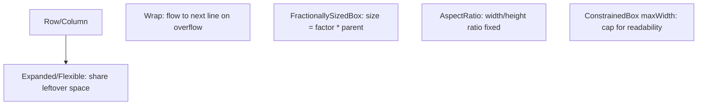
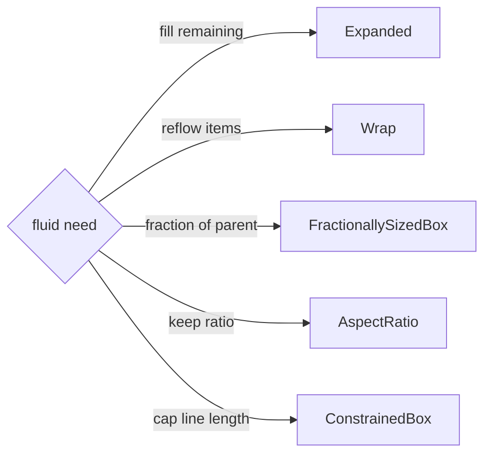

# Responsive Layout Widgets (`Flexible`, `Wrap`, `AspectRatio`, `FractionallySizedBox`)

> A toolkit of widgets makes layouts fluid without manual math: `Expanded`/`Flexible` share space, `Wrap` flows to new lines, `FractionallySizedBox` sizes by a fraction of the parent, `AspectRatio` keeps proportions, and `ConstrainedBox` caps max width for readability.

## Introduction

Responsive layout is mostly composing the right fluid widgets. This file covers the everyday responsive toolkit — flex distribution, wrapping, fractional/aspect sizing, and max-width constraints — so content adapts to space without breakpoints for the continuous cases.

## Why this concept exists

Fluid adaptation (fill remaining space, reflow chips, keep a 16:9 ratio, cap line length) shouldn't require measuring pixels or breakpoints. These widgets express intent ("take the rest," "wrap," "half the width," "keep ratio") and the layout engine computes sizes ([07 · constraints_and_sizing](../07%20Widgets/constraints_and_sizing.md)).

## Real-world analogy

These are **adjustable furniture**: `Expanded` is a couch that stretches to fill the room; `Wrap` is shelving that adds rows when full; `FractionallySizedBox` is "make it half the wall"; `AspectRatio` is a framed picture that keeps its shape; `ConstrainedBox(maxWidth)` is a reading lamp positioned so text lines aren't too long.

## Problem Statement

Build a toolbar (icon + expanding title + action), a chip cloud that wraps, a 16:9 media box, a half-width panel, and body text capped to a readable max width. You'll use the fluid widgets — mostly without breakpoints.

## Internal Working



- **`Expanded`/`Flexible`/`Spacer`**: distribute leftover main-axis space in a `Row`/`Column` by `flex` — the core of fluid horizontal/vertical layout ([07 · layout_flex](../07%20Widgets/layout_flex.md)).
- **`Wrap`**: lays children in a run, moving to the next line when out of space (chips, tags, responsive button rows) — reflows automatically by width.
- **`FractionallySizedBox(widthFactor/heightFactor)`**: sizes a child to a fraction of the parent (e.g., 0.5 = half width) — fluid proportional sizing.
- **`AspectRatio(aspectRatio)`**: constrains the child to a width:height ratio (16/9 media, square tiles) — proportion-preserving across sizes.
- **`ConstrainedBox(BoxConstraints(maxWidth: ...))`** (often centered): caps content width for **readability** on wide screens (line length) — a key responsive move for text/forms.
- **`LayoutBuilder`/`MediaQuery`**: for the discrete structural switches ([mediaquery_vs_layoutbuilder.md](mediaquery_vs_layoutbuilder.md)); these fluid widgets handle continuous adaptation.
- Also useful: `Flexible(fit: loose/tight)`, `IntrinsicWidth/Height` (sparingly — cost), `Table`, `Wrap.spacing/runSpacing`.

## Memory Representation

Not applicable; standard layout render objects ([07 · constraints_and_sizing](../07%20Widgets/constraints_and_sizing.md)).

## Compiler Behavior

Not applicable. Use `const` where possible.

## Runtime Behavior

`Wrap` reflows on width change; `Expanded`/`Flexible` recompute shares; `FractionallySizedBox`/`AspectRatio` recompute from the parent each layout. All respond to resize/rotate automatically.

## Flutter Engine Behavior / Dart VM Behavior

Not applicable.

## Examples

```dart
import 'package:flutter/material.dart';

class FluidDemo extends StatelessWidget {
  const FluidDemo({super.key});
  @override
  Widget build(BuildContext context) {
    return Center(
      child: ConstrainedBox(
        constraints: const BoxConstraints(maxWidth: 720), // cap width for readability
        child: Column(children: [
          // Toolbar: icon | expanding title | action (fluid)
          Row(children: [
            const Icon(Icons.menu),
            const SizedBox(width: 8),
            const Expanded(child: Text('Title', overflow: TextOverflow.ellipsis)),
            IconButton(icon: const Icon(Icons.search), onPressed: () {}),
          ]),
          const SizedBox(height: 12),

          // Chip cloud that wraps to new lines by available width
          Wrap(
            spacing: 8, runSpacing: 8,
            children: List.generate(12, (i) => Chip(label: Text('Tag $i'))),
          ),
          const SizedBox(height: 12),

          // 16:9 media box (proportion preserved at any width)
          AspectRatio(aspectRatio: 16 / 9, child: Container(color: Colors.teal)),
          const SizedBox(height: 12),

          // Half-width panel (fluid fraction of parent)
          FractionallySizedBox(
            widthFactor: 0.5, alignment: Alignment.centerLeft,
            child: Container(height: 40, color: Colors.orange),
          ),
        ]),
      ),
    );
  }
}
```

## Diagrams



## Common Mistakes

| Mistake | Why | Fix |
|---------|-----|-----|
| Fixed widths instead of flex/fractions | Breaks across sizes | `Expanded`/`FractionallySizedBox` |
| Full-width text on wide screens | Unreadable long lines | `ConstrainedBox(maxWidth)` + center |
| `Row` overflow with long content | Yellow/black stripes | `Expanded`/`Flexible` + ellipsis |
| Using breakpoints for continuous sizing | Rigid | Fluid widgets adapt continuously |
| `Wrap` vs `Row` confusion | Overflow vs reflow | `Wrap` when items should flow to new lines |
| Overusing `IntrinsicWidth/Height` | Extra layout passes (cost) | Avoid in big/scrolling trees ([07](../07%20Widgets/constraints_and_sizing.md)) |

## Best Practices

- Use **`Expanded`/`Flexible`/`Spacer`** for fluid space distribution; **`Wrap`** for reflowing item groups.
- Size proportionally with **`FractionallySizedBox`** and keep media/tiles with **`AspectRatio`**.
- **Cap content width** (`ConstrainedBox(maxWidth)` + `Center`) for readability on large screens (text/forms/reading views).
- Prefer these **fluid** widgets for continuous adaptation; add **breakpoints** only for structural switches.
- Guard long text with `overflow: ellipsis`; avoid fixed pixel widths and excessive intrinsics.

## Performance

Cheap standard layout; `Wrap`/flex recompute on resize. Avoid `IntrinsicWidth/Height` in large/scrolling trees (extra passes) ([07 · constraints_and_sizing](../07%20Widgets/constraints_and_sizing.md), [21](../21%20Performance/README.md)).

## Advantages / Disadvantages

- **+** Fluid adaptation without math/breakpoints; intent-revealing; composable; resize/rotate-safe.
- **−** Requires understanding constraints; misuse causes overflow/unbounded errors; not a substitute for structural breakpoints.

## Interview Questions

1. **🟢 How do you make a row's item fill remaining space?** — Wrap it in `Expanded` (or `Flexible`) inside the `Row`.
2. **🟢 What does `Wrap` do?** — Lays children in runs and flows to the next line when out of horizontal space — reflows by width.
3. **🟡 How do you keep media at 16:9 across sizes?** — `AspectRatio(aspectRatio: 16/9)`.
4. **🟡 How do you cap text width for readability on wide screens?** — `ConstrainedBox(constraints: BoxConstraints(maxWidth: N))`, usually centered.
5. **🟡 `FractionallySizedBox` — what does it do?** — Sizes a child to a fraction of its parent (e.g., 0.5 width) — fluid proportional sizing.
6. **🔴 When use these fluid widgets vs breakpoints?** — Fluid widgets for continuous adaptation within a layout; breakpoints for discrete structural changes between size tiers.
7. **🔴 Why avoid `IntrinsicWidth/Height` in responsive lists?** — They add extra layout passes (cost); prefer flex/fractions/fixed sizing.

## Senior Engineer Tips

- Reach for `Expanded`/`Wrap`/`FractionallySizedBox`/`AspectRatio`/`ConstrainedBox` before writing any width math — they express intent and adapt automatically.
- Always cap reading content width on wide screens; full-bleed text is a common desktop/web readability failure.
- Handle overflow (ellipsis/`Flexible`) proactively; test at narrow and very wide widths.

## Architect Perspective

These fluid widgets are the continuous-adaptation layer of responsive design; combined with breakpoint-driven structure ([responsive_fundamentals.md](responsive_fundamentals.md)) and correct scope ([mediaquery_vs_layoutbuilder.md](mediaquery_vs_layoutbuilder.md)), they produce components that look right at any width — reusable across split views, grids, and platforms.

## Summary

- Fluid toolkit: `Expanded`/`Flexible`/`Spacer` (share space), `Wrap` (reflow), `FractionallySizedBox` (fraction), `AspectRatio` (ratio), `ConstrainedBox(maxWidth)` (readability).
- Handles continuous adaptation without math/breakpoints; cap content width on wide screens; guard overflow.
- Combine with breakpoints for structural switches.

## Revision Notes

- `Expanded`/`Flexible`/`Spacer` (fill/share), `Wrap` (reflow), `FractionallySizedBox` (fraction of parent), `AspectRatio` (ratio), `ConstrainedBox(maxWidth)` (line-length).
- Fluid = continuous; breakpoints = structural. Guard overflow (ellipsis/`Flexible`).
- Avoid fixed widths + excessive intrinsics; `const` where possible.

## Practice Questions

1. Which widget reflows chips onto new lines?
2. How do you cap text width on wide screens, and why?
3. Fluid widgets vs breakpoints — when each?

## Coding Questions

1. Build a toolbar (icon | expanding ellipsized title | action).
2. Make a wrapping chip cloud + a 16:9 media box.
3. Center body text capped at `maxWidth: 700`.

## Mini Project

**Fluid article layout (Flutter):** Build an article screen using `ConstrainedBox(maxWidth)` for readable body text, a `Wrap` tag cloud, an `AspectRatio` hero image, a `FractionallySizedBox` callout, and an `Expanded`-based toolbar — all fluid (no breakpoints). Test narrow→very-wide. Acceptance: readable capped width; reflowing tags; preserved image ratio; no overflow; fluid across widths; runs.
