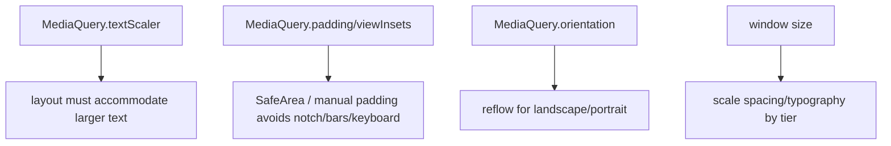
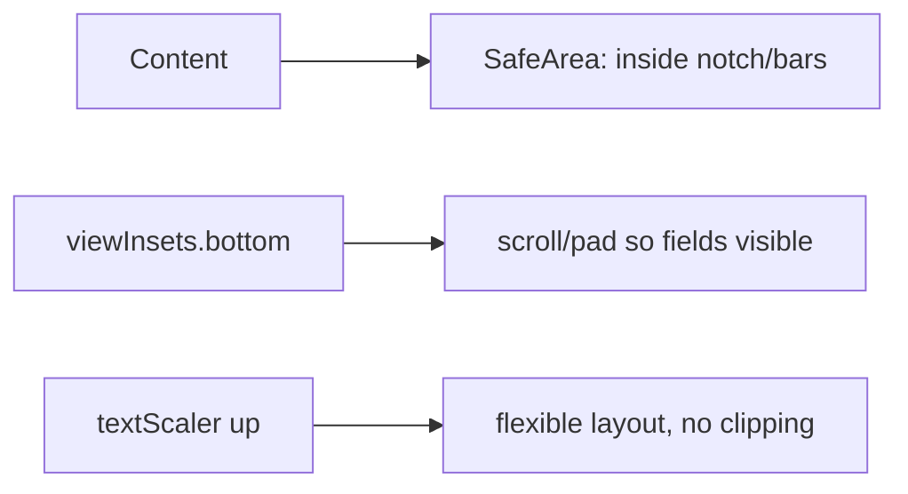

# Responsive Typography, Spacing, Orientation & Safe Areas

> Responsiveness isn't just layout: respect the user's **text scale** (accessibility), scale **spacing** by size, handle **orientation** changes, and lay out within **safe areas** (`SafeArea`, insets) so content isn't clipped by notches, system bars, or the keyboard.

## Introduction

The finishing details of responsive UI: honoring `textScaler` (never hardcode font sizes rigidly), scaling spacing/typography across tiers, reacting to orientation, and using `SafeArea`/`MediaQuery` insets so content avoids notches/bars/keyboard. This file rounds out the module.

## Why this concept exists

Users set larger fonts (accessibility); devices have notches, rounded corners, gesture bars, and keyboards; screens rotate. Ignoring these clips text, overlaps system UI, or breaks on rotation — failing accessibility and quality bars. Handling them is essential responsiveness.

## Real-world analogy

Safe areas are like **keeping important content inside the "title-safe" zone** of a TV broadcast (not behind the bezel/overscan). Text scaling is **honoring a reader's chosen font size** rather than forcing your own — the room must accommodate the reader, not the other way around.

## Problem Statement

A form must remain readable when the user enables large text, not be clipped by a notch or the keyboard, scale its spacing up on tablets, and reflow sensibly in landscape. You'll use `textScaler`, `SafeArea`, insets, and orientation.

## Internal Working



- **Text scaling / accessibility**: the OS/user font scale is in `MediaQuery.textScaler` (newer) / `textScaleFactor` (older). `Text` scales automatically; your **layout** must not assume fixed text heights — use flexible/wrapping layouts and avoid clipping. Don't disable scaling; **test at large scales**. Use theme text styles ([07 · text_and_theming](../07%20Widgets/text_and_theming.md)) and let them scale.
- **Responsive typography/spacing**: pick base sizes/spacing per size tier (larger on expanded), ideally from theme/tokens; scale gaps/paddings with a spacing helper. Cap line length for readability ([responsive_layout_widgets.md](responsive_layout_widgets.md)).
- **Safe areas & insets**: wrap content in **`SafeArea`** to avoid notches/status/gesture bars; `MediaQuery.viewInsets.bottom` gives keyboard height (pad/scroll so fields aren't hidden); `viewPadding`/`padding` distinguish system insets. Use `resizeToAvoidBottomInset` and scrollable forms.
- **Orientation**: `MediaQuery.orientation`/`OrientationBuilder` to reflow (e.g., stack in portrait, row in landscape); preserve state across rotation (state lives above the widget).
- Combine with breakpoints (structure) and fluid widgets (continuous) from earlier files.

## Memory Representation

Not applicable; these are layout/metric-driven decisions per frame ([mediaquery_vs_layoutbuilder.md](mediaquery_vs_layoutbuilder.md)).

## Compiler Behavior / Runtime Behavior

Text-scale/orientation/inset changes trigger rebuilds; layouts must adapt. Keyboard appearance changes `viewInsets.bottom` at runtime.

## Flutter Engine Behavior

Insets/notches/keyboard come from the platform via the embedder into `MediaQuery` ([10 · embedder_and_startup](../10%20Flutter%20Architecture/embedder_and_startup.md)).

## Dart VM Behavior

Not applicable.

## Examples

```dart
import 'package:flutter/material.dart';

class ResponsiveForm extends StatelessWidget {
  const ResponsiveForm({super.key});
  @override
  Widget build(BuildContext context) {
    final tier = MediaQuery.sizeOf(context).width >= 900 ? 24.0 : 16.0; // spacing by tier
    return Scaffold(
      resizeToAvoidBottomInset: true, // resize/scroll when keyboard shows
      body: SafeArea(                  // avoid notch/status/gesture bars
        child: Center(
          child: ConstrainedBox(
            constraints: const BoxConstraints(maxWidth: 520), // readable width
            child: SingleChildScrollView( // scroll so fields aren't hidden by keyboard
              padding: EdgeInsets.all(tier),
              child: Column(children: [
                // Uses theme text styles -> honors user text scale automatically
                Text('Sign up', style: Theme.of(context).textTheme.headlineMedium),
                SizedBox(height: tier),
                const TextField(decoration: InputDecoration(labelText: 'Email')),
                SizedBox(height: tier),
                const TextField(decoration: InputDecoration(labelText: 'Password')),
                SizedBox(height: tier),
                FilledButton(onPressed: () {}, child: const Text('Create account')),
              ]),
            ),
          ),
        ),
      ),
    );
  }
}

// Orientation-aware reflow
Widget orientationDemo() => OrientationBuilder(
      builder: (context, orientation) => orientation == Orientation.portrait
          ? const Column(children: [Placeholder(), Placeholder()])
          : const Row(children: [Expanded(child: Placeholder()), Expanded(child: Placeholder())]),
    );
```

## Diagrams



## Common Mistakes

| Mistake | Why | Fix |
|---------|-----|-----|
| Disabling/ignoring text scale | Breaks accessibility | Honor `textScaler`; test at large scales |
| Fixed text heights/tight rows | Clip at large text | Flexible/wrapping layouts; scrollable |
| No `SafeArea` | Content under notch/bars | Wrap in `SafeArea` |
| Keyboard hides fields | Poor form UX | Scrollable + `resizeToAvoidBottomInset`/`viewInsets` |
| Same spacing on all sizes | Cramped/wasteful | Scale spacing by tier |
| State lost on rotation | Re-entry annoyance | Keep state above the widget |

## Best Practices

- **Honor the user's text scale**: use theme text styles, flexible layouts, and scrollable content; **test at large `textScaler`** — never hardcode-lock font sizes.
- Wrap screens in **`SafeArea`**; handle the **keyboard** (scrollable forms + `resizeToAvoidBottomInset`/`viewInsets.bottom`).
- **Scale spacing/typography by tier** (bigger on expanded) via tokens/helpers; **cap reading width**.
- Use **`OrientationBuilder`**/`MediaQuery.orientation` to reflow; keep state above the widget so rotation preserves it.
- Combine with breakpoints (structure) + fluid widgets (continuous).

## Performance

Negligible; these are layout choices. Rebuilds on text-scale/orientation/keyboard changes are expected — scope them ([21 · rebuild_optimization](../21%20Performance/rebuild_optimization.md)).

## Advantages / Disadvantages

- **+** Accessible (text scale), device-safe (notch/keyboard), rotation-robust, size-appropriate spacing — full-quality responsiveness.
- **−** More cases to test (scales/orientations/devices); insets/keyboard handling nuances.

## Interview Questions

1. **🟢 How do you support user font scaling?** — Rely on `MediaQuery.textScaler` (text scales automatically); build flexible/scrollable layouts that don't clip at large scales — never lock font sizes.
2. **🟢 What is `SafeArea` for?** — Insetting content to avoid notches, status/navigation bars, and gesture areas.
3. **🟡 How do you keep fields visible when the keyboard appears?** — Use a scrollable form + `resizeToAvoidBottomInset` and/or account for `MediaQuery.viewInsets.bottom`.
4. **🟡 How do you handle orientation changes?** — `OrientationBuilder`/`MediaQuery.orientation` to reflow; keep state above the widget so it survives rotation.
5. **🟡 Why scale spacing/typography by size tier?** — Fixed spacing looks cramped on large screens and oversized on small; scale by tier (tokens/helpers) for balance.
6. **🔴 Why is disabling text scaling an accessibility problem?** — It ignores the user's chosen font size (a11y setting); layouts must accommodate larger text instead of preventing it.
7. **🔴 `padding` vs `viewInsets` vs `viewPadding` in `MediaQuery`?** — `padding` = system intrusions (notch/bars) currently affecting layout; `viewInsets` = obscured regions like the keyboard; `viewPadding` = intrusions ignoring current insets.

## Senior Engineer Tips

- Test every screen at the **largest text scale** and with the **keyboard open** — these catch the most real-world responsive bugs.
- Centralize spacing as tokens scaled by tier; wrap screens in `SafeArea` by default in your scaffold.
- Keep form state (and scroll position) above the widget so rotation/keyboard don't reset it.

## Architect Perspective

Typography scaling, spacing tokens, orientation, and safe-area handling are the accessibility-and-polish layer of responsiveness. Baking `SafeArea`, tier-scaled spacing, and text-scale-safe layouts into your base scaffold/design system ensures every screen is accessible and device-safe across form factors ([07 · text_and_theming](../07%20Widgets/text_and_theming.md), [Module 25](../25%20Adaptive%20UI/README.md)).

## Summary

- Honor user text scale (flexible/scrollable, test large), wrap in `SafeArea`, handle keyboard insets, scale spacing/typography by tier, and reflow on orientation.
- Keep state above widgets for rotation; cap reading width.
- The accessibility/polish layer completing responsive design.

## Revision Notes

- Text scale: `MediaQuery.textScaler`; flexible/scrollable layouts; test large scales (don't lock sizes).
- `SafeArea` (notch/bars); keyboard via `resizeToAvoidBottomInset`/`viewInsets.bottom` + scroll.
- Spacing/typography scale by tier (tokens); cap reading width.
- Orientation via `OrientationBuilder`/`orientation`; keep state above widget. `padding`/`viewInsets`/`viewPadding` differ.

## Practice Questions

1. Why must layouts accommodate large text scale?
2. How do you prevent the keyboard from hiding a field?
3. `padding` vs `viewInsets` in `MediaQuery`?

## Coding Questions

1. Build a form that's safe-area-wrapped, keyboard-aware (scroll), and text-scale-safe.
2. Reflow a layout portrait↔landscape with `OrientationBuilder`.
3. Scale spacing by size tier via a helper/token.

## Mini Project — Module capstone

**Fully responsive screen (Flutter):** Combine the module: breakpoint structure (list↔split), fluid widgets + adaptive grid, capped reading width, tier-scaled spacing/typography, `SafeArea` + keyboard-aware scrollable form, and orientation reflow — tested at large text scale, with keyboard open, and across sizes/orientations. Acceptance: adaptive structure + fluid content; accessible at large text; keyboard/notch-safe; orientation-robust; runs everywhere. (Builds on the adaptive product screen in [README](README.md).)
