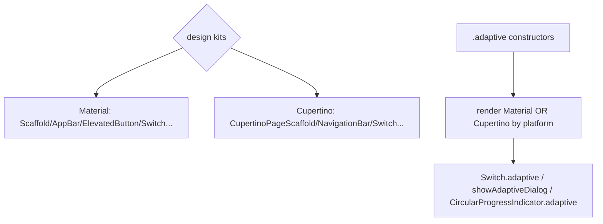
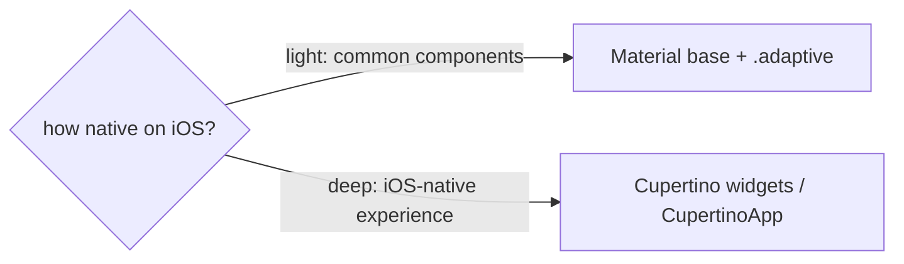

# Material vs Cupertino (and `.adaptive` Constructors)

> Flutter ships two design languages — **Material** (`package:flutter/material.dart`, Android/web default) and **Cupertino** (`package:flutter/cupertino.dart`, iOS-style) — plus **`.adaptive` constructors** (`Switch.adaptive`, `Slider.adaptive`, `showAdaptiveDialog`, etc.) that render the right style per platform automatically.

## Introduction

This file covers the two widget kits, their theming, when to use each, and the built-in **`.adaptive`** helpers that pick Material/Cupertino for you — the lowest-effort way to adapt common components without hand-branching.

## Why this concept exists

iOS users expect Cupertino visuals/behaviors (switches, dialogs, nav bars, pickers); Android/web expect Material. Rather than manually branch every component, `.adaptive` constructors and `MaterialApp`'s built-in adaptations give platform-correct rendering with minimal code, while full Cupertino widgets exist when you want a deeply iOS-native experience.

## Real-world analogy

Material and Cupertino are **two style guides** (British vs American English). `.adaptive` constructors are a **smart editor** that auto-applies the right dialect based on your audience — you write once, it localizes the style.

## Problem Statement

Show a platform-correct switch, dialog, and loading indicator without hand-branching, and know when to reach for full Cupertino widgets/theming for an iOS-native screen. You'll use `.adaptive` constructors and Cupertino equivalents.

## Internal Working



- **Material** (`material.dart`): `MaterialApp`, `Scaffold`, `AppBar`, `ElevatedButton`, `Switch`, `TextField`, Material 3 theming (`ThemeData`, `colorScheme` — [07 · text_and_theming](../07%20Widgets/06_text_and_theming.md)). Default for Android/web.
- **Cupertino** (`cupertino.dart`): `CupertinoApp`, `CupertinoPageScaffold`, `CupertinoNavigationBar`, `CupertinoButton`, `CupertinoSwitch`, `CupertinoTextField`, `CupertinoTheme` — iOS look/behavior.
- **`.adaptive` constructors** (in Material): render the platform-appropriate variant automatically:
  - `Switch.adaptive`, `Slider.adaptive`, `Checkbox.adaptive`, `Radio.adaptive`
  - `CircularProgressIndicator.adaptive` (spinner style per platform)
  - `showAdaptiveDialog` / `AlertDialog.adaptive` (Material vs Cupertino alert)
  - `Icon`/theme adaptations; `MaterialApp` also applies some platform adaptations (e.g., page transitions, scroll physics).
- **Choosing**: use **Material as the base** + **`.adaptive`** for common components (least effort, decent nativeness); use **full Cupertino** widgets/`CupertinoApp` when you want a deeply iOS-native app or specific iOS components (pickers, action sheets, segmented controls).
- **Theming both**: Material via `ThemeData`; Cupertino via `CupertinoTheme`/`MaterialApp`'s cupertino overrides; keep brand colors/typography consistent across both.

## Memory Representation

Not applicable; both are widget trees. `.adaptive` picks a variant at build using platform.

## Compiler Behavior

Not applicable.

## Runtime Behavior

`.adaptive` reads the platform (`Theme.of(context).platform`) and builds the matching widget; overriding `TargetPlatform` changes the rendered style (previews/tests).

## Flutter Engine Behavior / Dart VM Behavior

Not applicable.

## Examples

```dart
import 'package:flutter/cupertino.dart';
import 'package:flutter/material.dart';

class AdaptiveComponents extends StatefulWidget {
  const AdaptiveComponents({super.key});
  @override State<AdaptiveComponents> createState() => _S();
}
class _S extends State<AdaptiveComponents> {
  bool _on = true;
  @override
  Widget build(BuildContext context) {
    return Column(children: [
      // .adaptive: Material switch on Android, Cupertino switch on iOS — no branching
      Switch.adaptive(value: _on, onChanged: (v) => setState(() => _on = v)),

      // Adaptive spinner (Material circular vs Cupertino activity indicator)
      const CircularProgressIndicator.adaptive(),

      // Adaptive dialog (Material AlertDialog vs Cupertino alert)
      ElevatedButton(
        onPressed: () => showAdaptiveDialog(
          context: context,
          builder: (_) => AlertDialog.adaptive(
            title: const Text('Delete?'),
            content: const Text('This cannot be undone.'),
            actions: [
              TextButton(onPressed: () => Navigator.pop(context), child: const Text('Cancel')),
              TextButton(onPressed: () => Navigator.pop(context), child: const Text('Delete')),
            ],
          ),
        ),
        child: const Text('Show adaptive dialog'),
      ),
    ]);
  }
}

// Full Cupertino when you want a deeply iOS-native screen:
Widget cupertinoScreen() => const CupertinoPageScaffold(
      navigationBar: CupertinoNavigationBar(middle: Text('iOS Screen')),
      child: Center(child: CupertinoActivityIndicator()),
    );
```

## Diagrams



## Common Mistakes

| Mistake | Why | Fix |
|---------|-----|-----|
| Material dialogs/switches on iOS | Feels non-native | `.adaptive` constructors / Cupertino |
| Hand-branching every component | Verbose/error-prone | Prefer `.adaptive`; centralize the rest |
| Full Cupertino for one small element | Over-work | Use `.adaptive` for common bits |
| Inconsistent brand across kits | Disjointed look | Share colors/typography in both themes |
| Cupertino-only widgets on Android | Wrong idiom there | Use adaptive/Material fallback |
| Forgetting web/desktop | No `.adaptive` iOS on web | Decide web/desktop styling explicitly |

## Best Practices

- Use **Material as the base** + **`.adaptive`** constructors for common components (switches/sliders/spinner/dialogs) — best effort-to-nativeness ratio.
- Reach for **full Cupertino** widgets/`CupertinoApp` only when you want a **deeply iOS-native** screen or iOS-specific components (pickers/action sheets/segmented controls).
- **Theme both** kits with shared brand tokens (colors/typography) for consistency.
- **Centralize** platform choices in a design-system layer ([04_cross_platform_design_system.md](04_cross_platform_design_system.md)); keep detection overridable.
- Explicitly decide **web/desktop** styling (usually Material).

## Performance

No meaningful cost; `.adaptive` is a build-time branch. Both kits are optimized framework widgets.

## Advantages / Disadvantages

- **+ `.adaptive`:** minimal-code platform correctness. **+ Cupertino:** deep iOS nativeness.
- **− `.adaptive`:** limited to widgets that provide it. **− Full Cupertino:** more code/duplication; must theme both; wrong on non-iOS if misused.

## Interview Questions

1. **🟢 What are Material and Cupertino?** — Flutter's two design-language widget kits: Material (Android/web) and Cupertino (iOS-style).
2. **🟢 What do `.adaptive` constructors do?** — Render the platform-appropriate variant automatically (e.g., `Switch.adaptive`, `showAdaptiveDialog`, `CircularProgressIndicator.adaptive`).
3. **🟡 When use full Cupertino vs `.adaptive`?** — `.adaptive` for common components with minimal effort; full Cupertino for deeply iOS-native experiences or iOS-specific widgets (pickers/action sheets).
4. **🟡 How do you keep branding consistent across kits?** — Share color/typography tokens in both `ThemeData` and `CupertinoTheme`.
5. **🟡 How does `.adaptive` decide which to render?** — By the current platform (`Theme.of(context).platform`), which is overridable for tests/previews.
6. **🔴 What about web/desktop with `.adaptive`?** — `.adaptive` mainly toggles iOS(Cupertino) vs others(Material); decide web/desktop styling explicitly (usually Material) — don't assume Cupertino there.
7. **🔴 What's the tradeoff of full per-platform Cupertino/Material screens?** — Native feel vs duplicated code/maintenance and dual theming — adapt selectively.

## Senior Engineer Tips

- Default to **Material + `.adaptive`**; it covers most nativeness needs cheaply. Escalate to Cupertino widgets only where iOS users clearly expect them.
- Keep a single source of brand tokens applied to both themes so Material and Cupertino look like *your* app, not stock kits.
- Wrap platform choices behind design-system widgets so screens don't branch inline.

## Architect Perspective

Material/Cupertino + `.adaptive` are the building blocks of a platform-adaptive UI. A design-system layer that defaults to Material, applies `.adaptive` for common components, and uses Cupertino selectively — all themed with shared brand tokens — delivers native feel with controlled effort, and is where you centralize the adapt-vs-consistent policy ([01_adaptive_fundamentals.md](01_adaptive_fundamentals.md), [04_cross_platform_design_system.md](04_cross_platform_design_system.md)).

## Summary

- Material (Android/web) and Cupertino (iOS) are the two kits; `.adaptive` constructors auto-pick per platform.
- Base on Material + `.adaptive`; use full Cupertino for deeply iOS-native needs; theme both with shared brand tokens.
- Decide web/desktop styling explicitly; centralize choices in a design system.

## Revision Notes

- Material (`material.dart`) vs Cupertino (`cupertino.dart`); `.adaptive`: `Switch/Slider/Checkbox.adaptive`, `CircularProgressIndicator.adaptive`, `showAdaptiveDialog`/`AlertDialog.adaptive`.
- Base Material + `.adaptive` (low effort); full Cupertino for deep iOS.
- Theme both with shared brand tokens; `.adaptive` = iOS vs others (decide web/desktop explicitly).
- Centralize in design system; detection overridable.

## Practice Questions

1. When use `.adaptive` vs full Cupertino widgets?
2. How do you keep both kits on-brand?
3. What does `.adaptive` do on web/desktop?

## Coding Questions

1. Build a form with `Switch.adaptive` + adaptive spinner + `showAdaptiveDialog`.
2. Create a Cupertino-native screen (`CupertinoPageScaffold`/`CupertinoNavigationBar`).
3. Share brand colors/typography across `ThemeData` and `CupertinoTheme`.

## Mini Project

**Adaptive component set (Flutter):** Build a settings screen using Material as the base with `.adaptive` switches/dialog/spinner (platform-correct), plus one full-Cupertino detail screen, theming both kits with shared brand tokens. Preview iOS via `TargetPlatform` override. Acceptance: platform-correct common components; deep-Cupertino where chosen; consistent branding; web/desktop styling decided; runs.
