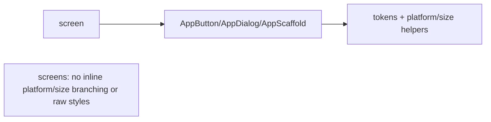

# Cross-Platform Design System

> Centralize adaptation (and branding) in a **design system**: shared tokens (color/typography/spacing) applied to Material *and* Cupertino, plus reusable adaptive components and an adaptive scaffold — so screens use consistent, platform-correct building blocks without inline platform/size branching.

## Introduction

The synthesis of this module (and the UI-craft cluster): a design system that turns responsive + adaptive rules into **reusable components + tokens**. This file covers structuring tokens, adaptive component wrappers, an adaptive scaffold, and how it keeps a large app consistent, native-feeling, and maintainable.

## Why this concept exists

Without a design system, platform/size branching and styling scatter across screens — inconsistent, hard to change, error-prone. A design system centralizes the *adapt-vs-consistent policy* ([01_adaptive_fundamentals.md](01_adaptive_fundamentals.md)), tokens, and components, so screens compose clean, on-brand, platform-correct pieces.

## Real-world analogy

A design system is a **brand style guide + a kit of pre-approved, localized components**: designers/engineers assemble screens from vetted parts (that already handle platform/size), rather than hand-crafting each one — consistent output, faster work, easy global changes.

## Problem Statement

Your app has inconsistent buttons/dialogs, scattered platform checks, and duplicated styling. Build a design-system layer — tokens, adaptive components (`AppButton`, `AppDialog`, `AppScaffold`), and helpers — so screens are clean, consistent, and platform/size-correct. You'll structure the tokens + components.

## Internal Working

```mermaid
flowchart TD
    Tokens[Design tokens: colors/typography/spacing/radii] --> Themes[Material ThemeData + CupertinoTheme]
    Tokens --> Components[Adaptive components]
    Components --> Btn[AppButton (Material/Cupertino/.adaptive)]
    Components --> Dlg[AppDialog (showAdaptiveDialog)]
    Components --> Scaffold[AppScaffold (nav adapts by platform+size)]
    Helpers[platform + breakpoint helpers] --> Components
    Screens[screens] --> Components
```

- **Tokens** (single source of truth): colors (semantic roles), typography scale, spacing scale, radii, durations — as constants/theme extensions. Applied to **both** `ThemeData` (Material) and `CupertinoTheme` so both kits look like *your* brand ([07 · text_and_theming](../07%20Widgets/06_text_and_theming.md)).
- **Adaptive components** (reusable widgets that encapsulate branching): e.g., `AppButton` (uses `.adaptive`/Material/Cupertino), `AppDialog` (`showAdaptiveDialog`), `AppTextField`, `AppSwitch` (`Switch.adaptive`) — screens use these, never raw platform branches.
- **Adaptive scaffold**: `AppScaffold` that adapts navigation (bottom nav ↔ rail/menu) by platform + size, handles scrollbars/back — combining adaptive ([03_platform_adaptive_widgets_and_navigation.md](03_platform_adaptive_widgets_and_navigation.md)) + responsive ([Module 24](../24%20Responsive%20UI/README.md)).
- **Helpers/extensions**: centralized `context.platform`, `context.windowSize`, `context.spacing`, `context.colors` so screens read intent, not raw metrics — and detection stays overridable/testable.
- **Consistency policy** lives here: the design system enforces the adapt-vs-consistent decisions once.

## Memory Representation

Tokens are constants/theme objects (shared, cheap); components are ordinary widgets. No special cost.

## Compiler Behavior

Theme extensions/tokens are type-safe; components centralize platform/size logic (testable, overridable).

## Runtime Behavior

Components read tokens + platform/size and render appropriately; a token/theme change updates the whole app consistently.

## Flutter Engine Behavior / Dart VM Behavior

Not applicable.

## Examples

```dart
import 'package:flutter/material.dart';

// 1) Tokens (single source of truth) — as a ThemeExtension for type-safe access
@immutable
class AppTokens extends ThemeExtension<AppTokens> {
  final double spacingUnit;
  final double radius;
  const AppTokens({this.spacingUnit = 8, this.radius = 12});
  @override AppTokens copyWith({double? spacingUnit, double? radius}) =>
      AppTokens(spacingUnit: spacingUnit ?? this.spacingUnit, radius: radius ?? this.radius);
  @override AppTokens lerp(AppTokens? other, double t) => this; // simplified
}

extension AppContextX on BuildContext {
  AppTokens get tokens => Theme.of(this).extension<AppTokens>()!;
  bool get isApple {
    final p = Theme.of(this).platform;
    return p == TargetPlatform.iOS || p == TargetPlatform.macOS;
  }
  bool get isWide => MediaQuery.sizeOf(this).width >= 900;
}

// 2) Adaptive component (screens use THIS, not raw platform branches)
class AppButton extends StatelessWidget {
  final String label; final VoidCallback? onPressed;
  const AppButton(this.label, {super.key, this.onPressed});
  @override
  Widget build(BuildContext context) {
    // Could branch to CupertinoButton on Apple; here Material with brand radius:
    return FilledButton(
      style: FilledButton.styleFrom(
        shape: RoundedRectangleBorder(borderRadius: BorderRadius.circular(context.tokens.radius)),
      ),
      onPressed: onPressed,
      child: Text(label),
    );
  }
}

// 3) Adaptive scaffold (nav adapts by platform+size) — see platform_adaptive_widgets file
// class AppScaffold extends StatelessWidget { ... bottom nav <-> rail by context.isWide ... }

// 4) Theme wiring (both kits share tokens)
ThemeData appTheme() => ThemeData(
      useMaterial3: true,
      colorSchemeSeed: Colors.indigo,        // brand
      extensions: const [AppTokens()],
    );
// CupertinoTheme derived from the same brand colors for consistency.
```

## Diagrams



## Common Mistakes

| Mistake | Why | Fix |
|---------|-----|-----|
| Platform/size branching in screens | Scattered, inconsistent, untestable | Encapsulate in design-system components |
| Hardcoded colors/spacing everywhere | Inconsistent, hard to rebrand | Centralize tokens; access via theme/extensions |
| Styling only Material (Cupertino off-brand) | Disjointed on iOS | Apply tokens to both kits |
| No adaptive scaffold | Repeated nav/scroll/back logic | One `AppScaffold` |
| Over-abstracting tiny one-offs | Ceremony | Componentize repeated/branching pieces |
| Non-overridable platform detection in components | Hard to test/preview | Use `Theme.of(context).platform` (overridable) |

## Best Practices

- Define **tokens** (color/typography/spacing/radii/durations) as the single source of truth; apply to **both** Material and Cupertino themes.
- Build **adaptive components** (`AppButton`/`AppDialog`/`AppScaffold`/…) that encapsulate `.adaptive`/platform/size branching — screens use these, never raw branches.
- Expose **helpers/extensions** (`context.platform`, `context.windowSize`, `context.tokens`) so screens read intent; keep detection **overridable/testable**.
- Centralize the **adapt-vs-consistent policy** in the design system.
- Combine adaptive (platform) + responsive (size) at the component level; document and version the system.

## Performance

Tokens/components are lightweight; a global token change updates the app cheaply. Centralization reduces duplicated (and buggy) branching ([21 · rebuild_optimization](../21%20Performance/02_rebuild_optimization.md)).

## Advantages / Disadvantages

- **+** Consistency, native feel, single place to change branding/adaptation, testable, faster feature work at scale.
- **−** Upfront investment; governance/maintenance; risk of over-engineering small apps.

## Interview Questions

1. **🟢 What is a design system in this context?** — A centralized layer of shared tokens + reusable adaptive components that encapsulate platform/size branding and behavior.
2. **🟢 Why centralize adaptation in components?** — To keep screens free of scattered, inconsistent platform/size branching and make changes/testing single-point.
3. **🟡 How do you keep both Material and Cupertino on-brand?** — Apply the same tokens (colors/typography/spacing) to both `ThemeData` and `CupertinoTheme`.
4. **🟡 What belongs in tokens?** — Colors (semantic roles), typography scale, spacing/radii, durations — the brand's design decisions.
5. **🟡 How do screens access adaptation without branching?** — Via design-system components (`AppButton`/`AppScaffold`) and helpers (`context.platform`/`windowSize`/`tokens`).
6. **🔴 How does the design system combine adaptive + responsive?** — Components read both platform (adaptive) and size (responsive) to render correctly, so screens compose one adaptive/responsive kit.
7. **🔴 When is a design system overkill?** — For very small/short-lived apps; the investment pays off with scale, multiple platforms, and team size.

## Senior Engineer Tips

- Start tokens + a handful of adaptive components early; retrofitting a design system into a branch-everywhere codebase is painful.
- Make components the *only* place platform/size branching lives; enforce "no raw `Platform`/breakpoint checks in screens" in review.
- Version and document the system; treat it as a product the whole team consumes.

## Architect Perspective

A cross-platform design system is the architectural capstone of UI craft: it operationalizes the adapt-vs-consistent policy, unifies responsive + adaptive + theming into reusable components, and gives one codebase native feel + brand consistency across platforms and form factors — at scale, with maintainability. It's where Modules 07, 22, 23, 24, and 25 converge ([Module 24](../24%20Responsive%20UI/README.md), [Module 47](../47%20Scalable%20Applications/README.md)).

## Summary

- Centralize tokens (applied to Material + Cupertino) + adaptive components + an adaptive scaffold + helpers.
- Screens compose design-system components — no inline platform/size branching or raw styles.
- Combines adaptive (platform) + responsive (size) + branding; the maintainable, scalable UI foundation.

## Revision Notes

- Tokens (color/typography/spacing/radii/durations) → both `ThemeData` + `CupertinoTheme`.
- Adaptive components (`AppButton`/`AppDialog`/`AppScaffold`) encapsulate `.adaptive`/platform/size; screens use them.
- Helpers/extensions (`context.platform`/`windowSize`/`tokens`); overridable detection.
- Centralizes adapt-vs-consistent policy; combines adaptive + responsive; invest early, govern/version.

## Practice Questions

1. Why encapsulate platform/size branching in components?
2. How do you keep Material and Cupertino on-brand?
3. What goes in tokens, and how are they accessed?

## Coding Questions

1. Define an `AppTokens` `ThemeExtension` + `context.tokens` accessor and use it.
2. Build an `AppButton` and `AppDialog` that adapt per platform.
3. Build an `AppScaffold` that adapts navigation by platform + size.

## Mini Project — Module capstone

**Adaptive design system (Flutter):** Build a small design system: tokens (color/typography/spacing/radii) applied to Material + Cupertino, adaptive components (`AppButton`, `AppSwitch`, `AppDialog`, `AppScaffold` with nav adapting by platform+size), and `context` helpers (`platform`/`windowSize`/`tokens`). Build a demo screen using only these components — no inline platform/size branching. Preview iOS via `TargetPlatform` override and resize for size tiers. Acceptance: consistent branding across kits; platform+size adaptation centralized in components; screens branch-free; overridable/testable; runs on mobile + desktop/web.
