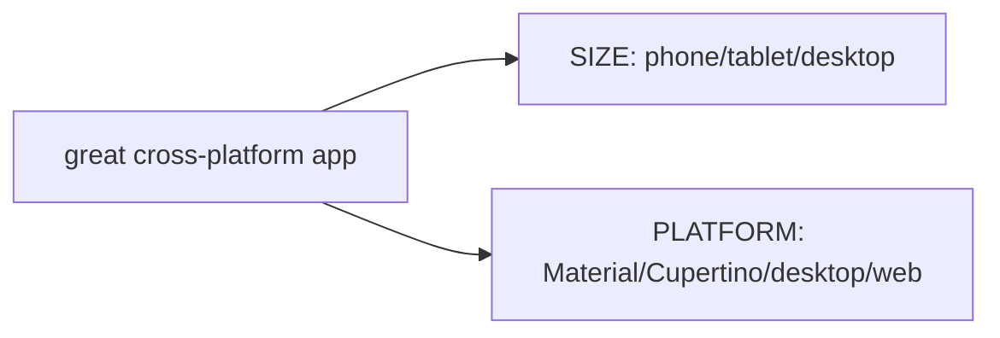

# Adaptive Fundamentals (Adaptive vs Responsive; Platform Detection)

> **Adaptive** UI conforms to the *platform* (Material/Cupertino/desktop/web conventions); **responsive** UI adapts to *size*. Detect the platform correctly (`Theme.of(context).platform`/`defaultTargetPlatform`, not raw `Platform.isX`), and adapt **selectively** where conventions matter — not everywhere.

## Introduction

Before adapting, get the concepts and detection right: the adaptive-vs-responsive distinction, how to detect platform properly, and the principle of *selective* adaptation (adapt what users notice; keep the rest consistent). This grounds the Material/Cupertino and design-system files.

## Why this concept exists

Flutter's consistency is a feature, but some things *should* differ per platform (dialog style, switches, scroll physics, back navigation, date pickers) — mismatches feel wrong/non-native. Blanket per-platform UIs, though, double the work. The skill is deciding *when* and *how much* to adapt, with correct detection.

## Real-world analogy

Adaptive is **speaking the local dialect and customs** wherever you travel (greetings, etiquette) while keeping your identity; responsive is **dressing for the weather** (size/conditions). You adapt the *manners that locals notice*, not everything — and you first need to correctly identify *which country you're in* (detection).

## Problem Statement

Your app shows a Material dialog and switch on iOS (feels wrong) and uses Android scroll physics everywhere. Decide what to adapt, and detect the platform correctly (including web/desktop and testability). You'll set up proper detection + a selective-adaptation policy.

## Internal Working

```mermaid
flowchart TD
    Dim{dimension}
    Dim --> Size[Responsive: adapt to SIZE (Module 24)]
    Dim --> Platform[Adaptive: conform to PLATFORM conventions]
    Detect[detect platform] --> TP[Theme.of(context).platform / defaultTargetPlatform]
    TP --> Decide{adapt where it matters}
    Decide --> Yes[dialogs/switches/scroll/back/pickers/nav]
    Decide --> No[keep consistent: layout, brand, most content]
```

- **Adaptive vs responsive**: adaptive = *platform* (which design language/idioms); responsive = *size/orientation* ([Module 24](../24%20Responsive%20UI/README.md)). They're orthogonal — real apps do both.
- **Platform detection (correctly)**:
  - Use **`Theme.of(context).platform`** or **`defaultTargetPlatform`** (a `TargetPlatform` enum: android/iOS/macOS/windows/linux/fuchsia). These are **overridable** (great for testing/previews) and work in widget code.
  - Avoid raw `dart:io` **`Platform.isIOS`** in UI: it's not overridable, throws on **web** (`dart:io` unavailable), and is harder to test. Use `kIsWeb` to detect web.
- **Selective adaptation**: adapt what users perceive as native (dialogs, switches/sliders, scroll physics, back gesture, date/time pickers, navigation patterns); keep **layout, branding, and most content consistent** to avoid doubling work.
- **Consistency vs nativeness tradeoff**: decide your product stance — some apps stay fully Material everywhere (brand consistency), others adapt heavily (native feel). Be intentional.

## Memory Representation

Not applicable; platform is a metric read at build time.

## Compiler Behavior

`defaultTargetPlatform`/`kIsWeb` are compile-time-friendly constants/enums; `dart:io` `Platform` isn't available on web (build/runtime issue).

## Runtime Behavior

Detection returns the current (or overridden) platform; adaptive branches choose platform-appropriate widgets. Overriding `TargetPlatform` (in `MaterialApp`/tests) changes what adapts — enabling previews/tests.

## Flutter Engine Behavior / Dart VM Behavior

Not applicable.

## Examples

```dart
import 'package:flutter/foundation.dart'; // defaultTargetPlatform, kIsWeb, TargetPlatform
import 'package:flutter/material.dart';

// ✅ Correct, testable, web-safe platform detection:
bool isApplePlatform(BuildContext context) {
  final p = Theme.of(context).platform; // overridable + works in widgets
  return p == TargetPlatform.iOS || p == TargetPlatform.macOS;
}

bool get isWeb => kIsWeb; // never use dart:io Platform on web

// ❌ Anti-pattern (avoid in UI):
// import 'dart:io';
// if (Platform.isIOS) ...   // not overridable, throws on web, hard to test

// Selective adaptation policy (what to adapt vs keep consistent):
// ADAPT:  dialogs, switches/sliders, scroll physics, back gesture, date/time pickers, nav pattern
// KEEP:   overall layout, brand colors/typography, business content
class AdaptiveExample extends StatelessWidget {
  const AdaptiveExample({super.key});
  @override
  Widget build(BuildContext context) {
    final apple = isApplePlatform(context);
    return Text(apple ? 'Cupertino-style here' : 'Material-style here');
  }
}
```

## Diagrams



## Common Mistakes

| Mistake | Why | Fix |
|---------|-----|-----|
| `dart:io` `Platform.isIOS` in UI | Crashes on web; not overridable/testable | `Theme.of(context).platform`/`defaultTargetPlatform` + `kIsWeb` |
| Confusing adaptive with responsive | Different dimensions | Adaptive=platform, responsive=size |
| Adapting everything | Doubles work/maintenance | Adapt selectively (what users notice) |
| Ignoring web/desktop platforms | Wrong idioms there | Handle web (`kIsWeb`) + desktop targets |
| Hardcoding platform checks everywhere | Scattered, fragile | Centralize in a design-system/helper |

## Best Practices

- Detect platform with **`Theme.of(context).platform`/`defaultTargetPlatform`** (overridable, testable) + **`kIsWeb`**; avoid `dart:io` `Platform` in UI.
- **Adapt selectively**: dialogs, switches/sliders, scroll physics, back gesture, date/time pickers, navigation — keep layout/brand/content consistent.
- Decide a **product stance** (fully-consistent vs heavily-adaptive) and apply it intentionally.
- **Centralize** adaptation in helpers/a design system ([cross_platform_design_system.md](cross_platform_design_system.md)); make platform overridable for testing/previews.
- Combine with **responsive** (size) for full cross-platform/form-factor coverage.

## Performance

Negligible; detection is a constant/enum read and branching is cheap.

## Advantages / Disadvantages

- **+** Native feel where it matters, better UX per platform, correct/testable detection, bounded effort.
- **−** Extra branches/testing across platforms; risk of over-adapting; must maintain a consistency policy.

## Interview Questions

1. **🟢 Adaptive vs responsive?** — Adaptive conforms to *platform* conventions (Material/Cupertino/desktop/web); responsive adapts to *size/orientation*. They're orthogonal.
2. **🟢 How should you detect platform in Flutter UI?** — `Theme.of(context).platform` or `defaultTargetPlatform` (overridable, testable) + `kIsWeb` for web.
3. **🟡 Why avoid `dart:io` `Platform.isIOS` in widgets?** — It's unavailable on web (throws), not overridable, and harder to test than `defaultTargetPlatform`.
4. **🟡 Why adapt selectively rather than everywhere?** — Full per-platform UIs double effort; adapt only what users perceive as native (dialogs/switches/scroll/back/pickers/nav), keep the rest consistent.
5. **🟡 What things typically warrant adaptation?** — Dialogs, switches/sliders, scroll physics, back gesture, date/time pickers, and navigation patterns.
6. **🔴 Why is overridable platform detection valuable?** — It lets you preview/test each platform's UI (set `TargetPlatform` in `MaterialApp`/tests) without running on that device.
7. **🔴 How do adaptive and responsive combine?** — Adaptive picks platform idioms; responsive picks layout by size — together they deliver native feel on every platform *and* form factor.

## Senior Engineer Tips

- Standardize on `defaultTargetPlatform`/`Theme.of(context).platform` + `kIsWeb`; ban `dart:io` `Platform` in UI code (lint/review).
- Write down a **consistency-vs-nativeness policy** per product; it prevents ad-hoc, inconsistent adaptation.
- Centralize platform branching so screens stay clean and adaptation is testable/overridable.

## Architect Perspective

Adaptive strategy is a product/UX-architecture decision: how native to feel vs how consistent to stay, and where to draw that line. Correct, centralized, overridable detection + selective adaptation (in a design-system layer) keeps a single codebase feeling native across platforms while remaining maintainable — complementing responsive design for full coverage ([Module 24](../24%20Responsive%20UI/README.md), [cross_platform_design_system.md](cross_platform_design_system.md)).

## Summary

- Adaptive = platform conventions; responsive = size — orthogonal, do both.
- Detect via `Theme.of(context).platform`/`defaultTargetPlatform` + `kIsWeb` (not `dart:io`).
- Adapt selectively (dialogs/switches/scroll/back/pickers/nav), keep layout/brand consistent, centralize the logic.

## Revision Notes

- Adaptive (platform) vs responsive (size); orthogonal.
- Detect: `Theme.of(context).platform`/`defaultTargetPlatform` (overridable/testable) + `kIsWeb`; avoid `dart:io Platform` in UI (web-unsafe).
- Adapt selectively: dialogs/switches/scroll/back/pickers/nav; keep layout/brand consistent.
- Centralize + define product stance; combine with responsive.

## Practice Questions

1. Why is `defaultTargetPlatform` better than `Platform.isIOS` in UI?
2. What's the difference between adaptive and responsive?
3. Which UI elements typically warrant platform adaptation?

## Coding Questions

1. Write a web-safe, testable `isApplePlatform(context)` helper.
2. List, for a given app, what to adapt vs keep consistent (with rationale).
3. Override `TargetPlatform` in a test to preview iOS UI.

## Mini Project

**Adaptation policy + detection (docs + helper):** Write `ADAPTATION.md` defining your product's adapt-vs-consistent policy (which elements adapt and why), and implement a centralized, web-safe, overridable platform-detection helper (`platform`, `isApple`, `isWeb`) used by a demo widget. Acceptance: correct detection (no `dart:io` in UI); documented selective policy; overridable for tests; runs on mobile + web.
