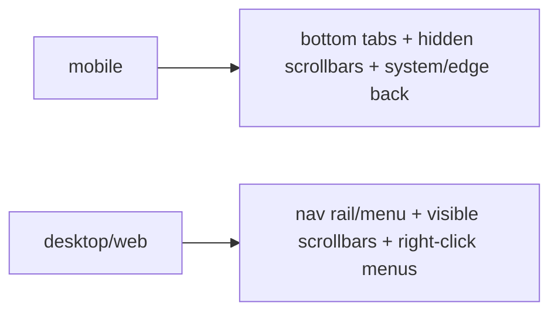

# Platform-Adaptive Widgets & Navigation

> Beyond dialogs/switches, adapt the **interaction patterns** users feel: scroll physics (bouncing vs clamping), the **back gesture/behavior**, navigation structure (bottom tabs vs nav rail/menu bar), scrollbars, context menus, and date/time pickers — so each platform behaves natively.

## Introduction

This file covers platform-adaptive *behaviors and navigation*, not just visuals: scroll physics, back handling, navigation patterns per platform/form factor, scrollbars, selection/context menus, and pickers. These are the behavioral details that make an app feel native (or not).

## Why this concept exists

Users notice *behavior* even more than looks: iOS bouncing scroll, the iOS edge-swipe back, desktop right-click menus and always-visible scrollbars, Android's system back. Getting these right (mostly automatic, sometimes manual) is what separates "a Flutter app" from "a native-feeling app."

## Real-world analogy

Adapting behaviors is like **driving on the correct side of the road** in each country — not just repainting the car. Visitors immediately feel when the controls behave "wrong"; matching local driving conventions (behaviors) matters more than the paint job.

## Problem Statement

Your app scrolls with Android physics on iOS, ignores the iOS back-swipe, shows bottom tabs on desktop (should be a rail/menu), lacks desktop scrollbars, and uses a Material date picker on iOS. You'll adapt scroll physics, back, navigation, scrollbars, and pickers.

## Internal Working

```mermaid
flowchart TD
    Behaviors{platform behaviors}
    Behaviors --> Scroll[ScrollPhysics: Bouncing (iOS) vs Clamping (Android)]
    Behaviors --> Back[back: iOS edge-swipe / Android system back / desktop none]
    Behaviors --> Nav[navigation: bottom tabs (mobile) vs nav rail/menu (desktop)]
    Behaviors --> Scrollbar[desktop: always-visible Scrollbar]
    Behaviors --> Menus[desktop: right-click context menus]
    Behaviors --> Pickers[Cupertino vs Material date/time pickers]
```

- **Scroll physics**: `MaterialApp` applies platform-appropriate `ScrollPhysics` by default (bouncing on iOS, clamping on Android); override via `ScrollConfiguration`/`physics:` when needed. It's a Strategy ([05 · strategy](../05%20Design%20Patterns/strategy.md)).
- **Back behavior**: iOS gets the **edge-swipe back** (via `CupertinoPageRoute`/adaptive page transitions); Android uses the **system back** button; desktop/web use app-provided back. Use `PopScope` for confirm-exit ([12 · navigator_stack](../12%20Navigation/navigator_stack.md)).
- **Navigation patterns** (platform + size): mobile → **bottom navigation/tabs**; large/desktop → **navigation rail / side menu / menu bar**; iOS → `CupertinoTabScaffold`; combine with responsive tiers ([24 · responsive_fundamentals](../24%20Responsive%20UI/responsive_fundamentals.md)).
- **Scrollbars**: desktop/web want **always-visible, draggable** scrollbars (`Scrollbar(thumbVisibility: true)`); mobile hides them.
- **Selection/context menus**: desktop/web want **right-click context menus** and hover states; mobile uses long-press/toolbar.
- **Pickers/inputs**: iOS wheel date/time pickers vs Material calendar; adapt where users expect the native picker.
- Much is **automatic** via `MaterialApp` + `.adaptive`; the rest is **selective manual** adaptation.

## Memory Representation

Not applicable; behaviors are configured widgets/physics chosen by platform/size.

## Compiler Behavior / Runtime Behavior

Physics/nav/back chosen at build by platform (overridable); scrollbars/menus respond to input device (mouse vs touch).

## Flutter Engine Behavior

Input devices (mouse/touch/keyboard), back gestures, and system bars are surfaced by the embedder; the framework maps them to platform behaviors ([10 · embedder_and_startup](../10%20Flutter%20Architecture/embedder_and_startup.md)).

## Dart VM Behavior

Not applicable.

## Examples

```dart
import 'package:flutter/material.dart';

// Navigation adapts by size/platform (bottom nav on mobile, rail on desktop)
class AdaptiveNavScaffold extends StatelessWidget {
  final int index; final Widget body; final ValueChanged<int> onSelect;
  const AdaptiveNavScaffold({super.key, required this.index, required this.body, required this.onSelect});

  @override
  Widget build(BuildContext context) {
    final wide = MediaQuery.sizeOf(context).width >= 900;
    final destinations = const [
      (icon: Icons.home, label: 'Home'),
      (icon: Icons.search, label: 'Search'),
      (icon: Icons.person, label: 'Profile'),
    ];
    if (wide) {
      // Desktop/tablet: navigation rail + always-visible scrollbar on content
      return Scaffold(
        body: Row(children: [
          NavigationRail(
            selectedIndex: index, onDestinationSelected: onSelect,
            destinations: [for (final d in destinations)
              NavigationRailDestination(icon: Icon(d.icon), label: Text(d.label))],
          ),
          const VerticalDivider(width: 1),
          Expanded(child: Scrollbar(thumbVisibility: true, child: body)), // desktop scrollbar
        ]),
      );
    }
    // Mobile: bottom navigation
    return Scaffold(
      body: body,
      bottomNavigationBar: NavigationBar(
        selectedIndex: index, onDestinationSelected: onSelect,
        destinations: [for (final d in destinations)
          NavigationDestination(icon: Icon(d.icon), label: d.label)],
      ),
    );
  }
}

// Scroll physics: MaterialApp adapts by default; override explicitly if needed
// ScrollConfiguration(behavior: const MaterialScrollBehavior(), child: ...)
// or set physics: const BouncingScrollPhysics() / ClampingScrollPhysics() deliberately.
```

## Diagrams



## Common Mistakes

| Mistake | Why | Fix |
|---------|-----|-----|
| Android scroll physics on iOS | Non-native feel | Let `MaterialApp` adapt / `BouncingScrollPhysics` on iOS |
| No edge-swipe back on iOS | Breaks iOS expectation | Cupertino/adaptive page routes |
| Bottom tabs on desktop | Wrong idiom | Navigation rail/menu on wide/desktop |
| No visible scrollbars on desktop/web | Hard to scroll with mouse | `Scrollbar(thumbVisibility: true)` |
| No right-click/hover on desktop | Misses desktop UX | Context menus + hover states |
| Material date picker on iOS | Non-native | Cupertino picker where expected |

## Best Practices

- Rely on **`MaterialApp` + `.adaptive`** for automatic behaviors (scroll physics, page transitions), then **selectively** adapt navigation, scrollbars, context menus, and pickers.
- **Adapt navigation by platform + size**: bottom tabs (mobile) → rail/side menu/menu bar (desktop) — combine with responsive tiers.
- Provide **desktop/web affordances**: visible scrollbars, hover states, right-click context menus, keyboard shortcuts.
- Honor **back conventions** (iOS edge-swipe, Android system back) via adaptive routes; `PopScope` for confirm-exit.
- Use **native pickers/inputs** where users expect them; centralize behavior choices in a design system.

## Performance

Negligible; these are configuration/branching choices. Scroll physics/scrollbars are framework-optimized.

## Advantages / Disadvantages

- **+** Native-feeling behavior per platform/device; better UX; meets user expectations.
- **−** More cases (mobile/desktop/web, touch/mouse) to handle/test; risk of inconsistency without centralization.

## Interview Questions

1. **🟢 What behaviors should you adapt per platform?** — Scroll physics, back gesture/behavior, navigation pattern, scrollbars, context menus/hover, and date/time pickers.
2. **🟢 How does scroll physics adapt by default?** — `MaterialApp` applies platform-appropriate `ScrollPhysics` (bouncing on iOS, clamping on Android); override via `ScrollConfiguration`/`physics:`.
3. **🟡 How should navigation change across platform/size?** — Bottom tabs on mobile → navigation rail/side menu/menu bar on desktop/wide; iOS `CupertinoTabScaffold` for deep iOS.
4. **🟡 What desktop/web affordances are expected?** — Always-visible draggable scrollbars, hover states, right-click context menus, and keyboard shortcuts.
5. **🟡 How do you honor back conventions?** — iOS edge-swipe (Cupertino/adaptive page routes), Android system back; `PopScope` for exit confirmation.
6. **🔴 Why adapt behavior even more than visuals?** — Users feel wrong *behavior* (scroll/back/menus) immediately; behavioral mismatches break the native feel more than styling.
7. **🔴 How do you keep adaptive behavior maintainable?** — Centralize choices in a design-system/adaptive-scaffold layer; rely on automatic adaptations, add manual ones selectively.

## Senior Engineer Tips

- Build one **adaptive scaffold** (nav bar ↔ rail/menu, scrollbars, back handling) driven by platform + size; screens just supply content.
- Don't forget **desktop/web input** (mouse hover, right-click, keyboard) — a common gap for mobile-first Flutter teams.
- Let the framework's defaults do the heavy lifting (physics/transitions); reserve manual adaptation for navigation, scrollbars, menus, and pickers.

## Architect Perspective

Behavioral adaptation (scroll/back/navigation/scrollbars/menus/pickers) is what truly makes an app feel native across platforms and input devices. Centralizing it in an adaptive scaffold/design system — combined with responsive size tiers ([Module 24](../24%20Responsive%20UI/README.md)) — delivers native behavior everywhere from one codebase, and is essential for web/desktop targets ([Modules 53](../53%20Flutter%20Web/README.md)/[54](../54%20Flutter%20Desktop/README.md)).

## Summary

- Adapt behaviors: scroll physics, back gesture/behavior, navigation (tabs↔rail/menu), scrollbars, context menus/hover, pickers.
- Framework + `.adaptive` handle much automatically; adapt navigation/scrollbars/menus/pickers selectively.
- Provide desktop/web input affordances; centralize in an adaptive scaffold; combine with responsive tiers.

## Revision Notes

- Adapt: ScrollPhysics (bouncing iOS/clamping Android, `MaterialApp` default), back (iOS edge-swipe/Android system), nav (bottom↔rail/menu), scrollbars (`thumbVisibility` desktop), right-click/hover, pickers.
- Automatic via MaterialApp/`.adaptive`; manual selective for nav/scrollbars/menus/pickers.
- Desktop/web: visible scrollbars + hover + context menus + shortcuts.
- Centralize in adaptive scaffold; combine with responsive size tiers.

## Practice Questions

1. How does scroll physics differ by platform and how is it set?
2. How should navigation adapt from mobile to desktop?
3. What desktop/web behaviors do mobile-first apps often miss?

## Coding Questions

1. Build an adaptive scaffold: bottom nav (mobile) ↔ navigation rail (desktop).
2. Add always-visible scrollbars + hover/right-click context menu for desktop.
3. Use a Cupertino date picker on iOS and Material on Android.

## Mini Project

**Adaptive navigation scaffold (Flutter):** Build a reusable scaffold that renders bottom navigation on mobile and a navigation rail/side menu on desktop/wide, with platform-correct scroll physics, iOS edge-swipe back, desktop scrollbars, and right-click context menus on desktop. Acceptance: navigation adapts by platform+size; native scroll/back; desktop affordances (scrollbar/hover/right-click); centralized/reusable; runs on mobile + desktop/web.
