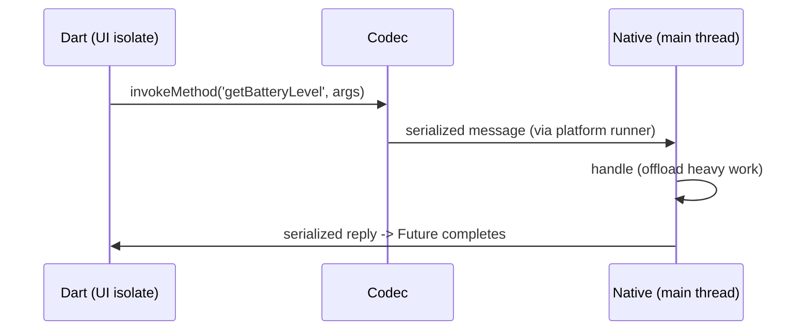

# Platform Channel Fundamentals (Messaging Model)

> A platform channel is a **named, asynchronous message pipe** between Dart and native code: messages are serialized by a **codec** (standard/JSON/binary), passed across the engine's platform/UI task runners, and handled on the native side — always async, and (by default) on the platform's main thread.

## Introduction

Before the specific channels, understand the model: named channels, message codecs, asynchrony, threading, and where handlers run. This explains why calls are `Future`-based, what data types cross, and the threading pitfalls — grounding `MethodChannel`/`EventChannel`/plugins/FFI.

## Why this concept exists

Dart (UI isolate) and native code run separately; they can't call each other directly. Channels provide a standardized, serialized, async message-passing mechanism across that boundary — the embedder-level bridge ([10 · engine_internals](../10%20Flutter%20Architecture/04_engine_internals.md)).

## Real-world analogy

A platform channel is a **labeled pneumatic tube** between two offices (Dart and native): you put a message in a canister (serialized by the codec), send it through the tube (async), the other office processes it and (maybe) sends a reply back. You never reach into the other office directly.

## Problem Statement

You need to call a native API from Dart and understand: is it sync or async? what data types can you pass? which thread does the native handler run on, and why does that matter? You'll map the channel model before writing code.

## Internal Working

```mermaid
flowchart LR
    Dart[Dart: channel.invokeMethod(args)] --> Codec[MethodCodec serializes]
    Codec --> UIrunner[UI task runner] --> Platrunner[Platform task runner]
    Platrunner --> Native[native handler (main thread)]
    Native --> Reply[serialize reply] --> DartFuture[Dart Future completes]
```

- **Named channels**: identified by a unique string (e.g., `'app/battery'`) shared by Dart and native — both sides register the same name.
- **Codecs**: messages are serialized/deserialized by a codec:
  - **`StandardMessageCodec`** (default): supports null, bool, num, String, `Uint8List`/typed lists, `List`, `Map` — efficient binary; **no custom classes** (map to primitives/maps).
  - Also `JSONMessageCodec`, `StringCodec`, `BinaryCodec` for special cases; Pigeon generates typed codecs ([04_plugins_and_pigeon.md](04_plugins_and_pigeon.md)).
- **Asynchronous**: all channel calls return a `Future`/`Stream` — messages hop between the **UI task runner** and **platform task runner** ([10 · threading_model](../10%20Flutter%20Architecture/03_threading_model.md)); never assume synchronous.
- **Threading**: native handlers typically run on the **platform main thread** (UI thread on Android, main queue on iOS). Do heavy native work off that thread and return results; long native work blocks native UI. Dart callers await on the UI isolate.
- **Background isolates**: calling channels from a **background Dart isolate** needs `RootIsolateToken` + `BackgroundIsolateBinaryMessenger.ensureInitialized` (channels aren't wired there by default) ([02 · isolates](../02%20Advanced%20Dart/04_isolates.md)).
- **Three channel types**: `MethodChannel` (call methods, get a reply), `EventChannel` (native→Dart event streams), `BasicMessageChannel` (arbitrary async messages both ways).

## Memory Representation

Messages are serialized to bytes for transit (copied across the boundary) — large payloads cost serialization time/memory; prefer small messages or `Uint8List`/FFI for big binary data.

## Compiler Behavior

Untyped by default (`invokeMethod` returns `dynamic`) — you cast on the Dart side (Pigeon adds compile-time types).

## Runtime Behavior

`invokeMethod` sends a message and awaits a reply (or `PlatformException`/`MissingPluginException`). Codec-unsupported types throw. Handlers run async on the platform side.

## Flutter Engine Behavior

The engine's platform-channel infrastructure marshals messages across the platform/UI runners via the embedder; the embedder registers native handlers ([10 · embedder_and_startup](../10%20Flutter%20Architecture/05_embedder_and_startup.md)).

## Dart VM Behavior

Dart-side calls run on the root isolate's event loop; background isolates need explicit messenger setup ([02 · event_loop](../02%20Advanced%20Dart/01_event_loop.md)).

## Examples

```dart
import 'package:flutter/services.dart';

// A named channel shared by Dart and native (same string on both sides)
const channel = MethodChannel('app/battery');

Future<int> batteryLevel() async {
  // Async: returns a Future; args/results limited to codec-supported types
  final level = await channel.invokeMethod<int>('getBatteryLevel', {'unit': 'percent'});
  return level ?? -1;
}
// Data types crossing: null/bool/num/String/Uint8List/List/Map — NOT custom classes.
// Native handler runs on the platform main thread (Android UI thread / iOS main queue).
```

## Diagrams



## Common Mistakes

| Mistake | Why | Fix |
|---------|-----|-----|
| Passing custom class objects | Codec supports only primitives/maps/lists | Serialize to maps/primitives (or Pigeon) |
| Assuming synchronous calls | Channels are async | Always `await`; handle errors |
| Heavy native work on the main thread | Blocks native UI/janks | Offload natively; return the result |
| Channels from a background isolate without setup | Not wired there | `RootIsolateToken` + background messenger |
| Mismatched channel name/method | `MissingPluginException`/no handler | Match names/methods exactly both sides |
| Large payloads over channels | Serialization cost | Small messages / `Uint8List` / FFI |

## Best Practices

- Treat channels as **async message pipes**; always `await` and handle `PlatformException`/`MissingPluginException`.
- Pass **codec-supported types** (primitives/`Map`/`List`/`Uint8List`); serialize custom data (or use **Pigeon** for typed messages).
- Do **heavy native work off the main thread** natively; keep messages small.
- Match **channel names/methods** exactly on both sides; namespace them (`com.app/feature`).
- For background-isolate channel use, set up the **background messenger**.
- **Wrap native access behind a repository** so the app depends on domain APIs, not channels.

## Performance

Serialization + cross-thread hops add latency; keep messages small and calls off hot paths. Big binary → `Uint8List` (efficient) or FFI (zero-copy-ish). Native work off the main thread avoids native jank ([Module 21](../21%20Performance/README.md)).

## Advantages / Disadvantages

- **+** Standard, async, cross-platform bridge to any native capability; multiple codecs; three channel types.
- **−** Untyped (cast/serialize), async-only, threading pitfalls, serialization cost, name-matching fragility — FFI/Pigeon mitigate some.

## Interview Questions

1. **🟢 What is a platform channel?** — A named async message pipe between Dart and native code, with messages serialized by a codec.
2. **🟢 Are channel calls sync or async?** — Async — they return `Future`s/`Stream`s; never assume synchronous.
3. **🟡 What data types can cross a standard channel?** — Codec-supported: null, bool, num, String, `Uint8List`/typed lists, `List`, `Map` — not custom classes.
4. **🟡 Which thread do native handlers run on?** — The platform main thread (Android UI thread / iOS main queue); offload heavy work natively.
5. **🟡 What are the three channel types?** — `MethodChannel` (call+reply), `EventChannel` (native→Dart streams), `BasicMessageChannel` (arbitrary two-way messages).
6. **🔴 How do you call channels from a background isolate?** — Register `RootIsolateToken` and `BackgroundIsolateBinaryMessenger.ensureInitialized` — channels aren't wired in background isolates by default.
7. **🔴 How do you pass a custom object across a channel?** — Serialize it to primitives/maps (or use Pigeon for generated typed messages); the standard codec can't send arbitrary classes.

## Senior Engineer Tips

- Namespace channels (`com.yourapp/feature`) and match names/methods exactly; a typo = `MissingPluginException`.
- Keep messages small and calls infrequent; batch where possible and use `Uint8List` for binary.
- Always wrap native calls behind a repository/service so the app is testable (mock the repo) and channels stay isolated.

## Architect Perspective

Platform channels are the embedder-boundary integration seam. Isolating them behind repositories (returning domain types, mapping errors) keeps the app portable and testable; understanding the codec/async/threading model prevents the subtle bugs (serialization, main-thread blocking, background isolates) that plague ad-hoc native integration ([10 · threading_model](../10%20Flutter%20Architecture/03_threading_model.md), [Module 27](../27%20Native%20Android/README.md)/[28](../28%20Native%20iOS/README.md)).

## Summary

- Channels = named, async, codec-serialized message pipes between Dart and native, crossing platform/UI runners.
- Pass primitives/maps/lists/bytes (not custom classes); handlers run on the native main thread; always async.
- Wrap behind repositories; use Pigeon for types, FFI for direct C, background messenger for isolates.

## Revision Notes

- Named channel + codec (Standard: primitives/`Map`/`List`/`Uint8List`; also JSON/String/Binary); async only.
- Types: `MethodChannel` (call+reply), `EventChannel` (streams), `BasicMessageChannel` (two-way).
- Native handlers on platform main thread → offload heavy work; keep messages small.
- Background isolate → `RootIsolateToken` + background messenger; wrap behind repository; Pigeon (types)/FFI (C).

## Practice Questions

1. What data types can cross a standard channel, and how do you send a custom object?
2. Which thread runs native handlers, and why does it matter?
3. Why must channel calls be awaited/handled for errors?

## Coding Questions

1. Define a namespaced `MethodChannel` and call a method with typed args/result (with cast).
2. Explain (comments) the serialize→cross-runner→handle→reply flow for a call.
3. Set up background-isolate channel access (token + messenger) conceptually.

## Mini Project

**Channel model map (docs + skeleton):** Write `CHANNELS.md` diagramming the messaging model (codec, runners, threading), listing supported data types and the three channel types, and sketch a repository wrapping a namespaced `MethodChannel` (typed Dart API, error mapping). Acceptance: correct model/threading explanation; supported types listed; repository-wrapped native access; runs (Dart side).
