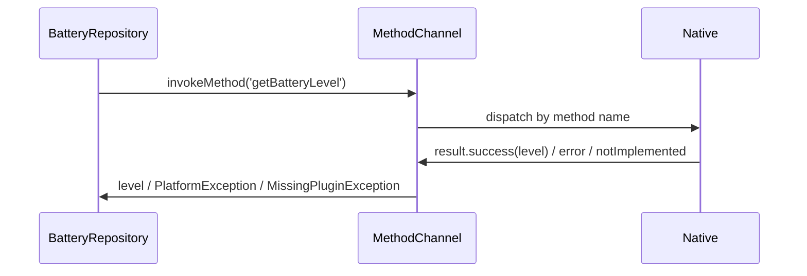

# `MethodChannel`

> `MethodChannel` is the request/reply channel: Dart calls `invokeMethod('name', args)` and awaits a result; the native side registers a handler that switches on the method name, does the work, and returns a result or a `PlatformException` — the workhorse for one-off native calls.

## Introduction

`MethodChannel` handles "call a native method, get a value back" — battery level, share intent, biometric prompt, native dialog. This file covers the Dart side (`invokeMethod` + error handling) and the native handler pattern (method dispatch, `result.success`/`error`/`notImplemented`), wrapped behind a repository.

## Why this concept exists

Most native integration is discrete calls with a result. `MethodChannel` standardizes this: a named channel + method dispatch + typed-ish result/error, async over the channel infrastructure ([01_platform_channel_fundamentals.md](01_platform_channel_fundamentals.md)).

## Real-world analogy

`MethodChannel` is **calling a service desk and asking for something specific** ("what's the battery level?"): you state the request by name with details (args), they look it up and reply with the answer (result) or "can't do that" (error). One question, one answer.

## Problem Statement

Read the battery level and trigger a native share sheet from Dart, handling the case where the platform doesn't implement it and native errors. You'll implement the Dart caller + native handler + repository wrapper + error handling.

## Internal Working

```mermaid
flowchart LR
    Dart[invokeMethod('getBatteryLevel', args)] --> Native[setMethodCallHandler]
    Native --> Switch{call.method}
    Switch -->|getBatteryLevel| Work[read battery -> result.success(level)]
    Switch -->|unknown| NotImpl[result.notImplemented()]
    Work --> DartResult[Future completes]
    NativeErr[failure] --> Error[result.error(code,msg) -> PlatformException]
```

- **Dart side**:
  - `const channel = MethodChannel('app/battery');`
  - `final v = await channel.invokeMethod<int>('getBatteryLevel', {args});` — returns the typed result (cast).
  - **Errors**: catch `PlatformException` (native `result.error`), `MissingPluginException` (no handler registered on this platform), and general errors; map to domain failures.
- **Native side** (registered by the plugin/app):
  - **Android (Kotlin)**: `MethodChannel(binaryMessenger, 'app/battery').setMethodCallHandler { call, result -> when (call.method) { "getBatteryLevel" -> result.success(level); else -> result.notImplemented() } }`
  - **iOS (Swift)**: `channel.setMethodCallHandler { call, result in ... result(level) / result(FlutterError(...)) / result(FlutterMethodNotImplemented) }`
  - Return via **`result.success`/`result.error`/`result.notImplemented`**; do heavy work off the main thread and call `result` on the main thread.
- **Args**: passed as codec-supported types (usually a `Map`); read/cast on native.
- **Wrap in a repository**: expose a typed Dart API (`BatteryRepository.level()`), map channel results/errors → domain — the app never touches the channel directly.

## Memory Representation

Small serialized messages both ways; large data should be `Uint8List` or avoided ([01_platform_channel_fundamentals.md](01_platform_channel_fundamentals.md)).

## Compiler Behavior

`invokeMethod<T>` returns `T?` but isn't truly type-checked end-to-end (native returns are dynamic) — Pigeon adds real type-safety ([04_plugins_and_pigeon.md](04_plugins_and_pigeon.md)).

## Runtime Behavior

`invokeMethod` sends the call and awaits; native handler dispatches by method name; unknown methods → `notImplemented` → Dart `MissingPluginException`; native errors → `PlatformException`.

## Flutter Engine Behavior

Message crosses platform/UI runners; native handler runs on the platform main thread ([10 · threading_model](../10%20Flutter%20Architecture/03_threading_model.md)).

## Dart VM Behavior

Dart caller awaits on the root isolate; background isolates need messenger setup ([02 · isolates](../02%20Advanced%20Dart/04_isolates.md)).

## Examples

```dart
import 'package:flutter/services.dart';

// Repository wrapping the channel (typed API + error mapping)
class BatteryRepository {
  static const _channel = MethodChannel('app/battery');

  Future<int> level() async {
    try {
      final level = await _channel.invokeMethod<int>('getBatteryLevel');
      return level ?? -1;
    } on MissingPluginException {
      throw UnsupportedError('Battery API not available on this platform');
    } on PlatformException catch (e) {
      throw StateError('Battery error: ${e.code} ${e.message}'); // map native error
    }
  }

  Future<void> share(String text) =>
      _channel.invokeMethod('share', {'text': text});
}
```

```kotlin
// Android (Kotlin) — register handler (e.g., in MainActivity.configureFlutterEngine)
MethodChannel(flutterEngine.dartExecutor.binaryMessenger, "app/battery")
  .setMethodCallHandler { call, result ->
    when (call.method) {
      "getBatteryLevel" -> {
        val bm = getSystemService(Context.BATTERY_SERVICE) as BatteryManager
        result.success(bm.getIntProperty(BatteryManager.BATTERY_PROPERTY_CAPACITY))
      }
      "share" -> { /* start share intent */ result.success(null) }
      else -> result.notImplemented()   // unknown method
    }
  }
```

```swift
// iOS (Swift) — register handler in AppDelegate/FlutterViewController
let channel = FlutterMethodChannel(name: "app/battery", binaryMessenger: controller.binaryMessenger)
channel.setMethodCallHandler { call, result in
  switch call.method {
  case "getBatteryLevel":
    UIDevice.current.isBatteryMonitoringEnabled = true
    result(Int(UIDevice.current.batteryLevel * 100))
  default:
    result(FlutterMethodNotImplemented)
  }
}
```

## Diagrams



## Common Mistakes

| Mistake | Why | Fix |
|---------|-----|-----|
| Not handling `PlatformException`/`MissingPluginException` | Crashes/uncaught | Catch + map to domain failures |
| Assuming a result type without cast | Runtime type errors | `invokeMethod<T>` + validate |
| Blocking the native main thread | Native jank/ANR | Offload native work; call `result` on main |
| Method name mismatch | `notImplemented`/missing | Match names exactly; namespace |
| Calling channel directly from UI | Coupling/untestable | Wrap in a repository |
| Passing custom objects | Codec unsupported | Send maps/primitives |

## Best Practices

- **Wrap in a repository** exposing a typed Dart API; map `PlatformException`/`MissingPluginException` → domain failures.
- Handle the **not-implemented** case (platform without the handler) gracefully.
- On native, **dispatch by method name**, return via `result.success/error/notImplemented`, and **offload heavy work** (call `result` on the main thread).
- Pass **codec-supported args** (a `Map`); validate/cast results.
- Namespace channels; for type-safety across the boundary, use **Pigeon** ([04_plugins_and_pigeon.md](04_plugins_and_pigeon.md)).

## Performance

Small request/reply latency (serialize + cross-thread) — keep calls off hot paths and results small; offload heavy native work so `result` returns quickly ([Module 21](../21%20Performance/README.md)).

## Advantages / Disadvantages

- **+** Simple request/reply to native, structured results/errors, cross-platform, wraps any native SDK.
- **−** Untyped (cast), async-only, error/threading handling required, name-matching fragility (Pigeon fixes typing).

## Interview Questions

1. **🟢 What is `MethodChannel` for?** — Calling a native method by name from Dart and awaiting a result (request/reply).
2. **🟢 How does the native side respond?** — A handler dispatches by `call.method` and returns `result.success(value)`, `result.error(...)`, or `result.notImplemented()`.
3. **🟡 What Dart exceptions must you handle?** — `PlatformException` (native error), `MissingPluginException` (no handler on this platform), plus general errors — map to domain failures.
4. **🟡 How do you pass arguments?** — As codec-supported types (usually a `Map`), read/cast on the native side.
5. **🟡 Which thread runs the native handler, and what's the risk?** — The platform main thread; heavy work there blocks native UI — offload and return via `result` on main.
6. **🔴 How do you make method calls type-safe across the boundary?** — Use **Pigeon** to generate typed interfaces/codecs instead of stringly-typed `invokeMethod`.
7. **🔴 Why wrap `MethodChannel` in a repository?** — To expose a typed, testable domain API and keep channel details (names/casts/errors) out of the app.

## Senior Engineer Tips

- Centralize each native feature in a repository with a typed API + error mapping; screens/logic never see `MethodChannel`.
- Always handle `MissingPluginException` — the same code runs on platforms that may lack the handler (e.g., web/desktop).
- Do native heavy-lifting off the main thread and reply on the main thread; forgetting this causes ANRs/jank.

## Architect Perspective

`MethodChannel` is the primary discrete native-call mechanism; behind repositories (typed API, mapped errors) it keeps the app portable/testable. For growing native surfaces, graduate to **plugins + Pigeon** for type-safety and reuse; for streaming events use `EventChannel` ([03_event_channel.md](03_event_channel.md)); for C libraries use FFI ([05_ffi.md](05_ffi.md)).

## Summary

- `MethodChannel`: Dart `invokeMethod('name', args)` → native handler dispatches by name → `result.success/error/notImplemented` → Dart `Future`/`PlatformException`/`MissingPluginException`.
- Pass codec types, offload native heavy work, handle errors, wrap in a repository (typed API).
- Untyped by default — use Pigeon for type-safety; namespace channels.

## Revision Notes

- Dart: `channel.invokeMethod<T>('name', mapArgs)`; catch `PlatformException`/`MissingPluginException`.
- Native: `setMethodCallHandler` → switch `call.method` → `result.success/error/notImplemented`; offload heavy work, reply on main.
- Codec-supported args (Map/primitives); wrap in repository (typed API + error mapping).
- Untyped → Pigeon for types; namespace channels.

## Practice Questions

1. How does the native side return a value vs an error vs not-implemented?
2. Which Dart exceptions must you handle and why?
3. Why wrap the channel in a repository?

## Coding Questions

1. Build a `BatteryRepository` over a `MethodChannel` (typed `level()`, error mapping).
2. Write the Android/iOS handler dispatching `getBatteryLevel`/`share`.
3. Handle `MissingPluginException` for a platform without the handler.

## Mini Project

**Battery + share bridge (Flutter + native):** Implement a `MethodChannel` for `getBatteryLevel` and `share`, native handlers (Kotlin/Swift) that offload work and return results/errors, and a `BatteryRepository` exposing a typed Dart API with error mapping (incl. `MissingPluginException`). Acceptance: request/reply works; errors mapped; native work off main thread; repository-wrapped; runs on a device. (Streams continue in [03_event_channel.md](03_event_channel.md).)
