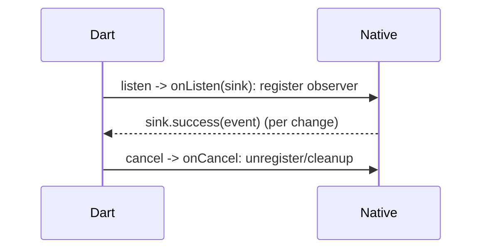

# `EventChannel`

> `EventChannel` streams **native→Dart** events over time: Dart `receiveBroadcastStream()` gives a `Stream`, and the native side pushes events via an event sink (`onListen`/`onCancel`) — the channel for continuous native data like sensor readings, battery/charging changes, connectivity, and location updates.

## Introduction

Where `MethodChannel` is one-shot request/reply, `EventChannel` is a **stream** of native events. This file covers the Dart side (`receiveBroadcastStream` → `Stream`, subscription lifecycle) and the native side (`StreamHandler` with `onListen`/`onCancel` + event sink), wrapped behind a repository.

## Why this concept exists

Many native sources emit *ongoing* data (accelerometer, GPS, battery state, connectivity, BLE). Polling via `MethodChannel` is wasteful/laggy; `EventChannel` lets native **push** events to a Dart `Stream`, with proper start/stop lifecycle tied to subscription.

## Real-world analogy

`EventChannel` is **subscribing to a live feed**: you tune in (`listen`), the broadcaster starts sending updates (`onListen` → sink events), and when you tune out (`cancel`), they stop (`onCancel`). Continuous, not one question.

## Problem Statement

Stream battery-level/charging changes from native to a Dart `Stream`, starting the native listener when subscribed and stopping it (and cleaning up native resources) when cancelled — behind a repository. You'll implement both sides + subscription lifecycle.

## Internal Working

```mermaid
flowchart LR
    Dart[receiveBroadcastStream().listen] --> OnListen[native onListen(sink)]
    OnListen --> Register[register native observer/receiver]
    Register --> Emit[sink.success(event) per change]
    Emit --> DartStream[Dart Stream emits]
    Cancel[subscription.cancel] --> OnCancel[native onCancel -> unregister/cleanup]
```

- **Dart side**:
  - `const events = EventChannel('app/battery/events');`
  - `Stream<dynamic> get stream => events.receiveBroadcastStream([optionalArgs]);`
  - `listen(onData, onError, onDone)`; **cancel** the subscription to stop (and to avoid leaks — [08 · dispose_and_leaks](../08%20Widget%20Lifecycle/dispose_and_leaks.md)). Errors arrive as `PlatformException` on the stream.
- **Native side** (a `StreamHandler`):
  - **`onListen(arguments, eventSink)`**: start emitting — register the native observer/receiver and call `eventSink.success(value)` on each event (`.error(...)` for failures). Runs when the first listener subscribes.
  - **`onCancel(arguments)`**: stop and **release native resources** (unregister receivers/observers) when the last listener cancels.
  - Emit on the **main thread** (marshal from background callbacks).
- **Broadcast**: `receiveBroadcastStream` supports multiple listeners; native `onListen`/`onCancel` fire on first-subscribe/last-cancel.
- **Repository**: expose a typed `Stream<BatteryState>` (map raw events → domain), and ensure consumers cancel subscriptions.

## Memory Representation

The native observer/receiver + the Dart subscription are live resources; not cancelling leaks both (and keeps native sensors running/battery drain) ([08 · dispose_and_leaks](../08%20Widget%20Lifecycle/dispose_and_leaks.md)).

## Compiler Behavior

Events are untyped (`dynamic`) — cast/map on the Dart side (Pigeon can type this).

## Runtime Behavior

First `listen` triggers native `onListen` (start); last `cancel` triggers `onCancel` (stop). Native pushes events asynchronously; errors surface as stream errors.

## Flutter Engine Behavior

Events cross the platform/UI runners; native emits on the main thread (marshal sensor callbacks) ([10 · threading_model](../10%20Flutter%20Architecture/threading_model.md)).

## Dart VM Behavior

Stream events dispatch on the root isolate's event loop; keep handlers light ([02 · streams](../02%20Advanced%20Dart/streams.md)).

## Examples

```dart
import 'package:flutter/services.dart';

// Repository exposing a typed Stream (native events mapped to domain)
enum ChargingStatus { charging, discharging, full, unknown }

class BatteryEventsRepository {
  static const _events = EventChannel('app/battery/events');

  Stream<ChargingStatus> chargingStatus() =>
      _events.receiveBroadcastStream().map((event) => switch (event as String) {
            'charging' => ChargingStatus.charging,
            'discharging' => ChargingStatus.discharging,
            'full' => ChargingStatus.full,
            _ => ChargingStatus.unknown,
          });
}
// Consumer: final sub = repo.chargingStatus().listen(...); ... sub.cancel(); // stop native
```

```kotlin
// Android (Kotlin) — StreamHandler starts/stops a BroadcastReceiver
class ChargingStreamHandler(private val context: Context) : EventChannel.StreamHandler {
  private var receiver: BroadcastReceiver? = null
  override fun onListen(args: Any?, events: EventChannel.EventSink) {
    receiver = object : BroadcastReceiver() {
      override fun onReceive(c: Context, i: Intent) {
        events.success(if (/* charging */ true) "charging" else "discharging") // emit
      }
    }
    context.registerReceiver(receiver, IntentFilter(Intent.ACTION_BATTERY_CHANGED))
  }
  override fun onCancel(args: Any?) {
    context.unregisterReceiver(receiver) // cleanup native resource
    receiver = null
  }
}
// EventChannel(messenger, "app/battery/events").setStreamHandler(ChargingStreamHandler(context))
```

```swift
// iOS (Swift) — FlutterStreamHandler with NotificationCenter observer
class ChargingStreamHandler: NSObject, FlutterStreamHandler {
  var sink: FlutterEventSink?
  func onListen(withArguments args: Any?, eventSink: @escaping FlutterEventSink) -> FlutterError? {
    sink = eventSink
    UIDevice.current.isBatteryMonitoringEnabled = true
    NotificationCenter.default.addObserver(self, selector: #selector(changed),
      name: UIDevice.batteryStateDidChangeNotification, object: nil)
    return nil
  }
  @objc func changed() { sink?( /* map state */ "charging") }
  func onCancel(withArguments args: Any?) -> FlutterError? {
    NotificationCenter.default.removeObserver(self); sink = nil; return nil // cleanup
  }
}
```

## Diagrams



## Common Mistakes

| Mistake | Why | Fix |
|---------|-----|-----|
| Not cancelling the subscription | Leaks + native sensor keeps running (battery) | `cancel()` in `dispose`; `onCancel` cleans native |
| No cleanup in `onCancel` | Native observer/receiver leaks | Unregister in `onCancel` |
| Emitting off the main thread | Crashes/threading issues | Marshal to main before `sink.success` |
| Using `MethodChannel` polling for streams | Wasteful/laggy | Use `EventChannel` |
| Untyped events unmapped | Runtime cast errors | Map events → domain in a repository |
| Heavy work in Dart `onData` | Jank | Keep handlers light; offload |

## Best Practices

- Use `EventChannel` for **continuous native events**; expose a typed `Stream` via a **repository** (map events → domain).
- **Cancel subscriptions** (in `dispose`) — this triggers native `onCancel` to **release resources** (stop sensors, unregister receivers) and prevent battery drain.
- On native, **start in `onListen`, stop/cleanup in `onCancel`**, and **emit on the main thread**.
- Handle stream **errors** (`PlatformException`); keep Dart handlers light.
- Consider `connectivity_plus`/`sensors_plus`/`battery_plus` plugins before hand-rolling ([Module 29](../29%20Device%20Features/README.md)).

## Performance

Push-based is efficient vs polling; native sensor/observer registration costs battery — stop on cancel/background ([08 · app_lifecycle](../08%20Widget%20Lifecycle/app_lifecycle.md)). Keep handlers light and events small ([Module 21](../21%20Performance/README.md)).

## Advantages / Disadvantages

- **+** Native→Dart streaming with start/stop lifecycle, efficient for continuous data, multiple listeners (broadcast).
- **−** Subscription/resource lifecycle to manage (leaks/battery), untyped events, threading care — Pigeon/plugins mitigate.

## Interview Questions

1. **🟢 What is `EventChannel` for?** — Streaming continuous native→Dart events (sensors, battery, connectivity) as a Dart `Stream`.
2. **🟢 How do you consume it in Dart?** — `channel.receiveBroadcastStream().listen(...)`, cancelling the subscription to stop.
3. **🟡 What do `onListen`/`onCancel` do natively?** — `onListen` starts emitting (register observer, use the event sink); `onCancel` stops and releases native resources.
4. **🟡 Why must you cancel subscriptions?** — To trigger `onCancel` (stop native sensors/receivers → save battery) and avoid leaks; not cancelling keeps native resources alive.
5. **🟡 How do errors surface?** — As `PlatformException` events on the stream (native `sink.error`).
6. **🔴 `EventChannel` vs `MethodChannel` for continuous data?** — `EventChannel` pushes events efficiently; `MethodChannel` polling is wasteful/laggy — use `EventChannel` for streams.
7. **🔴 What threading rule applies to emitting events?** — Emit on the platform main thread; marshal from background sensor callbacks before calling the sink.

## Senior Engineer Tips

- Treat the native `onListen`/`onCancel` pair as acquire/release — always unregister in `onCancel`; pair with Dart subscription cancel in `dispose`.
- Pause/stop streams on app background for battery ([08 · app_lifecycle](../08%20Widget%20Lifecycle/app_lifecycle.md)); resume on foreground.
- Prefer maintained `*_plus` plugins (battery/sensors/connectivity) over hand-rolled `EventChannel`s unless you need custom native behavior.

## Architect Perspective

`EventChannel` is the streaming native-integration primitive; behind a repository (typed `Stream`, lifecycle-managed) it powers reactive features (sensors/connectivity/location) cleanly. Its acquire/release lifecycle (`onListen`/`onCancel` ↔ subscribe/cancel) is a resource-management concern that, done right, avoids leaks and battery drain ([08 · dispose_and_leaks](../08%20Widget%20Lifecycle/dispose_and_leaks.md), [Module 29](../29%20Device%20Features/README.md)).

## Summary

- `EventChannel` streams native→Dart events: `receiveBroadcastStream` → `Stream`; native `onListen` (start/emit via sink) / `onCancel` (stop/cleanup).
- Cancel subscriptions (stops native, saves battery); emit on main thread; map events → domain in a repository.
- Use for continuous data; prefer `*_plus` plugins where available.

## Revision Notes

- Dart: `EventChannel.receiveBroadcastStream().listen(...)`; cancel to stop; errors = `PlatformException`.
- Native: `StreamHandler` — `onListen(sink)` start/emit, `onCancel` stop+unregister; emit on main thread.
- Cancel → native cleanup (leaks/battery); wrap in repository (typed Stream + domain mapping).
- Continuous data → `EventChannel` (not polling); prefer `*_plus` plugins.

## Practice Questions

1. What do `onListen`/`onCancel` correspond to, and why cancel subscriptions?
2. `EventChannel` vs `MethodChannel` for sensor data?
3. How do stream errors arrive on the Dart side?

## Coding Questions

1. Build a `BatteryEventsRepository` exposing a typed `Stream` over an `EventChannel`.
2. Write the native `StreamHandler` (register in `onListen`, unregister in `onCancel`).
3. Ensure the consumer cancels the subscription in `dispose` and pauses on background.

## Mini Project

**Charging-state stream (Flutter + native):** Implement an `EventChannel` streaming charging/battery changes, native `StreamHandler`s (Kotlin/Swift) that register in `onListen` and cleanup in `onCancel` (emit on main), and a `BatteryEventsRepository` exposing a typed `Stream<ChargingStatus>`; the consumer cancels on dispose and pauses on background. Acceptance: real-time events; native cleanup on cancel; no leaks/battery drain; repository-wrapped; runs on device.
