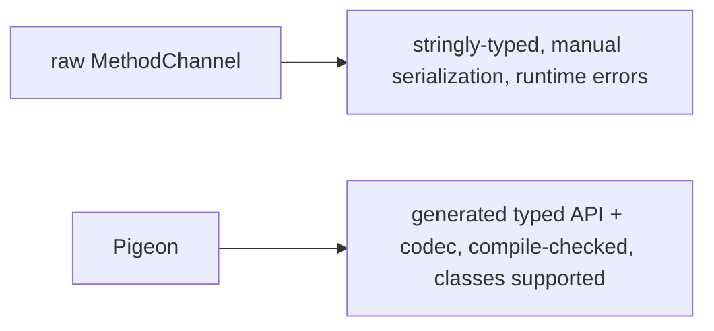

# Plugins & Pigeon (Type-Safe Channels)

> Package reusable native integration as a **plugin** (a federated package with platform implementations); use **Pigeon** to generate type-safe Dart↔native interfaces from a schema — eliminating stringly-typed `invokeMethod` and hand-written serialization/dispatch.

## Introduction

Ad-hoc channels don't scale or share. **Plugins** package native code + Dart API for reuse (and publishing); the **federated plugin** model splits per-platform implementations. **Pigeon** generates typed message code (Dart + Kotlin/Swift) from a Dart schema, replacing manual channels with compile-checked interfaces. This file covers both.

## Why this concept exists

Raw `MethodChannel` is untyped, error-prone (name/type mismatches), and not reusable. Plugins make native integration a shareable package; Pigeon makes the Dart↔native contract **type-safe and generated** — fewer bugs, less boilerplate, and refactor-safety across the boundary.

## Real-world analogy

A plugin is a **sealed appliance** you install and use via its interface (not its wiring). Pigeon is having an **engineer auto-generate matching plugs/sockets on both ends from a spec** — guaranteed to fit — instead of soldering wires by hand and hoping the pins line up.

## Problem Statement

You have growing native calls (battery, share, device info) that are untyped and duplicated. Package them as a plugin and generate a type-safe interface with Pigeon so Dart and native share a checked contract. You'll structure the plugin + define a Pigeon schema.

## Internal Working

```mermaid
flowchart TD
    subgraph Plugin (federated)
      API[plugin platform interface (Dart)] --> AndroidImpl[Android impl]
      API --> iOSImpl[iOS impl]
      API --> Others[web/desktop impls]
    end
    Pigeon[Pigeon schema (Dart @HostApi/@FlutterApi)] -->|codegen| Gen[typed Dart + Kotlin/Swift]
    Gen --> Typed[compile-checked calls both sides]
```

- **Plugin structure**: `flutter create --template=plugin`; a plugin exposes a Dart API and native implementations. **Federated plugins** split into: `*_platform_interface` (abstract API), platform packages (`*_android`, `*_ios`, `*_web`, …), and an app-facing package — so platforms evolve independently and third parties can add support.
- **Registration**: plugins register native handlers automatically (via `GeneratedPluginRegistrant`); the Dart API wraps the channels.
- **Pigeon**: define the contract in a Dart file with typed classes + `@HostApi()` (Dart→native) / `@FlutterApi()` (native→Dart) interfaces; run `pigeon` to **generate** the Dart API + native (Kotlin/Swift) protocol + codec. You implement the native protocol; Dart calls typed methods — **no `invokeMethod` strings, no manual serialization**.
- **Benefits**: compile-time type checks on both sides, generated (de)serialization, refactor-safe, less boilerplate; supports typed classes (which raw channels can't).
- **When**: use a **plugin** for reusable/publishable native features; use **Pigeon** for any non-trivial typed Dart↔native API; raw channels only for quick one-offs.

## Memory Representation

Pigeon generates efficient typed codecs; plugins are ordinary packages. Same message-passing model underneath ([platform_channel_fundamentals.md](platform_channel_fundamentals.md)).

## Compiler Behavior

Pigeon's generated Dart/native code is **compile-checked** — mismatched signatures/types fail at build, not runtime (unlike raw channels). Requires a codegen step (`dart run pigeon ...`).

## Runtime Behavior

Typed calls serialize via the generated codec and dispatch to the implemented native methods; errors are typed/structured. Plugins auto-register their handlers.

## Flutter Engine Behavior

Same platform/UI runner model; native implementations run on the platform side ([10 · threading_model](../10%20Flutter%20Architecture/threading_model.md)).

## Dart VM Behavior

Not applicable.

## Examples

```dart
// pigeons/messages.dart — the SCHEMA (run: dart run pigeon --input pigeons/messages.dart ...)
import 'package:pigeon/pigeon.dart';

class DeviceInfo {            // typed class crosses the boundary (raw channels can't)
  late String model;
  late int sdkVersion;
  late double batteryLevel;
}

@HostApi()                    // Dart -> native
abstract class DeviceApi {
  DeviceInfo getInfo();       // typed, compile-checked (no invokeMethod strings)
  void share(String text);
}

@FlutterApi()                 // native -> Dart (callbacks/events)
abstract class DeviceEvents {
  void onBatteryChanged(double level);
}
```

```dart
// App side — use the GENERATED typed API (no channels/casts):
// final api = DeviceApi();                  // generated
// final info = await api.getInfo();          // typed DeviceInfo, checked
// print('${info.model} ${info.batteryLevel}');
```

```kotlin
// Android — implement the GENERATED DeviceApi interface (Kotlin), register it.
// class DeviceApiImpl : DeviceApi { override fun getInfo(): DeviceInfo { ... } }
// DeviceApi.setUp(binaryMessenger, DeviceApiImpl())
```

```text
Plugin scaffolding:
  flutter create --template=plugin --platforms=android,ios,web my_device_plugin
Pigeon codegen (Dart + Kotlin + Swift):
  dart run pigeon --input pigeons/messages.dart \
    --dart_out lib/messages.g.dart \
    --kotlin_out android/.../Messages.g.kt \
    --swift_out ios/.../Messages.g.swift
```

## Diagrams



## Common Mistakes

| Mistake | Why | Fix |
|---------|-----|-----|
| Stringly-typed channels for a big API | Runtime errors, boilerplate | Use Pigeon (typed, generated) |
| Not federating a reusable plugin | Hard to extend per platform | Federated structure (`*_platform_interface` + impls) |
| Forgetting to run pigeon codegen | Stale generated code | Regenerate on schema change (CI) |
| Custom objects over raw channels | Codec can't send classes | Pigeon supports typed classes |
| Duplicating native code across apps | Not reusable | Package as a plugin |
| App depending on generated API directly everywhere | Coupling | Still wrap behind a repository/domain API |

## Best Practices

- Package **reusable/publishable** native features as **plugins**; use the **federated** structure for multi-platform maintainability.
- Use **Pigeon** for any non-trivial typed Dart↔native API — get compile-time safety, generated serialization, and support for typed classes; **automate codegen** (CI/pre-commit).
- Keep raw `MethodChannel`/`EventChannel` for quick one-offs; graduate to Pigeon/plugins as the surface grows.
- Still **wrap the generated/plugin API behind a repository/domain layer** so the app depends on domain types.
- Handle platform-not-supported gracefully (federated impls or fallbacks).

## Performance

Pigeon's generated codec is efficient; plugins add no overhead beyond the channel model. Type-safety prevents costly runtime bugs. Same threading/serialization considerations apply ([platform_channel_fundamentals.md](platform_channel_fundamentals.md)).

## Advantages / Disadvantages

- **+ Plugins:** reusable/publishable, per-platform (federated), auto-registered. **+ Pigeon:** type-safe, generated, class support, refactor-safe, less boilerplate.
- **−** Codegen/build step + more structure; overkill for a single tiny call; still need repository wrapping.

## Interview Questions

1. **🟢 What is a Flutter plugin?** — A package bundling a Dart API + native implementations, providing reusable native integration.
2. **🟢 What does Pigeon do?** — Generates type-safe Dart↔native interfaces + codecs from a Dart schema, replacing stringly-typed `invokeMethod` and manual serialization.
3. **🟡 What is a federated plugin?** — A plugin split into a platform-interface package + per-platform implementation packages (+ app-facing), so platforms evolve independently and third parties can add support.
4. **🟡 `@HostApi` vs `@FlutterApi` in Pigeon?** — `@HostApi`: Dart calls native; `@FlutterApi`: native calls Dart (callbacks/events).
5. **🟡 Why is Pigeon safer than raw channels?** — Signatures/types are compile-checked on both sides (build errors, not runtime) and it supports typed classes the standard codec can't.
6. **🔴 When use raw channels vs Pigeon vs a plugin?** — Raw channels for quick one-offs; Pigeon for non-trivial typed APIs; plugins for reusable/publishable native features (often plugin + Pigeon together).
7. **🔴 Do you still wrap a plugin/Pigeon API in a repository?** — Yes — to depend on domain types and keep the plugin swappable/testable.

## Senior Engineer Tips

- For any native API beyond a call or two, reach for **Pigeon** immediately — it removes the entire class of channel name/type bugs.
- Structure shared native features as **federated plugins**; automate pigeon codegen in CI so generated code never drifts.
- Even with generated APIs, wrap them behind a repository so the app depends on your domain, not the plugin.

## Architect Perspective

Plugins + Pigeon turn native integration into a typed, reusable, maintainable layer — critical as native surface grows or when publishing packages. Federation supports multi-platform ownership; Pigeon's type-safety mirrors the codegen-over-reflection theme ([02 · dart_compilation](../02%20Advanced%20Dart/dart_compilation.md)). Behind repositories, it keeps the app portable and testable ([Modules 27](../27%20Native%20Android/README.md)/[28](../28%20Native%20iOS/README.md)).

## Summary

- Plugins package reusable native integration (federated for multi-platform); Pigeon generates type-safe Dart↔native APIs (+ codecs, class support).
- Use Pigeon for non-trivial typed APIs, plugins for reuse/publishing; automate codegen.
- Still wrap behind repositories; raw channels only for quick one-offs.

## Revision Notes

- Plugin: Dart API + native impls; **federated** = platform-interface + per-platform packages; auto-registered.
- Pigeon: Dart schema (`@HostApi` Dart→native, `@FlutterApi` native→Dart, typed classes) → generated Dart+Kotlin+Swift + codec (compile-checked); automate codegen.
- Use Pigeon (non-trivial typed) / plugin (reusable) / raw channels (one-offs); wrap behind repository.

## Practice Questions

1. Why is Pigeon safer/less error-prone than raw `MethodChannel`?
2. What is a federated plugin and why use it?
3. When would you still use a raw channel?

## Coding Questions

1. Write a Pigeon schema (`@HostApi` + a typed class) and note the codegen command.
2. Scaffold a federated plugin structure (packages) for a native feature.
3. Wrap the generated Pigeon API behind a domain repository.

## Mini Project

**Type-safe device plugin (Flutter + native):** Define a Pigeon schema (`DeviceApi.getInfo()`/`share()` + a `DeviceInfo` class, `@FlutterApi` battery callback), generate Dart+Kotlin+Swift, implement the native side, and wrap the generated API in a `DeviceRepository` (domain types). Package it as a plugin. Acceptance: compile-checked typed calls (no `invokeMethod`); typed class crosses the boundary; repository-wrapped; codegen automated; runs on device.
