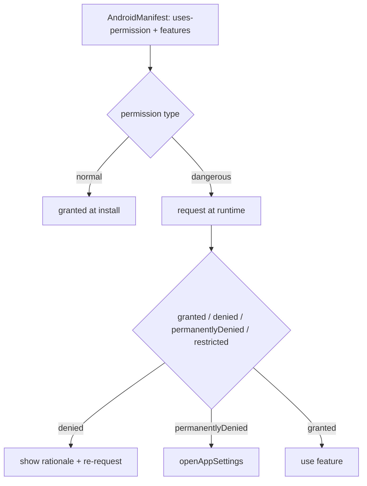
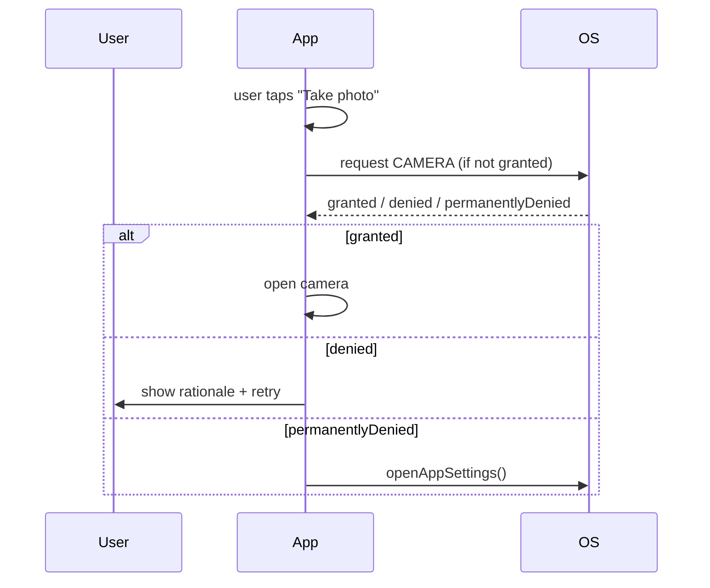

# Permissions & the Manifest

> Android permissions have two parts: **declare** them in `AndroidManifest.xml`, and (for dangerous permissions) **request them at runtime** — plus handle denial/"don't ask again" gracefully; use `permission_handler` to request/check from Dart, and keep the manifest minimal.

## Introduction

`AndroidManifest.xml` declares the app (package, activities, intent filters, permissions); dangerous permissions (camera, location, storage, contacts) also require a **runtime request** since Android 6 (API 23). This file covers manifest structure, permission types, the runtime-permission flow (via `permission_handler`), and best practices.

## Why this concept exists

Users must consent to sensitive capabilities. Android splits permissions into **normal** (granted at install by declaration) and **dangerous** (granted at runtime by the user). Apps must declare, request at the right time, handle denial/rationale, and degrade gracefully — a correctness and Play-policy requirement.

## Real-world analogy

The manifest is your **building permit application** listing what you intend to do; runtime permissions are **asking the resident for the key** each time you need to enter a private room (camera/location). They can say no, or "stop asking" — and you must still function without that room.

## Problem Statement

Add camera + location to your app: declare them, request at runtime when the feature is used, handle granted/denied/permanently-denied, and open app settings if needed. You'll edit the manifest and use `permission_handler` behind a repository.

## Internal Working



- **Manifest** (`android/app/src/main/AndroidManifest.xml`): declare `<uses-permission android:name="android.permission.CAMERA"/>`, `ACCESS_FINE_LOCATION`, etc.; optionally `<uses-feature>` (e.g., camera) — and `<application>`/`<activity>` config, intent filters (deep links — [13 · deep_linking](../13%20Routing/02_deep_linking_and_url_strategy.md)).
- **Permission types**: **normal** (INTERNET, network state) granted at install by declaration; **dangerous** (camera, location, mic, contacts, storage) require **runtime** consent; **special** (e.g., overlay, all-files-access) need settings-based grants.
- **Runtime flow** (via `permission_handler`): `Permission.camera.status` → if not granted, `.request()`; handle **`granted`/`denied`/`permanentlyDenied`/`restricted`**; show a **rationale** on denial; `openAppSettings()` when permanently denied.
- **Timing**: request **in context**, when the user triggers the feature (not all upfront) — better grant rates + Play guidance.
- **Scoped storage / newer APIs**: media/storage permissions changed (Android 13+ granular media perms; scoped storage) — declare the right ones per `targetSdk`.
- **Wrap in a repository/service**: expose `ensureCameraPermission()` returning a result; keep permission logic centralized and testable.

## Memory Representation

Not applicable; permission state is OS-managed. `permission_handler` queries/requests via platform APIs.

## Compiler Behavior

Manifest merged at build (library manifests merge in); missing declarations cause SecurityException at runtime, not compile time.

## Runtime Behavior

`.request()` shows the OS dialog (dangerous perms); denial/"don't ask again" changes status to `denied`/`permanentlyDenied`. Using a capability without permission throws `SecurityException` — always check/request first.

## Flutter Engine Behavior

Permission dialogs/results go through the Activity (needs `ActivityAware` in plugins — [02_kotlin_plugin_code.md](02_kotlin_plugin_code.md)); `permission_handler` manages this.

## Dart VM Behavior

Not applicable.

## Examples

```xml
<!-- android/app/src/main/AndroidManifest.xml -->
<manifest ...>
  <uses-permission android:name="android.permission.INTERNET"/>       <!-- normal -->
  <uses-permission android:name="android.permission.CAMERA"/>         <!-- dangerous -->
  <uses-permission android:name="android.permission.ACCESS_FINE_LOCATION"/>
  <uses-feature android:name="android.hardware.camera" android:required="false"/>
  <application ...>
    <activity android:name=".MainActivity" ...> ... </activity>
  </application>
</manifest>
```

```dart
import 'package:permission_handler/permission_handler.dart';

// Repository centralizing permission logic (request in context, handle all states)
class PermissionService {
  Future<bool> ensureCamera() async {
    var status = await Permission.camera.status;
    if (status.isGranted) return true;
    if (status.isPermanentlyDenied) {
      await openAppSettings();          // user must enable in settings
      return false;
    }
    status = await Permission.camera.request(); // shows OS dialog
    // (show a rationale before requesting again on plain denial)
    return status.isGranted;
  }
}
// Usage: if (await permissions.ensureCamera()) { openCamera(); } else { showWhyWeNeedIt(); }
```

## Diagrams



## Common Mistakes

| Mistake | Why | Fix |
|---------|-----|-----|
| Using a capability without runtime request | `SecurityException` crash | Check + request dangerous perms first |
| Declaring but not requesting (dangerous) | Install-grant only covers normal | Request at runtime |
| Requesting all permissions upfront | Low grant rates, Play issues | Request in context, when needed |
| Not handling `permanentlyDenied` | User stuck | `openAppSettings()` + explain |
| Over-declaring permissions | Privacy/Play scrutiny, user distrust | Declare only what you use |
| Wrong storage/media perms for targetSdk | Broken media access | Use granular media perms (Android 13+)/scoped storage |

## Best Practices

- **Declare only needed** permissions in the manifest; use `<uses-feature required="false">` where optional.
- **Request dangerous permissions at runtime, in context** (on feature use), via `permission_handler`; handle **all states** (granted/denied/permanentlyDenied/restricted).
- Show a **rationale** on denial; route to **`openAppSettings()`** when permanently denied; **degrade gracefully** without the permission.
- Use the correct **media/storage** permissions for your `targetSdk` (Android 13+ granular; scoped storage).
- **Centralize** permission logic in a repository/service (testable, consistent); mirror on iOS (Info.plist usage strings — [Module 28](../28%20Native%20iOS/README.md)).

## Performance

Negligible; permission checks/requests are occasional. Requesting in context improves grant rates (a UX/business metric more than perf).

## Advantages / Disadvantages

- **+** User consent/privacy, Play compliance, capability access with graceful degradation.
- **−** Multi-state flow + settings handling, changing storage/media rules per SDK, must degrade without permission.

## Interview Questions

1. **🟢 What are the two parts of Android permissions?** — Declare in `AndroidManifest.xml` and (for dangerous permissions) request at runtime with user consent.
2. **🟢 Normal vs dangerous permissions?** — Normal (e.g., INTERNET) are granted at install by declaration; dangerous (camera/location/mic/contacts/storage) require a runtime request.
3. **🟡 How do you request permissions from Dart?** — Via `permission_handler`: check `Permission.x.status`, `.request()`, and handle `granted/denied/permanentlyDenied/restricted`.
4. **🟡 What do you do on `permanentlyDenied`?** — Explain and call `openAppSettings()`; you can't re-prompt directly.
5. **🟡 When should you request a permission?** — In context, when the user triggers the feature — not all upfront (better grant rates + Play guidance).
6. **🔴 What changed for storage/media permissions recently?** — Android 13+ introduced granular media permissions and scoped storage; declare the right ones per `targetSdk`.
7. **🔴 What happens if you use a dangerous capability without permission?** — A `SecurityException` at runtime — always check/request first and degrade gracefully.

## Senior Engineer Tips

- Centralize permission flows in a `PermissionService` returning clear results; screens call `ensureX()` and handle true/false — consistent UX and testable.
- Request in context with a pre-prompt rationale; handle "don't ask again" by guiding to settings — and always have a no-permission fallback.
- Keep the manifest minimal; over-declaring hurts trust and Play review; align media/storage perms with `targetSdk`.

## Architect Perspective

Permissions are a privacy, UX, and compliance concern. A centralized, in-context, all-states-handled permission strategy (declare minimal, request when needed, degrade gracefully, settings fallback) — mirrored across Android/iOS — is essential for real apps and store approval, and integrates with device features and background work ([Module 29](../29%20Device%20Features/README.md), [Module 33](../33%20Background%20Services/README.md)).

## Summary

- Declare permissions in the manifest; request **dangerous** ones at runtime (in context) via `permission_handler`; handle all states + settings fallback.
- Declare only what you use; use correct media/storage perms per `targetSdk`; degrade gracefully.
- Centralize in a service; mirror iOS usage strings.

## Revision Notes

- Manifest: `<uses-permission>`/`<uses-feature>`; normal (install) vs dangerous (runtime) vs special (settings).
- `permission_handler`: `status`/`request()`; handle granted/denied/permanentlyDenied(→`openAppSettings`)/restricted; show rationale.
- Request in context; declare minimal; Android 13+ granular media/scoped storage per targetSdk.
- Centralize in `PermissionService`; degrade gracefully; mirror iOS Info.plist.

## Practice Questions

1. Which permissions need a runtime request, and how do you handle denial?
2. What do you do when a permission is permanently denied?
3. Why request permissions in context rather than upfront?

## Coding Questions

1. Declare camera + location in the manifest and request camera at runtime via `permission_handler`.
2. Handle `permanentlyDenied` by opening app settings.
3. Build a `PermissionService.ensureCamera()` with rationale + fallback.

## Mini Project

**Permission-gated camera (Flutter + Android):** Declare camera/location in the manifest, build a `PermissionService` that requests camera in-context, handles granted/denied/permanentlyDenied (rationale + `openAppSettings`), and gates a camera feature with graceful fallback. Acceptance: minimal declarations; runtime request in context; all states handled; degrades without permission; centralized/testable; runs on device.
