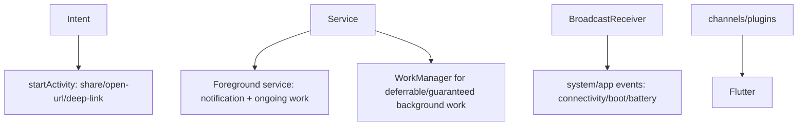

# Android Integration (Services, Intents, Broadcast Receivers)

> Deep Android integration means using native OS constructs: **Intents** (launch activities/share/deep links), **Services** (background work, incl. foreground services with notifications), and **BroadcastReceivers** (react to system/app events) — surfaced to Flutter via channels/plugins, respecting modern background-execution limits.

## Introduction

Beyond reading values, apps integrate with Android's app model: starting other apps/activities (Intents), running background work (Services/WorkManager), and reacting to system events (BroadcastReceivers). This file surveys these, how they reach Flutter, and the strict modern background limits.

## Why this concept exists

Android features (share, open URLs, foreground services for ongoing tasks, reacting to connectivity/boot/battery events) live in the native app model. Flutter integrates via native Kotlin bridged with channels/plugins. Modern Android heavily restricts background work, so integration must respect those rules.

## Real-world analogy

Intents are **sending a courier with a labeled parcel** ("open this URL", "share this text") to whichever app handles it. Services are **hiring staff to keep working** after you leave the office (with a visible badge for foreground services). BroadcastReceivers are **subscribing to building-wide announcements** (power, network) and reacting.

## Problem Statement

Your app must open a URL/share text (Intent), run an ongoing location task (foreground service with a notification), and react to connectivity changes (receiver). You'll use Intents, a foreground service, and a receiver — bridged to Flutter and within background limits.

## Internal Working



- **Intents**: launch activities/apps: `startActivity(Intent(ACTION_VIEW, uri))` (open URL), `ACTION_SEND` (share), or explicit intents to your activities. Incoming intents (deep links) route to Flutter ([13 · deep_linking](../13%20Routing/deep_linking_and_url_strategy.md)). Often handled by plugins (`url_launcher`, `share_plus`).
- **Services**:
  - **Foreground service**: for user-visible ongoing work (music, navigation) — **requires a persistent notification** and (Android 14+) a **service type** + permission; won't be killed like background work.
  - **Background limits**: since Android 8+ background execution is heavily restricted — use **WorkManager** for deferrable/guaranteed background tasks, not raw background services ([Module 33](../33%20Background%20Services/README.md)).
- **BroadcastReceivers**: register (statically in manifest — limited since Android 8 — or dynamically at runtime) to react to system/app events (connectivity, boot, battery, custom). Stream events to Flutter via `EventChannel` ([26 · event_channel](../26%20Platform%20Channels/event_channel.md)); many are covered by plugins (`connectivity_plus`).
- **Bridging to Flutter**: expose these via `MethodChannel` (fire an intent), `EventChannel` (stream receiver events), or plugins; background isolates need setup ([02 · isolates](../02%20Advanced%20Dart/isolates.md)).
- **Prefer plugins**: `url_launcher`/`share_plus`/`connectivity_plus`/`workmanager`/`flutter_local_notifications` cover most cases — hand-roll only for custom native behavior.

## Memory Representation

Services/receivers hold native resources — stop services and unregister receivers when done to avoid leaks/battery drain ([08 · dispose_and_leaks](../08%20Widget%20Lifecycle/dispose_and_leaks.md) analog; [26 · event_channel](../26%20Platform%20Channels/event_channel.md)).

## Compiler Behavior

Manifest declarations (services/receivers/permissions) merged at build; missing declarations/permissions fail at runtime.

## Runtime Behavior

Intents launch async; foreground services run with a notification (killed if misconfigured on modern Android); receivers fire on events; background limits may defer/deny raw background work (use WorkManager).

## Flutter Engine Behavior

Background work may run in a **background Flutter isolate** (e.g., WorkManager/headless) needing engine/messenger setup; intents/receivers bridge via the embedder ([10 · embedder_and_startup](../10%20Flutter%20Architecture/embedder_and_startup.md)).

## Dart VM Behavior

Background isolates for background tasks need `RootIsolateToken`/background messenger to use channels ([02 · isolates](../02%20Advanced%20Dart/isolates.md)).

## Examples

```dart
// Prefer plugins for common integrations:
import 'package:url_launcher/url_launcher.dart';   // open URL / dial / email (Intents)
import 'package:share_plus/share_plus.dart';        // share sheet (ACTION_SEND)
import 'package:connectivity_plus/connectivity_plus.dart'; // connectivity (receiver)

Future<void> openAndShare(String url) async {
  await launchUrl(Uri.parse(url));                   // ACTION_VIEW intent
  await Share.share('Check this out: $url');          // share intent
}

Stream<List<ConnectivityResult>> connectivity() =>
    Connectivity().onConnectivityChanged;             // wraps a BroadcastReceiver
```

```kotlin
// Custom Intent from a MethodChannel (when no plugin fits):
"openSettings" -> {
  startActivity(Intent(Settings.ACTION_APPLICATION_DETAILS_SETTINGS)
    .setData(Uri.fromParts("package", packageName, null)))
  result.success(null)
}

// Foreground service (sketch): must post a notification + declare in manifest + type/permission
// class TrackingService : Service() {
//   override fun onStartCommand(i: Intent?, f: Int, id: Int): Int {
//     startForeground(NOTIF_ID, buildNotification()) // required
//     // do ongoing work; stopSelf() when done
//     return START_STICKY
//   }
// }
```

```xml
<!-- Manifest declarations for a foreground service (Android 14+ needs a type) -->
<uses-permission android:name="android.permission.FOREGROUND_SERVICE"/>
<uses-permission android:name="android.permission.FOREGROUND_SERVICE_LOCATION"/>
<service android:name=".TrackingService" android:foregroundServiceType="location"/>
```

## Diagrams

```mermaid
flowchart LR
    Need{integration}
    Need -->|launch/share/open URL| Intent[Intent (url_launcher/share_plus)]
    Need -->|ongoing visible task| FG[Foreground service + notification]
    Need -->|deferrable background| WM[WorkManager (Module 33)]
    Need -->|react to system events| Recv[BroadcastReceiver / connectivity_plus]
```

## Common Mistakes

| Mistake | Why | Fix |
|---------|-----|-----|
| Raw background service for ongoing bg work | Killed by background limits (Android 8+) | Foreground service (visible) or WorkManager |
| Foreground service without notification/type | Crash/kill on modern Android | Post notification + declare type/permission |
| Static receivers for restricted implicit broadcasts | Ignored since Android 8 | Register dynamically / use JobScheduler/WorkManager |
| Not stopping services / unregistering receivers | Leaks/battery drain | `stopSelf`/unregister when done |
| Hand-rolling instead of plugins | Reinvent + bugs | Use `url_launcher`/`share_plus`/`connectivity_plus`/`workmanager` |
| Channels from bg isolate without setup | Not wired | `RootIsolateToken` + background messenger |

## Best Practices

- **Prefer maintained plugins** (`url_launcher`, `share_plus`, `connectivity_plus`, `workmanager`, `flutter_local_notifications`); hand-roll native only for custom behavior.
- For **ongoing user-visible work** use a **foreground service** (notification + service type/permission on Android 14+); for **deferrable/guaranteed** background use **WorkManager** — never rely on raw background services ([Module 33](../33%20Background%20Services/README.md)).
- Register **receivers** appropriately (dynamic for most; respect Android 8+ implicit-broadcast limits); stream to Flutter via `EventChannel`; **unregister/stop** when done.
- **Bridge via channels/plugins**; set up background-isolate messengers where needed.
- Declare services/receivers/permissions in the **manifest**; respect modern background/battery restrictions.

## Performance / Battery

Background limits exist to protect battery — foreground services and WorkManager are the sanctioned paths; unstopped services/receivers drain battery. Pause/stop work when not needed ([08 · app_lifecycle](../08%20Widget%20Lifecycle/app_lifecycle.md)).

## Advantages / Disadvantages

- **+** Full Android integration (launch/share/deep links, ongoing tasks, event reactions), mostly via plugins.
- **−** Strict background limits + service-type/notification requirements, manifest/permission setup, background-isolate complexity, per-Android-version changes.

## Interview Questions

1. **🟢 What are Intents/Services/BroadcastReceivers?** — Intents launch activities/apps (share/open URL/deep links); Services run background/ongoing work; BroadcastReceivers react to system/app events.
2. **🟢 How do you open a URL or share from Flutter?** — Via plugins (`url_launcher`, `share_plus`) that fire Android Intents.
3. **🟡 Foreground service vs WorkManager?** — Foreground service for ongoing user-visible work (needs a notification + type); WorkManager for deferrable/guaranteed background tasks under background limits.
4. **🟡 Why can't you rely on raw background services?** — Android 8+ restricts background execution; use foreground services or WorkManager.
5. **🟡 How do receiver events reach Flutter?** — Stream them via an `EventChannel` (or use a plugin like `connectivity_plus`).
6. **🔴 What's required for a foreground service on modern Android?** — A persistent notification, plus (Android 14+) a declared `foregroundServiceType` and matching permission.
7. **🔴 How do background tasks use channels/isolates?** — They run in a background Flutter isolate needing `RootIsolateToken`/background messenger to access channels.

## Senior Engineer Tips

- Default to plugins for integration; drop to custom Kotlin only for behavior no plugin provides.
- Choose the sanctioned background path (foreground service for visible/ongoing, WorkManager for deferrable) — raw background services will be killed and drain battery.
- Always stop services/unregister receivers; leaked native resources hurt battery and stability.

## Architect Perspective

Android integration (intents/services/receivers) connects the Flutter app to the OS app model within strict modern constraints. Using plugins + the correct background mechanism (foreground service/WorkManager) behind repositories keeps the app compliant, battery-friendly, and portable — and ties into background services, notifications, and device features ([Modules 33, 32, 29](../33%20Background%20Services/README.md)).

## Summary

- Integrate via Intents (launch/share/deep links), Services (foreground for ongoing; WorkManager for deferrable background), and BroadcastReceivers (event reactions) — mostly through plugins.
- Respect background limits (Android 8+): foreground services need notifications/types; use WorkManager, not raw background services.
- Declare in manifest, stop/unregister resources, bridge via channels/plugins (+ bg-isolate setup).

## Revision Notes

- Intents (url_launcher/share_plus/deep links), Services (foreground = notification + type/perm; deferrable = WorkManager), Receivers (dynamic; connectivity_plus) → bridge via channels/plugins.
- Android 8+ background limits: no raw background services; Android 14+ foreground service types.
- Stop services/unregister receivers (battery/leaks); bg isolate needs token/messenger.
- Prefer plugins; declare in manifest; respect battery/lifecycle.

## Practice Questions

1. When use a foreground service vs WorkManager?
2. Why do raw background services fail on modern Android?
3. How do BroadcastReceiver events reach Flutter?

## Coding Questions

1. Open a URL and share text using plugins (Intents).
2. Sketch a foreground service (notification + manifest type) for ongoing work.
3. Stream connectivity changes to Flutter (plugin or `EventChannel`).

## Mini Project — Module capstone

**Android integration slice (Flutter + Android):** Combine the module — open-URL/share via `url_launcher`/`share_plus` (Intents), a permission-gated camera (runtime permission), a native view embed (platform view), and connectivity reactions (`connectivity_plus`/`EventChannel`), plus a foreground-service sketch for ongoing work — all bridged to Flutter behind repositories, within background limits. Acceptance: intents/share work; permissions handled; native view embedded; connectivity streamed; foreground service correctly declared; resources stopped/unregistered; runs on device.
