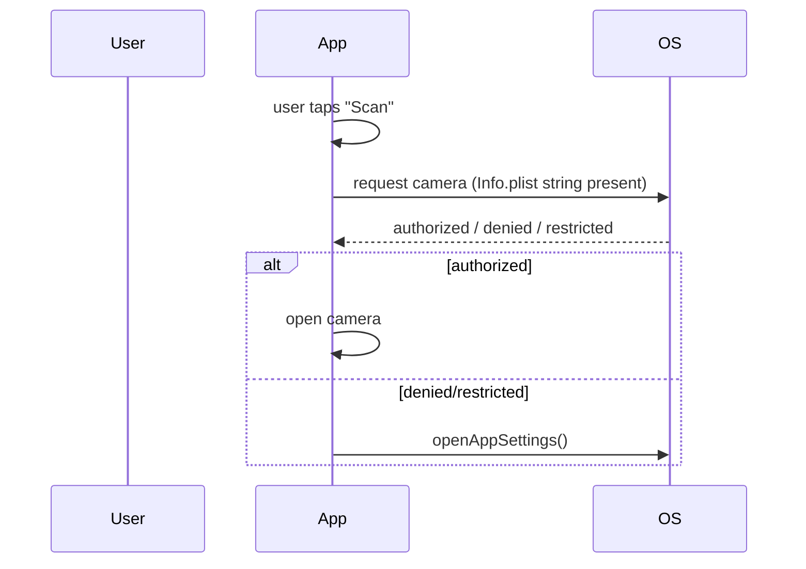

# `Info.plist` & Permissions (Usage Strings)

> iOS requires a **usage-description string in `Info.plist`** for every sensitive capability (camera, location, mic, photos, contacts) — missing one crashes the app when requested; then the OS shows a **one-time runtime prompt**, and you handle authorized/denied/restricted (with a settings fallback), typically via `permission_handler`.

## Introduction

`Info.plist` is the iOS app's configuration file (bundle id, display name, capabilities, and **privacy usage strings**). iOS shows a system permission prompt on first use of a sensitive API — but **only if you've declared a usage string**; otherwise it crashes. This file covers usage strings, the permission flow, and best practices — the iOS mirror of Android's manifest/permissions ([27 · permissions_and_manifest](../27%20Native%20Android/04_permissions_and_manifest.md)).

## Why this concept exists

Apple mandates transparency: apps must state *why* they need sensitive data (the usage string is shown in the prompt). This protects users and is an App Store requirement — missing/vague strings cause crashes or rejection.

## Real-world analogy

The usage string is your **written justification on the access-request form** ("we need the camera to scan receipts"). Without the form, security **refuses you at the door immediately** (crash); with it, they **ask the resident once** (system prompt), who can allow, deny, or say "settings only."

## Problem Statement

Add camera + location to iOS: declare usage strings in `Info.plist`, request at runtime when the feature is used, handle authorized/denied/restricted, and open Settings when denied — via `permission_handler` behind a repository. You'll edit `Info.plist` + handle the flow.

## Internal Working

```mermaid
flowchart TD
    Plist[Info.plist usage string declared?] -->|no| Crash[crash on first request]
    Plist -->|yes| Prompt[OS shows one-time prompt (with your string)]
    Prompt --> Status{authorized / denied / restricted / notDetermined}
    Status -->|denied| Settings[guide to Settings (openAppSettings)]
    Status -->|authorized| Use[use feature]
```

- **`Info.plist` usage strings**: add a key + human-readable reason per capability, e.g.:
  - `NSCameraUsageDescription` — camera
  - `NSLocationWhenInUseUsageDescription` / `NSLocationAlwaysAndWhenInUseUsageDescription` — location
  - `NSMicrophoneUsageDescription`, `NSPhotoLibraryUsageDescription`, `NSContactsUsageDescription`, etc.
  - **Missing string → immediate crash** when the API is first used.
- **Runtime flow**: iOS prompts **once** on first request; after that the status is fixed until the user changes it in **Settings**. States: `authorized`/`denied`/`restricted`/`notDetermined` (+ iOS 14+ `provisional`/`limited` for some). Via `permission_handler`: check `status`, `.request()`, and on denial guide the user to **`openAppSettings()`** (you can't re-prompt).
- **Timing**: request **in context** (when the feature is used) with a **pre-prompt rationale** — better acceptance and Apple guidance.
- **Background/always location**: requires additional keys/justification and is scrutinized in review.
- **App Tracking Transparency (ATT)**: tracking/IDFA needs `NSUserTrackingUsageDescription` + the ATT prompt.
- **Wrap in a repository/service**: expose `ensureCamera()` returning a result; centralize + mirror Android.

## Memory Representation

Not applicable; permission state is OS-managed. `permission_handler` queries/requests via iOS APIs.

## Compiler Behavior

`Info.plist` is bundled at build; missing usage strings aren't compile errors — they crash at runtime on first request.

## Runtime Behavior

First `.request()` shows the OS prompt (with your string); subsequent requests return the fixed status (no re-prompt) until changed in Settings. Using a capability without a declared string → crash.

## Flutter Engine Behavior

Permission prompts/results go through iOS via the `FlutterViewController`/plugins ([02_swift_plugin_code.md](02_swift_plugin_code.md)); `permission_handler` manages this.

## Dart VM Behavior

Not applicable.

## Examples

```xml
<!-- ios/Runner/Info.plist — usage strings (REQUIRED per capability) -->
<key>NSCameraUsageDescription</key>
<string>We use the camera to scan receipts.</string>
<key>NSLocationWhenInUseUsageDescription</key>
<string>We use your location to show nearby stores.</string>
<key>NSPhotoLibraryUsageDescription</key>
<string>We access photos so you can attach images.</string>
```

```dart
import 'package:permission_handler/permission_handler.dart';

// Repository centralizing permission logic (same API as Android — mirror)
class PermissionService {
  Future<bool> ensureCamera() async {
    var status = await Permission.camera.status;
    if (status.isGranted) return true;
    if (status.isPermanentlyDenied || status.isRestricted) {
      await openAppSettings();          // iOS: user must enable in Settings
      return false;
    }
    status = await Permission.camera.request(); // shows the one-time OS prompt
    return status.isGranted;
  }
}
// Usage: if (await permissions.ensureCamera()) openCamera(); else showRationale();
```

## Diagrams



## Common Mistakes

| Mistake | Why | Fix |
|---------|-----|-----|
| Missing usage string | Immediate crash on first request | Add the `NS...UsageDescription` key |
| Vague/generic usage strings | App Store rejection | Specific, honest justifications |
| Requesting all permissions upfront | Low acceptance / Apple guidance | Request in context with rationale |
| Not handling denied/restricted | User stuck | Guide to Settings (`openAppSettings`) |
| Expecting to re-prompt after denial | iOS prompts once | Route to Settings instead |
| Missing background/ATT keys | Feature broken / rejection | Add required extra keys + prompts |

## Best Practices

- **Declare a specific usage string** for every sensitive capability (missing → crash; vague → rejection).
- **Request in context** with a pre-prompt rationale; handle **authorized/denied/restricted/notDetermined**; route to **`openAppSettings()`** on denial (iOS can't re-prompt).
- Add extra keys for **always-location/background/ATT**; justify carefully (review scrutiny).
- **Degrade gracefully** without the permission; **centralize** in a repository/service; **mirror Android** ([27 · permissions_and_manifest](../27%20Native%20Android/04_permissions_and_manifest.md)).

## Performance

Negligible; occasional checks/requests. In-context requests improve acceptance (UX/business, not perf).

## Advantages / Disadvantages

- **+** User transparency/consent, App Store compliance, capability access with graceful degradation.
- **−** Crash-on-missing-string gotcha, one-shot prompt + Settings fallback, extra keys for background/ATT, review scrutiny.

## Interview Questions

1. **🟢 Why do iOS permissions need `Info.plist` usage strings?** — iOS requires a stated reason (shown in the prompt) for sensitive capabilities; missing it crashes the app on first request.
2. **🟢 What happens if a usage string is missing?** — The app crashes immediately when the capability is first requested.
3. **🟡 How many times does iOS prompt for a permission?** — Once; afterward the status is fixed until the user changes it in Settings — so guide to `openAppSettings()` on denial.
4. **🟡 How do you request permissions from Dart?** — Via `permission_handler`: check `status`, `.request()`, handle authorized/denied/restricted, route to Settings on denial.
5. **🟡 When should you request?** — In context (on feature use) with a pre-prompt rationale — better acceptance and Apple guidance.
6. **🔴 What extra requirements apply to always-location/tracking?** — Additional Info.plist keys (background/always usage, `NSUserTrackingUsageDescription`) + the ATT prompt, with careful justification for review.
7. **🔴 How does iOS permission handling compare to Android?** — Both declare + request at runtime; iOS crashes on missing usage strings and prompts once (Settings fallback), while Android has per-request dialogs and granular media perms — centralize both behind one service.

## Senior Engineer Tips

- Add usage strings **before** shipping any sensitive feature — a missing one is a guaranteed crash caught late.
- Write **specific, honest** strings (Apple rejects vague ones); pre-prompt with your own rationale before triggering the OS prompt.
- Centralize permissions in a `PermissionService` shared with Android; always provide a no-permission fallback + Settings route.

## Architect Perspective

iOS permissions are a privacy/compliance/UX concern: usage strings (mandatory), in-context requests, Settings fallback, and graceful degradation. A centralized, cross-platform `PermissionService` (mirroring Android) with correct Info.plist declarations ensures features work and pass App Store review, integrating with device features and background/ATT requirements ([Module 29](../29%20Device%20Features/README.md), [05_ios_integration.md](05_ios_integration.md)).

## Summary

- Declare a specific `NS...UsageDescription` per sensitive capability (missing → crash); iOS prompts once, with a Settings fallback.
- Request in context (rationale), handle all states, route to `openAppSettings()` on denial, degrade gracefully.
- Add background/ATT keys where needed; centralize in a service mirroring Android.

## Revision Notes

- `Info.plist`: `NSCameraUsageDescription`/`NSLocationWhenInUse...`/`NSMicrophone...`/`NSPhotoLibrary...` (missing → crash; vague → rejection).
- One-time prompt; states authorized/denied/restricted/notDetermined; denial → `openAppSettings()` (no re-prompt).
- Request in context + rationale; background/always-location/ATT need extra keys/prompts.
- Centralize in `PermissionService`; mirror Android; degrade gracefully.

## Practice Questions

1. What happens if you request the camera without a usage string?
2. How do you handle a denied permission on iOS?
3. Why request permissions in context?

## Coding Questions

1. Add camera/location usage strings to `Info.plist` and request camera via `permission_handler`.
2. Handle denied/restricted by opening app settings.
3. Build a cross-platform `PermissionService.ensureCamera()`.

## Mini Project

**iOS permission-gated feature (Flutter + iOS):** Add camera + location usage strings to `Info.plist`, build a `PermissionService` requesting camera in-context (rationale), handling authorized/denied/restricted (+ `openAppSettings`), and gating a camera feature with graceful fallback — shared with Android. Acceptance: usage strings present (no crash); one-time prompt handled; Settings fallback; degrades without permission; cross-platform service; runs on device.
