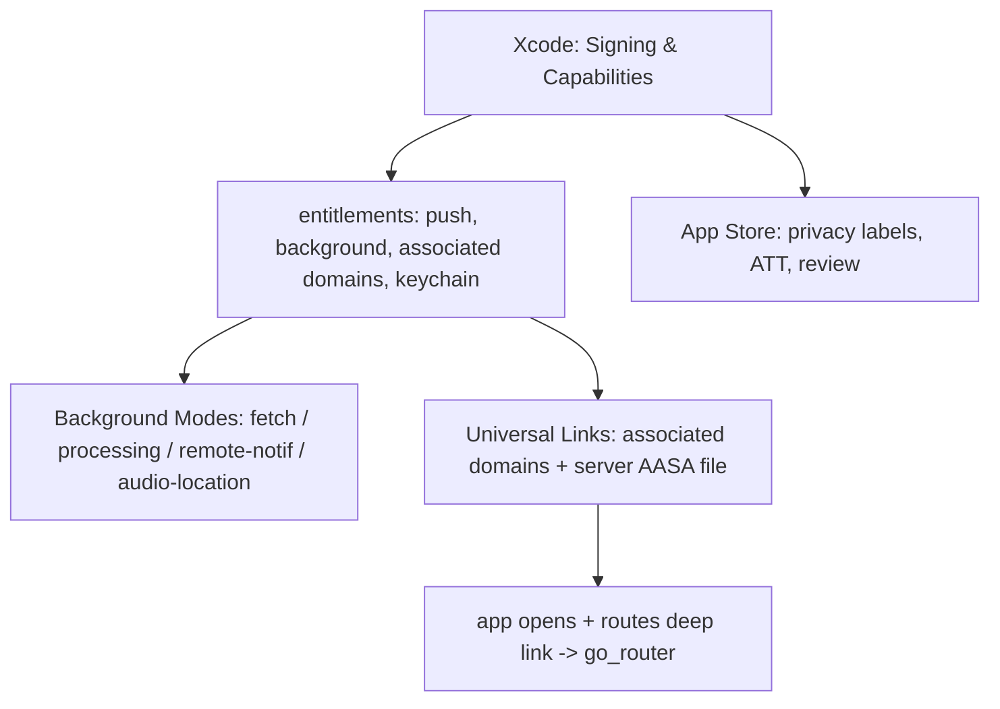
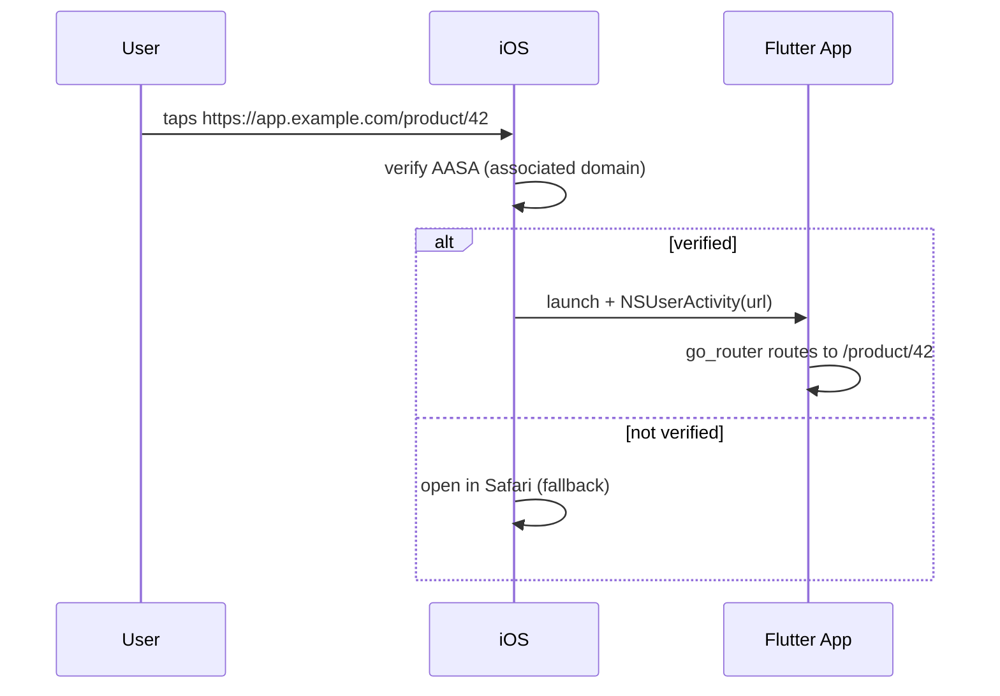

# iOS Integration (Capabilities, Background Modes, Universal Links, App Store)

> Beyond channels and permissions, real iOS apps enable **capabilities** (push, background modes, associated domains, keychain sharing) in Xcode, run limited work in **background modes**, open via **universal links** (associated domains + AASA file), and satisfy **App Store** requirements — the iOS integration surface that turns a Flutter build into a shippable, deep-linkable, background-capable app.

## Introduction

This module capstone covers the iOS-specific integration layer: **capabilities** (entitlements enabled in Xcode's Signing & Capabilities), **background modes** (fetch, processing, remote notifications, audio/location), **universal links** (HTTPS deep links via associated domains + Apple App Site Association), and **App Store** review essentials. It ties together channels ([02_swift_plugin_code.md](02_swift_plugin_code.md)), permissions ([04_infoplist_and_permissions.md](04_infoplist_and_permissions.md)), and deployment ([Module 51](../51%20Deployment/README.md)).

## Why this concept exists

iOS gates powerful features (push, background execution, deep links, keychain) behind **entitlements/capabilities** for security and battery/privacy control. Background execution is deliberately limited (battery); universal links require server-verified association (security); the App Store enforces privacy/quality. You must configure these to ship a full-featured app.

## Real-world analogy

Capabilities are **security clearances** you request for the app (each unlocks a room: push, background, keychain). Background modes are **limited after-hours passes** (short, supervised tasks — not free rein). Universal links are a **verified forwarding address** (the domain must vouch for the app via the AASA file). The App Store is **customs/inspection** before release.

## Problem Statement

Ship an iOS app that receives push notifications, refreshes data in the background, opens `https://app.example.com/...` links directly into the app (universal links), and passes App Store review. You'll enable capabilities, add background modes, host an AASA file + associated domains, and meet review requirements.

## Internal Working



- **Capabilities (entitlements)**: enabled in Xcode **Signing & Capabilities** (writes the `.entitlements` file + updates the provisioning profile): Push Notifications, Background Modes, Associated Domains, Keychain Sharing, Sign in with Apple, App Groups, etc. Each must be in your provisioning profile.
- **Background modes**: iOS strictly limits background work. Modes include **Background fetch** & **Background processing** (`BGTaskScheduler` — opportunistic, OS-scheduled), **Remote notifications** (silent push wakes the app briefly), and continuous **audio/location/VoIP** (only if genuinely used — misuse → rejection). Not general-purpose threads; see [Module 33](../33%20Background%20Services/README.md).
- **Universal links**: HTTPS links that open the app directly (no browser bounce). Require: **Associated Domains** capability (`applinks:app.example.com`) + an **`apple-app-site-association` (AASA)** JSON file served at `https://app.example.com/.well-known/apple-app-site-association` (no extension, `application/json`, listing your App ID + paths). iOS verifies it; then links route into the app → handled by `go_router`/deep-link handling ([13 · deep_linking](../13%20Routing/02_deep_linking_and_url_strategy.md)). Falls back to Safari if unverified.
- **Push notifications**: APNs (via capability + entitlement); typically through FCM ([Module 32](../32%20Notifications/README.md)).
- **App Store**: **privacy nutrition labels**, **ATT** prompt for tracking ([04_infoplist_and_permissions.md](04_infoplist_and_permissions.md)), correct usage strings, no private APIs, screenshots/metadata — reviewed before release ([Module 51](../51%20Deployment/README.md)).

## Memory Representation

Not applicable; entitlements/config are build-time. Background tasks get short, OS-metered execution windows (memory/time limited).

## Compiler Behavior

Capabilities add entitlements embedded/signed into the app; must match the provisioning profile or signing fails.

## Runtime Behavior

Background modes give brief OS-scheduled execution; silent push wakes the app momentarily; verified universal links launch/route the app; unverified links open Safari.

## Flutter Engine Behavior

The iOS embedder ([10 · embedder_and_startup](../10%20Flutter%20Architecture/05_embedder_and_startup.md)) receives lifecycle/link/notification callbacks in `AppDelegate` and forwards them to Flutter (plugins/channels — [02_swift_plugin_code.md](02_swift_plugin_code.md)).

## Dart VM Behavior

Background execution may run Dart in a background isolate/engine (plugin-dependent) with limited time ([Module 33](../33%20Background%20Services/README.md)).

## Examples

```text
Enable in Xcode → Runner → Signing & Capabilities → "+ Capability":
  • Push Notifications
  • Background Modes → check: Background fetch, Remote notifications, Background processing
  • Associated Domains → add: applinks:app.example.com
  • Keychain Sharing / Sign in with Apple / App Groups (as needed)
```

```json
// Served at: https://app.example.com/.well-known/apple-app-site-association
// (no file extension, Content-Type: application/json, HTTPS, no redirects)
{
  "applinks": {
    "apps": [],
    "details": [
      { "appID": "TEAMID.com.example.app", "paths": ["/product/*", "/invite/*"] }
    ]
  }
}
```

```swift
// AppDelegate: receive a universal link, forward to Flutter (plugins usually handle this)
override func application(
  _ application: UIApplication,
  continue userActivity: NSUserActivity,
  restorationHandler: @escaping ([UIUserActivityRestoring]?) -> Void
) -> Bool {
  if userActivity.activityType == NSUserActivityTypeBrowsingWeb,
     let url = userActivity.webpageURL {
    // forward url to Flutter (e.g., via a plugin / method channel) -> go_router
  }
  return super.application(application, continue: userActivity, restorationHandler: restorationHandler)
}
```

## Diagrams



## Common Mistakes

| Mistake | Why | Fix |
|---------|-----|-----|
| Capability not in provisioning profile | Signing/entitlement failure | Enable in Xcode + regenerate profile |
| AASA served with wrong type/redirect/extension | Universal link falls back to Safari | Serve JSON at `.well-known`, HTTPS, no redirect, no extension |
| Claiming background modes you don't use | App Store rejection | Only enable modes you genuinely use |
| Expecting unlimited background execution | iOS meters it strictly | Use `BGTaskScheduler`/silent push; keep short |
| Missing privacy labels/ATT/usage strings | Rejection | Complete privacy labels + ATT + usage strings |
| Wrong App ID/paths in AASA | Links don't route | Match `TEAMID.bundleId` + correct paths |

## Best Practices

- Enable only **capabilities you use** (each adds entitlement/profile surface); keep provisioning profiles in sync.
- Treat **background execution as scarce**: `BGTaskScheduler`/silent push, short work; only enable continuous modes (audio/location) if truly needed ([Module 33](../33%20Background%20Services/README.md)).
- Host a **correct AASA** (HTTPS, `.well-known`, right type/App ID/paths) and add **Associated Domains**; route links via `go_router` ([13 · deep_linking](../13%20Routing/02_deep_linking_and_url_strategy.md)).
- Complete **privacy labels, ATT, usage strings**; avoid private APIs; test on device before submission ([Module 51](../51%20Deployment/README.md)).
- Handle links/notifications in `AppDelegate` and forward to Flutter behind a repository ([02_swift_plugin_code.md](02_swift_plugin_code.md)).

## Performance

Background modes are OS-metered (battery); overusing them is rejected/throttled. Universal links avoid a browser bounce (faster UX). Build-time capabilities have no runtime cost.

## Advantages / Disadvantages

- **+** Push, background refresh, seamless deep links, keychain/App Groups; full native iOS integration; better UX + shippability.
- **−** Xcode/entitlement/provisioning complexity, strict background limits, server-side AASA hosting, App Store review scrutiny, Mac required.

## Interview Questions

1. **🟢 What are iOS capabilities?** — Entitlements enabled in Xcode Signing & Capabilities (push, background modes, associated domains, keychain) that unlock gated features and must be in the provisioning profile.
2. **🟢 What is a universal link?** — An HTTPS link that opens the app directly (no browser bounce), via the Associated Domains capability + a server-hosted AASA file.
3. **🟡 What does the AASA file do and where does it live?** — It associates the domain with the app (App ID + paths); served at `https://domain/.well-known/apple-app-site-association` as JSON over HTTPS (no redirect/extension).
4. **🟡 How limited is iOS background execution?** — Very: short OS-scheduled windows via `BGTaskScheduler`/silent push; only enable continuous modes (audio/location) if genuinely used, or risk rejection.
5. **🟡 How do push notifications work on iOS?** — APNs via the Push Notifications capability/entitlement, commonly through FCM ([Module 32](../32%20Notifications/README.md)).
6. **🔴 Why might a universal link fall back to Safari?** — Unverified AASA (wrong Content-Type, redirect, path, App ID, or not reachable) → iOS can't confirm the association.
7. **🔴 What are key App Store review pitfalls?** — Missing privacy labels/usage strings/ATT, unused background modes, private APIs, or mismatched entitlements.

## Senior Engineer Tips

- Enable capabilities deliberately and keep provisioning profiles regenerated; entitlement/profile mismatches are a common CI/device blocker.
- Validate the AASA with Apple's tooling and real devices — most universal-link bugs are server-side (type/redirect/paths).
- Never claim background modes you don't use; it's a frequent rejection cause. Forward links/notifications through a single repository shared with Android.

## Architect Perspective

iOS integration is where the app meets the platform's security/privacy/battery model: capabilities (least-privilege entitlements), metered background work, verified universal links, and App Store compliance. Designing these cleanly — minimal capabilities, short background tasks, correct AASA, links/notifications behind a cross-platform repository — yields a shippable, deep-linkable, background-capable app and completes the native integration story alongside Android ([Module 27](../27%20Native%20Android/README.md), [Module 51](../51%20Deployment/README.md)).

## Summary

- Capabilities = Xcode entitlements (push/background/associated domains/keychain), must be in the provisioning profile.
- Background execution is strictly metered (`BGTaskScheduler`/silent push); enable continuous modes only if truly used.
- Universal links = Associated Domains + server AASA (HTTPS `.well-known`, right App ID/paths) → route via `go_router`, else Safari fallback.
- App Store: privacy labels, ATT, usage strings, no private APIs; handle links/notifications in `AppDelegate` behind a repository.

## Revision Notes

- Signing & Capabilities → entitlements (push, Background Modes, Associated Domains, Keychain); must match provisioning profile.
- Background: `BGTaskScheduler`/silent push, short/metered; audio/location only if genuinely used (else rejection).
- Universal links: `applinks:domain` + AASA at `https://domain/.well-known/apple-app-site-association` (JSON, HTTPS, no redirect/extension, `TEAMID.bundleId` + paths); unverified → Safari.
- App Store: privacy labels, ATT, usage strings, no private APIs; route links/notifications via `AppDelegate` → Flutter repository.

## Practice Questions

1. What must be true for a universal link to open the app instead of Safari?
2. How limited is background execution on iOS, and how do you schedule work?
3. What is an entitlement and how does it relate to the provisioning profile?

## Coding Questions

1. Add the Associated Domains capability + host an AASA file for `/product/*`.
2. Handle an incoming universal link in `AppDelegate` and route it in Flutter via `go_router`.
3. Schedule a background refresh with `BGTaskScheduler` (outline) and forward the result to Flutter.

## Mini Project

**iOS integration slice (module capstone — Flutter + iOS):** Ship an iOS integration: enable **Push Notifications + Background Modes + Associated Domains** capabilities; host an **AASA** file and route `https://app.example.com/product/*` universal links into the app via `go_router`; schedule a **background refresh** (`BGTaskScheduler`/silent push); handle links/notifications in `AppDelegate` and forward to Flutter behind a repository (shared with Android); and satisfy **App Store** basics (privacy labels, usage strings, ATT if tracking). Combine with a Swift channel ([02_swift_plugin_code.md](02_swift_plugin_code.md)), a permission-gated feature ([04_infoplist_and_permissions.md](04_infoplist_and_permissions.md)), and an embedded native view ([03_platform_views_ios.md](03_platform_views_ios.md)). Acceptance: capabilities enabled + signed; universal link opens + routes in-app (Safari fallback if unverified); background refresh runs (metered); links/notifications forwarded via a cross-platform repository; App Store requirements met; runs on device.
