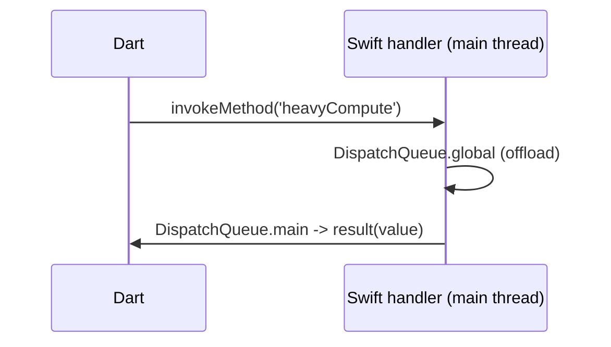

# Swift Plugin Code (Channels, `AppDelegate`/`FlutterViewController`, Lifecycle)

> On iOS, native channel handlers are Swift: register them in `AppDelegate` (via the `FlutterViewController`'s binary messenger) or in a plugin (`FlutterPlugin`), return results with the `FlutterResult` callback (`value` / `FlutterError` / `FlutterMethodNotImplemented`), and offload heavy work off the main thread — replying on it.

## Introduction

This file covers the iOS/Swift side of channels/plugins: where to register handlers (`AppDelegate`/`FlutterViewController`/`FlutterPlugin`), the `FlutterResult` reply pattern, `EventChannel` stream handlers, threading (main thread/GCD), and lifecycle — the iOS mirror of the Kotlin file ([27 · kotlin_plugin_code](../27%20Native%20Android/kotlin_plugin_code.md)).

## Why this concept exists

Channels need a native implementation; on iOS that's Swift with iOS-specific concerns: getting the `FlutterViewController`/binary messenger, replying via `FlutterResult`, threading with GCD (`DispatchQueue`), and integrating with UIKit lifecycle. Getting these right avoids crashes/hangs and enables native capabilities.

## Real-world analogy

Writing Swift channel code is the **iOS branch office** fulfilling HQ (Dart) requests: it uses iOS credentials (view controller/APIs), does work possibly on a background queue, and **hands the reply back through the correct window** (`result` on the main thread).

## Problem Statement

Implement a Swift `MethodChannel` that reads a system value and one that does heavy work off the main thread, plus an `EventChannel` stream — registered in `AppDelegate` (or a `FlutterPlugin`), with correct threading and reply. You'll register handlers and reply via `FlutterResult`.

## Internal Working

```mermaid
flowchart TD
    Register[AppDelegate / FlutterPlugin.register] --> Channel[FlutterMethodChannel(name, messenger)]
    Channel --> Handler[setMethodCallHandler { call, result -> ... }]
    Handler --> Switch{call.method}
    Switch -->|known| Work[offload heavy work (DispatchQueue.global)] --> Reply[result(value) on main]
    Switch -->|unknown| NotImpl[result(FlutterMethodNotImplemented)]
    Fail[error] --> Err[result(FlutterError(code,message,details))]
```

- **Registering handlers**:
  - **App-embedded**: in `AppDelegate.didFinishLaunchingWithOptions`, get the `FlutterViewController` (`window?.rootViewController as! FlutterViewController`) and create `FlutterMethodChannel(name:, binaryMessenger: controller.binaryMessenger)` + `setMethodCallHandler`.
  - **Plugin**: implement **`FlutterPlugin`** (`register(with registrar:)`) and use the registrar's messenger; register via `GeneratedPluginRegistrant`.
- **Replying (`FlutterResult`)**: call `result(value)` for success, `result(FlutterError(code:message:details:))` for errors, `result(FlutterMethodNotImplemented)` for unknown methods. Reply **exactly once**, on the **main thread**.
- **Args**: `call.arguments` (cast from `Any?`, usually a `[String: Any]` dict); codec-supported types only.
- **Threading**: handlers run on the **main thread** (main run loop). Do heavy work on a **background queue** (`DispatchQueue.global().async`) and call `result` back on the **main queue** (`DispatchQueue.main.async`) to avoid blocking UI ([26 · platform_channel_fundamentals](../26%20Platform%20Channels/platform_channel_fundamentals.md)).
- **`EventChannel`**: implement `FlutterStreamHandler` (`onListen(withArguments:eventSink:)` / `onCancel`); emit via the `FlutterEventSink` on the main thread; clean up in `onCancel` ([26 · event_channel](../26%20Platform%20Channels/event_channel.md)).
- **Lifecycle**: `AppDelegate` hooks (background/foreground, URL handling) integrate with app lifecycle ([ios_integration.md](ios_integration.md)).

## Memory Representation

Retaining strong references to controllers/observers past their lifetime can leak; use appropriate ownership and remove observers on `onCancel`/deinit ([26 · event_channel](../26%20Platform%20Channels/event_channel.md)).

## Compiler Behavior

Swift compiled by Xcode; channels are stringly-typed (Pigeon generates Swift type-safety — [26 · plugins_and_pigeon](../26%20Platform%20Channels/plugins_and_pigeon.md)).

## Runtime Behavior

Handlers dispatch by `call.method`; unknown → `FlutterMethodNotImplemented` → Dart `MissingPluginException`; `FlutterError` → Dart `PlatformException`. Heavy main-thread work blocks UI.

## Flutter Engine Behavior

`FlutterAppDelegate`/`FlutterViewController` embeds the engine + registers plugins; channel messages marshal via the engine ([10 · engine_internals](../10%20Flutter%20Architecture/engine_internals.md)).

## Dart VM Behavior

Not applicable.

## Examples

```swift
import Flutter
import UIKit

@main
@objc class AppDelegate: FlutterAppDelegate {
  override func application(
    _ application: UIApplication,
    didFinishLaunchingWithOptions launchOptions: [UIApplication.LaunchOptionsKey: Any]?
  ) -> Bool {
    let controller = window?.rootViewController as! FlutterViewController
    let channel = FlutterMethodChannel(name: "app/system", binaryMessenger: controller.binaryMessenger)

    channel.setMethodCallHandler { call, result in
      switch call.method {
      case "getBatteryLevel":
        UIDevice.current.isBatteryMonitoringEnabled = true
        let level = UIDevice.current.batteryLevel
        if level < 0 { result(FlutterError(code: "UNAVAILABLE", message: "No battery info", details: nil)) }
        else { result(Int(level * 100)) }                 // reply on main (already on main)

      case "heavyCompute":
        DispatchQueue.global().async {                     // offload heavy work
          let value = (1...1_000_000).reduce(0, +)
          DispatchQueue.main.async { result(value) }       // reply on MAIN queue
        }

      default:
        result(FlutterMethodNotImplemented)                // unknown method
      }
    }

    GeneratedPluginRegistrant.register(with: self)
    return super.application(application, didFinishLaunchingWithOptions: launchOptions)
  }
}
```

```swift
// EventChannel stream handler (native -> Dart)
class BatteryStreamHandler: NSObject, FlutterStreamHandler {
  var sink: FlutterEventSink?
  func onListen(withArguments args: Any?, eventSink: @escaping FlutterEventSink) -> FlutterError? {
    sink = eventSink
    NotificationCenter.default.addObserver(self, selector: #selector(changed),
      name: UIDevice.batteryStateDidChangeNotification, object: nil)
    return nil
  }
  @objc func changed() { DispatchQueue.main.async { self.sink?("charging") } } // emit on main
  func onCancel(withArguments args: Any?) -> FlutterError? {
    NotificationCenter.default.removeObserver(self); sink = nil; return nil     // cleanup
  }
}
```

## Diagrams



## Common Mistakes

| Mistake | Why | Fix |
|---------|-----|-----|
| Heavy work on the main thread | Blocks UI/hangs | Offload to `DispatchQueue.global`; reply on main |
| Replying off the main thread | Errors/crashes | `DispatchQueue.main.async { result(...) }` |
| Calling `result` more than once/never | Crash/hang | Reply exactly once per call |
| Not handling unknown methods | Missing handler | `result(FlutterMethodNotImplemented)` |
| Not removing observers (EventChannel) | Leak | Remove in `onCancel`/deinit |
| Passing custom objects | Codec unsupported | Send dicts/primitives (or Pigeon) |

## Best Practices

- Register handlers in **`AppDelegate`** (app) or a **`FlutterPlugin`** (reusable), using the correct **binary messenger**.
- Reply via **`FlutterResult`** exactly once, on the **main thread**; use `FlutterError`/`FlutterMethodNotImplemented` appropriately.
- **Offload heavy work** to `DispatchQueue.global()`; return results on `DispatchQueue.main`.
- For streams, implement **`FlutterStreamHandler`** and **remove observers in `onCancel`**; emit on main.
- Use **codec-supported types**; adopt **Pigeon** for Swift type-safety; wrap the Dart side in a repository.

## Performance

Main-thread handlers must return quickly — offload heavy work; keep messages small. Threading discipline avoids UI hangs ([26 · platform_channel_fundamentals](../26%20Platform%20Channels/platform_channel_fundamentals.md), [Module 21](../21%20Performance/README.md)).

## Advantages / Disadvantages

- **+** Full iOS/Swift API access, GCD-based offloading, proper lifecycle integration.
- **−** Threading/reply-once discipline, stringly-typed channels (Pigeon helps), observer cleanup, Swift/iOS knowledge + Mac required.

## Interview Questions

1. **🟢 Where do you register iOS channel handlers?** — In `AppDelegate.didFinishLaunchingWithOptions` (via `FlutterViewController.binaryMessenger`) or a `FlutterPlugin`.
2. **🟢 How do you reply from Swift?** — Call the `FlutterResult` callback once: `result(value)`, `result(FlutterError(...))`, or `result(FlutterMethodNotImplemented)` — on the main thread.
3. **🟡 How do you offload heavy work?** — `DispatchQueue.global().async { ... DispatchQueue.main.async { result(value) } }` — compute off-main, reply on main.
4. **🟡 How do you stream events (EventChannel) on iOS?** — Implement `FlutterStreamHandler` (`onListen` with a `FlutterEventSink`, `onCancel` to clean up); emit on main.
5. **🟡 How do you read arguments?** — From `call.arguments` (cast, usually `[String: Any]`), codec-supported types only.
6. **🔴 What happens if you call `result` twice or never?** — Crash/hang — reply exactly once per call.
7. **🔴 How do you make Swift channel code type-safe?** — Use Pigeon-generated Swift interfaces instead of stringly-typed `setMethodCallHandler`.

## Senior Engineer Tips

- Mirror the Android discipline: offload heavy native work, reply on the main thread exactly once, and clean up observers — the top iOS channel bugs.
- Prefer a `FlutterPlugin` (reusable, `register(with:)`) over ad-hoc `AppDelegate` code as the native surface grows.
- Use Pigeon for anything beyond a couple methods; it eliminates Swift-side name/type mismatches.

## Architect Perspective

The Swift channel layer is the iOS implementation of native features; correct threading (GCD/main), single-reply, and observer cleanup make it responsive and leak-free. Packaged as a plugin (+ Pigeon types) and wrapped behind repositories, it mirrors Android for a portable, testable native-integration story ([Module 26](../26%20Platform%20Channels/README.md), [27 · kotlin_plugin_code](../27%20Native%20Android/kotlin_plugin_code.md)).

## Summary

- Register handlers in `AppDelegate`/`FlutterPlugin`; reply via `FlutterResult` once, on the main thread.
- Offload heavy work (GCD) and reply on main; stream via `FlutterStreamHandler` (clean up in `onCancel`).
- Codec types (or Pigeon); wrap Dart side in a repository — the iOS mirror of Kotlin channel code.

## Revision Notes

- Register: `AppDelegate` (via `FlutterViewController.binaryMessenger`) or `FlutterPlugin.register(with:)`.
- Reply: `result(value)`/`FlutterError`/`FlutterMethodNotImplemented` — once, on main.
- Offload: `DispatchQueue.global` → `DispatchQueue.main` for reply; EventChannel = `FlutterStreamHandler` (remove observers in `onCancel`).
- Codec args (`[String:Any]`); Pigeon for type-safety; repository-wrap Dart side.

## Practice Questions

1. How do you offload heavy work and reply correctly on iOS?
2. What are the three `FlutterResult` outcomes?
3. How do you implement and clean up an `EventChannel` on iOS?

## Coding Questions

1. Write a Swift `MethodChannel` handler for `getBatteryLevel` + `heavyCompute` (offloaded).
2. Implement a `FlutterStreamHandler` for battery events (cleanup in `onCancel`).
3. Return a `FlutterError` for a failure case and handle unknown methods.

## Mini Project

**Swift channel service (Flutter + iOS):** Implement a Swift `MethodChannel` (`getBatteryLevel`, `heavyCompute` offloaded → main-thread reply) and an `EventChannel` (battery events via `FlutterStreamHandler`, cleaned up in `onCancel`), registered in `AppDelegate` (or a `FlutterPlugin`), and wrap the Dart side in a repository. Acceptance: correct threading (offload + reply on main); reply-once; stream cleanup; results/errors returned; runs on device/simulator.
