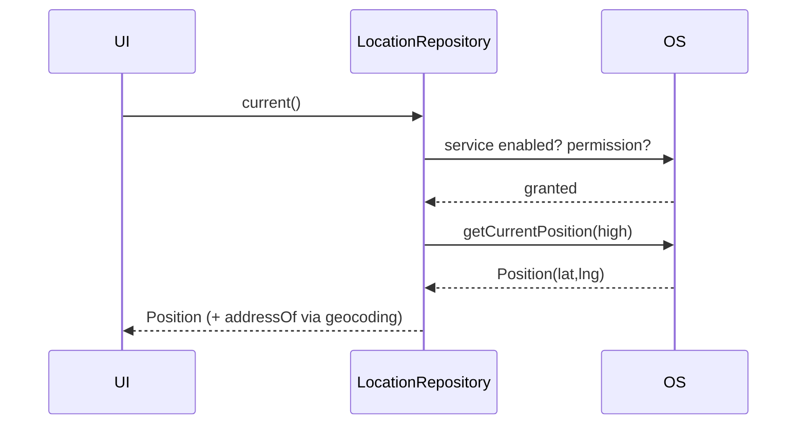

# Geolocation (Position, Streams, Accuracy, Geocoding)

> Read the device location with **`geolocator`**: a one-shot `getCurrentPosition()` or a continuous `getPositionStream()`, tuned by an **accuracy/distance filter** (higher accuracy = more battery); check **service enabled + permission** (incl. iOS while-in-use vs always), and convert between coordinates and addresses with **geocoding** — all behind a repository.

## Introduction

Location powers maps, delivery, geofencing, and "near me" features. `geolocator` provides current position, a position stream, distance calculations, and settings checks; `geocoding` converts lat/lng ↔ address. This file covers accuracy vs battery, the permission/service flow, streams, and wrapping it cleanly.

## Why this concept exists

GPS is a shared, battery-expensive sensor gated by permissions and a user-toggleable service. Flutter reaches it via a plugin over platform channels ([Module 26](../26%20Platform%20Channels/README.md)). You must request the right permission tier, respect battery (accuracy/interval), and handle "service off"/"denied" states.

## Real-world analogy

Asking for location is like **asking a navigator for your position**: first they must have the **map turned on** (location service enabled) and **permission to tell you** (granted), then you choose **how precise** (rough neighborhood = cheap/fast, exact GPS = slow/battery). A **stream** is the navigator calling out your position as you move.

## Problem Statement

Show the user's current location on a "near me" screen, keep it updated as they move (for live tracking), display a human-readable address, and handle service-off/denied gracefully. You'll use `getCurrentPosition`, `getPositionStream`, and `geocoding`, behind a repository.

## Internal Working

```mermaid
flowchart TD
    Enabled{location service ON?} -->|no| Prompt1[ask user to enable]
    Enabled -->|yes| Perm{permission?}
    Perm -->|denied| Req[requestPermission]
    Perm -->|deniedForever| Settings[openAppSettings]
    Perm -->|granted| Mode{one-shot or stream?}
    Mode -->|one-shot| Cur[getCurrentPosition(accuracy)]
    Mode -->|stream| Str[getPositionStream(accuracy, distanceFilter)]
```

- **Preflight**: `isLocationServiceEnabled()` (user can toggle GPS off) → `checkPermission()`/`requestPermission()`. iOS distinguishes **whileInUse** vs **always** (background needs always + justification — [28 · ios_integration](../28%20Native%20iOS/05_ios_integration.md)); Android has coarse vs fine.
- **One-shot**: `getCurrentPosition(desiredAccuracy: LocationAccuracy.high)` returns a `Position` (lat/lng, accuracy, speed, heading, timestamp).
- **Stream**: `getPositionStream(locationSettings: LocationSettings(accuracy, distanceFilter: 10))` emits on movement ≥ `distanceFilter` meters — the battery-friendly way to track. Cancel the subscription when done.
- **Accuracy vs battery**: higher accuracy + smaller distance filter = more GPS use = more drain/heat. Choose the **lowest accuracy that works**.
- **Geocoding** (`geocoding` package): `placemarkFromCoordinates(lat, lng)` → address; `locationFromAddress("...")` → coordinates. Network-dependent, rate-limited — cache.
- **Distance/bearing**: `Geolocator.distanceBetween(...)` for "how far."
- **Repository**: expose `Future<Position> current()` and `Stream<Position> track()`; centralize permission/service checks.

## Memory Representation

A `Position` is a small value object. The stream subscription holds a native listener — cancel it to stop GPS.

## Compiler Behavior

Not applicable; native bridge at runtime.

## Runtime Behavior

`getCurrentPosition` may take seconds for a fresh fix (especially cold/high-accuracy). The stream keeps GPS active while listened — a live drain until cancelled.

## Flutter Engine Behavior

Location updates arrive over a platform channel/`EventChannel` ([26 · event_channel](../26%20Platform%20Channels/README.md)) and surface as a Dart stream.

## Dart VM Behavior

Not applicable; positions are marshalled from native.

## Examples

```dart
import 'package:geolocator/geolocator.dart';
import 'package:geocoding/geocoding.dart';

class LocationRepository {
  // Preflight: service + permission (throws a domain error the UI can show)
  Future<void> _ensureReady() async {
    if (!await Geolocator.isLocationServiceEnabled()) {
      throw const LocationException('Location service is off');
    }
    var perm = await Geolocator.checkPermission();
    if (perm == LocationPermission.denied) perm = await Geolocator.requestPermission();
    if (perm == LocationPermission.denied) throw const LocationException('Permission denied');
    if (perm == LocationPermission.deniedForever) {
      await Geolocator.openAppSettings();
      throw const LocationException('Permission permanently denied');
    }
  }

  Future<Position> current() async {
    await _ensureReady();
    return Geolocator.getCurrentPosition(desiredAccuracy: LocationAccuracy.high);
  }

  // Battery-friendly tracking: only emit after moving >= 10 m
  Stream<Position> track() async* {
    await _ensureReady();
    yield* Geolocator.getPositionStream(
      locationSettings: const LocationSettings(
        accuracy: LocationAccuracy.high,
        distanceFilter: 10,
      ),
    );
  }

  Future<String> addressOf(Position p) async {
    final marks = await placemarkFromCoordinates(p.latitude, p.longitude);
    final m = marks.first;
    return '${m.street}, ${m.locality}, ${m.country}';
  }
}

class LocationException implements Exception {
  final String message;
  const LocationException(this.message);
  @override
  String toString() => message;
}
```

## Diagrams



## Common Mistakes

| Mistake | Why | Fix |
|---------|-----|-----|
| Not checking service enabled | Hangs/errors when GPS off | `isLocationServiceEnabled()` first |
| Not handling `deniedForever` | User stuck | Route to `openAppSettings()` |
| Always max accuracy | Battery drain/heat | Lowest accuracy + distance filter that works |
| Not cancelling the stream | GPS runs forever | Cancel subscription on dispose |
| Requesting `always` when `whileInUse` suffices | Rejection/low acceptance | Request the minimum tier needed |
| Geocoding on every frame | Rate limits/latency | Cache, throttle |

## Best Practices

- **Preflight** service + permission (handle denied/`deniedForever` → Settings); request the **minimum tier** (`whileInUse` unless background truly needed).
- Choose the **lowest accuracy + largest distance filter** that works; **cancel** the position stream when done (battery).
- Use `getPositionStream` (not polling) for tracking; **cache/throttle geocoding** (network, rate-limited).
- Wrap in a **repository** exposing `current()`/`track()`/`addressOf()`; surface service/permission errors as domain errors ([Module 38](../38%20Error%20Handling/README.md)).

## Performance

GPS is one of the biggest battery drains; accuracy and update frequency dominate cost. Use distance filters, stop streams promptly, and prefer coarse accuracy when precision isn't needed.

## Advantages / Disadvantages

- **+** Precise location, movement streams, distance/geocoding; cross-platform.
- **−** Battery/heat cost, permission/service complexity (tiers, background), fix latency, geocoding is network/rate-limited.

## Interview Questions

1. **🟢 One-shot vs stream location?** — `getCurrentPosition` for a single fix; `getPositionStream` (with a distance filter) for continuous tracking that emits on movement.
2. **🟢 What two preconditions must you check before reading location?** — The location **service is enabled** and **permission is granted** (request if denied; Settings if deniedForever).
3. **🟡 How do you make location battery-friendly?** — Lower `desiredAccuracy`, use a `distanceFilter`, cancel streams when done, avoid `always` unless needed.
4. **🟡 What's the difference between whileInUse and always?** — Foreground-only vs background location; `always` needs extra justification/keys and is scrutinized in review.
5. **🟡 What is geocoding?** — Converting coordinates ↔ addresses (`placemarkFromCoordinates`/`locationFromAddress`); network-based and rate-limited, so cache.
6. **🔴 Why cancel the position stream?** — An active stream keeps GPS running, draining battery — cancel on dispose.
7. **🔴 How do you compute distance between two points?** — `Geolocator.distanceBetween(lat1, lng1, lat2, lng2)` (meters).

## Senior Engineer Tips

- Always preflight service + permission and model the failure states as domain errors — half of location bugs are "GPS off" or "deniedForever" unhandled.
- Default to the coarsest accuracy the feature tolerates and a generous distance filter; escalate only when needed.
- Never leave a position stream running past the screen — tie its subscription to widget/bloc disposal.

## Architect Perspective

Geolocation is a battery/permission/privacy-sensitive capability. A `LocationRepository` that centralizes preflight, exposes one-shot + stream APIs, enforces minimum accuracy/tier, and returns domain errors keeps location testable and power-efficient — feeding maps, geofencing, and offline tagging ([Module 30](../30%20Google%20Maps/README.md), [Module 19](../19%20Offline%20First/README.md)).

## Summary

- `geolocator`: preflight service + permission → `getCurrentPosition` (one-shot) or `getPositionStream` (tracking, distance filter).
- Accuracy + frequency drive battery; request the minimum permission tier; cancel streams; cache geocoding.
- Wrap behind a repository with domain errors.

## Revision Notes

- Preflight: `isLocationServiceEnabled()` + `checkPermission()`/`requestPermission()`; handle `deniedForever` → `openAppSettings()`.
- One-shot `getCurrentPosition(desiredAccuracy)`; stream `getPositionStream(LocationSettings(accuracy, distanceFilter))` — cancel it.
- iOS whileInUse vs always (background = justification); Android coarse vs fine; lowest accuracy that works.
- `geocoding`: coords ↔ address (cache); `distanceBetween` for distance; repository wrapper.

## Practice Questions

1. What must be true before you can read the device location?
2. How do you track movement without draining the battery?
3. What is the whileInUse vs always distinction on iOS?

## Coding Questions

1. Implement `LocationRepository.current()` with full preflight + domain errors.
2. Implement `track()` as a `distanceFilter` stream and consume it in a widget (cancel on dispose).
3. Add `addressOf(Position)` using geocoding with caching.

## Mini Project

**"Near me" + live tracking (Flutter):** Build a `LocationRepository` with `current()`, `track()` (distance-filtered stream), and `addressOf()` (cached geocoding), full service/permission preflight, and domain errors. UI shows current address, a live-updating position while tracking (subscription cancelled on dispose), and graceful handling of service-off/denied. Acceptance: preflight + all permission states handled; one-shot + stream work; stream cancelled; geocoding cached; battery-conscious accuracy/filter; behind a repository; runs on device.
