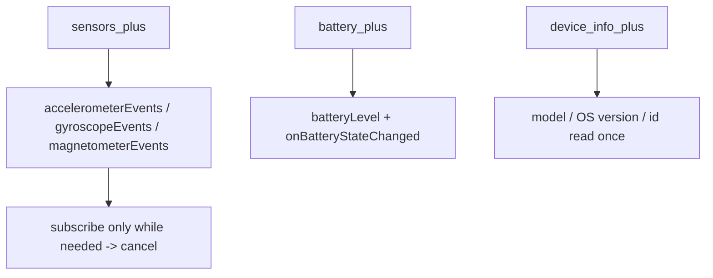
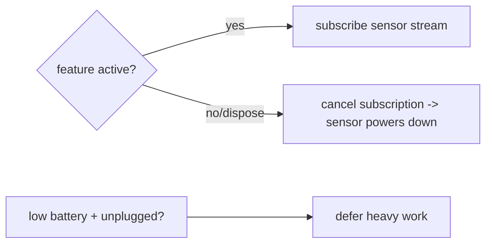

# Sensors, Battery & Device Info

> Read motion sensors with **`sensors_plus`** (accelerometer/gyroscope/magnetometer as **streams**), battery level/state with **`battery_plus`**, and static hardware/OS details with **`device_info_plus`** (model, OS version, unique-ish id) — subscribe only while needed (sensors are high-frequency and battery-hungry) and expose everything behind a repository.

## Introduction

Beyond camera/location, apps read the device's **motion sensors** (steps, shake-to-undo, AR/tilt UIs), **battery** (defer heavy work on low battery), and **device info** (adapt to model/OS, analytics, feature gating). This file covers the streaming sensors, the battery API, device-info reads, and the battery/lifecycle discipline they demand.

## Why this concept exists

These are native hardware/OS signals with no Dart equivalent; plugins bridge them via platform channels ([Module 26](../26%20Platform%20Channels/README.md)). Sensors emit at high frequency (tens–hundreds Hz) so must be subscribed sparingly; battery/device info let apps adapt behavior and diagnose issues across the fragmented device landscape.

## Real-world analogy

Sensors are a **firehose of readings** — you only open the valve while you're actually drinking (subscribed), because leaving it on floods you (battery). Battery info is the **fuel gauge** (throttle heavy work when low). Device info is the **vehicle's spec sheet** (model/year/OS) you read once to adapt.

## Problem Statement

Add shake-to-undo (accelerometer), defer a heavy sync when the battery is low/unplugged (`battery_plus`), and log device model + OS version for analytics/crash context (`device_info_plus`). You'll subscribe to a sensor stream (and cancel it), read battery state, and read device info — behind repositories.

## Internal Working



- **`sensors_plus`**: exposes `accelerometerEventStream()`, `gyroscopeEventStream()`, `magnetometerEventStream()`, `userAccelerometerEventStream()` (gravity removed). High-frequency — subscribe **only while the feature is active**, cancel on dispose, and consider throttling/debouncing.
- **`battery_plus`**: `battery.batteryLevel` (0–100) and `battery.onBatteryStateChanged` (charging/discharging/full) — use to defer heavy work (sync/backup) when low/unplugged.
- **`device_info_plus`**: `DeviceInfoPlugin().androidInfo` / `.iosInfo` → model, manufacturer, OS version, identifiers. **Static** — read once and cache. Note: device ids aren't stable/unique across reinstalls and are privacy-sensitive; don't use as a security identity.
- **Discipline**: sensor streams are the main battery risk here — treat them like GPS (subscribe/cancel tightly). Battery/device info are cheap.
- **Repository**: `MotionRepository.shakes()`, `PowerRepository.state()`, `DeviceRepository.info()`.

## Memory Representation

Sensor events are tiny value objects but arrive rapidly (GC pressure if you allocate per event). A subscription holds a native listener until cancelled.

## Compiler Behavior

Not applicable; native bridges at runtime.

## Runtime Behavior

An active sensor stream keeps the sensor powered and delivers events continuously — a live battery cost. Battery-state changes emit on transitions; device info is a one-time native read.

## Flutter Engine Behavior

Sensor/battery events arrive via `EventChannel`s ([26 · event_channel](../26%20Platform%20Channels/README.md)) as Dart streams; device info via a `MethodChannel`.

## Dart VM Behavior

Not applicable; values marshalled from native. High-frequency streams can create allocation churn — throttle.

## Examples

```dart
import 'package:sensors_plus/sensors_plus.dart';
import 'dart:math';

// Shake detection from the accelerometer stream (subscribe only while active)
class MotionRepository {
  Stream<void> shakes({double threshold = 20}) {
    return accelerometerEventStream()
        .where((e) => sqrt(e.x * e.x + e.y * e.y + e.z * e.z) > threshold)
        .map((_) {});
  }
}
// Usage: final sub = motion.shakes().listen((_) => undo());  ... later: sub.cancel();
```

```dart
import 'package:battery_plus/battery_plus.dart';

class PowerRepository {
  final _battery = Battery();
  Future<bool> shouldDeferHeavyWork() async {
    final level = await _battery.batteryLevel;
    final state = await _battery.batteryState;
    return level < 20 && state != BatteryState.charging; // defer sync/backup
  }
  Stream<BatteryState> stateChanges() => _battery.onBatteryStateChanged;
}
```

```dart
import 'package:device_info_plus/device_info_plus.dart';
import 'dart:io';

class DeviceRepository {
  Future<String> summary() async {
    final plugin = DeviceInfoPlugin();
    if (Platform.isAndroid) {
      final a = await plugin.androidInfo;
      return '${a.manufacturer} ${a.model} · Android ${a.version.release}';
    } else {
      final i = await plugin.iosInfo;
      return '${i.name} · iOS ${i.systemVersion}';
    }
  }
}
```

## Diagrams



## Common Mistakes

| Mistake | Why | Fix |
|---------|-----|-----|
| Leaving a sensor stream subscribed | Constant battery drain | Subscribe only while active; cancel on dispose |
| Heavy work per sensor event | Jank/GC churn | Throttle/debounce; keep handlers tiny |
| Reading device info repeatedly | Wasteful | Read once, cache |
| Using device id as security identity | Not stable/unique; privacy | Use proper auth; treat id as best-effort |
| Ignoring battery state for heavy jobs | Drains user's battery | Defer sync/backup on low/unplugged |
| Not handling platform differences | Field mismatch | Branch Android/iOS info |

## Best Practices

- Treat sensor streams like GPS: **subscribe only while the feature is active, cancel on dispose**, and **throttle** high-frequency events.
- Use `userAccelerometerEventStream` when you want motion without gravity; keep event handlers cheap.
- **Read device info once and cache**; branch Android/iOS; don't rely on device ids for identity/security (privacy + instability).
- Use **battery state** to defer heavy/background work (sync, backup) when low/unplugged; wrap each in a **repository**.

## Performance

Sensor streams are the dominant cost — high frequency + continuous power. Cancel promptly and throttle. Battery/device info reads are negligible.

## Advantages / Disadvantages

- **+** Rich device awareness (motion, power, hardware) for adaptive/interactive features and diagnostics; cross-platform.
- **−** Sensor streams drain battery + create allocation churn; device ids unstable/privacy-sensitive; platform-specific fields.

## Interview Questions

1. **🟢 How are motion sensors exposed in Flutter?** — As high-frequency streams (`accelerometerEventStream`, `gyroscopeEventStream`, etc.) via `sensors_plus`.
2. **🟢 Why must you cancel sensor subscriptions?** — An active stream keeps the sensor powered and delivers events continuously — a battery drain; cancel on dispose.
3. **🟡 accelerometer vs userAccelerometer?** — The former includes gravity; `userAccelerometer` removes it (pure user motion).
4. **🟡 How do you use battery state?** — Read `batteryLevel`/`batteryState` (or listen to changes) to defer heavy work when low/unplugged.
5. **🟡 Is a device id a good user identifier?** — No — it's not stable across reinstalls and is privacy-sensitive; use real auth.
6. **🔴 How do you keep high-frequency sensor handling smooth?** — Throttle/debounce, keep handlers tiny, avoid per-event allocations/setState storms.
7. **🔴 Why read device info once?** — It's static; repeated native reads are wasteful — cache the result.

## Senior Engineer Tips

- Tie every sensor subscription to a lifecycle (bloc/state dispose); a forgotten accelerometer listener is a silent battery bug.
- Throttle sensor streams (e.g., sample every N ms) before doing work — raw streams are far faster than your UI needs.
- Cache device info in a singleton and attach it to logs/crash reports for field diagnostics.

## Architect Perspective

Sensors/battery/device-info are adaptive-behavior and diagnostics signals. Repositories that expose throttled sensor streams, power-aware scheduling hooks, and cached device info let the app react to motion, respect battery, and adapt across a fragmented device base — feeding background scheduling, analytics, and crash reporting ([Module 33](../33%20Background%20Services/README.md), [Module 52](../52%20Monitoring/README.md)).

## Summary

- `sensors_plus` = high-frequency motion streams (subscribe/cancel tightly, throttle); `battery_plus` = level/state (defer heavy work); `device_info_plus` = static specs (read once, cache).
- Sensor streams are the battery risk; device ids aren't identities.
- Wrap each behind a repository.

## Revision Notes

- Sensors: `accelerometerEventStream`/`gyroscope`/`magnetometer`/`userAccelerometer`; subscribe while active, cancel on dispose, throttle.
- Battery: `batteryLevel` (0–100), `batteryState`, `onBatteryStateChanged`; defer heavy work when low/unplugged.
- Device info: `androidInfo`/`iosInfo` (model/OS/id) — static, cache; id ≠ identity (privacy/instability).
- Repositories: `MotionRepository`/`PowerRepository`/`DeviceRepository`.

## Practice Questions

1. Why are sensor streams a battery concern and how do you mitigate it?
2. When should the app defer heavy background work based on battery?
3. Why shouldn't you use a device id as a user identifier?

## Coding Questions

1. Implement shake detection from the accelerometer stream and cancel it on dispose.
2. Implement `PowerRepository.shouldDeferHeavyWork()`.
3. Build a cached `DeviceRepository.summary()` branching Android/iOS.

## Mini Project

**Device-aware utilities (Flutter):** Build `MotionRepository` (shake-to-undo from a throttled accelerometer stream, cancelled on dispose), `PowerRepository` (defer a simulated heavy sync when battery < 20% and unplugged), and a cached `DeviceRepository` that logs model + OS. Acceptance: shake triggers undo; sensor subscription cancelled; heavy work deferred on low battery; device info read once + cached + logged; each behind a repository; runs on device.
