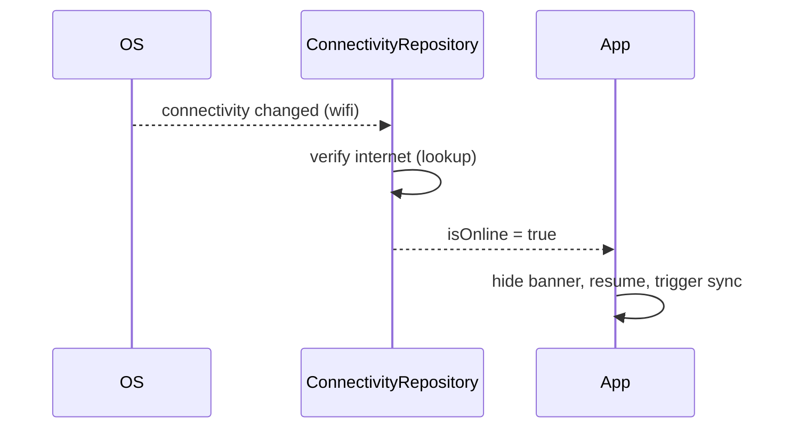

# Connectivity (Network Reachability & Offline Handling)

> Detect the network *interface* (wifi/mobile/none) with **`connectivity_plus`** and, crucially, verify **actual internet reachability** separately — "connected to wifi" ≠ "has internet." React to online/offline transitions via a stream, show an offline banner, pause/resume network work, and feed the offline-first sync engine ([Module 19](../19%20Offline%20First/README.md)).

## Introduction

Apps must behave well offline: queue writes, pause polling, show a banner, retry on reconnect. `connectivity_plus` reports the active interface and emits changes; but a connected interface can still lack real internet (captive portal, no signal). This file covers reachability vs connectivity, the change stream, and wiring it into app behavior.

## Why this concept exists

Mobile networks are unreliable — connections drop, switch (wifi↔mobile), and lie (connected but no internet). The OS exposes interface state via platform channels ([Module 26](../26%20Platform%20Channels/README.md)); Flutter apps need this to drive offline UX and sync. It's the trigger layer for offline-first ([Module 19](../19%20Offline%20First/README.md)).

## Real-world analogy

`connectivity_plus` tells you **the tap is connected to a pipe** (wifi/mobile/none). But a connected pipe can still be **dry** (captive portal, dead cell). So you also **run the tap** (a real request/lookup) to confirm water actually flows (internet reachable).

## Problem Statement

Show an offline banner, pause a live feed and outbound requests when offline, and resume + trigger sync when the connection (with real internet) returns — reliably, without treating "on wifi" as "online." You'll use `connectivity_plus` for changes plus a reachability check, behind a repository exposing a boolean `isOnline` stream.

## Internal Working

```mermaid
flowchart TD
    Change[connectivity_plus onConnectivityChanged] --> Iface{interface = none?}
    Iface -->|yes| Offline[emit offline]
    Iface -->|no| Reach[verify real internet (lookup / lightweight request)]
    Reach -->|ok| Online[emit online -> resume + trigger sync]
    Reach -->|fail| Offline
```

- **`connectivity_plus`**: `checkConnectivity()` → current interface(s) (`wifi`/`mobile`/`ethernet`/`vpn`/`none`) and `onConnectivityChanged` stream. **It reports the interface, not internet** — a key gotcha.
- **Reachability**: confirm real internet with a lightweight check (`InternetAddress.lookup('example.com')` or a HEAD request to your API/health endpoint). Combine: online = interface ≠ none **and** reachability ok. (The `internet_connection_checker` package packages this.)
- **Debounce/dedupe**: connectivity can flap; debounce transitions and only emit real changes (distinct) to avoid banner flicker/sync storms.
- **React**: on offline → show banner, pause polling/uploads, queue writes; on online → hide banner, resume, **trigger sync** ([Module 19](../19%20Offline%20First/README.md)).
- **Don't gate every request on it**: still handle request failures directly (the check can be stale); use connectivity as a *hint/trigger*, not a guarantee.
- **Repository**: expose `Stream<bool> isOnline` + `Future<bool> checkNow()`.

## Memory Representation

Trivial; a stream subscription + last-known state. Reachability checks are transient network calls.

## Compiler Behavior

Not applicable.

## Runtime Behavior

The stream emits on interface changes; reachability adds a quick async check. Connectivity may flap during transitions (handoff wifi↔mobile) — debounce.

## Flutter Engine Behavior

Connectivity events arrive via an `EventChannel` ([26 · event_channel](../26%20Platform%20Channels/README.md)) as a Dart stream.

## Dart VM Behavior

Not applicable.

## Examples

```dart
import 'package:connectivity_plus/connectivity_plus.dart';
import 'dart:io';
import 'dart:async';

class ConnectivityRepository {
  final _connectivity = Connectivity();

  // interface change -> verify real internet -> distinct online/offline stream
  Stream<bool> get isOnline async* {
    yield await checkNow();
    await for (final _ in _connectivity.onConnectivityChanged) {
      yield await checkNow();
    }
  }

  Future<bool> checkNow() async {
    final result = await _connectivity.checkConnectivity();
    if (result.contains(ConnectivityResult.none)) return false;
    return _hasInternet(); // interface up != internet up
  }

  Future<bool> _hasInternet() async {
    try {
      final r = await InternetAddress.lookup('example.com')
          .timeout(const Duration(seconds: 3));
      return r.isNotEmpty && r.first.rawAddress.isNotEmpty;
    } catch (_) {
      return false;
    }
  }
}
// Use .distinct() when consuming to avoid duplicate emissions / banner flicker.
```

```dart
// Offline banner driven by the stream
StreamBuilder<bool>(
  stream: connectivity.isOnline, // .distinct() applied in repo/consumer
  builder: (context, snap) {
    final online = snap.data ?? true;
    return online
        ? const SizedBox.shrink()
        : Container(
            color: Colors.red, padding: const EdgeInsets.all(8),
            child: const Text('You are offline', textAlign: TextAlign.center),
          );
  },
);
```

## Diagrams



## Common Mistakes

| Mistake | Why | Fix |
|---------|-----|-----|
| Treating interface = internet | Captive portal / no signal | Verify reachability separately |
| No debounce/distinct | Banner flicker, sync storms | Debounce + `.distinct()` |
| Gating every request on the check | Stale, races | Use as hint/trigger; handle request errors too |
| Not triggering sync on reconnect | Stale offline data | Fire sync on online transition ([Module 19](../19%20Offline%20First/README.md)) |
| Blocking UI on reachability check | Jank | Async + timeout |
| Assuming online at startup | Wrong initial UI | Emit initial `checkNow()` |

## Best Practices

- Distinguish **interface (connectivity_plus)** from **real internet (reachability check)**; combine both for `isOnline`.
- **Debounce + `.distinct()`** transitions; emit an **initial** state at startup.
- Use connectivity as a **trigger/hint** (banner, pause/resume, fire sync) — still handle per-request failures directly.
- On reconnect, **resume work + trigger the sync engine**; wrap in a **repository** exposing `Stream<bool> isOnline`.

## Performance

Negligible; a stream + occasional short reachability checks (with timeouts). Debouncing avoids redundant work.

## Advantages / Disadvantages

- **+** Reactive offline UX, sync triggering, pause/resume network work; cross-platform.
- **−** Interface≠internet gotcha, flapping needs debounce, reachability adds a network call, only a hint (not a guarantee).

## Interview Questions

1. **🟢 What does `connectivity_plus` actually report?** — The active network **interface** (wifi/mobile/none), *not* whether the internet is reachable.
2. **🟢 How do you know the device truly has internet?** — Do a reachability check (DNS lookup / lightweight request) in addition to the interface state.
3. **🟡 Why debounce/`.distinct()` connectivity events?** — Connections flap during handoffs; without it you get banner flicker and repeated sync triggers.
4. **🟡 Should you gate every network request on connectivity?** — No — use it as a hint/trigger; the state can be stale, so still handle request errors directly.
5. **🟡 What should happen on reconnect?** — Hide the banner, resume paused work, and trigger the offline sync engine.
6. **🔴 How does this integrate with offline-first?** — It's the trigger: offline → queue writes (outbox); online → flush/sync ([Module 19](../19%20Offline%20First/README.md)).
7. **🔴 How do you avoid blocking the UI on the reachability check?** — Run it async with a timeout; emit the result to a stream.

## Senior Engineer Tips

- Never equate "on wifi" with "online" — captive portals and dead cells are the #1 false-positive; always add a reachability probe with a timeout.
- Debounce transitions and expose a single `.distinct()` `Stream<bool>` so the whole app shares one source of truth.
- Treat connectivity as the sync *trigger*, not the sync *gate* — requests must still handle their own failures.

## Architect Perspective

Connectivity is the reactive trigger layer for resilient apps: it drives offline UX and kicks the sync engine. A `ConnectivityRepository` combining interface + reachability into one debounced `Stream<bool>` gives the app a single, reliable online signal — the backbone of offline-first behavior ([Module 19](../19%20Offline%20First/README.md), [Module 16](../16%20Networking/README.md)).

## Summary

- `connectivity_plus` reports the interface; verify real internet with a reachability check — combine into `isOnline`.
- Debounce + `.distinct()` + initial emission; use as a trigger (banner, pause/resume, sync), not a hard gate.
- Wrap in a repository exposing `Stream<bool> isOnline`; drives offline-first.

## Revision Notes

- Interface (`checkConnectivity`/`onConnectivityChanged`) ≠ internet → add reachability (`InternetAddress.lookup`/HEAD, with timeout).
- `isOnline` = interface≠none AND reachable; debounce + `.distinct()` + initial state.
- Trigger, not gate: banner, pause/resume, fire sync on reconnect; still handle request errors.
- Repository: `Stream<bool> isOnline` + `checkNow()`; feeds [Module 19](../19%20Offline%20First/README.md).

## Practice Questions

1. Why is "connected to wifi" not the same as "online"?
2. Why debounce connectivity transitions?
3. What should the app do the moment connectivity returns?

## Coding Questions

1. Implement `ConnectivityRepository.isOnline` combining interface + reachability.
2. Build an offline banner driven by that stream (distinct).
3. Trigger a sync callback on the offline→online transition.

## Mini Project

**Offline-aware shell (Flutter):** Build a `ConnectivityRepository` exposing a debounced, `.distinct()` `Stream<bool> isOnline` (interface + reachability with timeout). Wire an app-wide offline banner, pause a simulated live feed when offline, and trigger a `sync()` callback on reconnect. Acceptance: distinguishes interface vs internet; initial state emitted; no banner flicker; pauses/resumes + triggers sync on reconnect; behind a repository; runs on device.
