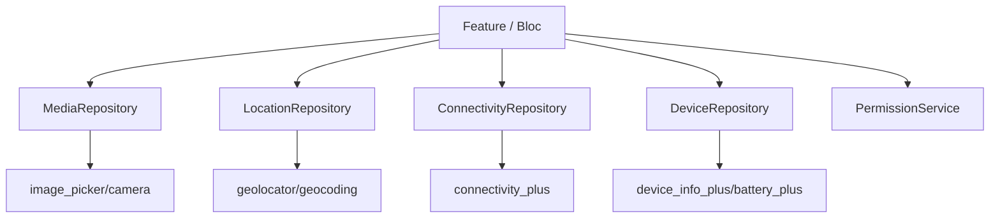
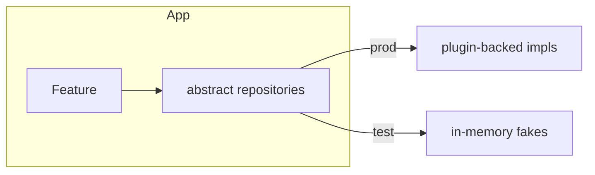

# Device Integration (Capstone: Features Behind Repositories)

> The unifying pattern for every device feature: wrap each native capability (camera, location, sensors, connectivity, battery, device info) behind a **repository** with a small domain API, **centralize permissions**, prefer **streams** for continuous data (cancel on dispose), and **degrade gracefully** when denied/unavailable — so the UI and tests never touch a plugin and the app stays portable, testable, and battery-friendly.

## Introduction

This module capstone ties the individual device features together into one architecture. Rather than sprinkling plugin calls across widgets, you expose each capability through a repository interface, inject it (DI — [Module 14](../14%20Dependency%20Injection/README.md)), and compose them in a feature. This file shows the pattern, a combined "photo + location + connectivity" example, and the cross-cutting concerns (permissions, lifecycle, errors, testing).

## Why this concept exists

Device plugins are imperative, permission-gated, lifecycle-sensitive, and platform-specific. Calling them directly from widgets makes code untestable (needs a real device), brittle (permission/lifecycle bugs), and hard to swap. A repository layer isolates these concerns behind a clean, mockable boundary — the same discipline used for networking/storage ([Module 16](../16%20Networking/README.md), [Module 15](../15%20Local%20Storage/README.md)).

## Real-world analogy

The repository is a **universal remote** for the device: the app presses simple buttons ("get photo", "where am I", "am I online") without knowing the make/model of each gadget (plugin) behind it. Swap a gadget (change plugin) or use a dummy one (mock in tests) — the remote's buttons don't change.

## Problem Statement

Build an "add place" feature: attach a photo (camera/gallery), tag it with the current location + address, show an online/offline banner, and record device/battery context — all composed from device repositories, permissions handled once, degrading gracefully, and unit-testable without a real device. You'll compose the repositories from this module.

## Internal Working



- **Interface per capability**: define abstract repositories (`MediaRepository`, `LocationRepository`, `ConnectivityRepository`, `DeviceRepository`) with domain methods returning domain types/`Result`/`Either` — not raw plugin types.
- **Centralized permissions**: a `PermissionService` ([27](../27%20Native%20Android/permissions_and_manifest.md)/[28](../28%20Native%20iOS/infoplist_and_permissions.md)) all repositories use; request in context, handle denied/restricted → Settings.
- **Streams for continuous data**: location tracking, sensors, connectivity are streams — expose them, and **cancel subscriptions** on dispose (bloc/state).
- **Graceful degradation**: every feature has a no-permission/unavailable path (skip location tag, hide the sensor feature, offline banner). Never crash on denial.
- **DI + testing**: inject repositories ([Module 14](../14%20Dependency%20Injection/README.md)); in tests provide fakes returning canned positions/files/online-state — no device needed ([Module 49](../49%20Testing/README.md)).
- **Errors**: convert plugin/permission failures into domain errors ([Module 38](../38%20Error%20Handling/README.md)).

## Memory Representation

Repositories are thin; the cost is in underlying resources (camera controller, GPS/sensor subscriptions). The repository layer is where you enforce disposal/cancellation.

## Compiler Behavior

Abstract interfaces let you compile against contracts; concrete plugin impls are injected — supports swapping/mocking.

## Runtime Behavior

The feature orchestrates async calls + stream subscriptions; repositories manage native resources; degradation paths run when capabilities are denied/unavailable.

## Flutter Engine Behavior

Underlying plugins use channels/textures/platform views as covered in their files; the repository layer adds no engine cost.

## Dart VM Behavior

Not applicable beyond the individual features (stream allocation churn — throttle sensors).

## Examples

```dart
// Domain interfaces (implementations wrap the plugins from this module)
abstract class MediaRepository { Future<File?> pickImage({required bool fromCamera}); }
abstract class LocationRepository {
  Future<Position> current();
  Future<String> addressOf(Position p);
}
abstract class ConnectivityRepository { Stream<bool> get isOnline; }

// Feature composing them — no plugin references, fully testable
class AddPlaceController {
  final MediaRepository media;
  final LocationRepository location;
  final PermissionService permissions;
  AddPlaceController(this.media, this.location, this.permissions);

  Future<PlaceDraft> capture() async {
    final photo = await media.pickImage(fromCamera: true); // null if cancelled
    Position? pos;
    String? address;
    try {
      pos = await location.current();           // may throw LocationException
      address = await location.addressOf(pos);
    } on LocationException {
      // graceful: save the place without a location tag
    }
    return PlaceDraft(photo: photo, position: pos, address: address);
  }
}
```

```dart
// Test with fakes — no real device
class FakeLocationRepository implements LocationRepository {
  @override
  Future<Position> current() async => Position(/* canned lat/lng ... */);
  @override
  Future<String> addressOf(Position p) async => '1 Test St, Testville';
}
// Inject FakeLocationRepository + a stub MediaRepository -> assert PlaceDraft.
```

## Diagrams



## Common Mistakes

| Mistake | Why | Fix |
|---------|-----|-----|
| Calling plugins from widgets | Untestable, brittle | Repository layer + DI |
| Permission logic scattered | Inconsistent/duplicated | One `PermissionService` |
| No degradation path | Crashes on denial/unavailable | Handle every denied/unavailable case |
| Leaking stream subscriptions | Battery drain | Cancel on dispose (bloc/state) |
| Returning raw plugin types | Leaks plugin into domain | Return domain types/`Result` |
| Untestable device code | Needs real hardware | Fakes behind interfaces |

## Best Practices

- One **repository interface per capability** returning **domain types**; inject via **DI**; keep plugins out of the UI.
- Centralize **permissions** in one service (in-context, Settings fallback); convert failures to **domain errors**.
- Prefer **streams** for continuous data and **cancel** them on dispose; enforce native-resource disposal in the repository layer.
- Provide **graceful degradation** for every capability; write **fakes** for tests (no device needed).

## Performance

The pattern adds no overhead; it's where you *enforce* battery discipline (cancel streams, release controllers, defer heavy work on low battery). Underlying feature costs (GPS/sensors/preview) dominate — manage them here.

## Advantages / Disadvantages

- **+** Testable (fakes), swappable (plugin-agnostic), consistent permissions/lifecycle, graceful degradation, single place to enforce battery discipline.
- **−** More boilerplate (interfaces/impls), indirection, requires DI discipline.

## Interview Questions

1. **🟢 Why wrap device plugins in repositories?** — To keep plugins out of the UI, make features testable with fakes, allow swapping plugins, and centralize permissions/lifecycle/errors.
2. **🟢 How do you test code that uses the camera/GPS?** — Inject fake repositories returning canned files/positions — no real device required.
3. **🟡 Where does permission logic live?** — In a single `PermissionService` used by all repositories (in-context requests, Settings fallback), not scattered in widgets.
4. **🟡 How do you prevent battery drain in this architecture?** — Expose continuous data as streams and cancel subscriptions on dispose; release native resources in the repository; defer heavy work on low battery.
5. **🟡 What should repositories return?** — Domain types/`Result`/`Either`, not raw plugin types — so the plugin never leaks into the domain/UI.
6. **🔴 How do you handle a denied permission or unavailable sensor?** — Every capability has a graceful-degradation path (skip the feature/tag, show a banner) and a domain error — never crash.
7. **🔴 How does this connect to offline-first?** — The `ConnectivityRepository` triggers sync; media/location feed queued writes (outbox) that flush on reconnect ([Module 19](../19%20Offline%20First/README.md)).

## Senior Engineer Tips

- Design the interface around the *feature's need* ("tag with current place"), not the plugin's API — that's what makes it swappable and testable.
- Put all disposal/cancellation in the repository or bloc `close()`; a forgotten subscription is the classic device-feature battery bug.
- Ship fakes alongside real impls from day one — device features are otherwise impossible to test in CI.

## Architect Perspective

Device integration is where clean architecture meets hardware: capabilities behind interfaces, permissions centralized, streams lifecycle-managed, failures degraded — the same boundary discipline as data/networking. This keeps a device-heavy app testable in CI, portable across plugins/platforms, and power-efficient, and it plugs directly into DI, offline-first, background work, and monitoring ([Module 14](../14%20Dependency%20Injection/README.md), [Module 19](../19%20Offline%20First/README.md), [Module 40](../40%20Clean%20Architecture/README.md)).

## Summary

- Wrap each device capability behind a repository interface returning domain types; inject via DI; keep plugins out of the UI.
- Centralize permissions, prefer streams (cancel on dispose), degrade gracefully, convert failures to domain errors.
- Provide fakes for CI testing; enforce battery discipline in the repository layer.

## Revision Notes

- Interface per capability (Media/Location/Connectivity/Device) → domain types; DI-injected; UI never touches plugins.
- One `PermissionService`; streams for continuous data + cancel on dispose; release native resources; graceful degradation everywhere.
- Domain errors ([Module 38](../38%20Error%20Handling/README.md)); fakes for tests ([Module 49](../49%20Testing/README.md)); connectivity triggers sync ([Module 19](../19%20Offline%20First/README.md)).

## Practice Questions

1. Why keep device plugins out of widgets?
2. How do you unit-test a feature that uses camera + GPS?
3. Where do you enforce stream cancellation and resource disposal?

## Coding Questions

1. Define `MediaRepository`/`LocationRepository`/`ConnectivityRepository` interfaces + plugin-backed impls.
2. Build a feature controller composing them with graceful degradation.
3. Write a unit test using fakes (no device).

## Mini Project

**"Add place" device slice (capstone — Flutter):** Compose `MediaRepository`, `LocationRepository`, `ConnectivityRepository`, and `DeviceRepository` (from this module) behind interfaces + DI to build an "add place" feature: attach a photo, tag it with current location + address (degrade if denied), show an online/offline banner, and record device/battery context. Provide fakes and a unit test covering the no-location path. Acceptance: features composed from repositories (no plugin in UI); permissions centralized; streams cancelled on dispose; graceful degradation for every capability; unit test passes without a device; runs on a real device end-to-end.
