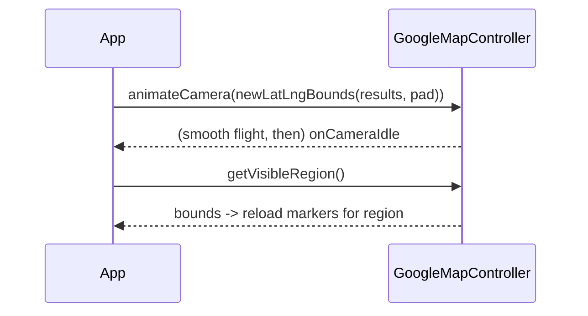

# Camera Control (Move/Animate, Bounds, Zoom, Gestures, Styling)

> Drive the viewport through the `GoogleMapController` with **`CameraUpdate`s**: `moveCamera` (instant) vs `animateCamera` (smooth), by target/zoom, by `LatLngBounds` (fit multiple points with padding), or by bearing/tilt for 3D — plus gesture toggles, zoom limits, and JSON **map styling**; listen to `onCameraMove`/`onCameraIdle` to react to user panning.

## Introduction

The camera is what the user sees: center, zoom, bearing, tilt. You control it imperatively via the controller using `CameraUpdate` factories, and observe user-driven changes via callbacks. This file covers moving/animating, fitting bounds, zoom/gesture config, styling, and reacting to camera events.

## Why this concept exists

Maps must focus on what matters — the user, a route, a set of results — and respond to interaction. `CameraUpdate` is the declarative description of a viewport change; the controller applies it (instantly or animated). Callbacks let the app react (e.g., reload markers for the visible region).

## Real-world analogy

The camera is a **drone over the map**: you tell it a destination (`CameraUpdate`) and whether to **teleport** (`moveCamera`) or **fly smoothly** (`animateCamera`); "fit these points" is "**rise until everyone's in frame**" (bounds). Gesture/zoom settings are the **remote's enabled buttons**; `onCameraIdle` fires when the drone stops so you can **survey what's now visible**.

## Problem Statement

Animate to the user's location on load, fit all search results in view with padding, cap zoom, disable rotation, apply a dark map style, and reload markers when the user stops panning. You'll use `CameraUpdate`, config flags, styling, and camera callbacks.

## Internal Working

```mermaid
flowchart TD
    Update[CameraUpdate.newLatLngZoom / newLatLngBounds / zoomIn ...] --> Apply{move or animate?}
    Apply -->|moveCamera| Instant[instant jump]
    Apply -->|animateCamera| Smooth[smooth flight]
    User[user pans/zooms] --> Move[onCameraMove] --> Idle[onCameraIdle -> react (reload visible region)]
```

- **`CameraUpdate` factories**: `newLatLng(latLng)`, `newLatLngZoom(latLng, zoom)`, `newCameraPosition(CameraPosition(target, zoom, bearing, tilt))`, `newLatLngBounds(bounds, padding)`, `zoomIn/zoomOut/zoomTo(level)`, `scrollBy`.
- **Apply**: `controller.animateCamera(update)` (smooth, preferred for UX) or `controller.moveCamera(update)` (instant, e.g., initial jump). Both are async.
- **Fit bounds**: build `LatLngBounds(southwest, northeast)` covering all points, then `newLatLngBounds(bounds, padding)`. **Gotcha**: calling it before the map is laid out throws — await map creation, and compute bounds correctly (min/max lat/lng).
- **Config flags** (widget): `minMaxZoomPreference`, `rotateGesturesEnabled`, `tiltGesturesEnabled`, `scrollGesturesEnabled`, `zoomGesturesEnabled`, `zoomControlsEnabled`, `compassEnabled`, `mapType` (normal/satellite/terrain/hybrid).
- **Styling**: `controller.setMapStyle(jsonString)` (or `style` param) — JSON from the Google Maps styling wizard (dark mode, hide POIs). Invalid JSON silently fails — validate.
- **Callbacks**: `onCameraMove(CameraPosition)` (fires continuously — keep cheap), `onCameraIdle()` (fires when movement stops — do work here, e.g., query visible region via `controller.getVisibleRegion()`).

## Memory Representation

Camera state is a small `CameraPosition`. Reacting to `onCameraIdle` by loading region data is where cost lives — debounce/limit.

## Compiler Behavior

Not applicable.

## Runtime Behavior

`animateCamera` runs a timed native animation; rapid successive animations can queue/cancel. `onCameraMove` fires many times per gesture — throttle any work.

## Flutter Engine Behavior

Camera animation happens natively on the map view; Flutter isn't driving the frames — no Flutter jank from the animation itself, but heavy `onCameraMove` Dart work can still jank the UI thread.

## Dart VM Behavior

Not applicable; camera commands marshalled to native.

## Examples

```dart
import 'package:google_maps_flutter/google_maps_flutter.dart';

class MapCamera {
  final GoogleMapController controller;
  MapCamera(this.controller);

  Future<void> goTo(LatLng target, {double zoom = 15}) =>
      controller.animateCamera(CameraUpdate.newLatLngZoom(target, zoom));

  // Fit all points in view with padding
  Future<void> fitAll(List<LatLng> points, {double padding = 48}) async {
    if (points.isEmpty) return;
    double minLat = points.first.latitude, maxLat = minLat;
    double minLng = points.first.longitude, maxLng = minLng;
    for (final p in points) {
      minLat = p.latitude < minLat ? p.latitude : minLat;
      maxLat = p.latitude > maxLat ? p.latitude : maxLat;
      minLng = p.longitude < minLng ? p.longitude : minLng;
      maxLng = p.longitude > maxLng ? p.longitude : maxLng;
    }
    final bounds = LatLngBounds(
      southwest: LatLng(minLat, minLng),
      northeast: LatLng(maxLat, maxLng),
    );
    await controller.animateCamera(CameraUpdate.newLatLngBounds(bounds, padding));
  }
}
```

```dart
// Widget config + reacting to idle (reload markers for the visible region)
GoogleMap(
  initialCameraPosition: _start,
  minMaxZoomPreference: const MinMaxZoomPreference(3, 18),
  rotateGesturesEnabled: false,
  mapType: MapType.normal,
  onCameraIdle: () async {
    final region = await (await _controller.future).getVisibleRegion();
    _reloadMarkersFor(region);      // debounced query for what's visible
  },
  onMapCreated: (c) => _controller.complete(c),
);
```

## Diagrams



## Common Mistakes

| Mistake | Why | Fix |
|---------|-----|-----|
| `newLatLngBounds` before layout | Throws / no-op | Await map creation; ensure size |
| Wrong bounds (sw/ne swapped) | Crash/odd view | Compute min→sw, max→ne correctly |
| Heavy work in `onCameraMove` | Jank (fires constantly) | Do work in `onCameraIdle`, debounce |
| `moveCamera` everywhere | Jarring UX | Prefer `animateCamera` for user-initiated moves |
| Invalid style JSON | Silently ignored | Validate JSON from the styling wizard |
| No zoom limits | Over/under-zoom, cost | `minMaxZoomPreference` |

## Best Practices

- Prefer **`animateCamera`** for user-facing moves; `moveCamera` for the initial jump; both are async — await if sequencing.
- Use **`newLatLngBounds` + padding** to frame multiple points (after map is laid out; compute bounds correctly).
- Do reactive work in **`onCameraIdle`** (with `getVisibleRegion`), not `onCameraMove`; **debounce** region reloads.
- Set **zoom limits + gesture flags** to match the UX; apply **validated style JSON**; keep `onCameraMove` handlers trivial.

## Performance

Camera animation is native (cheap for Flutter). The cost is your reaction: `onCameraMove` fires rapidly (keep empty/cheap) and `onCameraIdle` region reloads must be debounced/bounded to avoid request/marker storms.

## Advantages / Disadvantages

- **+** Precise viewport control (target/zoom/bearing/tilt/bounds), smooth animation, styling, rich gesture config, react-to-view callbacks.
- **−** Bounds-before-layout gotcha, `onCameraMove` firing storms, imperative/async model, silent style failures.

## Interview Questions

1. **🟢 `moveCamera` vs `animateCamera`?** — `moveCamera` jumps instantly; `animateCamera` flies smoothly — prefer animate for user-initiated moves.
2. **🟢 How do you fit multiple points in view?** — Build a `LatLngBounds` covering them and `animateCamera(CameraUpdate.newLatLngBounds(bounds, padding))`.
3. **🟡 Why can `newLatLngBounds` throw?** — If called before the map has a size/layout; await map creation first.
4. **🟡 Why do work in `onCameraIdle` not `onCameraMove`?** — `onCameraMove` fires continuously during gestures (jank); `onCameraIdle` fires once when movement stops.
5. **🟡 How do you style the map (e.g., dark mode)?** — `setMapStyle` with JSON from the Maps styling wizard (validate — invalid JSON silently fails).
6. **🔴 How do you reload only what's visible?** — In `onCameraIdle`, call `getVisibleRegion()` and query markers for that bounds (debounced).
7. **🔴 How do you constrain zoom/gestures?** — `minMaxZoomPreference` + gesture flags (`rotate/tilt/scroll/zoomGesturesEnabled`) on the widget.

## Senior Engineer Tips

- Frame results with `newLatLngBounds` + padding rather than guessing a zoom — it always fits and looks intentional.
- Treat `onCameraMove` as hot path: no allocations/setState; push all reactive work to a debounced `onCameraIdle`.
- Validate style JSON at build/test time; a silent style failure is a confusing "why is it still light mode" bug.

## Architect Perspective

Camera control is the viewport-orchestration layer: declarative `CameraUpdate`s applied via the controller, with reactive region loading gated behind idle + debounce. Encapsulating it (a `MapCamera` helper) and keeping move-handlers cheap yields smooth, responsive maps that fetch only visible data — integrating with overlays, live tracking, and networking budgets ([02_markers_and_overlays.md](02_markers_and_overlays.md), [04_live_location_and_clustering.md](04_live_location_and_clustering.md)).

## Summary

- Control the viewport with `CameraUpdate` (target/zoom/bounds/bearing/tilt) via `animateCamera` (smooth) or `moveCamera` (instant).
- Fit points with `newLatLngBounds` + padding (after layout); set zoom limits/gestures; apply validated style JSON.
- React in `onCameraIdle` (+ `getVisibleRegion`, debounced), keep `onCameraMove` trivial.

## Revision Notes

- `CameraUpdate`: `newLatLngZoom`, `newCameraPosition(target,zoom,bearing,tilt)`, `newLatLngBounds(bounds,padding)`, `zoomTo`. Apply via `animateCamera`/`moveCamera` (async).
- Bounds after layout; compute sw(min)/ne(max) correctly; `minMaxZoomPreference` + gesture flags; `setMapStyle(json)` (validate).
- `onCameraMove` (cheap/throttle) vs `onCameraIdle` (do work, `getVisibleRegion`, debounce).

## Practice Questions

1. When would you use `moveCamera` vs `animateCamera`?
2. How do you fit a set of markers in view, and what's the gotcha?
3. Why put region reloads in `onCameraIdle` with debouncing?

## Coding Questions

1. Implement `fitAll(List<LatLng>)` computing bounds + animating with padding.
2. Reload markers for the visible region on `onCameraIdle` (debounced).
3. Apply a dark map style from JSON and cap zoom.

## Mini Project

**Camera + viewport (Flutter):** Extend the store map with a `MapCamera` helper: animate to the user on load, "fit all results" (bounds + padding), cap zoom (3–18), disable rotation, apply a dark style, and reload markers for the visible region on `onCameraIdle` (debounced). Acceptance: smooth animate-to + fit-bounds (no throw); zoom/gestures constrained; dark style applies; visible-region reload debounced; `onCameraMove` stays trivial; runs on device.
