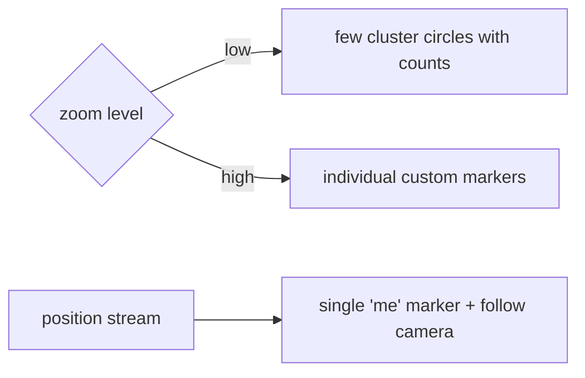

# Custom Markers, Live Location & Clustering

> Three scaling patterns: render **custom marker icons** (`BitmapDescriptor` from asset/bytes/widget) instead of default pins; show **live location** by driving a single "me" marker + camera from the geolocator position stream ([Module 29](../29%20Device%20Features/02_geolocation.md)); and **cluster** hundreds/thousands of markers (via `google_maps_cluster_manager` or server-side grid clustering) so the map stays smooth.

## Introduction

Real map apps go beyond static default pins: branded icons, a moving "you are here" marker, and datasets too large to render one-pin-per-point. This file covers custom `BitmapDescriptor` icons, wiring a live-location stream to a marker + follow-camera, and clustering strategies for scale.

## Why this concept exists

Default pins don't convey type/brand; a static map can't track movement; and thousands of raw markers jank the native map and overwhelm the user. Custom icons, live streams, and clustering solve identity, motion, and scale respectively — the difference between a demo and a production map.

## Real-world analogy

Custom markers are **branded pins** (a coffee cup for cafés). Live location is a **moving "you are here" dot** that the map gently follows. Clustering is **grouping a crowd into labeled circles** ("42 here") that split apart as you zoom in — like a map that summarizes a mob instead of drawing every face.

## Problem Statement

Use branded icons for store types, show the user's live position as a moving marker with an optional follow-camera, and render 2,000 place markers via clustering that expands on zoom. You'll build `BitmapDescriptor`s, consume the location stream, and integrate a cluster manager.

## Internal Working

```mermaid
flowchart TD
    Icon[BitmapDescriptor from asset/bytes/widget] --> Marker[Marker(icon:)]
    Loc[geolocator getPositionStream] --> MeMarker[update single 'me' marker]
    MeMarker --> Follow{follow mode?}
    Follow -->|yes| Cam[animateCamera to position]
    Big[2000 points] --> Cluster[ClusterManager: group by zoom -> cluster markers]
    Cluster -->|zoom in| Split[clusters split into individual markers]
```

- **Custom markers (`BitmapDescriptor`)**: `BitmapDescriptor.asset(...)` / `fromBytes(pngBytes)` (render a Flutter widget → image → bytes for fully custom pins) / `defaultMarkerWithHue(...)`. Cache descriptors (creating them is not free); size for density.
- **Live location**: subscribe to `geolocator.getPositionStream()` ([29 · geolocation](../29%20Device%20Features/02_geolocation.md)); on each `Position`, replace the single **"me"** marker (`copyWith` new position, or a custom bearing icon) and, if following, `animateCamera` to it. **Cancel** the subscription on dispose. Throttle updates (distance filter) to avoid churn.
- **Clustering**: raw markers don't scale — group nearby points into cluster markers that show a count and split as you zoom.
  - **Client-side**: `google_maps_cluster_manager` — feed it items with `LatLng`; it recomputes clusters on camera move and yields a `Set<Marker>` (cluster or single). Simple, good to ~thousands.
  - **Server-side**: for very large/dynamic sets, cluster on the backend by the current bounds+zoom (grid/geohash) and return cluster summaries — less client work, scales further.
- **Selection**: tapping a cluster → zoom to expand; tapping a single marker → details.

## Memory Representation

Each `BitmapDescriptor` holds a bitmap — cache and reuse. Clustering keeps the rendered marker count small regardless of dataset size (the win). The live "me" marker is a single overlay updated in place.

## Compiler Behavior

Not applicable.

## Runtime Behavior

The location stream emits as the user moves (throttled by distance filter); the cluster manager recomputes on camera idle/move. Uncapped raw markers degrade frame time as count grows.

## Flutter Engine Behavior

Markers (custom or clustered) render on the native map (platform view). Rendering a Flutter widget to a `BitmapDescriptor` uses the engine's image pipeline once, then the bytes are reused.

## Dart VM Behavior

Not applicable; clustering math runs in Dart (client-side) — keep it off the critical path (it runs on camera idle).

## Examples

```dart
import 'package:google_maps_flutter/google_maps_flutter.dart';
import 'package:geolocator/geolocator.dart';
import 'dart:async';

// Live "me" marker + optional follow-camera
class LiveLocationMap {
  final GoogleMapController controller;
  final void Function(Marker me) onMe;
  StreamSubscription<Position>? _sub;
  bool follow;
  LiveLocationMap(this.controller, this.onMe, {this.follow = true});

  void start(Stream<Position> positions) {
    _sub = positions.listen((p) {
      final me = Marker(
        markerId: const MarkerId('me'),
        position: LatLng(p.latitude, p.longitude),
        rotation: p.heading,               // point the icon along travel
        flat: true,
      );
      onMe(me);                            // caller puts it in the marker set
      if (follow) {
        controller.animateCamera(CameraUpdate.newLatLng(me.position));
      }
    });
  }

  void dispose() => _sub?.cancel();        // stop GPS + follow
}
```

```dart
import 'package:google_maps_cluster_manager/google_maps_cluster_manager.dart';

// Client-side clustering: items implement ClusterItem (expose a LatLng)
class Place with ClusterItem {
  final String id; final LatLng latLng;
  Place(this.id, this.latLng);
  @override LatLng get location => latLng;
}

late ClusterManager<Place> manager;
Set<Marker> _clusterMarkers = {};

void initClustering(List<Place> places, GoogleMapController c) {
  manager = ClusterManager<Place>(
    places,
    (markers) => _clusterMarkers = markers, // updateMarkers callback -> setState
    markerBuilder: (cluster) async => Marker(
      markerId: MarkerId(cluster.getId()),
      position: cluster.location,
      infoWindow: InfoWindow(title: cluster.isMultiple ? '${cluster.count} places' : cluster.items.first.id),
      onTap: () { /* multiple -> zoom to expand; single -> details */ },
    ),
  );
  manager.setMapId(c.mapId);
}
// Wire GoogleMap.onCameraMove: manager.onCameraMove; onCameraIdle: manager.updateMap();
```

## Diagrams



## Common Mistakes

| Mistake | Why | Fix |
|---------|-----|-----|
| Recreating `BitmapDescriptor` per build | Wasteful/jank | Create once, cache/reuse |
| Raw markers for large datasets | Jank/OOM | Cluster (client or server) |
| New marker id per location update | Marker piles up | Reuse a single `'me'` id |
| Not cancelling the location stream | Battery drain | Cancel on dispose |
| Follow-camera fighting user pan | Annoying UX | Toggle follow off when user interacts |
| Clustering math on `onCameraMove` | Jank | Recompute on idle/updateMap |

## Best Practices

- **Cache `BitmapDescriptor`s**; size icons for screen density; render-widget-to-bytes only once.
- Live location: update a **single `'me'` marker** from a throttled position stream, **cancel on dispose**, and let the user **disable follow** by interacting.
- **Cluster** anything beyond a few hundred markers — client-side (`cluster_manager`) for thousands, **server-side** (bounds+zoom grid/geohash) for very large/dynamic sets.
- Recompute clusters on **idle/`updateMap`**, not per move frame; tap-cluster → zoom to expand.

## Performance

Clustering is the key scale lever — it caps rendered markers regardless of dataset size. Cache icons, throttle the location stream (distance filter), and keep clustering off the per-frame path. Uncapped markers are the #1 map jank source.

## Advantages / Disadvantages

- **+** Branded/identity markers, smooth live tracking, and datasets of thousands rendered smoothly via clustering.
- **−** Icon caching/rendering complexity, stream lifecycle (battery), clustering setup + recompute cost, follow-vs-user-gesture UX tension.

## Interview Questions

1. **🟢 How do you use a custom marker icon?** — Set `Marker.icon` to a `BitmapDescriptor` (from asset/bytes/rendered widget); cache it.
2. **🟢 How do you show the user's live location?** — Subscribe to the geolocator position stream and update a single `'me'` marker (and optionally follow with `animateCamera`), cancelling on dispose.
3. **🟡 Why must live-location updates reuse one marker id?** — A new id per update accumulates stale markers; reusing `'me'` moves the same one.
4. **🟡 Why and when do you cluster?** — Beyond a few hundred markers rendering jank/OOMs; clustering caps rendered count and summarizes density, expanding on zoom.
5. **🟡 Client-side vs server-side clustering?** — Client (`cluster_manager`) is simple, good to thousands; server-side (bounds+zoom grid/geohash) offloads work and scales to very large/dynamic sets.
6. **🔴 How do you keep clustering smooth?** — Recompute on camera idle/`updateMap` (not per move frame); cache icons; throttle data.
7. **🔴 How do you handle follow-camera vs user panning?** — Disable follow when the user interacts, re-enable via a button — don't fight the user's gesture.

## Senior Engineer Tips

- Precompute and cache every custom icon at startup; building descriptors in `build`/per-marker is a classic jank source.
- Decide clustering strategy by dataset trajectory: if it can grow unbounded or is server-driven, cluster server-side by bounds+zoom from day one.
- Bind the live-location subscription to bloc/state disposal and add a follow toggle — the two most common live-map bugs are a leaked GPS stream and a camera that won't let the user look around.

## Architect Perspective

These three patterns turn a basic map into a production one: identity (custom icons), motion (live stream behind a repository), and scale (clustering, ideally server-side for large sets). Keeping icons cached, streams lifecycle-managed, and clustering off the per-frame path — all behind a controller/repository — makes map-heavy features performant and testable, integrating location, networking, and performance budgets ([Module 29](../29%20Device%20Features/02_geolocation.md), [Module 16](../16%20Networking/README.md), [Module 21](../21%20Performance/README.md)).

## Summary

- Custom markers via cached `BitmapDescriptor`; live location via a single throttled `'me'` marker + optional follow-camera (cancel on dispose).
- Cluster large datasets (client-side to thousands, server-side beyond); recompute on idle, not per frame.
- These solve identity, motion, and scale — the jump from demo to production.

## Revision Notes

- `BitmapDescriptor.asset/fromBytes/defaultMarkerWithHue` — cache; widget→bytes once.
- Live: subscribe position stream → update single `'me'` marker (`rotation:` heading), follow via `animateCamera`, cancel on dispose, throttle.
- Cluster: client `google_maps_cluster_manager` (ClusterItem, markerBuilder, onCameraMove/updateMap) to thousands; server-side (bounds+zoom grid/geohash) for very large; recompute on idle.

## Practice Questions

1. Why cache `BitmapDescriptor`s?
2. How do you render and follow a live user position without leaking the stream?
3. When do you choose server-side over client-side clustering?

## Coding Questions

1. Create + cache a custom marker icon and use it for a marker type.
2. Wire a live `'me'` marker from the geolocator stream with a follow toggle, cancelled on dispose.
3. Integrate `google_maps_cluster_manager` for 2,000 points, expanding on zoom.

## Mini Project

**Live + clustered map (Flutter):** Extend the store map: use cached custom icons per store type, show a live `'me'` marker driven by the geolocator stream with a follow toggle (subscription cancelled on dispose), and cluster 2,000 place markers with `google_maps_cluster_manager` (tap cluster → zoom to expand, tap single → details). Acceptance: custom icons cached; live marker tracks + follow toggles; stream cancelled; 2,000 points render smoothly via clustering that recomputes on idle; runs on device.
