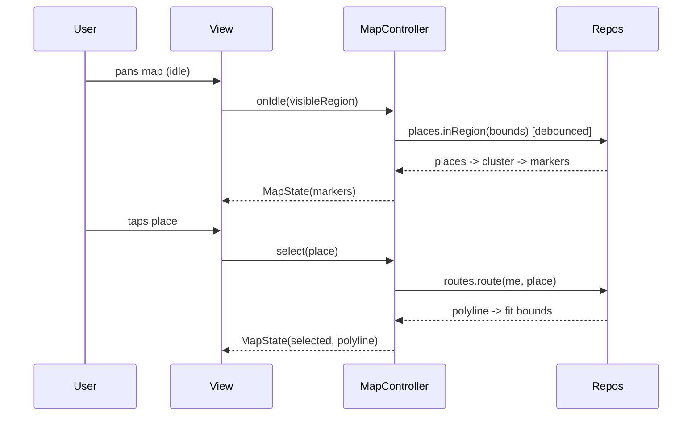

# Maps Integration (Capstone: Map Behind a Controller/Repository)

> Pull the pieces together into one architecture: keep the imperative `GoogleMapController` and all map **state (markers/polylines/camera/selection)** inside a dedicated controller/bloc, feed it data through **repositories** (places, route, live location), and expose the map widget as a thin view — so the map is testable, its heavy native cost is contained to one instance, and features (live tracking, search-in-area, routing) compose cleanly.

## Introduction

This module capstone unifies setup, overlays, camera, and scaling into a maintainable structure. The problem with maps is that the plugin is imperative and stateful; scattering `setState`+controller calls across a widget becomes unmanageable. The fix is the same as elsewhere: a controller/bloc owns map state, repositories provide data, and the widget just renders. This file shows that architecture and a combined live-tracking + search-in-area example.

## Why this concept exists

Map screens accumulate concerns fast: permissions, controller readiness, marker/camera state, live streams, clustering, region queries, selection. Without a boundary, this bleeds into one giant `StatefulWidget`. A map controller/bloc + repositories isolate data, state, and native access — testable and composable, consistent with clean architecture ([Module 40](../40%20Clean%20Architecture/README.md)).

## Real-world analogy

The map widget is a **cockpit display**; the map controller/bloc is the **flight computer** holding current state and issuing commands; the repositories are the **instruments feeding data** (GPS, traffic, waypoints). The pilot (UI) reads the display and presses buttons — it doesn't wire the sensors directly.

## Problem Statement

Build a "places near me" screen: live user marker (following until the user pans), clustered place markers loaded for the visible region, a route polyline to a selected place, camera that fits results, and a details panel on selection — with map state in a bloc, data from repositories, and the widget kept thin + testable. You'll compose everything from this module.

## Internal Working

```mermaid
flowchart TD
    View[MapView (thin widget)] --> Bloc[MapBloc/Controller (owns state + GoogleMapController)]
    Bloc --> PlacesRepo[PlacesRepository (region query)]
    Bloc --> LocationRepo[LocationRepository (position stream)]
    Bloc --> RouteRepo[RouteRepository (polyline)]
    Bloc --> Cluster[ClusterManager]
    Bloc -->|state: markers/polylines/camera/selection| View
```

- **MapBloc/Controller** owns: the `GoogleMapController` (via `Completer`), the overlay sets (markers/polylines), camera intents, selection, follow-mode, and the live-location subscription. It exposes a single immutable `MapState` the view renders.
- **Repositories** feed data (no plugin in the bloc's collaborators): `LocationRepository.track()` ([29 · geolocation](../29%20Device%20Features/02_geolocation.md)), `PlacesRepository.inRegion(bounds)` ([Module 16](../16%20Networking/README.md)), `RouteRepository.route(from,to)`. Injected via DI ([Module 14](../14%20Dependency%20Injection/README.md)).
- **Flow**: `onCameraIdle` → get visible region → `PlacesRepository.inRegion` (debounced) → feed cluster manager → emit markers. Location stream → update `'me'` marker + follow camera. Select place → fetch route → polyline + fit bounds.
- **Lifecycle**: cancel the location subscription and dispose the controller in the bloc's `close()`; one map instance only.
- **Testing**: the bloc is testable with fake repositories (canned positions/places/routes) — no map/device needed; the widget is a thin `BlocBuilder`.

## Memory Representation

State is small immutable data (sets + camera + selection). The heavy native map (one instance) is disposed with the screen; clustering caps rendered markers; the "me" marker is a single overlay.

## Compiler Behavior

The bloc/repositories compile against interfaces (mockable); the concrete plugin lives behind the controller wrapper only.

## Runtime Behavior

The bloc orchestrates async region loads (debounced), a live stream, and route fetches, emitting states the view renders; native map applies overlays/camera.

## Flutter Engine Behavior

One platform-view map composited into the surface; overlays/camera are native. The architecture doesn't add engine cost — it *contains* it to one instance.

## Dart VM Behavior

Clustering math + state reducers run in Dart on idle/events (off the per-frame path). Streams should be throttled.

## Examples

```dart
// MapState: everything the view needs to render (immutable)
class MapState {
  final Set<Marker> markers;
  final Set<Polyline> polylines;
  final Place? selected;
  final bool following;
  const MapState({this.markers = const {}, this.polylines = const {},
                  this.selected, this.following = true});
  MapState copyWith({Set<Marker>? markers, Set<Polyline>? polylines,
                     Place? selected, bool? following}) => MapState(
    markers: markers ?? this.markers, polylines: polylines ?? this.polylines,
    selected: selected ?? this.selected, following: following ?? this.following);
}

// Controller owns GoogleMapController + subscriptions; fed by repositories
class MapController {
  final LocationRepository location;
  final PlacesRepository places;
  final RouteRepository routes;
  final _map = Completer<GoogleMapController>();
  StreamSubscription? _locSub;
  MapController(this.location, this.places, this.routes);

  void attach(GoogleMapController c) => _map.complete(c);

  Future<void> startTracking(void Function(Marker me) emitMe) async {
    _locSub = location.track().listen((p) async {
      emitMe(Marker(markerId: const MarkerId('me'),
          position: LatLng(p.latitude, p.longitude)));
      // if following: (await _map.future).animateCamera(...)
    });
  }

  Future<void> onIdle(LatLngBounds region, void Function(List<Place>) emit) async {
    emit(await places.inRegion(region));   // debounced upstream -> cluster
  }

  Future<void> dispose() async {
    await _locSub?.cancel();               // stop GPS
    if (_map.isCompleted) (await _map.future).dispose(); // release native map
  }
}
```

```dart
// The view is thin: render state, forward events to the controller/bloc
GoogleMap(
  initialCameraPosition: _start,
  markers: state.markers,
  polylines: state.polylines,
  onMapCreated: controller.attach,
  onCameraIdle: () => controller.onIdleFromVisibleRegion(),
);
```

## Diagrams



## Common Mistakes

| Mistake | Why | Fix |
|---------|-----|-----|
| Map logic in a giant StatefulWidget | Untestable, unmaintainable | Bloc/controller owns state + native access |
| Plugin types in bloc collaborators | Couples domain to plugin | Repositories return domain types |
| No debounce on region loads | Request/marker storms | Debounce `onCameraIdle` queries |
| Leaking location subscription / map | Battery/memory | Cancel + dispose in `close()` |
| Multiple map instances | Compositing/memory cost | One map per screen |
| Untestable map screen | Needs device | Fake repositories, thin view |

## Best Practices

- Put **all map state + the `GoogleMapController`** in a **bloc/controller**; keep the widget a thin renderer of `MapState`.
- Feed data via **repositories returning domain types** (location/places/routes), injected by DI; **debounce** region queries.
- **Cluster** at scale, **cancel** the live subscription + **dispose** the map in `close()`, keep **one** map instance.
- Make the bloc **testable with fakes** (no device/map); model camera/selection/follow as explicit state.

## Performance

The architecture contains the map's native cost to one disposable instance, caps markers via clustering, and gates network via debounced region loads — the three levers that keep a data-heavy map at 60fps. Throttle the live stream; keep reducers cheap.

## Advantages / Disadvantages

- **+** Testable (fakes), maintainable (state in one place), composable features (tracking/search/routing), contained native cost, clean data boundary.
- **−** More structure/boilerplate (state class, controller, repos), DI discipline, still bounded by the map's inherent native cost.

## Interview Questions

1. **🟢 Why not keep all map logic in the widget?** — It becomes an untestable, unmaintainable god-widget; a bloc/controller owning state + native access is testable and composable.
2. **🟢 What should repositories return to the map bloc?** — Domain types (positions/places/routes), not plugin types — keeping the domain decoupled from `google_maps_flutter`.
3. **🟡 How do you load only visible data efficiently?** — On debounced `onCameraIdle`, query `PlacesRepository.inRegion(visibleBounds)` and feed clustering.
4. **🟡 Where do you cancel the location stream and dispose the map?** — In the bloc/controller's `close()`/`dispose()` — tie native resources to the state object's lifecycle.
5. **🟡 How do you test a map screen without a device?** — Unit-test the bloc with fake repositories (canned data); the view is a thin `BlocBuilder`.
6. **🔴 How do live tracking, search-in-area, and routing compose?** — Each is an event/state transition in the bloc fed by its repository — location stream → me marker; idle → region places; select → route polyline + fit.
7. **🔴 What are the three performance levers for a data-heavy map?** — One disposable map instance, clustering to cap markers, and debounced region loads to gate network.

## Senior Engineer Tips

- Model the map as a state machine (`MapState` + events); it turns "spaghetti of setState + controller calls" into testable transitions.
- Keep the `GoogleMapController` behind the bloc via a `Completer` so events that arrive before map-ready simply await.
- Tie GPS subscription + map disposal to `close()` and enforce a single map instance — the recurring production bugs are leaked streams, undisposed maps, and un-debounced region fetches.

## Architect Perspective

Maps integration applies clean-architecture discipline to an imperative, expensive native view: state and the controller live in a bloc, data flows through domain repositories, and the widget is a thin projection. This makes map features testable in CI, composable (tracking/search/routing as state transitions), and performant (one instance, clustered, debounced) — the same boundary pattern as the rest of the app, now over a platform-view-backed map ([Module 40](../40%20Clean%20Architecture/README.md), [Module 11](../11%20State%20Management/README.md), [Module 21](../21%20Performance/README.md)).

## Summary

- Own map state + the controller in a bloc; feed it via repositories returning domain types; keep the widget thin.
- Debounce region loads, cluster at scale, cancel the live stream + dispose the map in `close()`, one instance.
- Test the bloc with fakes; compose tracking/search/routing as state transitions.

## Revision Notes

- Bloc/controller owns `MapState` (markers/polylines/camera/selection/follow) + `GoogleMapController` (via `Completer`).
- Repositories (location/places/routes) return domain types, DI-injected; `onCameraIdle` → debounced `inRegion` → cluster.
- Cancel location sub + dispose map in `close()`; one map instance; test bloc with fakes; view = thin `BlocBuilder`.

## Practice Questions

1. What belongs in the map bloc vs the widget?
2. How do you load only the visible region efficiently?
3. Where are the map's native resources released?

## Coding Questions

1. Design `MapState` + a `MapController` owning the controller and a live subscription.
2. Implement debounced `onCameraIdle` → `PlacesRepository.inRegion` → clustered markers.
3. Unit-test the controller with fake repositories (no device).

## Mini Project

**"Places near me" map (capstone — Flutter):** Build a `MapController`/bloc owning `MapState` and the `GoogleMapController`, fed by `LocationRepository` (live `'me'` marker + follow toggle), `PlacesRepository.inRegion` (debounced on idle → clustered markers), and `RouteRepository` (polyline + fit bounds on selection), with a details panel. Cancel the subscription + dispose the map in `close()`; keep the widget thin. Provide fakes + a unit test for the idle→places flow. Acceptance: live tracking + follow toggle; clustered region loads (debounced); route on selection with fit-bounds; one disposed map instance; bloc unit-tested with fakes (no device); runs end-to-end on device.
