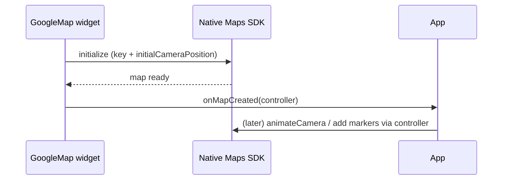

# Maps Setup & the `GoogleMap` Widget

> Add `google_maps_flutter`, register a **per-platform API key** (Android manifest / iOS `AppDelegate`, both from a billing-enabled Google Cloud project with the Maps SDKs enabled), then drop a **`GoogleMap`** widget with an `initialCameraPosition` and grab its **`GoogleMapController`** via `onMapCreated` — the controller is how you drive everything imperatively afterward.

## Introduction

Before any markers or camera work, you need the plugin installed, API keys wired per platform, and the map rendering. This file covers setup (keys/billing/SDK enablement), the `GoogleMap` widget's core config, and capturing the `GoogleMapController` — the handle for all later operations.

## Why this concept exists

Google Maps is a paid Google Cloud service rendered by native SDKs; Flutter embeds it via platform views ([27](../27%20Native%20Android/platform_views_android.md)/[28](../28%20Native%20iOS/platform_views_ios.md)). Keys authenticate/bill your usage per platform, and the widget/controller split (declarative widget + imperative controller) reflects that the map is a stateful native view you command after creation.

## Real-world analogy

Setting up Maps is like **leasing a metered kiosk in a mall**: you sign with the landlord (Google Cloud project + billing), get **keys to your specific unit** (per-platform API keys), then the kiosk (the `GoogleMap` widget) opens at a **starting location** (`initialCameraPosition`). The **controller** is your staff phone line to rearrange the kiosk after it's open.

## Problem Statement

Get a map on screen: create a Cloud project with billing + Maps SDKs, add Android + iOS API keys, install the plugin, and render a `GoogleMap` centered on a city, capturing its controller. You'll edit native config and add the widget.

## Internal Working

```mermaid
flowchart TD
    Cloud[Google Cloud project + billing + Maps SDK (Android/iOS)] --> Keys[API keys per platform]
    Keys --> AndroidKey[AndroidManifest meta-data]
    Keys --> IOSKey[AppDelegate GMSServices.provideAPIKey]
    Widget[GoogleMap(initialCameraPosition,...)] --> Created[onMapCreated -> GoogleMapController]
    Created --> Drive[camera/markers/overlays via controller]
```

- **Cloud/billing**: create a project, enable **Maps SDK for Android** + **Maps SDK for iOS**, enable billing, and (best practice) **restrict** each key (by app id/bundle + API). Usage is metered/billed.
- **Android**: add the key as `<meta-data android:name="com.google.android.geo.API_KEY" .../>` in `AndroidManifest.xml`; set a suitable `minSdkVersion`.
- **iOS**: `GMSServices.provideAPIKey("...")` in `AppDelegate` before `super.application(...)`; add location usage strings if showing user location ([28 · infoplist](../28%20Native%20iOS/infoplist_and_permissions.md)).
- **Widget**: `GoogleMap(initialCameraPosition: CameraPosition(target: LatLng(...), zoom: ...), onMapCreated: ...)`. Config flags: `myLocationEnabled`, `myLocationButtonEnabled`, `mapType`, `zoomControlsEnabled`, `markers`, `polylines`, etc.
- **Controller**: `onMapCreated: (c) => _controller = c;` — store it (often in a `Completer` or state/bloc) to call `animateCamera`, `showMarkerInfoWindow`, screenshot, etc. The controller is available only **after** creation.
- **`myLocationEnabled`**: shows the blue dot; requires location permission ([29 · geolocation](../29%20Device%20Features/geolocation.md)).

## Memory Representation

The map is a native view with its own tile cache/textures composited into Flutter — memory-heavy. Keep few maps alive; dispose screens holding them.

## Compiler Behavior

Not applicable; native SDK + platform view at runtime. Keys are build-time config.

## Runtime Behavior

First render initializes the native map (tiles load over network — brief blank/loading). Missing/invalid/unrestricted-but-wrong key → blank or gray map + console error.

## Flutter Engine Behavior

The map renders as a **platform view** composited into the Flutter surface ([09 · compositing](../09%20Rendering%20Pipeline/compositing_and_repaint_boundaries.md)) — heavier than Flutter widgets; avoid many maps or maps in fast lists.

## Dart VM Behavior

Not applicable; map rendering is native, commands marshalled over channels.

## Examples

```xml
<!-- android/app/src/main/AndroidManifest.xml (inside <application>) -->
<meta-data
    android:name="com.google.android.geo.API_KEY"
    android:value="YOUR_ANDROID_API_KEY"/>
```

```swift
// ios/Runner/AppDelegate.swift
import GoogleMaps
@main
@objc class AppDelegate: FlutterAppDelegate {
  override func application(_ application: UIApplication,
    didFinishLaunchingWithOptions launchOptions: [UIApplication.LaunchOptionsKey: Any]?) -> Bool {
    GMSServices.provideAPIKey("YOUR_IOS_API_KEY")   // before super
    GeneratedPluginRegistrant.register(with: self)
    return super.application(application, didFinishLaunchingWithOptions: launchOptions)
  }
}
```

```dart
import 'package:flutter/material.dart';
import 'package:google_maps_flutter/google_maps_flutter.dart';
import 'dart:async';

class MapScreen extends StatefulWidget {
  const MapScreen({super.key});
  @override
  State<MapScreen> createState() => _MapScreenState();
}

class _MapScreenState extends State<MapScreen> {
  final _controller = Completer<GoogleMapController>();
  static const _start = CameraPosition(target: LatLng(28.6139, 77.2090), zoom: 12);

  @override
  Widget build(BuildContext context) {
    return GoogleMap(
      initialCameraPosition: _start,
      myLocationEnabled: true,          // blue dot (needs location permission)
      myLocationButtonEnabled: true,
      onMapCreated: (c) => _controller.complete(c), // capture the controller
    );
  }
}
```

## Diagrams



## Common Mistakes

| Mistake | Why | Fix |
|---------|-----|-----|
| Missing/invalid/unbilled key | Blank/gray map | Enable SDK + billing; correct per-platform key |
| Same key both platforms unrestricted | Security/billing risk | Separate, restricted keys per platform |
| Using controller before `onMapCreated` | Null/late | Store via `Completer`/state; use after created |
| `myLocationEnabled` without permission | No blue dot / error | Request location permission first |
| Many maps / map in a list | Compositing cost, jank/OOM | One map; avoid in scroll lists |
| iOS key set after `super` | Map fails to init | `provideAPIKey` before `super.application` |

## Best Practices

- Use a **billing-enabled** project with the right **Maps SDKs**; create **separate, restricted keys** per platform (app id/bundle + API restrictions).
- Wire keys correctly (Android manifest meta-data; iOS `GMSServices.provideAPIKey` **before** `super`); add location usage strings if showing the user.
- Capture the **controller** in `onMapCreated` (via `Completer`/state) and use it only afterward; keep **one map**, out of fast lists.
- Set a sensible **`initialCameraPosition`**; request location permission before `myLocationEnabled` ([29 · geolocation](../29%20Device%20Features/geolocation.md)).

## Performance

The map is a native platform view — heavy compositing + tile memory/network. Minimize map count, dispose when off-screen, and never put maps in scrolling lists. Monitor API usage/billing.

## Advantages / Disadvantages

- **+** Full native Google Maps (tiles, gestures, my-location, overlays) in Flutter; rich, familiar UX.
- **−** Paid/metered (billing + keys), platform-view compositing cost, per-platform setup, imperative controller model, memory-heavy.

## Interview Questions

1. **🟢 How is a Google Map rendered in Flutter?** — Via `google_maps_flutter`, which embeds the native Maps SDK as a **platform view** composited into the Flutter surface.
2. **🟢 Where do API keys go?** — Android: `AndroidManifest` `meta-data`; iOS: `GMSServices.provideAPIKey` in `AppDelegate` (before `super`) — from a billing-enabled project with the Maps SDKs enabled.
3. **🟡 How do you get the `GoogleMapController`?** — From `onMapCreated`; store it (e.g., a `Completer`/state) and use it only after the map is created.
4. **🟡 Why restrict API keys?** — To prevent unauthorized use/billing abuse (restrict by app id/bundle + API).
5. **🟡 Why avoid maps in scrolling lists / multiple maps?** — Each is a heavy native platform view (compositing/memory); many cause jank/OOM.
6. **🔴 Why might the map show blank/gray?** — Invalid/missing key, SDK not enabled, billing off, or key restrictions mismatched.
7. **🔴 What's the widget/controller split about?** — The map is a stateful native view: declarative `GoogleMap` for initial config, imperative `GoogleMapController` to command it afterward.

## Senior Engineer Tips

- Restrict keys and store them out of source (build-time injection / native config); an unrestricted key in a public repo is a billing incident.
- Wrap the controller in a `Completer` so early camera/marker calls await map readiness instead of NPE-ing.
- Treat the map as an expensive singleton view — one per screen, disposed when gone; never in a `ListView`.

## Architect Perspective

Maps setup is a platform-config + cost + platform-view concern. Getting keys/billing/restrictions right and capturing the controller cleanly (awaitable, in state) sets the foundation for overlays, camera, and live tracking — while the platform-view cost dictates using maps sparingly and disposing them, integrating with location and performance budgets ([29 · geolocation](../29%20Device%20Features/geolocation.md), [Module 21](../21%20Performance/README.md)).

## Summary

- Enable Maps SDKs + billing, add restricted per-platform keys (Android manifest / iOS AppDelegate), install the plugin.
- Render `GoogleMap` with `initialCameraPosition`; capture the `GoogleMapController` in `onMapCreated` (via `Completer`/state).
- It's a heavy native platform view — one map, out of lists, dispose when gone; request location permission for the blue dot.

## Revision Notes

- Cloud project + billing + Maps SDK (Android/iOS); restricted keys: Android `meta-data`, iOS `GMSServices.provideAPIKey` before `super`.
- `GoogleMap(initialCameraPosition, myLocationEnabled, onMapCreated)`; controller via `Completer`, used after creation.
- Native platform view → heavy compositing/memory; one map, not in lists; blank map = key/billing/SDK issue.

## Practice Questions

1. Where and how do you register the API key on each platform?
2. How and when do you obtain the `GoogleMapController`?
3. Why is it costly to place maps in a scrolling list?

## Coding Questions

1. Add Android + iOS API keys and render a `GoogleMap` centered on a city.
2. Capture the controller via a `Completer` and expose an `animateTo(LatLng)` helper.
3. Enable the my-location blue dot after requesting permission.

## Mini Project

**Map bootstrap (Flutter):** Set up a billing-enabled Maps project, wire restricted Android + iOS keys, and render a `GoogleMap` centered on a chosen city with the my-location dot (permission requested via [Module 29](../29%20Device%20Features/geolocation.md)). Capture the controller in a `Completer` and expose an `animateTo(LatLng)` method. Acceptance: map renders on both platforms (no blank/gray); keys restricted per platform; controller captured + usable; blue dot works with permission; single map instance; runs on device.
