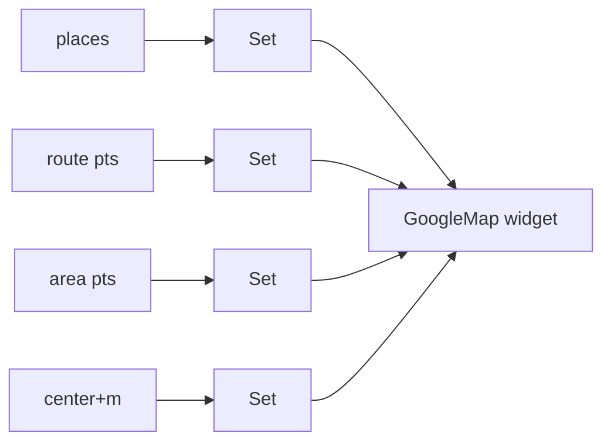

# Markers & Overlays (Markers, Polylines, Polygons, Circles, Info Windows)

> Draw on the map with immutable overlay **`Set`s** the `GoogleMap` widget consumes: `Set<Marker>` (pins, each a unique `MarkerId` with a tap/info window), `Set<Polyline>` (routes), `Set<Polygon>` (areas), `Set<Circle>` (radii/geofences) — you rebuild the set and call `setState` (or update state) to change what's shown; overlays are **declarative**, not imperative.

## Introduction

Overlays are how you annotate the map: pins for places, a line for a route, a shape for a delivery zone, a circle for "within 5 km." Each overlay type is an immutable value with a stable id; you pass sets to the `GoogleMap` widget and update them via state. This file covers all overlay types, ids/updates, and info windows.

## Why this concept exists

The map needs to show *your* data (places, routes, zones). Rather than imperative add/remove calls, `google_maps_flutter` uses **declarative sets keyed by id** — you describe the desired overlays and the plugin diffs/reconciles with the native map. Stable ids make updates (move a marker, recolor a line) efficient.

## Real-world analogy

Overlays are **stickers, string, and highlighter on a paper map**: markers are numbered pins (each pin has a label card = info window), polylines are string tracing a route, polygons are highlighted regions, circles are compass-drawn radii. You hand the map a fresh **sticker sheet** (the set) and it updates what's stuck on.

## Problem Statement

Plot store markers (tappable, with info windows), draw the route from the user to a store as a polyline, shade a delivery zone as a polygon, and show a 2 km radius circle — updating them as data changes. You'll build overlay sets and update them via state.

## Internal Working

```mermaid
flowchart TD
    Data[your data (places/route/zone)] --> Build[build Set<Marker>/Polyline/Polygon/Circle]
    Build --> Widget[GoogleMap(markers:, polylines:, polygons:, circles:)]
    Update[data changes] --> Rebuild[new immutable set + setState] --> Diff[plugin diffs by id -> native map updates]
    Marker[Marker.onTap / infoWindow] --> Tap[handle selection]
```

- **Marker**: `Marker(markerId: MarkerId('store-1'), position: LatLng(...), infoWindow: InfoWindow(title:..., snippet:...), icon: BitmapDescriptor..., onTap: ...)`. **`markerId` must be unique + stable** (used for diffing/selection). Tapping shows the info window (or handle `onTap`).
- **Polyline**: `Polyline(polylineId:, points: [LatLng...], width:, color:, patterns:)` — a route/path.
- **Polygon**: `Polygon(polygonId:, points: [...], fillColor:, strokeColor:, holes:)` — a filled area (delivery/service zone).
- **Circle**: `Circle(circleId:, center:, radius: meters, fillColor:, strokeColor:)` — a radius/geofence visual.
- **Immutability + `copyWith`**: overlays are immutable; to move/recolor, create a new instance (`marker.copyWith(positionParam: ...)`) and put it in a new set.
- **Updates**: hold the sets in state (setState/bloc), rebuild on change; the plugin reconciles by id — no manual add/remove.
- **Info windows**: default bubble from `InfoWindow`, or fully custom UI by drawing your own widget positioned over the marker (advanced) / `showMarkerInfoWindow(id)` via controller.
- **Custom icons**: `BitmapDescriptor` from asset/bytes ([live_location_and_clustering.md](live_location_and_clustering.md)).

## Memory Representation

Overlay sets are lightweight Dart value objects; the native map holds the rendered geometry. Thousands of markers get expensive → cluster ([live_location_and_clustering.md](live_location_and_clustering.md)).

## Compiler Behavior

Not applicable.

## Runtime Behavior

Passing a new set triggers a native diff by id: added/removed/changed overlays are reconciled. Large sets increase reconcile + render cost.

## Flutter Engine Behavior

Overlays render on the native map (platform view) — not Flutter layers; the info window is native (custom info windows require extra work to align a Flutter widget).

## Dart VM Behavior

Not applicable; overlay definitions marshalled to native.

## Examples

```dart
import 'package:google_maps_flutter/google_maps_flutter.dart';
import 'package:flutter/material.dart';

class MapOverlays {
  Set<Marker> storeMarkers(List<Store> stores, void Function(Store) onTap) {
    return stores.map((s) => Marker(
      markerId: MarkerId('store-${s.id}'),          // unique + stable
      position: LatLng(s.lat, s.lng),
      infoWindow: InfoWindow(title: s.name, snippet: s.address),
      onTap: () => onTap(s),
    )).toSet();
  }

  Polyline route(List<LatLng> points) => Polyline(
    polylineId: const PolylineId('route'),
    points: points, width: 5, color: Colors.blue,
  );

  Polygon deliveryZone(List<LatLng> boundary) => Polygon(
    polygonId: const PolygonId('zone'),
    points: boundary,
    fillColor: Colors.green.withOpacity(0.2),
    strokeColor: Colors.green, strokeWidth: 2,
  );

  Circle radius(LatLng center, double meters) => Circle(
    circleId: const CircleId('radius'),
    center: center, radius: meters,
    fillColor: Colors.orange.withOpacity(0.15), strokeColor: Colors.orange,
  );
}
```

```dart
// Consume in the widget (sets held in state, rebuilt on change)
GoogleMap(
  initialCameraPosition: _start,
  markers: _markers,          // Set<Marker>
  polylines: _polylines,      // Set<Polyline>
  polygons: _polygons,        // Set<Polygon>
  circles: _circles,          // Set<Circle>
  onMapCreated: (c) => _controller.complete(c),
);
// To move a marker: _markers = {..._markers}..remove(old)..add(old.copyWith(positionParam: newPos));
```

## Diagrams



## Common Mistakes

| Mistake | Why | Fix |
|---------|-----|-----|
| Duplicate/unstable `markerId` | Overlaps, broken updates | Unique, stable ids |
| Mutating overlays in place | Immutable; no update | New instance via `copyWith` + new set |
| Rebuilding sets every frame | Wasted diffing | Rebuild only on data change |
| Thousands of raw markers | Jank/memory | Cluster ([live_location_and_clustering.md](live_location_and_clustering.md)) |
| Expecting Flutter-widget info windows | Info windows are native | Custom overlay/positioned widget if needed |
| Not toSet()/using List | Widget expects `Set` | Use `Set<...>` |

## Best Practices

- Give every overlay a **unique, stable id**; treat overlays as **immutable** — update via `copyWith` + a new set.
- Hold overlay sets in **state** (setState/bloc) and rebuild **only when data changes**; the plugin diffs by id.
- **Cluster** large marker counts; use `BitmapDescriptor` for custom pins ([live_location_and_clustering.md](live_location_and_clustering.md)).
- Use `InfoWindow` for simple bubbles; for rich content, position a Flutter widget yourself; handle `onTap` for selection logic.

## Performance

Overlay cost scales with count; hundreds of markers/complex polygons can jank — cluster/simplify. Avoid rebuilding sets per frame; diff only on change.

## Advantages / Disadvantages

- **+** Declarative, id-diffed overlays (markers/lines/shapes/circles); efficient reconciliation; clean state model.
- **−** Immutable-update boilerplate (`copyWith`), native info windows (limited styling), scaling needs clustering, sets rendered natively (not Flutter widgets).

## Interview Questions

1. **🟢 How do you add markers to a Google Map in Flutter?** — Pass a `Set<Marker>` (each with a unique `MarkerId`) to the `GoogleMap` widget's `markers` property; update via state.
2. **🟢 What overlay types are available?** — Markers, polylines, polygons, and circles (plus info windows on markers).
3. **🟡 Why must marker ids be unique and stable?** — The plugin diffs overlays by id to reconcile with the native map; unstable ids break updates/selection.
4. **🟡 How do you move or restyle an existing overlay?** — Create a new immutable instance (`copyWith`) and put it in a new set — overlays can't be mutated in place.
5. **🟡 How do info windows work and their limitation?** — `InfoWindow(title/snippet)` renders a native bubble; rich Flutter-widget content requires positioning your own overlay.
6. **🔴 What happens with thousands of markers?** — Rendering/diffing gets expensive → jank/memory; use clustering.
7. **🔴 When are overlays reconciled with the native map?** — When you pass a new set to the widget; the plugin diffs by id (added/removed/changed).

## Senior Engineer Tips

- Key ids to your domain (`'store-${id}'`) so selection/updates map cleanly to data; never use array index (reorders break it).
- Build overlay sets in a pure function from state — easy to test and cheap to rebuild only on data change.
- Reach for clustering early if the dataset can grow; retrofitting it after raw markers jank is painful.

## Architect Perspective

Overlays are the map's data-binding layer: pure functions from domain data → immutable overlay sets, held in state and diffed by id. Keeping this declarative and id-stable (and clustering at scale) makes map features testable and performant, integrating with state management and the location/route data feeding them ([Module 11](../11%20State%20Management/README.md), [live_location_and_clustering.md](live_location_and_clustering.md)).

## Summary

- Overlays = immutable `Set<Marker|Polyline|Polygon|Circle>` passed to `GoogleMap`, diffed by unique/stable id.
- Update via `copyWith` + new set held in state; rebuild only on data change; cluster at scale.
- Info windows are native (`InfoWindow`); custom pins via `BitmapDescriptor`; handle `onTap` for selection.

## Revision Notes

- `Set<Marker>` (unique `MarkerId`, `infoWindow`, `onTap`), `Set<Polyline>` (route), `Set<Polygon>` (area), `Set<Circle>` (radius).
- Immutable → `copyWith` + new set; held in state; plugin diffs by id; rebuild only on change.
- Native info windows (limited styling); custom icons via `BitmapDescriptor`; cluster large counts.

## Practice Questions

1. Why must marker ids be unique and stable?
2. How do you update a marker's position?
3. What are the limits of `InfoWindow` styling?

## Coding Questions

1. Build a pure function mapping a list of places to a `Set<Marker>` with info windows + tap handling.
2. Draw a route polyline and a delivery-zone polygon.
3. Move a marker by producing a new immutable set via `copyWith`.

## Mini Project

**Store map overlays (Flutter):** From a list of stores, render tappable markers with info windows, draw a polyline route to a selected store, shade a delivery-zone polygon, and show a radius circle — all as immutable sets held in state, updated via `copyWith`. Selecting a marker updates a details panel. Acceptance: overlays render + update by stable id; marker tap drives selection; move/restyle via `copyWith`; sets rebuilt only on change; runs on device.
