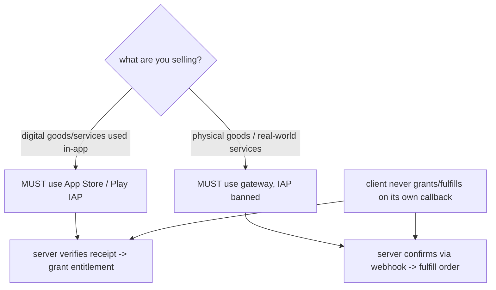
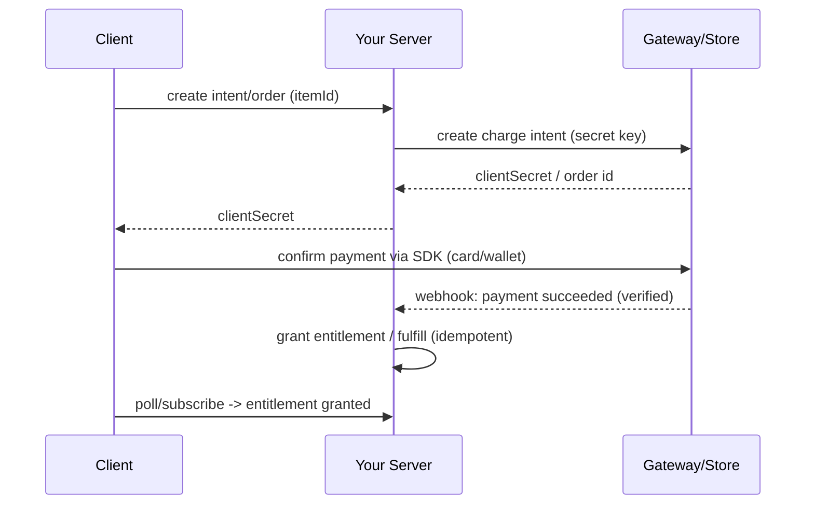

# Payments Overview & Security (The Ground Rules)

> Two hard rules govern all mobile payments: **(1)** your app must **never see or store raw card data** — a PCI-compliant SDK tokenizes it and your server works with tokens/intents; **(2)** the **platform decides the rail** — *digital goods/services* consumed in-app **must** use Apple/Google in-app purchase (they take ~15–30% and mandate it), while *physical goods/real-world services* **must** use an external gateway and are **banned** from IAP. And always: **the server, verified server-side, is the source of truth** — never the client's success callback.

## Introduction

Before any SDK, you must internalize the payment model: what you're selling determines the rail, PCI dictates you never touch cards, and trust must live on the server. This file establishes those rules, the actors (client, gateway/store, your backend), and the canonical secure flow every later file builds on.

## Why this concept exists

Payments involve money, fraud, and regulation. PCI-DSS exists so card data isn't leaked; Apple/Google billing rules exist to enforce their cut and consumer protections; server-side verification exists because a mobile client is untrusted (it can be tampered, spoofed, or fail after charging). These constraints are non-negotiable and shape the entire architecture.

## Real-world analogy

You're a shop that **never handles cash directly**: a **bonded cashier** (PCI SDK) takes the customer's card behind glass and hands you a **receipt token**. For **downloadable goods** the mall (Apple/Google) *requires* you use **its checkout** and takes a cut; for **furniture you deliver**, the mall *forbids* its checkout and you use your **own card terminal** (gateway). And you only ship once your **accountant confirms the bank actually settled** (server verification) — not because the customer *said* they paid.

## Problem Statement

Decide, for each thing you sell (a coin pack, a pro subscription, a physical order, a service booking), which rail is legal/required, ensure no card data touches your app, and design a flow where entitlement/fulfillment happens only after server verification. You'll classify items and design the trust boundary.

## Internal Working



- **Rail selection (critical, App Store/Play policy)**:
  - **Digital content/services consumed in the app** (coins, pro features, subscriptions, unlockables) → **must** use **in-app purchase** ([03_in_app_purchases.md](03_in_app_purchases.md)). Using a gateway for these = rejection/ban.
  - **Physical goods, real-world services** (food delivery, ride, e-commerce, ticket to a physical event) → **must** use a **gateway** (Stripe/Razorpay/wallets) — IAP is **not allowed** for these ([02_payment_gateways.md](02_payment_gateways.md)).
  - Grey areas (reader apps, external-link entitlements, regional rules) evolve — check current policy before shipping.
- **PCI / card data**: your app **never** collects raw PAN/CVV into your own variables/storage. The gateway SDK (Stripe/Razorpay) presents its own secure input or tokenizes; you only ever handle **tokens/intents/nonces**. This keeps you out of PCI scope. **Never log or store card data.**
- **Server as source of truth**: the client is untrusted. The **backend creates the charge intent/order**, and **verifies completion server-side** (webhook / receipt validation) before granting entitlement or fulfilling. A client "payment succeeded" callback is a *hint*, not proof (it can be faked or the app can die mid-flow).
- **Actors**: **client** (collects intent, launches SDK UI, shows result), **gateway/store** (charges, tokenizes, sends webhooks/receipts), **your backend** (creates intents/orders, holds secret keys, verifies, grants/fulfills, reconciles).
- **Secret keys** live only on the server; the client holds only publishable/public keys.
- **Idempotency**: use idempotency keys/order ids so retries don't double-charge or double-grant.

## Memory Representation

Not a data-structure topic. The security-relevant point: card data should have **no representation** in your app's memory/logs/storage — only opaque tokens.

## Compiler Behavior

Not applicable.

## Runtime Behavior

The charge happens via the SDK/store; the authoritative state transition (entitlement/fulfillment) happens on your server after verification — often slightly *after* the client sees "success" (webhook latency), so design for eventual confirmation.

## Flutter Engine Behavior

Payment SDKs often present native UI (platform views / native sheets — [26 · platform channels](../26%20Platform%20Channels/README.md)) for PCI-compliant card entry / wallet sheets.

## Dart VM Behavior

Not applicable.

## Examples

```dart
// The SAFE shape: client asks server to create an intent, launches SDK, then
// waits for SERVER confirmation — it never grants entitlement itself.
Future<void> checkout(CartItem item) async {
  // 1) Server creates the intent/order (holds secret key, sets amount)
  final intent = await api.createPaymentIntent(itemId: item.id); // returns clientSecret
  // 2) SDK collects card/wallet securely (no raw card data in our code)
  final result = await gatewaySdk.confirm(intent.clientSecret);
  // 3) DO NOT unlock here on `result.success` alone.
  //    Server verifies via webhook; client polls/subscribes for entitlement.
  await api.awaitEntitlement(item.id); // truth comes from the server
}
```

```text
Rail decision cheat-sheet:
  Coins / pro unlock / subscription (digital, in-app) -> IAP (App Store / Play)   [mandatory]
  Physical product / food / ride / booking            -> Gateway (Stripe/etc.)     [IAP banned]
  Never: collect raw card numbers into your own code / storage / logs.
  Always: server creates intent, server verifies completion, then grant/fulfill.
```

## Diagrams



## Common Mistakes

| Mistake | Why it's bad | Fix |
|---------|-------------|-----|
| Using a gateway for digital goods | App Store/Play rejection/ban | Use IAP for digital content |
| Using IAP for physical goods | Also against policy/rejection | Use a gateway for physical/services |
| Collecting raw card data in-app | PCI liability, breach risk | Use SDK tokenization; never store cards |
| Trusting the client success callback | Fraud / lost revenue / double grants | Verify server-side (webhook/receipt) |
| Secret keys in the app | Key theft, unlimited charges | Secret keys server-only; client uses publishable |
| No idempotency | Double charges/grants on retry | Idempotency keys / order ids |
| Logging card/token PII | Compliance/breach | Never log sensitive payment data |

## Best Practices

- **Classify each item** and pick the mandated rail (digital→IAP, physical→gateway); verify current store policy before shipping.
- **Never handle raw card data** — rely on the PCI-compliant SDK; keep **secret keys server-side**, publishable keys client-side.
- Make the **server create intents/orders and verify completion** (webhook/receipt) before granting/fulfilling; treat client callbacks as hints.
- Use **idempotency keys**; never log/store sensitive payment data; design for **eventual** (webhook-latency) confirmation.

## Performance

Irrelevant vs correctness/security here. The only latency concern is webhook confirmation delay — show a pending state and confirm from the server rather than blocking or optimistically unlocking.

## Advantages / Disadvantages

- **+** (Following the rules) compliant, secure, fraud-resistant, store-approvable, out of PCI scope.
- **−** Requires a backend, webhook/verification complexity, platform cut for IAP, eventual-consistency UX, strict policy constraints.

## Interview Questions

1. **🟢 When must you use IAP vs a payment gateway?** — Digital goods/services consumed in-app **must** use App Store/Play IAP; physical goods/real-world services **must** use a gateway (IAP is banned for those).
2. **🟢 Why must your app never handle raw card data?** — PCI-DSS: touching card data puts you in scope and creates breach/compliance liability; SDKs tokenize instead.
3. **🟡 Why is the client success callback not enough?** — The client is untrusted (tamperable, spoofable, can die mid-flow); only server-side verification (webhook/receipt) proves payment.
4. **🟡 Where do secret vs publishable keys live?** — Secret keys only on your server; the client holds only publishable/public keys.
5. **🟡 What is idempotency and why does it matter?** — Using a stable key/order id so retries don't double-charge or double-grant.
6. **🔴 Design the secure end-to-end flow.** — Server creates intent/order → client confirms via SDK → gateway/store notifies server (webhook/receipt) → server verifies + idempotently grants/fulfills → client reflects server truth.
7. **🔴 How do you handle webhook latency in UX?** — Show a pending state and confirm entitlement from the server (poll/subscribe); don't optimistically unlock.

## Senior Engineer Tips

- Write down the rail decision per SKU *before* coding — a gateway-for-digital mistake gets the whole app rejected.
- Treat the client as a hostile environment: no secret keys, no card data, no trusting its own "success" — the server grants everything.
- Build idempotent grant/fulfill from day one; payment retries and duplicate webhooks are normal, not edge cases.

## Architect Perspective

Payments are a trust-boundary and compliance architecture problem, not an SDK-wiring problem. The invariants — right rail per item, no card data client-side, server-as-source-of-truth with idempotent verification — dictate that you need a backend and a clean client/server contract. Every later file (gateways, IAP, wallets, verification) is an implementation of these rules ([02_payment_gateways.md](02_payment_gateways.md), [03_in_app_purchases.md](03_in_app_purchases.md), [05_payments_integration.md](05_payments_integration.md)).

## Summary

- Rail is mandated by *what* you sell: digital→IAP, physical→gateway (each banned from the other).
- Never touch raw card data (PCI); secret keys server-only.
- Server creates intents/orders and verifies completion (webhook/receipt) before granting/fulfilling; idempotent; client callbacks are hints.

## Revision Notes

- Digital in-app → IAP (mandatory, ~15–30% cut); physical/services → gateway (IAP banned); verify current policy.
- No raw card data in app (PCI); SDK tokenizes; secret keys server-only, publishable client-side.
- Server = source of truth: creates intent/order, verifies via webhook/receipt, idempotent grant/fulfill; design for webhook latency.

## Practice Questions

1. Classify five items (coins, pro subscription, T-shirt, ride, e-book) by rail.
2. Why can't the client be trusted to grant entitlement?
3. What keeps your app out of PCI scope?

## Coding Questions

1. Sketch the client `checkout()` that defers entitlement to the server.
2. Design an idempotent server grant given possibly-duplicate webhooks.
3. Write the rail-decision function for a mixed catalog.

## Mini Project

**Payment architecture design (Flutter + backend):** For a catalog mixing digital (coins, pro subscription) and physical (merch order) items, document the rail per SKU, design the client/server contract (server creates intent/order, verifies via webhook/receipt, idempotent grant/fulfill), and implement a client `checkout()` that never grants entitlement itself (waits for server truth). Acceptance: correct rail per item; no card data/secret keys client-side; server-verification flow documented + client defers to it; idempotency addressed; pending-state UX for webhook latency.
