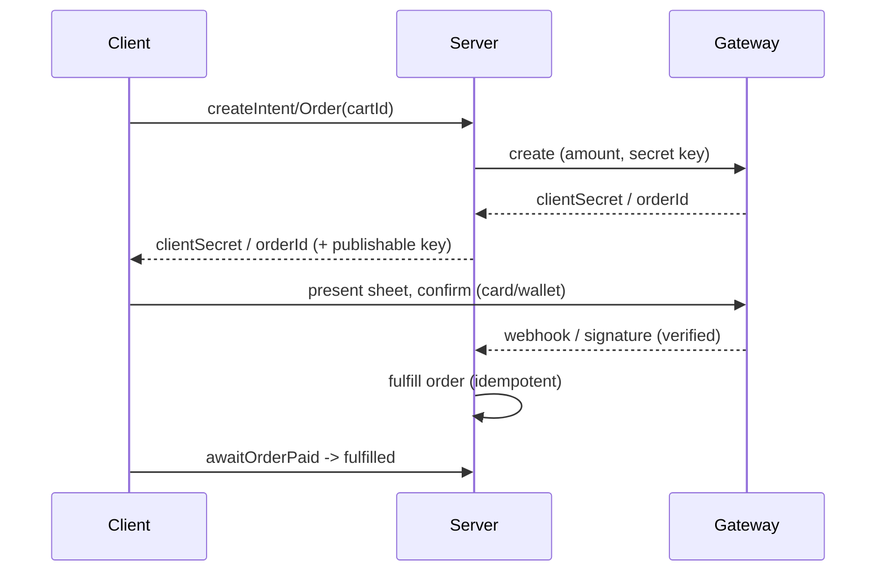

# Payment Gateways (Stripe, Razorpay — Physical Goods & Services)

> For physical goods/real-world services, integrate a gateway with the **server-driven intent/order flow**: your backend (holding the **secret key**) creates a `PaymentIntent` (Stripe) or `Order` (Razorpay) with the amount; the client uses the **publishable key** + SDK (`flutter_stripe` / `razorpay_flutter`) to collect card/wallet securely and confirm using the returned **client secret/order id**; the gateway then confirms to your server via **webhook**, which fulfills the order — the client never sets the amount or trusts its own result.

## Introduction

Gateways charge cards/wallets for non-digital purchases. Stripe and Razorpay share the same secure shape: server creates the payment object with the amount, client confirms with a secret it can't tamper into a different amount, server verifies via webhook. This file covers that flow, the two SDKs, and the security boundary.

## Why this concept exists

Charging cards requires PCI compliance and fraud control. Gateways provide tokenizing SDKs (so your app never sees card data) and a server API where the **amount is set server-side** (so a client can't pay ₹1 for a ₹1000 order). The webhook exists because the client is untrusted — the gateway tells your server directly.

## Real-world analogy

The gateway is a **card terminal you rent**: your **back office** (server) rings up the exact total and prints a **one-time payment slip** (client secret / order id); the customer taps their card on the terminal (SDK) against *that slip*; the **bank calls your back office** (webhook) to confirm settlement before you hand over the goods. The customer can't change the total written on the slip.

## Problem Statement

Charge for a physical order (e.g., ₹899 cart) via Stripe (global) or Razorpay (India): server creates the intent/order with the amount, the app confirms with the card/wallet sheet, and the server fulfills on the verified webhook. You'll wire the SDK + the server-driven flow.

## Internal Working

```mermaid
flowchart TD
    Cart[client: checkout(cart)] --> Server[server: create PaymentIntent/Order (amount, secret key)]
    Server --> Secret[return clientSecret / orderId + publishableKey]
    Secret --> SDK[client SDK: present card/wallet sheet, confirm]
    SDK --> Gateway[gateway charges card]
    Gateway --> Webhook[webhook -> your server: succeeded (verified)]
    Webhook --> Fulfill[server fulfills order (idempotent)]
    SDK -. result is a hint .-> Client[client shows pending -> reflects server truth]
```

- **Stripe (`flutter_stripe`)**:
  1. Server: `PaymentIntent.create(amount, currency, ...)` with the **secret key** → returns a **client secret**.
  2. Client: init with **publishable key**; `Stripe.instance.initPaymentSheet(paymentIntentClientSecret: ...)` then `presentPaymentSheet()` (Stripe's PCI-compliant sheet handles card entry / Apple/Google Pay).
  3. Server: handle the `payment_intent.succeeded` **webhook** → fulfill.
- **Razorpay (`razorpay_flutter`)**:
  1. Server: create an **Order** (`orders` API) with the **key secret** → returns an **order id**.
  2. Client: `razorpay.open({key, amount, order_id, ...})`; handle `EVENT_PAYMENT_SUCCESS`/`ERROR`/`EXTERNAL_WALLET`.
  3. Server: verify the **payment signature** (HMAC of order_id|payment_id with key secret) and/or webhook → fulfill.
- **Security invariants**: **amount is set server-side** (client never dictates price); **secret key server-only**; **card data only in the SDK sheet**; **fulfillment on verified webhook/signature**, not the client callback.
- **Wallets**: both route Apple Pay / Google Pay for physical purchases through the same sheet ([04_wallets_google_apple_pay.md](04_wallets_google_apple_pay.md)).
- **Refunds/disputes**: handled server-side via the gateway API.
- **Repository**: expose `Future<PaymentResult> pay(cartId)`; UI/domain never see keys or card data.

## Memory Representation

Client holds only a transient client secret/order id + publishable key. No card data. The authoritative record (paid/fulfilled) lives in your DB, set on webhook.

## Compiler Behavior

Not applicable.

## Runtime Behavior

The SDK presents a native sheet; on confirm, the gateway charges and later calls your webhook (may lag the client result by seconds). Fulfillment is triggered by the webhook, so success UX is "payment received, finalizing."

## Flutter Engine Behavior

Payment sheets are native UI (Stripe/Razorpay) presented over Flutter via platform integration ([26 · platform channels](../26%20Platform%20Channels/README.md)).

## Dart VM Behavior

Not applicable.

## Examples

```dart
// Stripe (flutter_stripe) — server sets the amount; client confirms with the secret
import 'package:flutter_stripe/flutter_stripe.dart';

class StripeGateway {
  Future<void> pay(String cartId) async {
    // 1) Server creates the PaymentIntent (amount decided server-side)
    final clientSecret = await api.createPaymentIntent(cartId: cartId);
    // 2) PCI-compliant sheet handles card entry / wallets (no card data in our code)
    await Stripe.instance.initPaymentSheet(
      paymentSheetParameters: SetupPaymentSheetParameters(
        paymentIntentClientSecret: clientSecret,
        merchantDisplayName: 'My Shop',
      ),
    );
    await Stripe.instance.presentPaymentSheet();
    // 3) Do NOT fulfill here — server does it on payment_intent.succeeded webhook.
    await api.awaitOrderPaid(cartId); // reflect server truth
  }
}
// main(): Stripe.publishableKey = '<publishable_key>'; (secret key stays on server)
```

```dart
// Razorpay (razorpay_flutter) — server creates the Order; server verifies signature
import 'package:razorpay_flutter/razorpay_flutter.dart';

class RazorpayGateway {
  final _razorpay = Razorpay();
  void init() {
    _razorpay.on(Razorpay.EVENT_PAYMENT_SUCCESS, (r) async {
      // Send payment_id + order_id + signature to server for HMAC verification.
      await api.verifyRazorpay(r.orderId, r.paymentId, r.signature); // server verifies + fulfills
    });
    _razorpay.on(Razorpay.EVENT_PAYMENT_ERROR, (e) {/* show failure */});
  }
  Future<void> pay(String cartId) async {
    final order = await api.createRazorpayOrder(cartId: cartId); // {orderId, amount, key}
    _razorpay.open({
      'key': order.publishableKey, 'order_id': order.orderId,
      'amount': order.amount, 'name': 'My Shop',
    });
  }
}
```

## Diagrams



## Common Mistakes

| Mistake | Why | Fix |
|---------|-----|-----|
| Client sets/sends the amount | Price tampering | Amount set server-side in the intent/order |
| Secret key in the app | Key theft, arbitrary charges | Secret key server-only; client uses publishable |
| Fulfilling on client success | Fraud/no-verify | Fulfill on webhook / verified signature |
| Skipping signature verification (Razorpay) | Spoofed success | Verify HMAC server-side |
| Custom card fields | PCI scope/breach | Use the SDK's sheet/tokenization |
| Non-idempotent fulfillment | Double-ship on retry/dup webhook | Idempotent by order id |
| Using a gateway for digital goods | Store rejection | Gateways are for physical/services only |

## Best Practices

- **Server sets the amount** and creates the intent/order with the **secret key**; client uses only the **publishable key** + returned secret/order id.
- Collect card/wallet **only via the SDK sheet** (PCI); **fulfill on the verified webhook/signature**, idempotently — never on the client callback.
- **Verify Razorpay signature** / handle Stripe webhooks server-side; support refunds/disputes via the gateway API.
- Wrap in a **repository** returning a domain `PaymentResult`; keep keys/card data out of UI/domain; gateways are for **physical/services only** ([01_payments_overview_and_security.md](01_payments_overview_and_security.md)).

## Performance

Not perf-sensitive; the UX concern is webhook latency — show "finalizing" and confirm from the server. SDK sheets load quickly.

## Advantages / Disadvantages

- **+** Charge cards/wallets for physical goods/services, PCI-handled by SDK, server-controlled amounts, refunds/disputes, global (Stripe) / India (Razorpay) coverage.
- **−** Requires a backend + webhooks, secret-key/verification discipline, eventual-confirmation UX, gateway fees, not usable for digital goods.

## Interview Questions

1. **🟢 Who sets the payment amount and why?** — The **server** (in the PaymentIntent/Order) so the client can't tamper the price.
2. **🟢 What key does the client use vs the server?** — Client: publishable/public key; server: secret key (never shipped).
3. **🟡 Walk through the Stripe payment-sheet flow.** — Server creates a `PaymentIntent` → returns client secret → client `initPaymentSheet`/`presentPaymentSheet` → server fulfills on `payment_intent.succeeded` webhook.
4. **🟡 How is Razorpay success verified?** — Server verifies the HMAC signature (order_id|payment_id with key secret) and/or a webhook before fulfilling.
5. **🟡 Why not fulfill on the client success event?** — It's an untrusted hint; only server verification (webhook/signature) proves payment.
6. **🔴 How do you prevent double fulfillment?** — Idempotent fulfillment keyed by order/payment id (webhooks can duplicate; clients retry).
7. **🔴 Why can't you use a gateway for coins/subscriptions consumed in-app?** — Store policy mandates IAP for digital goods; gateways are for physical/real-world only.

## Senior Engineer Tips

- Never let the amount originate on the client — server-created intents are the single most important anti-fraud measure.
- Make fulfillment idempotent and webhook-driven; treat the client result purely as "show pending."
- Verify Razorpay signatures server-side every time; a client-reported success without server verification is an open fraud door.

## Architect Perspective

Gateways implement the "server-as-source-of-truth" rule for physical commerce: amount and verification on the server, card data in the SDK, fulfillment on webhook. Behind a repository returning domain results, the app stays PCI-safe and fraud-resistant while the backend owns money movement — the same trust boundary as auth/networking, applied to payments ([01_payments_overview_and_security.md](01_payments_overview_and_security.md), [05_payments_integration.md](05_payments_integration.md), [Module 16](../16%20Networking/README.md)).

## Summary

- Server creates `PaymentIntent`/`Order` with the amount (secret key); client confirms via SDK sheet with the client secret/order id (publishable key).
- Card data only in the SDK; fulfill on verified webhook/signature, idempotently; never trust the client callback or let it set the amount.
- Stripe (global) / Razorpay (India); wrap behind a repository; gateways = physical/services only.

## Revision Notes

- Stripe: server `PaymentIntent.create` → clientSecret → `initPaymentSheet`/`presentPaymentSheet` → `payment_intent.succeeded` webhook → fulfill.
- Razorpay: server `orders` API → orderId → `razorpay.open` → verify HMAC signature server-side → fulfill.
- Secret key server-only; amount server-set; card data in SDK sheet only; idempotent webhook fulfillment; physical/services only.

## Practice Questions

1. Why must the amount be created server-side?
2. What does the client hold vs the server (keys/secrets)?
3. How is a Razorpay payment verified before fulfillment?

## Coding Questions

1. Implement a Stripe `pay(cartId)` using the server-created client secret + payment sheet.
2. Implement Razorpay `pay` + server-side signature verification.
3. Design an idempotent, webhook-driven fulfillment handler.

## Mini Project

**Physical-order checkout (Flutter + backend):** Implement a `StripeGateway` (or `RazorpayGateway`) where the server creates the intent/order with the amount, the client confirms via the SDK sheet, and the server fulfills on the verified webhook/signature (idempotent). UI shows a pending → confirmed state from server truth. Acceptance: amount set server-side; secret key never in app; card data only in SDK; fulfillment webhook/signature-verified + idempotent; behind a repository; runs end-to-end (test mode).
