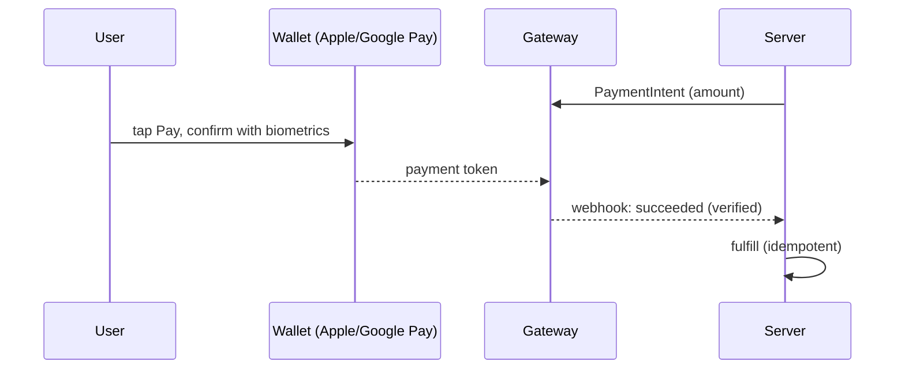

# Wallets (Google Pay & Apple Pay)

> Google Pay and Apple Pay are **faster checkout methods for physical goods/services** — they return a **tokenized card** you pass to your gateway (Stripe/Razorpay), not a separate payment rail. They boost conversion (no typing, biometric confirm) but the **same rules apply**: server sets the amount, server verifies via webhook, and wallets are **not** a substitute for IAP on digital goods.

## Introduction

Wallets let users pay with a saved card via Face ID/fingerprint instead of typing card details. In Flutter you can use `pay` (the official Google/Apple Pay plugin) or the wallet support built into gateway SDKs (`flutter_stripe`, `razorpay_flutter`). This file covers how wallets fit the gateway flow, setup, and when they apply.

## Why this concept exists

Manual card entry kills mobile conversion. Wallets provide a one-tap, biometric-confirmed, tokenized payment that's more secure (no card shown) and faster. They exist on top of the card networks/gateways — the wallet supplies a payment token; your gateway still does the charge.

## Real-world analogy

A wallet is **tap-to-pay with your phone** instead of digging out a physical card: the terminal (gateway) still runs the charge and the bank still settles — you just authenticated with your face/thumb and the card number never appeared. The **cashier (server) still rings up the exact total** and confirms the bank settled.

## Problem Statement

Add a "Pay with Google Pay / Apple Pay" button to a physical-order checkout so users pay in one tap, feeding the wallet token into your existing gateway flow (server amount + webhook verification). You'll wire wallet buttons and route their token to the gateway.

## Internal Working

```mermaid
flowchart TD
    Button[Google/Apple Pay button] --> Sheet[wallet sheet: pick card + biometric confirm]
    Sheet --> Token[wallet returns a payment token]
    Token --> Gateway[pass token to gateway (Stripe/Razorpay) charge]
    Gateway --> Webhook[server verifies via webhook -> fulfill]
    Amount[server-set amount] --> Gateway
```

- **Two integration paths**:
  1. **Via the gateway SDK** (recommended): Stripe/Razorpay payment sheets **already offer** Apple/Google Pay when configured — the wallet token flows through the same `PaymentIntent`/order you already built ([02_payment_gateways.md](02_payment_gateways.md)). Least extra work.
  2. **`pay` plugin**: renders native Google/Apple Pay buttons, returns a payment token you forward to your gateway (or processor) to charge.
- **Setup**:
  - **Google Pay**: a payment configuration JSON (gateway = your processor, e.g. Stripe), merchant info, allowed card networks; test in Google Pay test env.
  - **Apple Pay**: a **Merchant ID + Apple Pay capability/entitlement** in Xcode ([28 · ios_integration](../28%20Native%20iOS/05_ios_integration.md)), merchant certificate; only on real devices with a card in Wallet.
- **Same invariants**: **amount server-set**, **charge via gateway**, **fulfill on verified webhook** — the wallet only changes *how the card is supplied* (tokenized), not the trust model.
- **Availability**: check device/wallet availability and only show the button when supported (Apple Pay iOS-only, Google Pay Android/web); provide a card fallback.
- **Digital goods**: wallets do **not** bypass IAP — you still can't sell coins/subscriptions via Apple/Google Pay; those go through IAP ([03_in_app_purchases.md](03_in_app_purchases.md)).

## Memory Representation

Client handles only an opaque wallet **payment token** (not card data). Charge/fulfillment records live server-side as with any gateway payment.

## Compiler Behavior

Not applicable; Apple Pay needs the capability/entitlement at build ([28 · ios_integration](../28%20Native%20iOS/05_ios_integration.md)).

## Runtime Behavior

The wallet sheet is a native biometric flow; on confirm it returns a token instantly; the gateway charge + webhook proceed as normal (with the usual confirmation latency).

## Flutter Engine Behavior

Wallet sheets are native UI presented over Flutter (via `pay`/gateway SDK platform channels — [26](../26%20Platform%20Channels/README.md)).

## Dart VM Behavior

Not applicable.

## Examples

```dart
// Simplest: enable wallets inside the Stripe payment sheet (reuses your PaymentIntent)
import 'package:flutter_stripe/flutter_stripe.dart';

Future<void> payWithWalletOrCard(String cartId) async {
  final clientSecret = await api.createPaymentIntent(cartId: cartId); // server sets amount
  await Stripe.instance.initPaymentSheet(
    paymentSheetParameters: SetupPaymentSheetParameters(
      paymentIntentClientSecret: clientSecret,
      merchantDisplayName: 'My Shop',
      applePay: const PaymentSheetApplePay(merchantCountryCode: 'US'),   // Apple Pay
      googlePay: const PaymentSheetGooglePay(merchantCountryCode: 'US', testEnv: true), // Google Pay
    ),
  );
  await Stripe.instance.presentPaymentSheet();  // sheet shows Apple/Google Pay + card
  await api.awaitOrderPaid(cartId);             // server truth (webhook)
}
```

```dart
// Or the `pay` plugin: native button -> token -> your gateway
// import 'package:pay/pay.dart';
// GooglePayButton(
//   paymentConfiguration: PaymentConfiguration.fromJsonString(googlePayConfig),
//   paymentItems: items,                         // amounts (server-authoritative in practice)
//   onPaymentResult: (result) => api.chargeWithWalletToken(result), // forward token to gateway
// );
// Show the button only when the wallet is available; provide a card fallback.
```

## Diagrams



## Common Mistakes

| Mistake | Why | Fix |
|---------|-----|-----|
| Treating wallets as a separate rail | They feed the gateway | Route token through gateway flow |
| Amount from the client wallet items | Tampering | Server-set amount (intent/order) |
| Fulfilling on wallet result | Untrusted | Fulfill on gateway webhook |
| Showing button when unsupported | Broken UX | Check availability; card fallback |
| Missing Apple Pay entitlement/merchant id | Apple Pay unavailable | Configure capability + merchant id |
| Wallets for digital goods | Policy violation | IAP for digital ([03_in_app_purchases.md](03_in_app_purchases.md)) |

## Best Practices

- Prefer enabling wallets **inside the gateway payment sheet** (reuses your `PaymentIntent`/order + webhook) over a separate integration.
- Keep the **amount server-set** and **fulfill on the webhook** — wallets only change how the card is tokenized, not the trust model.
- **Check availability** and show the wallet button only when supported (Apple Pay iOS, Google Pay Android/web); always offer a **card fallback**.
- Configure **Apple Pay merchant id + entitlement** ([28 · ios_integration](../28%20Native%20iOS/05_ios_integration.md)) / **Google Pay config**; use wallets for **physical/services only** (not IAP goods).

## Performance

Faster checkout (higher conversion) — the main benefit is UX/business, not runtime perf. Confirmation latency is the gateway webhook as usual.

## Advantages / Disadvantages

- **+** One-tap, biometric, tokenized (secure) checkout; higher conversion; reuses gateway flow.
- **−** Platform setup (Apple merchant id/entitlement), availability checks + fallback needed, still gateway-bound, not for digital goods.

## Interview Questions

1. **🟢 Are Google/Apple Pay a separate payment rail?** — No — they supply a tokenized card that you charge through your gateway; they're a faster input method, not a new processor.
2. **🟢 When do wallets apply vs IAP?** — Wallets are for physical goods/services (via a gateway); digital goods still require IAP.
3. **🟡 What's the easiest way to add wallets in Flutter?** — Enable Apple/Google Pay inside the gateway's payment sheet (Stripe/Razorpay), reusing the existing PaymentIntent + webhook.
4. **🟡 Do the security rules change with wallets?** — No — server sets the amount and fulfills on the verified webhook; only card tokenization is handled by the wallet.
5. **🟡 What does Apple Pay require to work?** — A Merchant ID + Apple Pay capability/entitlement (Xcode), real device, and a card in Wallet.
6. **🔴 How do you decide whether to show the wallet button?** — Check wallet availability/support for the platform/device and provide a card fallback when unavailable.
7. **🔴 Why can't you sell a subscription via Apple/Google Pay?** — It's a digital good; store policy mandates IAP regardless of payment method.

## Senior Engineer Tips

- Reuse the gateway sheet's wallet support instead of a bespoke `pay` integration unless you need custom buttons — far less to maintain and it inherits your webhook flow.
- Always gate the wallet button on runtime availability and keep a card fallback; nothing erodes trust like a dead pay button.
- Remember wallets don't change compliance: server amount + webhook fulfillment still apply, and they're never a loophole around IAP.

## Architect Perspective

Wallets are a conversion-optimizing front-end to the existing gateway rail, not a new rail. Architecturally they slot into the same server-amount + webhook-verified-fulfillment flow, adding only availability checks and platform setup. Treating them this way keeps checkout secure and consistent while improving UX for physical commerce — orthogonal to the IAP rail for digital goods ([02_payment_gateways.md](02_payment_gateways.md), [03_in_app_purchases.md](03_in_app_purchases.md)).

## Summary

- Google/Apple Pay = fast, biometric, tokenized card input feeding your gateway — not a separate rail and not an IAP substitute.
- Easiest via the gateway payment sheet; same rules (server amount, webhook fulfillment).
- Check availability + card fallback; configure Apple Pay merchant id/entitlement; physical/services only.

## Revision Notes

- Wallets return a tokenized card → charged via gateway; enable inside Stripe/Razorpay sheet (easiest) or via `pay` plugin.
- Same invariants: server-set amount, webhook-verified fulfillment; wallets change only card tokenization.
- Apple Pay: merchant id + entitlement (Xcode), real device; Google Pay: config JSON; availability check + card fallback; not for digital goods (IAP).

## Practice Questions

1. Why are wallets not a separate payment rail?
2. How do wallets fit the server-amount/webhook flow?
3. Why can't wallets be used to sell in-app coins?

## Coding Questions

1. Enable Apple/Google Pay inside the Stripe payment sheet reusing a server PaymentIntent.
2. Gate the wallet button on availability with a card fallback.
3. Forward a `pay`-plugin token to a gateway charge.

## Mini Project

**One-tap wallet checkout (Flutter + backend):** Add Apple/Google Pay to the physical-order checkout by enabling wallets in the gateway payment sheet (server-created PaymentIntent), with an availability check and card fallback, fulfilling on the verified webhook. Acceptance: wallet sheet appears where supported (card fallback otherwise); amount server-set; fulfillment webhook-verified; Apple Pay entitlement/merchant id configured; not used for digital goods; runs on device (test mode).
