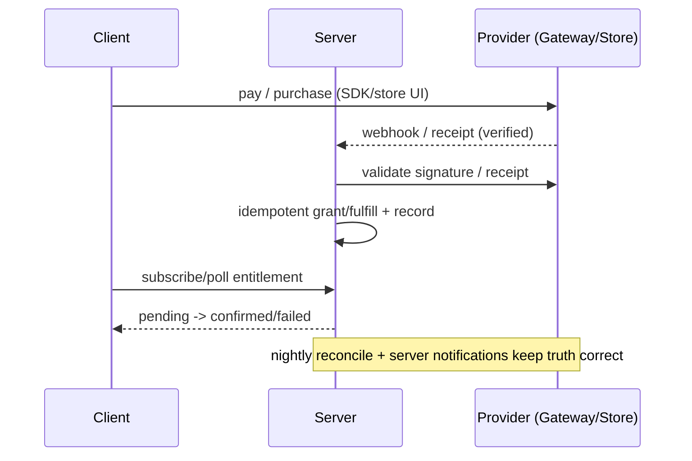

# Payments Integration (Capstone: Server Verification, Webhooks & Reconciliation)

> The backbone that makes payments trustworthy: the **server is the single source of truth**. It creates intents/orders (amount, secret keys), **verifies completion out-of-band** — gateway **webhooks** (with signature checks) and IAP **receipt validation** (Apple/Google APIs + server notifications) — then **idempotently** grants entitlement/fulfills, and **reconciles** its ledger against the provider. The client only ever *reflects* server-confirmed state.

## Introduction

This module capstone unifies gateways, IAP, and wallets under one server-verification architecture. The recurring theme across every file — don't trust the client — is realized here: a payment isn't "done" until your server has verified it with the provider and recorded it idempotently. This file covers webhooks/receipts, idempotency, entitlement modeling, reconciliation, and the client's (limited) role.

## Why this concept exists

Clients can be tampered, spoofed, disconnected mid-flow, or replay old receipts; networks drop; webhooks duplicate; subscriptions renew/expire independently. Only a server that verifies with the provider and records idempotently can produce correct, fraud-resistant, reconcilable payment state. This is the difference between a demo and a system that handles real money.

## Real-world analogy

Your server is the **accounting department**. Salespeople (clients) can *say* a sale happened, but accounting only books revenue when the **bank statement** (webhook / verified receipt) confirms settlement — and it **matches its ledger to the bank statement** monthly (reconciliation) so nothing is lost, double-counted, or fraudulent.

## Problem Statement

Build the server-truth layer for a checkout that sells both a **digital** item (IAP) and a **physical** order (gateway): verify each via webhook/receipt, grant/fulfill idempotently, model entitlement (including subscription expiry), reconcile against the provider, and have the client reflect confirmed state. You'll design the verification + entitlement backbone.

## Internal Working

```mermaid
flowchart TD
    Client[client: initiate + reflect state] --> Server
    subgraph Server [Server = source of truth]
      Create[create intent/order OR receive IAP receipt]
      Verify[verify: gateway webhook signature / Apple-Google receipt API]
      Idem[idempotent grant/fulfill keyed by provider id]
      Entitlement[entitlement store (incl. subscription expiry)]
      Reconcile[reconcile ledger vs provider (jobs + server notifications)]
    end
    Verify --> Idem --> Entitlement
    Notify[App Store/Play server notifications, gateway events] --> Reconcile --> Entitlement
    Entitlement --> Client
```

- **Verification per rail**:
  - **Gateway**: receive the **webhook**, **verify its signature** (Stripe signing secret / Razorpay HMAC), then act. Webhooks are the authoritative "it settled" — not the client.
  - **IAP**: send the receipt/token to Apple (App Store Server API) / Google (Play Developer API) to validate; subscribe to **server notifications** (App Store Server Notifications / Play RTDN) for renewals/cancellations/refunds.
- **Idempotency**: every grant/fulfill is keyed by a **stable provider id** (payment_intent id / order id / transaction id) so duplicate webhooks, client retries, and reprocessing don't double-charge, double-ship, or double-grant. Store processed ids.
- **Entitlement model**: a durable server record of *what the user owns* — one-off unlocks, consumable balances, and **subscription state with expiry** (updated by renewal notifications). The client caches a derived flag; the server is authoritative.
- **Reconciliation**: periodically (and via notifications) match your ledger against the provider's records to catch missed webhooks, refunds, chargebacks, and expiries — repair entitlement accordingly.
- **Client role (minimal)**: initiate purchase, present SDK/store UI, then **poll/subscribe for server-confirmed entitlement** and render pending → confirmed/failed. It never grants, never sets amounts, never trusts its own callback.
- **Failure handling**: pending (webhook not yet arrived), failed, refunded, expired — each an explicit state ([Module 38](../38%20Error%20Handling/README.md)).

## Memory Representation

The durable entitlement/ledger lives in your DB (server). The client holds a small cached entitlement snapshot (non-authoritative). Processed-webhook ids are stored to enforce idempotency.

## Compiler Behavior

Not applicable.

## Runtime Behavior

Confirmation is **eventually consistent**: the client sees "pending" until the webhook/receipt is verified and entitlement is written, then reflects it. Renewals/refunds arrive over time via notifications and update entitlement asynchronously.

## Flutter Engine Behavior

Not applicable beyond the SDK/store UIs covered in prior files.

## Dart VM Behavior

Not applicable (verification/reconciliation are server-side).

## Examples

```dart
// CLIENT: initiate, then reflect server-confirmed entitlement (never grants itself)
class PaymentFacade {
  Future<Entitlement> buyDigital(String productId) async {
    await iap.buy(productId);                 // store flow; receipt verified server-side
    return _awaitEntitlement(productId);      // truth from server
  }
  Future<Entitlement> buyPhysical(String cartId) async {
    await gateway.pay(cartId);                // gateway sheet; fulfilled on webhook
    return _awaitOrderPaid(cartId);           // truth from server
  }
  // Poll/subscribe until the server confirms (handles webhook latency)
  Future<Entitlement> _awaitEntitlement(String id) => api.entitlementStream(id)
      .firstWhere((e) => e.isFinal); // granted | failed | refunded
}
```

```text
SERVER (pseudocode) — the part that actually matters:
  on gatewayWebhook(req):
     assert verifySignature(req, SIGNING_SECRET)          # reject spoofed
     if alreadyProcessed(req.paymentId): return 200        # idempotent
     if req.type == 'payment_succeeded':
         fulfillOrder(req.orderId)                         # grant/ship
         markProcessed(req.paymentId)
     return 200

  on iapVerify(receipt):
     result = appleOrGoogle.validate(receipt)              # provider API
     if result.valid and not alreadyProcessed(result.txnId):
         grantEntitlement(result.productId, expiry=result.expiry)
         markProcessed(result.txnId)

  nightly reconcile():
     for record in provider.listSince(lastRun):            # catch missed/refunded
         upsertEntitlement(record)                         # repair truth
```

## Diagrams



## Common Mistakes

| Mistake | Why | Fix |
|---------|-----|-----|
| Skipping webhook signature verification | Spoofed grants | Verify signature before acting |
| Non-idempotent processing | Double grant/ship on dup/retry | Key by provider id; store processed ids |
| Client grants entitlement | Fraud/lost revenue | Server-only grants; client reflects |
| No subscription lifecycle handling | Stale access after cancel/expiry | Use server notifications + expiry |
| No reconciliation | Missed webhooks/refunds unhandled | Periodic ledger vs provider reconcile |
| Optimistic unlock on client success | Wrong on failure/fraud | Show pending → server-confirmed |
| Local flag as source of truth | Diverges from reality | Server authoritative; local is cache |

## Best Practices

- Make the **server the source of truth**: verify **webhook signatures** / **receipts** with the provider before acting; the client only reflects.
- **Idempotent** grant/fulfill keyed by provider id (store processed ids) — assume duplicate webhooks + client retries.
- Model **entitlement durably**, including **subscription expiry** driven by **server notifications**; **reconcile** the ledger against the provider periodically.
- Client: initiate + **poll/subscribe for confirmed state** (pending → confirmed/failed/refunded); never grant/set amount/trust its callback ([01_payments_overview_and_security.md](01_payments_overview_and_security.md)).

## Performance

Not throughput-sensitive; the design concern is **eventual consistency** (webhook latency) and **robustness** (idempotency, reconciliation). Client UX handles the pending window; the server converges to correct state via webhooks/notifications/reconciliation.

## Advantages / Disadvantages

- **+** Correct, fraud-resistant, reconcilable payments across both rails; survives retries/duplicates/interruptions; accurate subscription state.
- **−** Requires backend infrastructure (webhooks, provider APIs, notifications, reconciliation jobs), eventual-consistency UX, more moving parts.

## Interview Questions

1. **🟢 Why is the server the source of truth for payments?** — The client is untrusted (tamperable, replayable, can fail mid-flow); only server-side verification with the provider proves a payment and can be reconciled.
2. **🟢 What proves a gateway payment vs an IAP purchase?** — A signature-verified **webhook** for the gateway; a provider-validated **receipt** (+ server notifications) for IAP.
3. **🟡 Why must processing be idempotent, and how?** — Webhooks duplicate and clients retry; key grant/fulfill by a stable provider id and store processed ids so it runs once.
4. **🟡 How do you keep subscription entitlement correct over time?** — Track expiry in a durable entitlement store updated by App Store/Play server notifications (renewals, cancellations, refunds).
5. **🟡 What is reconciliation and why do it?** — Periodically matching your ledger against the provider's records to catch missed webhooks, refunds, and chargebacks and repair entitlement.
6. **🔴 How should the client behave during webhook latency?** — Show pending and subscribe/poll for the server-confirmed final state (granted/failed/refunded) — never optimistically unlock.
7. **🔴 Design an end-to-end trustworthy payment for both rails.** — Server creates intent/receives receipt → verifies (signature/provider API) → idempotently grants/fulfills → durable entitlement (+ notifications) → reconciliation → client reflects confirmed state.

## Senior Engineer Tips

- Store every processed provider id and make grant/fulfill idempotent before you write any happy-path code — duplicates and retries are guaranteed, not rare.
- Drive subscriptions from server notifications + an expiry field, not from client checks; a cancelled sub that keeps working is a common, costly bug.
- Add reconciliation early; the day a webhook is missed (and it will be), reconciliation is the only thing that keeps entitlement correct.

## Architect Perspective

Payments integration is a distributed-systems trust problem: an untrusted client, an asynchronous provider, duplicate/lost messages, and time-varying entitlements. The architecture — server-side verification, idempotency, durable entitlement with server notifications, and reconciliation — is what makes money movement correct and auditable. The client shrinks to "initiate + reflect confirmed state," and both rails (gateway/IAP) converge on the same backbone, consistent with the app's overall clean-architecture trust boundaries ([01_payments_overview_and_security.md](01_payments_overview_and_security.md), [Module 40](../40%20Clean%20Architecture/README.md), [Module 38](../38%20Error%20Handling/README.md)).

## Summary

- Server = source of truth: verify webhook signatures / receipts with the provider before acting.
- Idempotent grant/fulfill by provider id; durable entitlement with subscription expiry via server notifications; reconcile periodically.
- Client initiates and reflects server-confirmed state (pending → confirmed/failed/refunded); both rails share this backbone.

## Revision Notes

- Gateway → signature-verified webhook; IAP → provider receipt validation + server notifications (App Store Server Notifications / Play RTDN).
- Idempotency keyed by provider id (store processed ids); durable entitlement incl. subscription expiry; periodic reconciliation vs provider.
- Client: initiate + poll/subscribe for confirmed entitlement (pending→final); never grants/sets amount/trusts callback.

## Practice Questions

1. Why is idempotency essential in webhook processing?
2. How is subscription entitlement kept correct after a cancellation?
3. What does reconciliation protect against?

## Coding Questions

1. Design an idempotent gateway-webhook handler (signature check + processed-id store).
2. Design IAP receipt verification + entitlement grant with expiry.
3. Implement a client that shows pending and reflects server-confirmed entitlement.

## Mini Project

**Trustworthy payments backbone (capstone — Flutter + backend):** Build the server-truth layer for a checkout selling a digital item (IAP) and a physical order (gateway): signature-verified webhook + provider receipt validation, idempotent grant/fulfill keyed by provider id, a durable entitlement store with subscription expiry driven by server notifications, and a nightly reconciliation job. The client initiates and reflects server-confirmed state (pending → confirmed/failed/refunded). Acceptance: both rails verified server-side; idempotent (duplicate webhook safe); subscription expiry honored via notifications; reconciliation repairs missed/refunded; client never grants/sets amount; runs end-to-end (test/sandbox).
