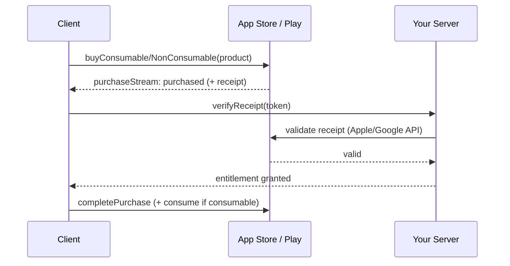

# In-App Purchases (Digital Goods — Consumables, Non-Consumables, Subscriptions)

> Digital goods consumed in-app **must** use the platform stores via the **`in_app_purchase`** plugin: define products in App Store Connect / Play Console, query them, launch the store purchase, and **listen to the purchase stream**; **verify the receipt/token server-side** before granting entitlement, then **complete** the purchase — and for **consumables** consume them, for **non-consumables/subscriptions** support **restore**.

## Introduction

IAP is the mandated rail for coins, pro unlocks, and subscriptions. Unlike a gateway, you don't create the charge — the store does — but you *must* verify the receipt on your server and manage product types and restoration. This file covers product setup, the purchase stream, the three product types, receipt verification, and restore.

## Why this concept exists

Apple/Google require their billing for digital goods (consumer protection + their cut) and provide `StoreKit`/`Play Billing`. The `in_app_purchase` plugin unifies them. Server-side receipt verification exists because the client purchase result is untrusted and receipts can be replayed/forged — entitlement must be validated with Apple/Google.

## Real-world analogy

IAP is buying **tokens at an arcade's official booth** (you can't bring outside cash to the machines). The booth prints a **receipt**; before the machine gives you a prize you take the receipt to the **manager's office** (your server) which **calls the booth to confirm it's genuine** (Apple/Google verification). **Consumables** are tokens you spend; **non-consumables** are a permanent membership card; a **subscription** is a monthly pass you can **restore** on a new machine.

## Problem Statement

Sell a **consumable** (coin pack), a **non-consumable** (remove ads forever), and a **subscription** (pro monthly) with a "restore purchases" button — verifying each receipt server-side before granting, completing purchases, and consuming consumables. You'll wire `in_app_purchase` + server verification.

## Internal Working

```mermaid
flowchart TD
    Setup[define products in App Store Connect / Play Console] --> Query[queryProductDetails(ids)]
    Query --> Buy[buyConsumable / buyNonConsumable]
    Buy --> Stream[purchaseStream emits PurchaseDetails]
    Stream --> Verify[server verifies receipt/token with Apple/Google]
    Verify -->|valid| Grant[grant entitlement]
    Grant --> Complete[completePurchase (+ consume if consumable)]
    Restore[restorePurchases] --> Stream
```

- **Product setup**: create products in **App Store Connect** and **Play Console** with matching **product ids**; types: **consumable** (coins), **non-consumable** (permanent unlock), **auto-renewable subscription** (pro). Products must be approved/active to query.
- **Query**: `InAppPurchase.instance.queryProductDetails({ids})` → `ProductDetails` (localized price/title). Show these (don't hardcode prices).
- **Purchase**: `buyConsumable(purchaseParam)` or `buyNonConsumable(purchaseParam)`. Results arrive **only** via `InAppPurchase.instance.purchaseStream` (set the listener up at app start — purchases can complete/resume out-of-band).
- **Purchase stream states**: `pending` → `purchased`/`restored` (verify + grant) or `error`/`canceled`. **Always** call `completePurchase(details)` after handling (or the store re-delivers).
- **Server verification (mandatory)**: send the receipt/purchase token to your server, which validates with **Apple** (verifyReceipt / App Store Server API) or **Google** (Play Developer API) before granting entitlement. Never grant on the client result alone.
- **Consume vs restore**: **consumables** must be **consumed** (so they can be bought again); **non-consumables/subscriptions** support **`restorePurchases()`** (required by Apple) to re-grant on reinstall/new device.
- **Subscriptions**: status/renewal/expiry is tracked via server-to-server notifications (App Store Server Notifications / Play RTDN) — the server is the entitlement authority over time.
- **Repository**: expose products + `buy()` + entitlement state; keep store details out of UI.

## Memory Representation

`ProductDetails`/`PurchaseDetails` are small value objects. Entitlement truth lives server-side (validated), cached locally as a derived flag — not the source of truth.

## Compiler Behavior

Not applicable.

## Runtime Behavior

Purchases may arrive asynchronously (including after app restart / interrupted flows) — hence the always-on stream + `completePurchase`. Subscriptions renew/expire over time, updated via server notifications.

## Flutter Engine Behavior

The store purchase UI is native (StoreKit / Play Billing) presented over Flutter via the plugin's platform channels ([26 · platform channels](../26%20Platform%20Channels/README.md)).

## Dart VM Behavior

Not applicable.

## Examples

```dart
import 'package:in_app_purchase/in_app_purchase.dart';

class IapRepository {
  final _iap = InAppPurchase.instance;
  late final Stream<List<PurchaseDetails>> _stream = _iap.purchaseStream;

  // Set up the listener at APP START (purchases can resume out-of-band)
  void listen(void Function() onEntitled) {
    _stream.listen((purchases) async {
      for (final p in purchases) {
        if (p.status == PurchaseStatus.pending) continue;
        if (p.status == PurchaseStatus.purchased || p.status == PurchaseStatus.restored) {
          final ok = await api.verifyReceipt(              // SERVER verifies with Apple/Google
            productId: p.productID,
            token: p.verificationData.serverVerificationData,
          );
          if (ok) onEntitled();                            // grant only if server says valid
        }
        if (p.pendingCompletePurchase) {
          await _iap.completePurchase(p);                  // ALWAYS complete (else re-delivered)
        }
      }
    });
  }

  Future<List<ProductDetails>> products(Set<String> ids) async {
    final resp = await _iap.queryProductDetails(ids);
    return resp.productDetails;                            // localized prices
  }

  Future<void> buyCoins(ProductDetails coins) =>
      _iap.buyConsumable(purchaseParam: PurchaseParam(productDetails: coins));

  Future<void> buyProSubscription(ProductDetails pro) =>
      _iap.buyNonConsumable(purchaseParam: PurchaseParam(productDetails: pro)); // subs use buyNonConsumable

  Future<void> restore() => _iap.restorePurchases();       // required for non-consumables/subs
}
```

## Diagrams



## Common Mistakes

| Mistake | Why | Fix |
|---------|-----|-----|
| Granting on client purchase result | Forgeable/replayable | Verify receipt server-side first |
| Not calling `completePurchase` | Store re-delivers / stuck | Always complete after handling |
| Listener set up late/on one screen | Missed/resumed purchases lost | Listen at app start, app-wide |
| Not consuming consumables | Can't rebuy | Consume after grant |
| No restore button | Apple rejection; users lose access | Implement `restorePurchases()` |
| Hardcoding prices | Wrong/localized prices | Use `ProductDetails` price |
| Using IAP for physical goods | Policy violation | Gateway for physical ([payment_gateways.md](payment_gateways.md)) |

## Best Practices

- **Set up the purchase-stream listener at app start** (app-wide) and **always `completePurchase`**; handle `pending`/`error`/`canceled`/`restored`.
- **Verify every receipt server-side** with Apple/Google before granting; treat the client result as a hint. Server is the entitlement authority (esp. subscriptions, via server notifications).
- **Consume consumables**; implement **`restorePurchases()`** for non-consumables/subscriptions (Apple requires it); show **localized `ProductDetails` prices**.
- Wrap in a **repository** exposing products + entitlement; use IAP **only for digital goods** ([payments_overview_and_security.md](payments_overview_and_security.md)).

## Performance

Not perf-sensitive. The concern is correctness/robustness: out-of-band and interrupted purchases must be handled by the always-on stream + completion, and entitlement must survive reinstalls via server-validated restore.

## Advantages / Disadvantages

- **+** Mandated/approved rail for digital goods, native store UX, subscriptions + restore, familiar to users.
- **−** ~15–30% store cut, server verification required, async/out-of-band purchase handling, per-store product setup, subscription lifecycle complexity.

## Interview Questions

1. **🟢 When must you use IAP?** — For digital goods/services consumed in the app (coins, unlocks, subscriptions); it's store-mandated.
2. **🟢 What are the three product types?** — Consumable (rebuyable, must consume), non-consumable (permanent), auto-renewable subscription.
3. **🟡 Why verify receipts server-side?** — Client purchase results are untrusted/replayable; only Apple/Google validation proves the purchase before granting entitlement.
4. **🟡 Why must the purchase-stream listener be app-wide and set up early?** — Purchases can complete/resume out-of-band (after restart/interruption); a late/screen-local listener misses them.
5. **🟡 Why is `completePurchase` mandatory?** — Until completed, the store considers it undelivered and will re-deliver it.
6. **🔴 How do you handle subscription status over time?** — The server is the authority, updated via App Store Server Notifications / Play RTDN (renewals, cancellations, expiries).
7. **🔴 Why is restore required and for what?** — Apple requires a restore path for non-consumables/subscriptions so users regain entitlements on reinstall/new device (`restorePurchases`).

## Senior Engineer Tips

- Initialize the purchase stream in your app bootstrap, not a store screen — the #1 IAP bug is a purchase that completes while the paywall is closed and is never granted.
- Make the server the durable entitlement store (esp. subscriptions with server notifications); the local flag is just a cache.
- Test the ugly paths: interrupted purchase, reinstall + restore, refund/cancel — these are where real IAP bugs and rejections live.

## Architect Perspective

IAP is an asynchronous, server-verified entitlement system, not a one-shot buy. The robust design: app-wide purchase stream → server receipt verification → durable entitlement (with subscription server-notifications) → local cache, all behind a repository. This survives reinstalls, interruptions, and refunds, and keeps digital-goods commerce store-compliant — complementing the gateway rail for physical goods ([payment_gateways.md](payment_gateways.md), [payments_integration.md](payments_integration.md)).

## Summary

- Digital goods → IAP: define products per store, query (localized prices), buy, handle via an **app-wide purchase stream**, **complete** every purchase.
- **Verify receipts server-side** before granting; server is entitlement authority (subscriptions via server notifications).
- Consume consumables; implement restore for non-consumables/subscriptions; behind a repository; digital only.

## Revision Notes

- `in_app_purchase`: products in App Store Connect/Play Console (matching ids); `queryProductDetails` → `buyConsumable`/`buyNonConsumable`.
- Results via `purchaseStream` (app-wide, early); states pending/purchased/restored/error/canceled; **always `completePurchase`**.
- Server verifies receipt/token (Apple/Google) before grant; consume consumables; `restorePurchases()` (required); subs tracked via server notifications.

## Practice Questions

1. Why must receipts be verified server-side?
2. Where and when do you set up the purchase-stream listener, and why?
3. What's the difference in handling consumables vs non-consumables/subscriptions?

## Coding Questions

1. Implement an `IapRepository` with app-wide stream handling + `completePurchase`.
2. Add server receipt verification before granting entitlement.
3. Implement consume (consumable) + `restorePurchases` (non-consumable/sub).

## Mini Project

**Store purchases (Flutter + backend):** Implement an `IapRepository` selling a consumable (coins), a non-consumable (remove ads), and a subscription (pro), with an app-wide purchase-stream listener, server-side receipt verification before granting, `completePurchase`, consumable consumption, and a "restore purchases" button. Acceptance: three product types work; listener app-wide + early; receipts verified server-side before grant; purchases completed; consumables rebuyable; restore re-grants on reinstall; behind a repository; runs (sandbox/test track).
