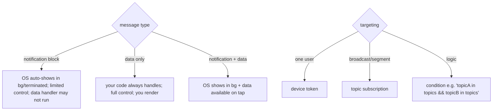

# Message Types & Targeting (Notification vs Data, Topics, Tokens)

> FCM messages come in two shapes with very different behavior: **notification messages** (a `notification` block the OS auto-displays in background/terminated — convenient but you don't control display, and your Dart handler *doesn't run* on tap-less background delivery) vs **data messages** (custom key/value only — *your* code always handles them, giving full control but you must render). For reliable, routable push, most apps send **data-only** (or notification+data) and target by **device token** (one user), **topic** (broadcast/segments), or **condition**.

## Introduction

Choosing the message type is the second-biggest push decision after the three-state model. It determines who displays the notification (OS vs your app) and whether your handler runs. This file explains both types, the recommended hybrid, and the targeting methods (token/topic/condition) — all sent from your **server**, never the client.

## Why this concept exists

FCM supports a "just show this" mode (notification messages, zero client code) and a "let the app decide" mode (data messages, full control). The distinction exists because some pushes are simple alerts and others need custom rendering/routing/background work. Targeting methods exist to send to one device, a broadcast audience, or logical segments efficiently.

## Real-world analogy

A **notification message** is a **pre-printed postcard** the postal service reads aloud and displays for you — easy, but you can't change how it looks or reliably act on it. A **data message** is a **sealed envelope with instructions** only you open and act on — more work, full control. **Topics** are a **magazine subscription** (broadcast to all subscribers); **tokens** are a **personal letter** to one address.

## Problem Statement

Send (a) a personalized "order shipped, tap to track" push to one user that deep-links reliably, and (b) a "flash sale" broadcast to everyone who opted in. Decide message type + targeting, and send from the server. You'll model payloads and targeting.

## Internal Working



- **Notification message**: has a `notification: {title, body}` block. In **background/terminated** the **OS displays it automatically**; your `onMessage`/background handler behavior is limited, and **data processing may not run** unless the user taps. Easy but low control.
- **Data message**: only a `data: {k:v}` map (no `notification` block). **Your handler always runs** (foreground `onMessage`; terminated/background isolate handler), and **you render** (via local notifications). Full control over display, routing, and background work. **Recommended** when you need reliable routing/custom UI.
- **Hybrid (notification + data)**: OS shows the notification in background; the `data` is available on tap (`onMessageOpenedApp`/`getInitialMessage`). Common compromise, but foreground still needs you to render, and pure-background data work is limited — for guaranteed background processing prefer **data-only** with high priority.
- **Priority/TTL**: set **high priority** for time-sensitive/data messages (esp. Android, to wake the app) and a TTL for expiry.
- **Targeting** (server-side via Admin SDK / HTTP v1 API):
  - **Token**: send to one device's registration token (personal) — requires your backend to store tokens ([02_fcm_push.md](02_fcm_push.md)).
  - **Topic**: clients `subscribeToTopic('deals')`; server sends to the topic (broadcast/segments) — no token management, but public-ish (anyone can subscribe) — don't use for sensitive targeting.
  - **Condition**: boolean combo of topics (`'deals' in topics && 'india' in topics`).
- **Server-only sending**: the FCM **server key/service account** is secret — **never** send from the client (it could spam anyone). The app only subscribes to topics + reports tokens.

## Memory Representation

Payloads are small key/value maps (keep under FCM's ~4KB limit; put ids/routes in `data`, not big blobs). Tokens/topic subscriptions are managed per device.

## Compiler Behavior

Not applicable.

## Runtime Behavior

Notification messages get OS-throttled/auto-shown; data messages invoke your handler (subject to delivery/priority/doze). Topic fan-out is eventually delivered to subscribers (slight latency for large topics).

## Flutter Engine Behavior

Data-message background processing runs in the background isolate ([02_fcm_push.md](02_fcm_push.md)); notification-only messages may bypass your Dart code entirely until tapped.

## Dart VM Behavior

Not applicable.

## Examples

```dart
// CLIENT: only subscribe to topics + report token. NEVER send messages from the client.
await FirebaseMessaging.instance.subscribeToTopic('deals');
// await FirebaseMessaging.instance.unsubscribeFromTopic('deals');
```

```jsonc
// SERVER (FCM HTTP v1) — DATA-ONLY for reliable routing (you render + route)
{
  "message": {
    "token": "<device_token>",                 // personal target
    "data": { "type": "order", "orderId": "42", "route": "/order/42" },
    "android": { "priority": "high" },
    "apns": { "headers": { "apns-priority": "10" } }
  }
}
```

```jsonc
// SERVER — BROADCAST via topic, notification + data hybrid
{
  "message": {
    "topic": "deals",                            // everyone subscribed
    "notification": { "title": "Flash Sale", "body": "50% off today!" },
    "data": { "route": "/sale" }
  }
}
```

## Diagrams

```mermaid
flowchart LR
    Need{need reliable routing / custom UI / bg work?}
    Need -- yes --> DataOnly[data-only + high priority (you render)]
    Need -- no (simple alert) --> NotifMsg[notification message (OS shows)]
    Audience{who?}
    Audience -- one user --> Tok[token]
    Audience -- many/opt-in --> Top[topic]
```

## Common Mistakes

| Mistake | Why | Fix |
|---------|-----|-----|
| Sending from the client | Anyone could spam users | Send server-side (secret key/service account) |
| Notification-only when routing needed | Data handler may not run | Use data-only / hybrid + handle tap data |
| Topics for sensitive/private targeting | Anyone can subscribe | Use tokens (+ auth) for personal/sensitive |
| Not setting high priority for data | Delayed/not woken (Android) | `priority: high` for time-sensitive data |
| Oversized payloads | >4KB rejected | Send ids/routes; fetch details in-app |
| Expecting guaranteed delivery | Best-effort | Design for miss/late; reconcile in-app |

## Best Practices

- Prefer **data-only** (or notification+data hybrid) with **high priority** when you need reliable routing, custom rendering, or background processing; use plain **notification messages** only for simple OS-shown alerts.
- **Send only from the server** (Admin SDK/HTTP v1 with a service account) — never expose the FCM key in the client; the app only **subscribes to topics** and **reports tokens**.
- Target by **token** (personal/sensitive, requires auth) vs **topic/condition** (broadcast/opt-in segments); keep payloads **small** (ids/routes, fetch details in-app).
- Treat delivery as **best-effort**; reconcile important state in-app rather than relying on a single push.

## Performance

Small payloads + topic fan-out are efficient. High priority wakes the app (slightly more battery) — use for time-sensitive only. Don't over-broadcast (annoyance + unsubscribes).

## Advantages / Disadvantages

- **+** Flexible: OS-simple (notification) or fully controlled (data); efficient targeting (token/topic/condition); server-controlled.
- **−** Type/behavior subtleties (handler-runs?), topics are public-ish, best-effort delivery, 4KB limit, server infra required.

## Interview Questions

1. **🟢 Notification vs data message — what's the difference?** — Notification messages have a `notification` block the OS auto-displays (limited control, handler may not run); data messages carry only `data`, always invoke your handler, and you render.
2. **🟢 How do you target one user vs a broadcast?** — Token (one device, personal) vs topic/condition (opt-in broadcast/segments).
3. **🟡 Why send push only from the server?** — The FCM key/service account is secret; a client with it could spam any user — the app only subscribes/reports tokens.
4. **🟡 When would you choose data-only?** — When you need reliable routing, custom display, or background processing (your handler always runs); set high priority.
5. **🟡 Why not use topics for sensitive targeting?** — Anyone can subscribe to a topic; use authenticated token targeting for personal/sensitive pushes.
6. **🔴 Why is notification-only unreliable for routing/background work?** — In background/terminated the OS shows it but your data handler may not run until the user taps; data-only guarantees handler execution.
7. **🔴 What are payload/delivery constraints?** — ~4KB payload limit and best-effort (not guaranteed/instant) delivery; send ids and reconcile in-app.

## Senior Engineer Tips

- Default to data-only + high priority + client-side rendering; it's the only way to get consistent behavior across all three states and platforms.
- Keep payloads to ids and a route; fetch the real content in-app so you're never bound by the 4KB limit or stale push data.
- Use topics for opt-in broadcasts and tokens (behind auth) for anything personal; never let the FCM key touch the client.

## Architect Perspective

Message type + targeting is the contract between your backend and the client push handler. Standardizing on data-only (or hybrid) with a `route`/`type`/`id` schema, server-only sending, and clear token-vs-topic rules makes push predictable and routable, and keeps the display/routing logic in your app (behind the notification service) rather than at the mercy of OS auto-display ([02_fcm_push.md](02_fcm_push.md), [04_handling_and_deeplinks.md](04_handling_and_deeplinks.md)).

## Summary

- Notification messages = OS-shown, low control, handler may not run; data messages = your code always handles + renders (recommended for routing/bg); hybrid = both.
- Target by token (personal, auth) or topic/condition (broadcast/opt-in); send **server-side only**.
- Keep payloads small (ids/routes), set high priority for time-sensitive data, treat delivery as best-effort.

## Revision Notes

- `notification` block → OS auto-shows (bg/terminated), limited handler; `data` only → your handler always runs, you render; hybrid = both.
- Data-only + `priority: high` for reliable routing/bg; payload ≤ ~4KB (send ids/route).
- Target: token (one user, requires stored token + auth) / topic (`subscribeToTopic`, broadcast, public-ish) / condition. Send from server (service account) only.

## Practice Questions

1. When does your Dart handler run for notification vs data messages?
2. Token vs topic targeting — when each?
3. Why must sending be server-side?

## Coding Questions

1. Client: subscribe/unsubscribe to a topic and report the token.
2. Server payloads: a data-only personal push and a topic broadcast (JSON).
3. Design a small `data` schema (`type`/`id`/`route`) for routable push.

## Mini Project

**Targeted push (Flutter + backend):** Implement client topic subscription + token reporting, and a server (Admin SDK/HTTP v1) that sends (a) a data-only personal "order shipped" push (token, high priority, `route`) and (b) a topic broadcast "flash sale" (notification+data). The client renders/routes from the `data`. Acceptance: data-only push reliably handled/routed in all states; topic broadcast reaches subscribers; sending is server-only (no key in app); payloads small (ids/route); token/topic targeting used appropriately.
