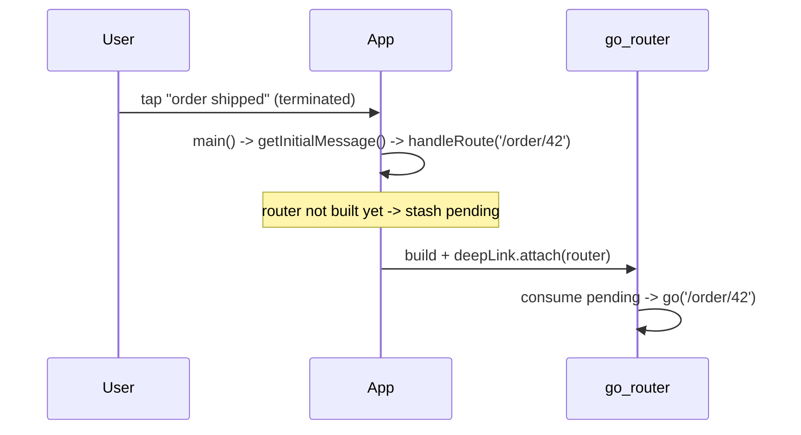

# Handling Taps & Deep Links (Cold Start Included)

> A tapped notification must open the right screen — reliably from **foreground, background, and cold start**. The pattern: put a **route/deep link in the payload** (`data.route`), collect the tap from the three entry points (`onMessageOpenedApp`, `getInitialMessage`, and the local-notification tap handler / `getNotificationAppLaunchDetails`), and funnel them all into **one router call** (`go_router`) — deferring the terminated-launch case until the router is ready.

## Introduction

Reception is only half the job; the payoff is routing the user to the relevant content on tap. This file covers extracting the route from the payload, the multiple tap-entry points across states (and the tricky cold-start timing), and consolidating them into a single deep-link handler with `go_router`.

## Why this concept exists

Notifications are re-engagement: "order shipped" should open the order, not the home screen. But the tap arrives through different callbacks depending on app state, and on cold start the router may not exist yet when the launch message is available — so a single, timing-safe routing funnel is needed to avoid lost or mis-timed navigation.

## Real-world analogy

The notification payload is a **luggage tag with a destination**; no matter which **door the traveler enters** (already inside = foreground, side door = background, front door after being away = cold start), the **concierge (router)** reads the same tag and walks them to the right room. The only catch: at the front door on cold start, you must **wait for the concierge to arrive** before handing over the tag.

## Problem Statement

Ensure tapping "order #42 shipped" opens `/order/42` whether the app was open, backgrounded, or killed — for both FCM and local notifications — using one handler. You'll extract routes from payloads and wire all tap sources into `go_router`.

## Internal Working

```mermaid
flowchart TD
    subgraph Sources [tap entry points]
      A[FCM onMessageOpenedApp (background tap)]
      B[FCM getInitialMessage (terminated launch)]
      C[local notif onDidReceiveNotificationResponse]
      D[local getNotificationAppLaunchDetails (cold start)]
    end
    A & B & C & D --> Extract[extract route from payload/data]
    Extract --> Ready{router ready?}
    Ready -->|yes| Go[router.go(route)]
    Ready -->|no (cold start)| Defer[queue -> run after first frame / router init]
```

- **Route in payload**: standardize a field — FCM `data['route']` (or `type`+`id` you map to a route), local-notification `payload` string ([local_notifications.md](local_notifications.md)). Keep it a real app route (`/order/42`) so it maps 1:1 to `go_router`.
- **Tap entry points** (must handle all):
  - **FCM background tap** → `FirebaseMessaging.onMessageOpenedApp` (app resumes).
  - **FCM terminated launch** → `FirebaseMessaging.getInitialMessage()` at startup (returns the message that launched the app, or null).
  - **Local notification tap** → `onDidReceiveNotificationResponse` (foreground/background) and `getNotificationAppLaunchDetails()` (cold start).
  - **Foreground FCM** (`onMessage`) usually has **no tap** yet — you render a local notification whose tap then routes.
- **Cold-start timing (the gotcha)**: on terminated launch, the launch message/details are available *before* the widget tree/router is built. **Capture the pending route** at startup and **navigate after the router is initialized** (e.g., in `go_router`'s first build / a post-frame callback / a `redirect`), or you'll navigate into a non-existent router.
- **One funnel**: convert every source to `handleRoute(String route)` that either navigates now (router ready) or stores a `pendingRoute` consumed once the router exists — avoids duplicated, racy navigation logic.
- **go_router integration**: `router.go(route)` / `router.push(route)`; or feed the pending route via the router's `initialLocation`/`redirect`.
- **Auth/guarding**: a deep link may require login — let `go_router` `redirect` gate it (send to login, then resume) ([Module 13](../13%20Routing/README.md)).

## Memory Representation

A single nullable `pendingRoute` holds a cold-start deep link until consumed. Otherwise routing is stateless (payload → router call).

## Compiler Behavior

Not applicable.

## Runtime Behavior

Foreground/background taps route immediately (router exists). Cold-start taps must defer until the router mounts — the classic "notification opens app but lands on home" bug is a missed deferral.

## Flutter Engine Behavior

On terminated launch the engine starts, runs `main`, and only then builds the tree; launch messages retrieved in `main`/early must wait for the first frame/router to navigate.

## Dart VM Behavior

Not applicable.

## Examples

```dart
import 'package:firebase_messaging/firebase_messaging.dart';
import 'package:flutter_local_notifications/flutter_local_notifications.dart';

// Single funnel: navigate now if ready, else stash until the router mounts.
class DeepLinkRouter {
  GoRouter? _router;
  String? _pending;

  void attach(GoRouter router) {           // called once the router exists
    _router = router;
    final p = _pending;
    if (p != null) { _pending = null; router.go(p); } // consume cold-start route
  }

  void handleRoute(String? route) {
    if (route == null) return;
    final r = _router;
    if (r != null) { r.go(route); } else { _pending = route; } // defer on cold start
  }
}

final deepLink = DeepLinkRouter();

Future<void> wireNotificationTaps() async {
  final fm = FirebaseMessaging.instance;
  // FCM: background tap + terminated launch
  fm.onMessageOpenedApp.listen((m) => deepLink.handleRoute(m.data['route']));
  final initial = await fm.getInitialMessage();
  deepLink.handleRoute(initial?.data['route']);            // may set _pending

  // Local notifications: cold-start launch details
  final details = await FlutterLocalNotificationsPlugin().getNotificationAppLaunchDetails();
  if (details?.didNotificationLaunchApp ?? false) {
    deepLink.handleRoute(details!.notificationResponse?.payload);
  }
  // (local tap handler onDidReceiveNotificationResponse also calls deepLink.handleRoute)
  // (foreground onMessage renders a local notification -> its tap routes)
}
// In app build: deepLink.attach(myGoRouter);  // consumes any pending route
```

## Diagrams



## Common Mistakes

| Mistake | Why | Fix |
|---------|-----|-----|
| Ignoring `getInitialMessage`/launch details | Cold-start taps lost (land on home) | Handle terminated launch on startup |
| Navigating before router exists | Crash/no-op on cold start | Defer via pending route → attach |
| Separate routing logic per source | Duplication/races | One `handleRoute` funnel |
| No route in payload | Can't deep-link | Standardize `data['route']`/payload |
| Foreground push not tappable | User can't act | Render a local notification that routes |
| Ignoring auth on deep link | Opens gated screen unauthenticated | `go_router` redirect/guard |

## Best Practices

- Put a **real app route** in every payload (`data['route']` / local `payload`) and funnel **all tap sources** into one `handleRoute`.
- **Handle cold start**: capture the launch message/details at startup and **navigate after the router mounts** (pending-route pattern).
- Render **foreground** FCM as a local notification so it's tappable → routes; **guard** deep links via `go_router` redirect (auth/existence).
- Keep routing **stateless except the single pending route**; wrap in a service so tests can assert route extraction/deferral.

## Performance

Trivial. The only concern is timing (defer cold-start navigation) and idempotency (don't double-navigate if a source fires twice).

## Advantages / Disadvantages

- **+** Reliable re-engagement (tap → exact content) across all states, unified handling, auth-aware routing.
- **−** Cold-start timing complexity, multiple entry points to wire, need a payload route convention, dedupe/guard care.

## Interview Questions

1. **🟢 How do you route the user when they tap a notification?** — Extract a route from the payload (`data['route']`/local `payload`) and call the router (`go_router`) via a single handler.
2. **🟢 What are the tap entry points across app states?** — FCM `onMessageOpenedApp` (background), `getInitialMessage` (terminated launch); local `onDidReceiveNotificationResponse` and `getNotificationAppLaunchDetails` (cold start).
3. **🟡 What's the cold-start routing gotcha?** — The launch message is available before the router is built; you must defer navigation until the router mounts (pending-route pattern).
4. **🟡 Why render foreground FCM as a local notification?** — Foreground `onMessage` has no OS notification/tap; rendering a local one makes it tappable → routes.
5. **🟡 Why funnel all sources into one handler?** — To avoid duplicated, racy per-source navigation and centralize dedupe/guarding.
6. **🔴 How do you handle a deep link to a gated screen?** — Let `go_router` `redirect` check auth and send to login, then resume to the target after authentication.
7. **🔴 How do you prevent double navigation?** — Consume the pending route once and dedupe sources (e.g., don't process both `getInitialMessage` and a local launch for the same tap).

## Senior Engineer Tips

- Build the single `handleRoute` funnel + pending-route deferral first; every notification feature then just supplies a route.
- Test the terminated-tap path explicitly (force-kill → tap) — it's the one that silently lands users on home in most apps.
- Encode routes (not opaque ids) in payloads and let `go_router` redirect handle auth/existence, so deep links behave like any in-app navigation.

## Architect Perspective

Tap handling is the bridge from delivery to product value, and its complexity is entirely about state/timing. A `DeepLinkRouter` funnel with cold-start deferral, fed by all reception sources and integrated with `go_router`'s guards, makes notification routing reliable and testable — and reuses the same deep-link infrastructure as universal/app links ([Module 13](../13%20Routing/README.md), [28 · ios_integration](../28%20Native%20iOS/ios_integration.md), [notifications_integration.md](notifications_integration.md)).

## Summary

- Standardize a route in the payload; funnel `onMessageOpenedApp`, `getInitialMessage`, local tap, and launch details into one `handleRoute`.
- Defer cold-start navigation until the router mounts (pending-route pattern); render foreground push as a tappable local notification.
- Guard deep links via `go_router` redirect; dedupe to avoid double navigation.

## Revision Notes

- Route in payload: FCM `data['route']` / local `payload`; one `handleRoute` funnel → `router.go(route)`.
- Sources: `onMessageOpenedApp` (bg), `getInitialMessage` (terminated), local `onDidReceiveNotificationResponse` + `getNotificationAppLaunchDetails` (cold start).
- Cold start: stash pending route, navigate after router mounts (`attach`); foreground → render local notif (tappable); guard via `go_router` redirect.

## Practice Questions

1. What are all the tap entry points and which state does each cover?
2. Why and how do you defer cold-start navigation?
3. How do you make a foreground push tappable?

## Coding Questions

1. Implement a `DeepLinkRouter` with pending-route deferral + `attach`.
2. Wire all FCM + local tap sources into `handleRoute`.
3. Guard a deep link to a login-required screen via `go_router` redirect.

## Mini Project

**Deep-link routing (Flutter):** Build a `DeepLinkRouter` funnel that routes notification taps to `go_router` from all sources (FCM background/terminated, local tap/cold-start), using a `data['route']`/payload convention and the pending-route deferral for cold start. Render foreground FCM as a tappable local notification; guard a gated route via redirect. Acceptance: tapping opens the exact screen in foreground, background, and cold start; foreground push is tappable; gated deep link routes through login; no double navigation; behind a service.
